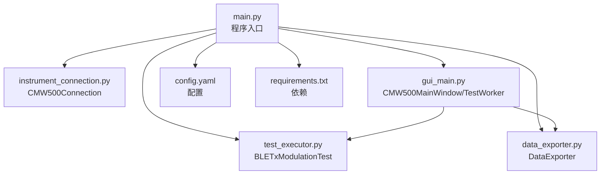
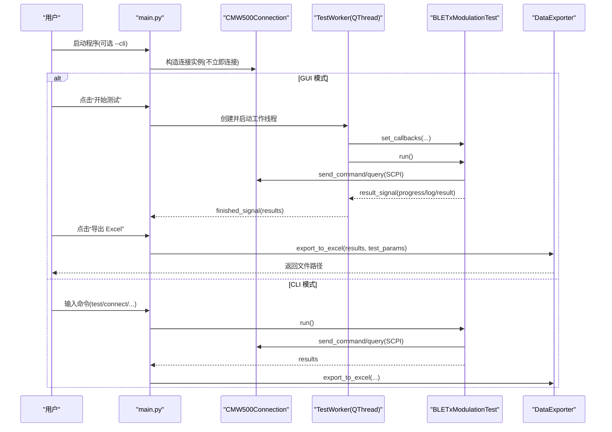
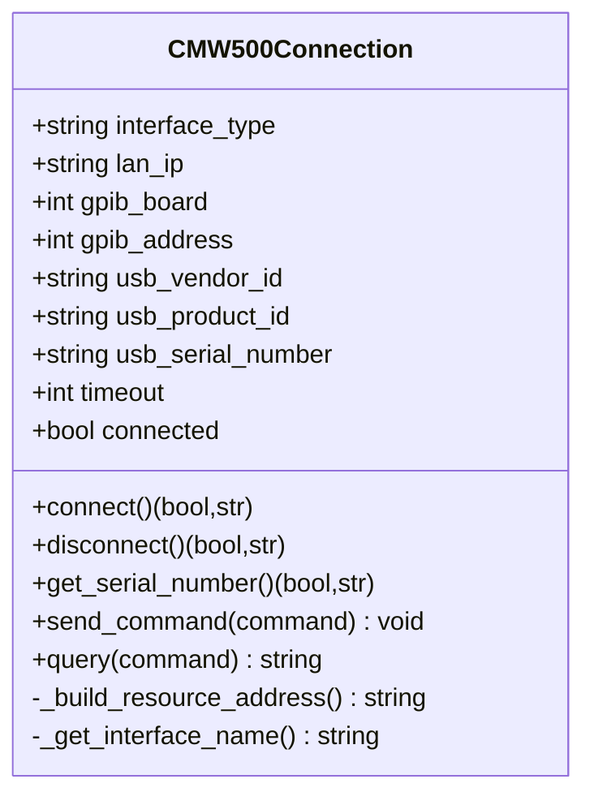
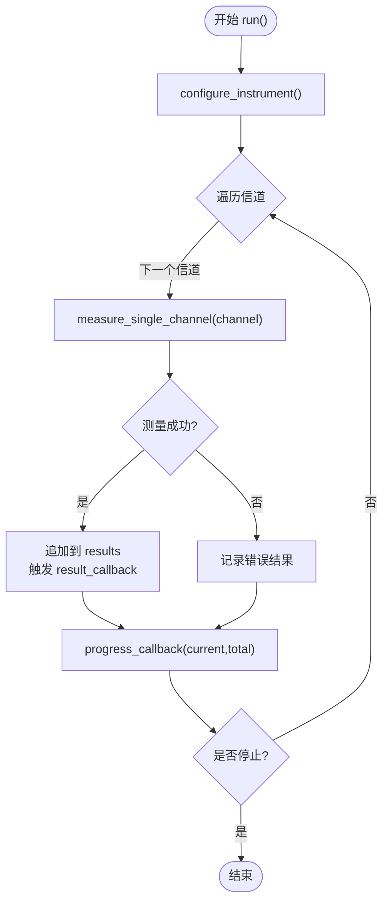
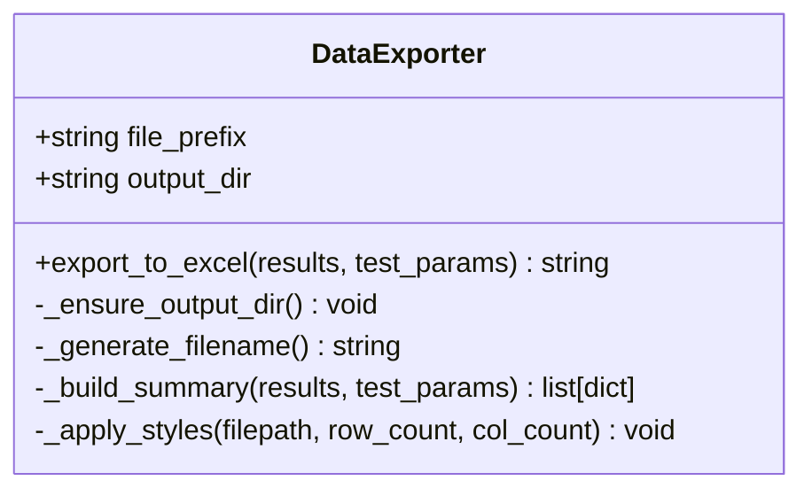
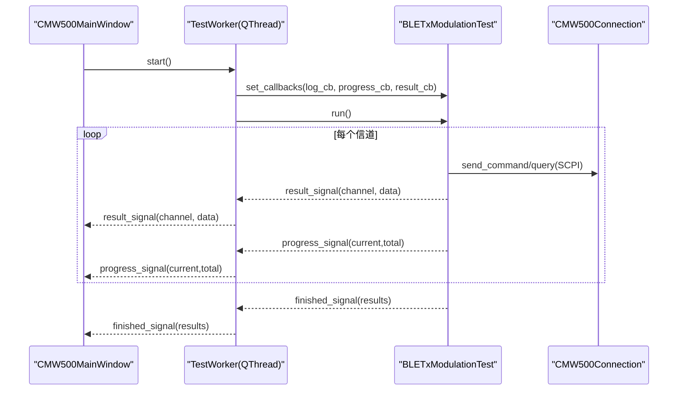
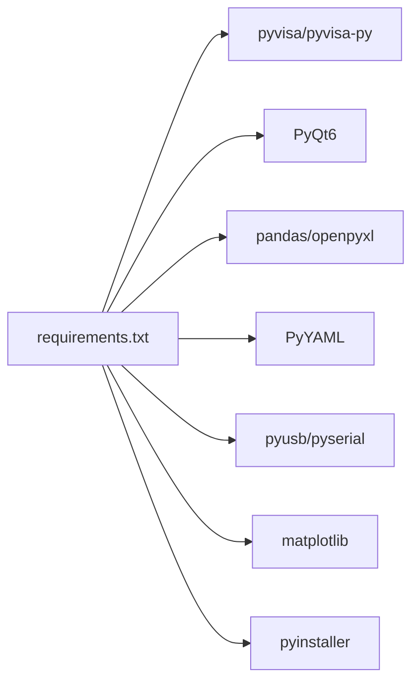

# API 参考文档

<cite>
**本文引用的文件**   
- [main.py](file://main.py)
- [instrument_connection.py](file://instrument_connection.py)
- [test_executor.py](file://test_executor.py)
- [data_exporter.py](file://data_exporter.py)
- [gui_main.py](file://gui_main.py)
- [config.yaml](file://config.yaml)
- [requirements.txt](file://requirements.txt)
</cite>

## 目录
1. [简介](#简介)
2. [项目结构](#项目结构)
3. [核心组件](#核心组件)
4. [架构总览](#架构总览)
5. [详细组件分析](#详细组件分析)
6. [依赖关系分析](#依赖关系分析)
7. [性能与并发特性](#性能与并发特性)
8. [错误处理与调试指南](#错误处理与调试指南)
9. [版本兼容性与迁移指南](#版本兼容性与迁移指南)
10. [结论](#结论)
11. [附录：配置项说明](#附录配置项说明)

## 简介
本 API 参考文档面向使用 CMW500 BLE TX 调制自动化测试工具的用户与二次开发者，系统化记录以下公共类与接口：
- CMW500Connection：仪器连接管理（LAN/GPIB/USB）
- BLETxModulationTest：BLE TX 调制测试执行器
- DataExporter：测试结果导出为 Excel
- GUI 线程模型与回调机制：TestWorker、信号槽、进度与日志推送

文档包含构造函数参数、方法签名、返回值类型、异常行为、代码示例路径、回调与异步操作说明、错误代码对照表、调试技巧以及版本兼容性建议。

## 项目结构
本项目采用“入口 + 模块”的清晰分层：
- main.py：程序入口、配置加载、CLI/GUI 模式选择
- instrument_connection.py：CMW500 仪器连接封装（VISA）
- test_executor.py：BLE TX 调制测试流程编排与结果判定
- data_exporter.py：Excel 数据导出与样式美化
- gui_main.py：PyQt6 界面、工作线程、信号槽与交互
- config.yaml：全局配置（仪器、测试、导出）
- requirements.txt：运行依赖

图表来源
- [main.py:295-336](file://main.py#L295-L336)
- [instrument_connection.py:18-54](file://instrument_connection.py#L18-L54)
- [test_executor.py:22-51](file://test_executor.py#L22-L51)
- [data_exporter.py:23-62](file://data_exporter.py#L23-L62)
- [gui_main.py:75-124](file://gui_main.py#L75-L124)

章节来源
- [main.py:1-357](file://main.py#L1-L357)
- [config.yaml:1-79](file://config.yaml#L1-L79)
- [requirements.txt:1-12](file://requirements.txt#L1-L12)

## 核心组件
本节概述三大核心类的职责与协作方式：
- CMW500Connection：负责建立/断开仪器连接、发送 SCPI 命令与查询，支持 LAN/GPIB/USB 三种接口。
- BLETxModulationTest：根据配置遍历信道范围，逐信道测量频率相关指标并判定 PASS/FAIL，提供回调与停止控制。
- DataExporter：将测试结果导出为带样式的 Excel，包含“测试数据”和“测试摘要”两个 Sheet。

章节来源
- [instrument_connection.py:18-216](file://instrument_connection.py#L18-L216)
- [test_executor.py:22-261](file://test_executor.py#L22-L261)
- [data_exporter.py:23-283](file://data_exporter.py#L23-L283)

## 架构总览
系统以 main.py 为入口，加载配置后创建 CMW500Connection；GUI 模式下通过 TestWorker 在独立线程中执行 BLETxModulationTest，并通过 Qt 信号向主线程推送日志、进度与结果；完成后由 DataExporter 生成 Excel。

图表来源
- [main.py:295-336](file://main.py#L295-L336)
- [gui_main.py:499-528](file://gui_main.py#L499-L528)
- [gui_main.py:28-73](file://gui_main.py#L28-L73)
- [test_executor.py:186-245](file://test_executor.py#L186-L245)
- [data_exporter.py:81-139](file://data_exporter.py#L81-L139)

## 详细组件分析

### CMW500Connection（仪器连接管理）
职责：
- 初始化连接参数（接口类型、地址、超时等）
- 构建 VISA 资源地址（LAN/GPIB/USB）
- 连接/断开仪器，校验 *IDN?
- 发送 SCPI 命令与查询

关键方法与行为：
- __init__(interface_type, lan_ip, gpib_board, gpib_address, usb_vendor_id, usb_product_id, usb_serial_number, timeout)
  - 参数说明见下方表格
  - 不立即连接，仅保存参数
- connect() -> (bool, str)
  - 成功：返回 (True, 提示信息含仪器信息)
  - 失败：返回 (False, 错误提示含具体接口排查建议)
  - 可能抛出：无（内部捕获并返回元组）
- disconnect() -> (bool, str)
  - 成功：返回 (True, 提示信息)
  - 失败：返回 (False, 错误信息)
- get_serial_number() -> (bool, str)
  - 成功：返回 (True, 序列号字符串)
  - 失败：返回 (False, 错误信息)
- send_command(command) -> None
  - 未连接时抛出 ConnectionError
- query(command) -> str
  - 未连接时抛出 ConnectionError

参数与默认值（来自构造函数）：
- interface_type: 字符串，"LAN"/"GPIB"/"USB"，默认 "LAN"
- lan_ip: 字符串，如 "192.168.1.100"
- gpib_board: 整数，通常 0
- gpib_address: 整数，通常 0~30
- usb_vendor_id: 字符串，如 "0x0AAD"
- usb_product_id: 字符串，如 "0x0117"
- usb_serial_number: 字符串，留空表示自动搜索
- timeout: 整数毫秒，默认 10000

异常与错误码：
- pyvisa.VisaIOError：通信层错误（网络不通、地址错误、驱动缺失等），connect/disconnect/get_serial_number 会捕获并返回友好提示
- ConnectionError：send_command/query 在未连接时抛出
- 其他异常：统一捕获并返回错误信息

使用示例路径：
- GUI 连接流程：[gui_main.py:438-479](file://gui_main.py#L438-L479)
- CLI 连接流程：[main.py:160-176](file://main.py#L160-L176)
- 读取序列号：[main.py:171-176](file://main.py#L171-L176)

图表来源
- [instrument_connection.py:18-216](file://instrument_connection.py#L18-L216)

章节来源
- [instrument_connection.py:18-216](file://instrument_connection.py#L18-L216)

### BLETxModulationTest（BLE TX 调制测试执行器）
职责：
- 配置 CMW500 为 BLE TX 调制测量模式
- 遍历信道范围，逐信道测量 5 项频率指标
- 依据配置上限进行 PASS/FAIL 判定
- 提供回调（日志、进度、单信道结果）与停止控制

关键方法与行为：
- __init__(cmw500, config)
  - cmw500：已连接的 CMW500Connection 实例
  - config：从 config.yaml 加载的配置字典
- set_callbacks(log_cb=None, progress_cb=None, result_cb=None)
  - log_cb(message: str)
  - progress_cb(current: int, total: int)
  - result_cb(channel: int, data: dict)
- configure_instrument() -> None
  - 复位仪器、设置 BT TX 测量、PHY、统计次数、数据包类型等
- measure_single_channel(channel) -> dict
  - 返回包含 channel、timestamp、各项测量值及 pass_fail 判定的字典
- run() -> list[dict]
  - 遍历信道，收集结果，支持 stop() 中断
  - 触发进度与结果回调
- stop() -> None
  - 请求停止当前测试
- get_results() -> list[dict]
  - 获取所有测试结果

数据结构约定（单信道结果）：
- channel: int
- timestamp: str
- frequency_accuracy: float|None
- frequency_drift: float|None
- frequency_offset: float|None
- initial_frequency_drift: float|None
- max_drift_rate: float|None
- pass_fail: dict[key="frequency_*", value="PASS"/"FAIL"/"ERROR"]

异常与错误处理：
- 单个信道测量异常会被捕获，记录 error 字段并继续后续信道
- 整体 run() 返回部分或全部结果，调用方可根据 is_stopped 判断是否被中断

使用示例路径：
- GUI 线程绑定回调与执行：[gui_main.py:48-73](file://gui_main.py#L48-L73)
- CLI 执行与导出：[main.py:178-203](file://main.py#L178-L203)

图表来源
- [test_executor.py:186-245](file://test_executor.py#L186-L245)
- [test_executor.py:105-184](file://test_executor.py#L105-L184)

章节来源
- [test_executor.py:22-261](file://test_executor.py#L22-L261)

### DataExporter（数据导出器）
职责：
- 将测试结果导出为 Excel，包含“测试数据”和“测试摘要”两个 Sheet
- 自动命名文件（时间戳），确保输出目录存在
- 对单元格应用样式（表头、边框、对齐、PASS/FAIL 着色）

关键方法与行为：
- __init__(config)
  - 解析 export.output_dir 与 file_prefix，兼容相对路径与打包环境
- export_to_excel(results, test_params) -> str
  - 返回完整文件路径
- _build_summary(results, test_params) -> list[dict]
  - 生成摘要行（测试时间、标准、信道范围、统计次数、各指标通过/失败计数、总体判定）
- _apply_styles(filepath, row_count, col_count) -> None
  - 应用字体、填充、对齐、边框、列宽调整

数据结构约定（results 格式同 BLETxModulationTest.run() 返回）：
- 每个元素为一个信道的结果字典，包含 measurement 数值与 pass_fail 判定

异常与错误处理：
- 若导出过程中出现 IO 或 openpyxl/pandas 异常，将向上抛出，调用方需捕获并提示

使用示例路径：
- CLI 导出：[main.py:199-203](file://main.py#L199-L203)
- GUI 导出：[gui_main.py:537-555](file://gui_main.py#L537-L555)

图表来源
- [data_exporter.py:23-283](file://data_exporter.py#L23-L283)

章节来源
- [data_exporter.py:23-283](file://data_exporter.py#L23-L283)

### GUI 线程模型与回调机制（TestWorker 与信号槽）
职责：
- 在独立 QThread 中执行 BLETxModulationTest，避免阻塞 UI
- 定义自定义信号：log_signal、result_signal、progress_signal、finished_signal、error_signal
- 主窗口通过信号槽更新日志、表格、进度条与状态栏

关键方法与行为：
- TestWorker.__init__(cmw500, config)
- TestWorker.run()
  - 创建 BLETxModulationTest，绑定回调，执行 run()，发出 finished_signal 或 error_signal
- TestWorker.stop_test()
  - 调用 BLETxModulationTest.stop()
- CMW500MainWindow._on_start_test()
  - 创建工作线程，连接信号槽，启动线程
- CMW500MainWindow._on_channel_result(), _on_progress_update(), _on_test_finished(), _on_test_error()
  - 线程安全地更新 UI

使用示例路径：
- 线程定义与信号：[gui_main.py:28-73](file://gui_main.py#L28-L73)
- 开始测试与信号绑定：[gui_main.py:499-528](file://gui_main.py#L499-L528)
- 结果与进度更新：[gui_main.py:561-629](file://gui_main.py#L561-L629)

图表来源
- [gui_main.py:28-73](file://gui_main.py#L28-L73)
- [gui_main.py:499-528](file://gui_main.py#L499-L528)
- [test_executor.py:186-245](file://test_executor.py#L186-L245)

章节来源
- [gui_main.py:28-73](file://gui_main.py#L28-L73)
- [gui_main.py:499-528](file://gui_main.py#L499-L528)
- [gui_main.py:561-629](file://gui_main.py#L561-L629)

## 依赖关系分析
外部依赖与用途：
- pyvisa / pyvisa-py：仪器通信后端（VISA）
- pyusb / pyserial：USB/串口底层支持（pyvisa-py 依赖）
- PyQt6：图形界面
- pandas / openpyxl：Excel 读写与样式
- PyYAML：配置文件解析
- matplotlib：可视化（当前未直接使用于导出，但作为依赖保留）
- pyinstaller：打包为 exe

图表来源
- [requirements.txt:1-12](file://requirements.txt#L1-L12)

章节来源
- [requirements.txt:1-12](file://requirements.txt#L1-L12)

## 性能与并发特性
- 线程模型：GUI 使用 QThread 执行测试，避免阻塞主线程；信号槽保证线程安全的 UI 更新。
- I/O 密集：SCPI 查询与写入为阻塞式，单次测量耗时取决于仪器响应与统计次数（statistic_count）。
- 批量导出：pandas 一次性写入 Excel，openpyxl 应用样式，适合中小规模结果集。
- 优化建议：
  - 合理设置 statistic_count，平衡精度与速度
  - 大结果集导出时可考虑分批写入或关闭实时样式应用后再统一处理
  - 网络/USB 不稳定时适当增大 timeout

[本节为通用指导，无需源码引用]

## 错误处理与调试指南

常见错误与定位：
- 连接失败（VISA 通信错误）
  - 现象：connect() 返回 False，提示无法与仪器通信
  - 排查：检查 IP/板号/地址/VID/PID/序列号是否正确；确认线缆与驱动安装；查看 pyvisa 后端日志
  - 参考实现：[instrument_connection.py:112-132](file://instrument_connection.py#L112-L132)
- 未连接时发送命令
  - 现象：send_command/query 抛出 ConnectionError
  - 处理：先调用 connect() 并检查返回状态
  - 参考实现：[instrument_connection.py:199-215](file://instrument_connection.py#L199-L215)
- 测试异常中断
  - 现象：GUI 弹出严重错误对话框；CLI 打印错误堆栈
  - 处理：查看日志窗口/控制台输出；检查仪器固件与 SCPI 指令兼容性
  - 参考实现：[gui_main.py:621-629](file://gui_main.py#L621-L629), [main.py:340-356](file://main.py#L340-L356)
- 导出失败
  - 现象：导出按钮报错或无输出文件
  - 处理：检查输出目录权限、磁盘空间、openpyxl/pandas 依赖；查看异常消息
  - 参考实现：[gui_main.py:537-555](file://gui_main.py#L537-L555)

调试技巧：
- 启用详细日志：GUI 日志窗口实时显示；CLI 模式直接输出
- 逐步验证：先 connect() 与 get_serial_number()，再执行单信道测量，最后全量扫描
- 回退策略：遇到个别信道失败，可缩小 channel_start/channel_end 范围复现
- 环境检查：确认 pyvisa 后端可用（pyvisa-py），USB 驱动正常，网络连通

章节来源
- [instrument_connection.py:112-132](file://instrument_connection.py#L112-L132)
- [instrument_connection.py:199-215](file://instrument_connection.py#L199-L215)
- [gui_main.py:621-629](file://gui_main.py#L621-L629)
- [main.py:340-356](file://main.py#L340-L356)
- [gui_main.py:537-555](file://gui_main.py#L537-L555)

## 版本兼容性与迁移指南
- 配置文件兼容性：
  - 旧版 config.yaml 若直接在 instrument 下包含 ip_address，将被自动迁移至 instrument.lan.ip_address
  - 若缺少 gpib/usb 子节或字段，将按默认值补齐
  - 参考实现：[main.py:245-292](file://main.py#L245-L292)
- 接口类型默认值：
  - 若未指定 interface_type，默认使用 "LAN"
  - 参考实现：[main.py:283-286](file://main.py#L283-L286)
- 打包与运行：
  - 支持 PyInstaller 打包后的路径解析（APP_DIR、output_dir 相对路径）
  - 参考实现：[main.py:20-35](file://main.py#L20-L35), [data_exporter.py:51-61](file://data_exporter.py#L51-L61)
- 向后兼容建议：
  - 新增字段时保持默认值，避免破坏旧配置
  - 对关键路径（输出目录、配置文件）增加健壮性检查与降级策略

章节来源
- [main.py:245-292](file://main.py#L245-L292)
- [main.py:20-35](file://main.py#L20-L35)
- [data_exporter.py:51-61](file://data_exporter.py#L51-L61)

## 结论
本 API 参考文档围绕 CMW500 BLE TX 调制自动化测试的核心类展开，提供了完整的构造参数、方法签名、返回值与异常说明，并结合 GUI 线程模型与回调机制给出使用模式与最佳实践。通过错误处理与调试指南，帮助用户快速定位问题；通过版本兼容性与迁移指南，保障配置与接口的平滑演进。

[本节为总结，无需源码引用]

## 附录：配置项说明
- instrument.interface_type：接口类型（"LAN"/"GPIB"/"USB"）
- instrument.lan.ip_address：LAN 模式下的 IP 地址
- instrument.gpib.board / address：GPIB 板号与主地址
- instrument.usb.vendor_id / product_id / serial_number：USB VID/PID/序列号
- instrument.timeout：通信超时（毫秒）
- test_params.standard / phy_type / burst_type / packet_type：测试标准与 PHY 参数
- test_params.channel_start / channel_end：信道范围
- test_params.statistic_count：统计平均次数
- test_params.measurements.*：各项指标的 name/unit/upper_limit/lower_limit
- export.output_dir / file_prefix：导出目录与文件名前缀

章节来源
- [config.yaml:1-79](file://config.yaml#L1-L79)