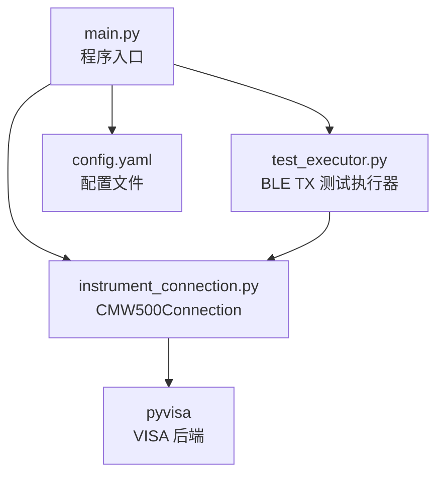
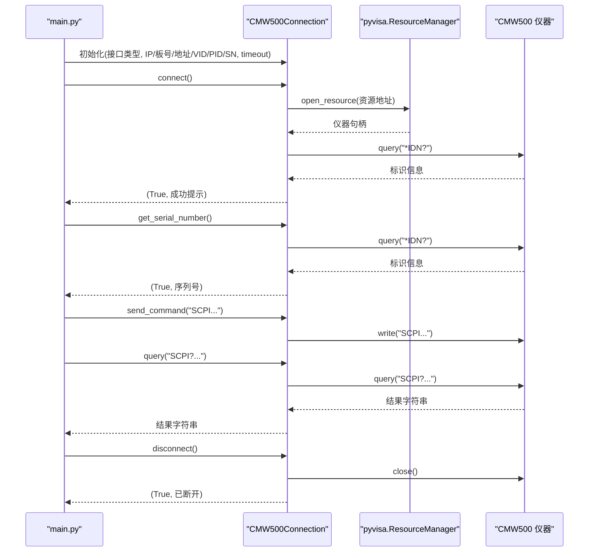
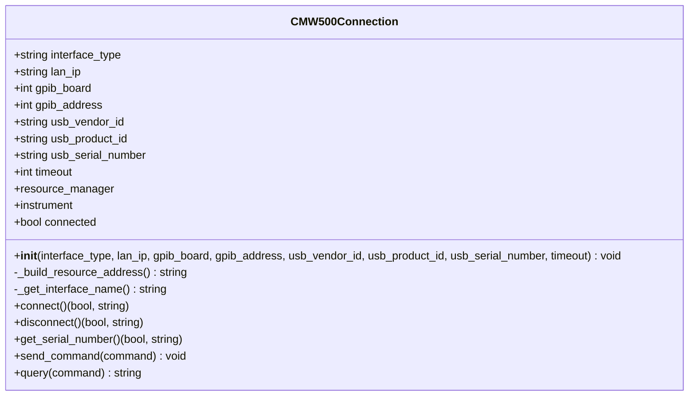
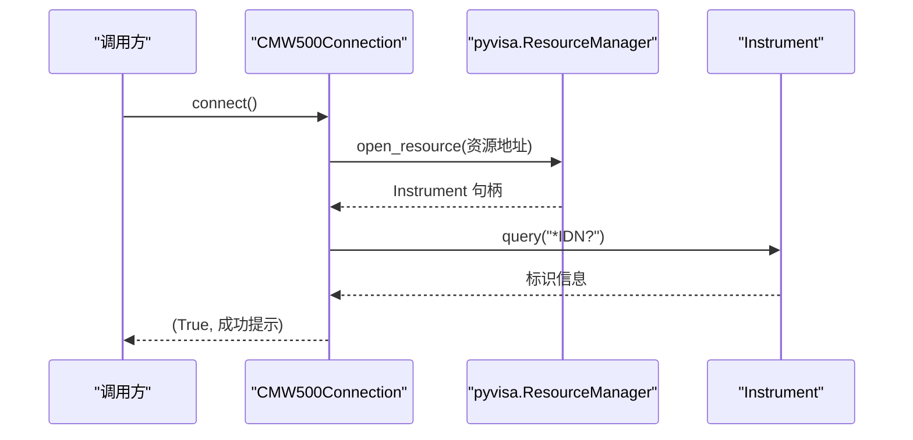
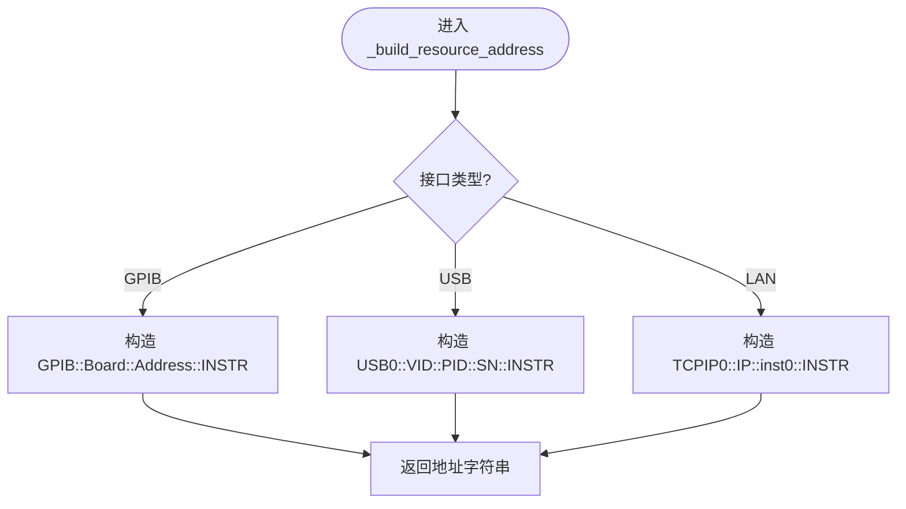
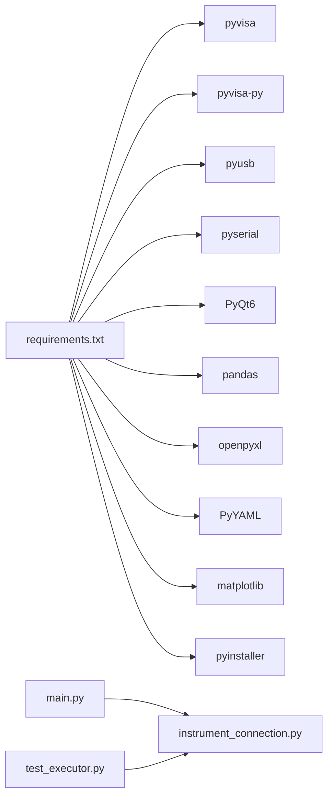

# 仪器连接 API

<cite>
**本文引用的文件**
- [instrument_connection.py](file://instrument_connection.py)
- [main.py](file://main.py)
- [config.yaml](file://config.yaml)
- [test_executor.py](file://test_executor.py)
- [requirements.txt](file://requirements.txt)
</cite>

## 目录
1. [简介](#简介)
2. [项目结构](#项目结构)
3. [核心组件](#核心组件)
4. [架构总览](#架构总览)
5. [详细组件分析](#详细组件分析)
6. [依赖分析](#依赖分析)
7. [性能与超时设置](#性能与超时设置)
8. [故障排查指南](#故障排查指南)
9. [结论](#结论)
10. [附录：接口配置示例与完整使用流程](#附录接口配置示例与完整使用流程)

## 简介
本文件为 CMW500Connection 类的权威 API 文档，覆盖其公共方法、参数类型、返回值格式、异常处理机制，并给出 LAN/GPIB/USB 三种接口的配置示例与使用模式。同时解释 VISA 资源管理器的使用方式、通信超时设置、错误代码对照表以及常见连接问题的解决方案。文末提供完整的初始化、连接、发送命令与断开连接的参考路径，便于快速上手。

## 项目结构
本项目围绕 R&S CMW500 无线通信测试仪的自动化测试展开，核心由以下模块组成：
- instrument_connection.py：封装 CMW500 的连接、断开、查询等底层通信能力（基于 pyvisa）。
- main.py：程序入口，负责加载配置、创建 CMW500Connection 实例，并提供 CLI/GUI 两种运行模式。
- test_executor.py：基于 CMW500Connection 实现 BLE TX 调制测试的执行逻辑。
- config.yaml：配置文件，包含仪器接口参数、测试参数与导出选项。
- requirements.txt：依赖库清单（含 pyvisa、pyvisa-py、PyQt6 等）。

图表来源
- [main.py:295-336](file://main.py#L295-L336)
- [instrument_connection.py:18-216](file://instrument_connection.py#L18-L216)
- [test_executor.py:22-104](file://test_executor.py#L22-L104)
- [config.yaml:1-26](file://config.yaml#L1-L26)

章节来源
- [main.py:295-336](file://main.py#L295-L336)
- [instrument_connection.py:18-216](file://instrument_connection.py#L18-L216)
- [config.yaml:1-26](file://config.yaml#L1-L26)
- [requirements.txt:1-11](file://requirements.txt#L1-L11)

## 核心组件
CMW500Connection 类是仪器控制的核心抽象，统一封装了不同物理接口（LAN/GPIB/USB）的资源地址构建、连接建立、断开、序列号读取、命令发送与查询等功能。该类通过 pyvisa 与仪器进行 SCPI 指令通信，并在内部维护连接状态、资源管理器与仪器对象。

关键职责
- 构造 VISA 资源地址字符串（根据接口类型自动选择 TCPIP/GPIB/USB 格式）
- 建立/断开仪器连接，验证连通性（*IDN?）
- 读取仪器序列号（解析 *IDN? 返回）
- 发送无返回值的 SCPI 命令
- 发送查询命令并返回结果字符串

章节来源
- [instrument_connection.py:18-216](file://instrument_connection.py#L18-L216)

## 架构总览
下图展示了从应用层到仪器层的调用关系与数据流。main.py 负责加载配置并创建 CMW500Connection；CLI/GUI 调用 connect/disconnect/query/send_command；test_executor.py 在测试过程中复用该连接执行具体测量。

图表来源
- [main.py:315-336](file://main.py#L315-L336)
- [instrument_connection.py:85-132](file://instrument_connection.py#L85-L132)
- [instrument_connection.py:161-190](file://instrument_connection.py#L161-L190)
- [instrument_connection.py:192-216](file://instrument_connection.py#L192-L216)
- [instrument_connection.py:134-159](file://instrument_connection.py#L134-L159)

## 详细组件分析

### 类与方法概览
- 常量
  - INTERFACE_LAN = "LAN"
  - INTERFACE_GPIB = "GPIB"
  - INTERFACE_USB = "USB"
- 属性
  - interface_type: str
  - lan_ip: str
  - gpib_board: int
  - gpib_address: int
  - usb_vendor_id: str
  - usb_product_id: str
  - usb_serial_number: str
  - timeout: int（毫秒）
  - resource_manager: pyvisa.ResourceManager | None
  - instrument: pyvisa.Instrument | None
  - connected: bool

#### __init__(interface_type="LAN", lan_ip="", gpib_board=0, gpib_address=20, usb_vendor_id="0x0AAD", usb_product_id="0x0117", usb_serial_number="", timeout=10000)
- 作用：初始化连接管理器（不立即连接），保存接口类型与参数，初始化资源管理器与仪器对象为 None，设置超时时间。
- 参数类型与默认值
  - interface_type: str，可选 "LAN"/"GPIB"/"USB"，默认 "LAN"
  - lan_ip: str，默认 ""
  - gpib_board: int，默认 0
  - gpib_address: int，默认 20
  - usb_vendor_id: str，默认 "0x0AAD"
  - usb_product_id: str，默认 "0x0117"
  - usb_serial_number: str，默认 ""
  - timeout: int（毫秒），默认 10000
- 返回值：无
- 异常：无显式抛出

章节来源
- [instrument_connection.py:26-53](file://instrument_connection.py#L26-L53)

#### _build_resource_address()
- 作用：根据当前接口类型构造 VISA 资源地址字符串
- 返回值：str（TCPIP/GPIB/USB 格式）
- 异常：无显式抛出

章节来源
- [instrument_connection.py:55-74](file://instrument_connection.py#L55-L74)

#### _get_interface_name()
- 作用：获取当前接口类型的中文名称
- 返回值：str

章节来源
- [instrument_connection.py:76-83](file://instrument_connection.py#L76-L83)

#### connect()
- 作用：建立与 CMW500 的连接（根据接口类型自动选择 LAN/GPIB/USB），并通过 *IDN? 验证连通性
- 返回值：(bool, str) —— (是否成功, 提示信息)
- 异常：捕获 pyvisa.VisaIOError 与通用 Exception，均返回失败元组，不向上抛出

章节来源
- [instrument_connection.py:85-132](file://instrument_connection.py#L85-L132)

#### disconnect()
- 作用：断开与 CMW500 的连接，关闭仪器句柄并重置状态
- 返回值：(bool, str) —— (是否成功, 提示信息)
- 异常：捕获 pyvisa.VisaIOError 与通用 Exception，均返回失败元组

章节来源
- [instrument_connection.py:134-159](file://instrument_connection.py#L134-L159)

#### get_serial_number()
- 作用：读取仪器序列号（通过 *IDN? 解析第三段）
- 返回值：(bool, str) —— (是否成功, 序列号或错误信息)
- 异常：捕获 pyvisa.VisaIOError 与通用 Exception，均返回失败元组

章节来源
- [instrument_connection.py:161-190](file://instrument_connection.py#L161-L190)

#### send_command(command)
- 作用：向仪器发送 SCPI 命令（无返回值）
- 参数：command: str
- 返回值：无
- 异常：若未连接则抛出 ConnectionError

章节来源
- [instrument_connection.py:192-201](file://instrument_connection.py#L192-L201)

#### query(command)
- 作用：向仪器发送查询命令并返回结果
- 参数：command: str
- 返回值：str（已去除首尾空白）
- 异常：若未连接则抛出 ConnectionError

章节来源
- [instrument_connection.py:203-216](file://instrument_connection.py#L203-L216)

### 类图（代码级）

图表来源
- [instrument_connection.py:18-216](file://instrument_connection.py#L18-L216)

### 连接时序（代码级）

图表来源
- [instrument_connection.py:85-110](file://instrument_connection.py#L85-L110)

### 复杂逻辑流程图（资源地址构建）

图表来源
- [instrument_connection.py:55-74](file://instrument_connection.py#L55-L74)

## 依赖分析
- 外部依赖
  - pyvisa：仪器控制通信库
  - pyvisa-py：纯 Python 后端（无需安装 NI-VISA）
  - pyusb、pyserial：pyvisa-py 的 USB/串口支持
  - PyQt6、pandas、openpyxl、PyYAML、matplotlib、pyinstaller：GUI、数据处理、打包等
- 内部依赖
  - main.py 通过延迟导入 instrument_connection 以避免顶层导入失败导致闪退
  - test_executor.py 依赖 CMW500Connection 提供的 send_command/query 完成测量

图表来源
- [requirements.txt:1-11](file://requirements.txt#L1-L11)
- [main.py:315-336](file://main.py#L315-L336)
- [test_executor.py:22-104](file://test_executor.py#L22-L104)

章节来源
- [requirements.txt:1-11](file://requirements.txt#L1-L11)
- [main.py:315-336](file://main.py#L315-L336)
- [test_executor.py:22-104](file://test_executor.py#L22-L104)

## 性能与超时设置
- 超时设置
  - 通过构造函数 timeout 参数指定（单位毫秒），在 connect 中设置到 instrument.timeout
  - 默认值为 10000ms，可在 config.yaml 的 instrument.timeout 中配置
- 性能建议
  - 合理设置超时：网络不稳定时适当增大，批量测量时可结合 *OPC? 等待策略避免忙轮询
  - 减少不必要的 *IDN? 校验：仅在首次连接或重连后需要
  - 对高频查询可考虑合并命令或使用二进制传输（需仪器支持）

章节来源
- [instrument_connection.py:26-53](file://instrument_connection.py#L26-L53)
- [instrument_connection.py:102-103](file://instrument_connection.py#L102-L103)
- [config.yaml:24-25](file://config.yaml#L24-L25)
- [main.py:286-292](file://main.py#L286-L292)

## 故障排查指南
- 常见问题与定位
  - 无法建立连接（VisaIOError）
    - LAN：检查网线、IP 地址、防火墙与端口可达性
    - GPIB：检查板卡驱动、线缆连接、主地址是否正确
    - USB：检查 VID/PID/SN 是否正确、设备管理器是否识别、驱动是否安装
  - 断开连接失败
    - 可能因仪器侧会话异常，重试一次或重启仪器
  - 读取序列号失败
    - 确认已连接且 *IDN? 响应正常
  - 未连接即发送命令
    - 会抛出 ConnectionError，请先调用 connect() 并确认返回成功
- 错误码与异常映射
  - pyvisa.VisaIOError：底层 IO 错误（网络/总线不可达、超时、权限不足等）
  - ConnectionError：业务层未连接即操作
  - 其他 Exception：未知错误，记录详细信息以便诊断

章节来源
- [instrument_connection.py:112-132](file://instrument_connection.py#L112-L132)
- [instrument_connection.py:151-159](file://instrument_connection.py#L151-L159)
- [instrument_connection.py:186-190](file://instrument_connection.py#L186-L190)
- [instrument_connection.py:199-201](file://instrument_connection.py#L199-L201)
- [instrument_connection.py:213-216](file://instrument_connection.py#L213-L216)

## 结论
CMW500Connection 提供了统一的仪器连接抽象，屏蔽了 LAN/GPIB/USB 的差异，简化了上层测试逻辑。通过合理的超时配置与完善的异常处理，能够稳定支撑 BLE TX 调制等自动化测试场景。建议在工程实践中结合配置文件集中管理连接参数，并在 GUI/CLI 中提供清晰的连接状态反馈与错误提示。

## 附录：接口配置示例与完整使用流程

### 接口配置示例（来自配置文件）
- LAN（TCP/IP）
  - interface_type: "LAN"
  - lan.ip_address: "192.168.1.100"
- GPIB（IEEE-488）
  - interface_type: "GPIB"
  - gpib.board: 0
  - gpib.address: 20
- USB（TMC）
  - interface_type: "USB"
  - usb.vendor_id: "0x0AAD"
  - usb.product_id: "0x0117"
  - usb.serial_number: ""（留空表示自动匹配第一个设备）

章节来源
- [config.yaml:4-25](file://config.yaml#L4-L25)

### 使用模式（CLI/GUI）
- CLI 模式
  - 启动：python main.py --cli
  - 交互命令：connect / disconnect / serial / test / stop / quit
- GUI 模式
  - 启动：python main.py
  - 界面内完成连接、测试与结果导出

章节来源
- [main.py:117-220](file://main.py#L117-L220)
- [main.py:222-242](file://main.py#L222-L242)

### 完整使用流程（步骤与参考路径）
- 初始化连接（不立即连接）
  - 参考路径：[main.py:315-328](file://main.py#L315-L328)
- 建立连接
  - 参考路径：[main.py:160-164](file://main.py#L160-L164), [instrument_connection.py:85-110](file://instrument_connection.py#L85-L110)
- 读取序列号
  - 参考路径：[main.py:171-176](file://main.py#L171-L176), [instrument_connection.py:161-190](file://instrument_connection.py#L161-L190)
- 发送命令与查询
  - 参考路径：[test_executor.py:85-103](file://test_executor.py#L85-L103), [instrument_connection.py:192-216](file://instrument_connection.py#L192-L216)
- 断开连接
  - 参考路径：[main.py:166-169](file://main.py#L166-L169), [instrument_connection.py:134-159](file://instrument_connection.py#L134-L159)