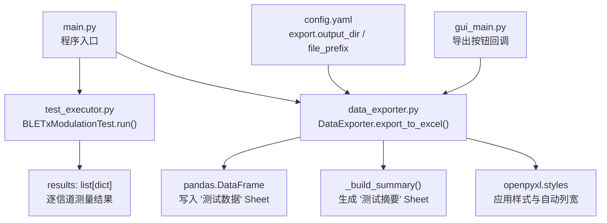
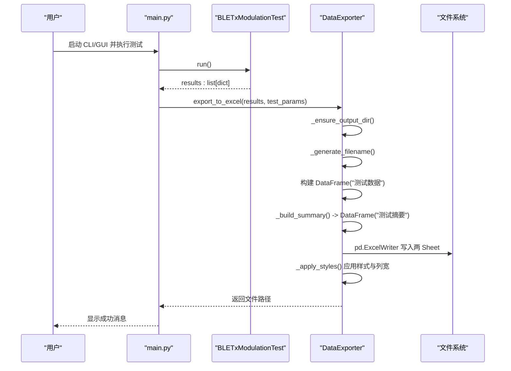
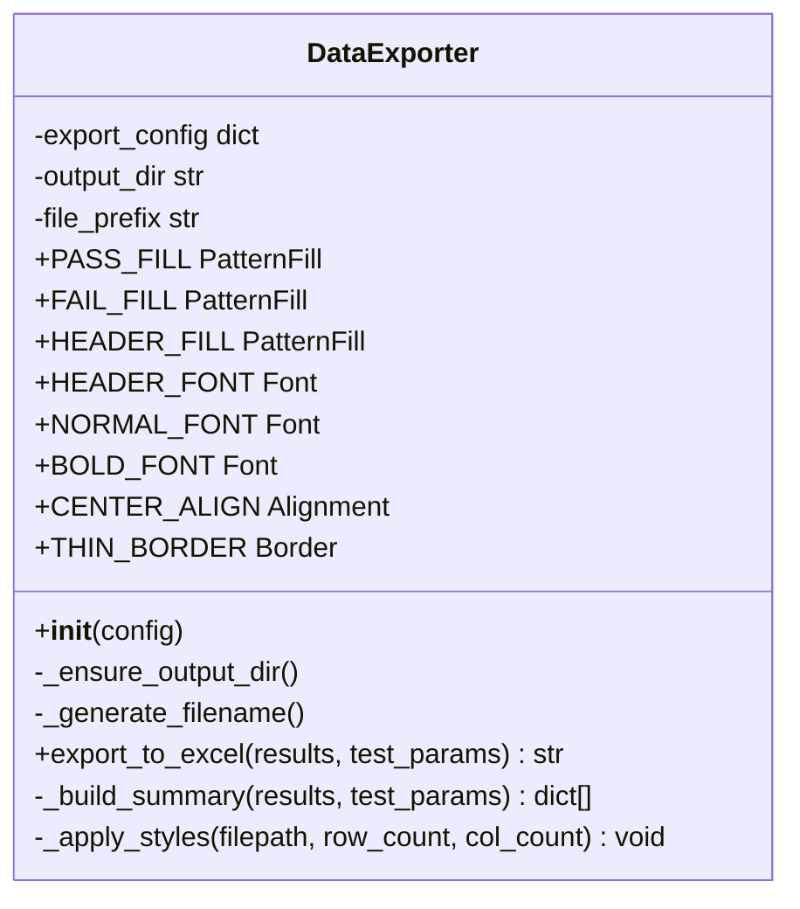
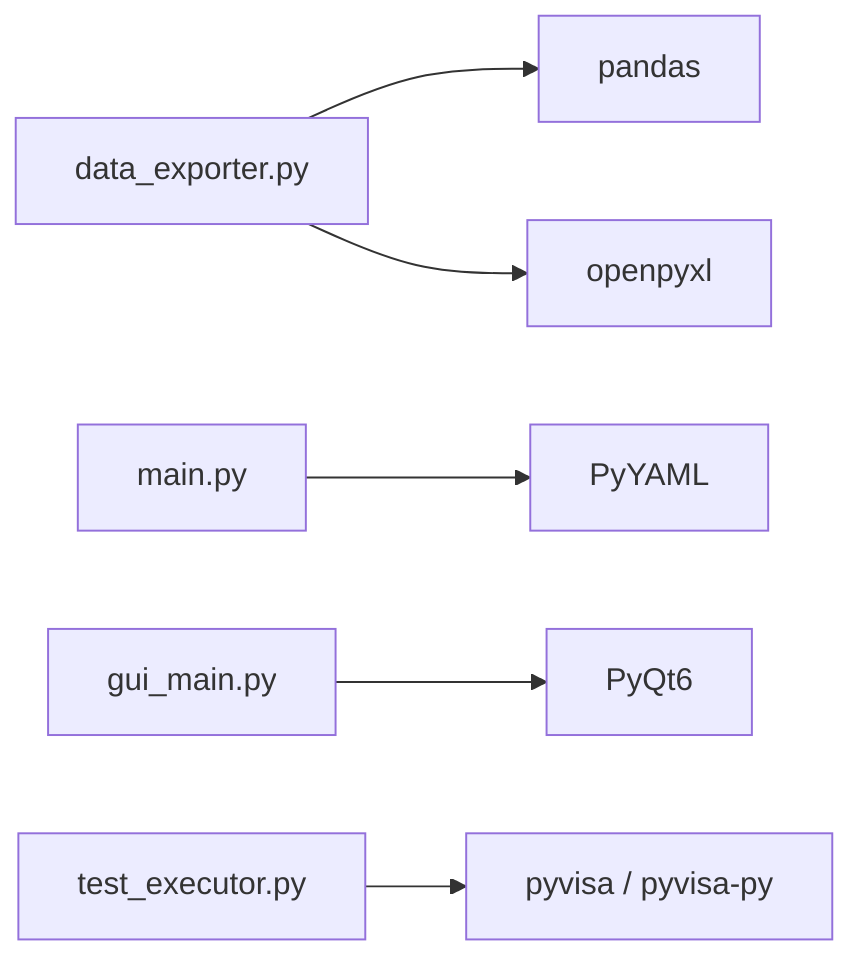

# 数据导出 API

<cite>
**本文引用的文件**
- [data_exporter.py](file://data_exporter.py)
- [main.py](file://main.py)
- [config.yaml](file://config.yaml)
- [test_executor.py](file://test_executor.py)
- [gui_main.py](file://gui_main.py)
- [requirements.txt](file://requirements.txt)
</cite>

## 目录
1. [简介](#简介)
2. [项目结构](#项目结构)
3. [核心组件](#核心组件)
4. [架构总览](#架构总览)
5. [详细组件分析](#详细组件分析)
6. [依赖分析](#依赖分析)
7. [性能考虑](#性能考虑)
8. [故障排查指南](#故障排查指南)
9. [结论](#结论)
10. [附录](#附录)

## 简介
本文件为 DataExporter 类的权威 API 文档，聚焦于 BLE TX 调制测试结果的 Excel 导出能力。内容涵盖：
- 导出方法与配置选项（输出目录、文件名前缀）
- Excel 生成与样式设置（表头、边框、对齐、条件着色）
- 表格格式化与列宽自适应
- 导出数据结构与格式规范
- 统计分析功能与摘要输出
- 自定义报告模板与样式定制方法
- 完整导出流程示例（从数据准备到文件生成）
- pandas DataFrame 使用模式与 openpyxl 样式配置要点
- 批量导出与自动化处理最佳实践

## 项目结构
DataExporter 位于数据导出模块中，负责将测试结果转换为带样式的 Excel 文件，并在“测试数据”和“测试摘要”两个工作表中输出结果与统计信息。程序入口 main.py 提供命令行与 GUI 两种调用方式；GUI 通过按钮触发导出；配置文件 config.yaml 定义导出路径与前缀等参数。

图表来源
- [main.py:117-216](file://main.py#L117-L216)
- [test_executor.py:186-245](file://test_executor.py#L186-L245)
- [data_exporter.py:81-139](file://data_exporter.py#L81-L139)
- [data_exporter.py:141-202](file://data_exporter.py#L141-L202)
- [data_exporter.py:204-282](file://data_exporter.py#L204-L282)
- [config.yaml:73-79](file://config.yaml#L73-L79)
- [gui_main.py:537-555](file://gui_main.py#L537-L555)

章节来源
- [main.py:117-216](file://main.py#L117-L216)
- [data_exporter.py:81-139](file://data_exporter.py#L81-L139)
- [config.yaml:73-79](file://config.yaml#L73-L79)
- [gui_main.py:537-555](file://gui_main.py#L537-L555)

## 核心组件
- DataExporter：负责导出 Excel、构建摘要、应用样式与列宽调整。
- BLETxModulationTest：产生 results 列表，每个元素包含信道号、时间戳、各项指标数值及判定结果。
- main.py：命令行/图形界面入口，组织测试执行与导出流程。
- gui_main.py：GUI 中的“导出 Excel”按钮回调，调用 DataExporter。
- config.yaml：导出相关配置项（输出目录、文件名前缀）。

章节来源
- [data_exporter.py:23-282](file://data_exporter.py#L23-L282)
- [test_executor.py:22-261](file://test_executor.py#L22-L261)
- [main.py:117-216](file://main.py#L117-L216)
- [gui_main.py:537-555](file://gui_main.py#L537-L555)
- [config.yaml:73-79](file://config.yaml#L73-L79)

## 架构总览
下图展示了从测试执行到导出的端到端流程，包括数据准备、Excel 写入、样式应用与最终文件返回。

图表来源
- [main.py:178-204](file://main.py#L178-L204)
- [test_executor.py:186-245](file://test_executor.py#L186-L245)
- [data_exporter.py:81-139](file://data_exporter.py#L81-L139)
- [data_exporter.py:141-202](file://data_exporter.py#L141-L202)
- [data_exporter.py:204-282](file://data_exporter.py#L204-L282)

## 详细组件分析

### DataExporter 类概览
DataExporter 封装了导出器核心逻辑，包括初始化、目录管理、文件名生成、数据导出、摘要构建与样式应用。

图表来源
- [data_exporter.py:23-282](file://data_exporter.py#L23-L282)

#### 构造与配置
- 构造函数接收配置字典，读取 export 子节：
  - output_dir：输出目录（支持绝对路径或相对路径，相对路径基于程序根目录解析）
  - file_prefix：Excel 文件名前缀
- 内部维护 output_dir、file_prefix 属性，用于后续生成文件路径与应用样式。

章节来源
- [data_exporter.py:41-61](file://data_exporter.py#L41-L61)
- [config.yaml:73-79](file://config.yaml#L73-L79)

#### 目录与文件名
- _ensure_output_dir：若输出目录不存在则创建。
- _generate_filename：生成带日期时间戳的文件名，格式为“前缀_YYYYMMDD_HHMMSS.xlsx”，并拼接输出目录。

章节来源
- [data_exporter.py:63-79](file://data_exporter.py#L63-L79)

#### 导出主流程
- export_to_excel(results, test_params)：
  - 确保目录存在并生成文件路径
  - 构建“测试数据”DataFrame：
    - 固定列：“信道 (Channel)”、“测量时间”
    - 动态列：根据 test_params.measurements 的 name 与 unit 生成“指标名称 (单位)”列
    - 判定列：对应指标的“指标名称 判定”列，值为 PASS/FAIL/ERROR/N/A
  - 构建“测试摘要”DataFrame：由 _build_summary 生成
  - 使用 pd.ExcelWriter 以 openpyxl 引擎写入两个 Sheet
  - 调用 _apply_styles 进行样式美化与列宽调整
  - 返回文件路径字符串

章节来源
- [data_exporter.py:81-139](file://data_exporter.py#L81-L139)

#### 统计数据构建
- _build_summary(results, test_params)：
  - 汇总测试时间、标准、PHY 类型、信道范围、统计次数、总信道数
  - 逐项统计各指标的通过/失败数量
  - 计算全部通过信道数、有失败项信道数、总体判定（全通过则为 PASS，否则 FAIL）
  - 返回行列表，每行为 {"项目": ..., "数值": ...}

章节来源
- [data_exporter.py:141-202](file://data_exporter.py#L141-L202)

#### 样式与格式化
- _apply_styles(filepath, row_count, col_count)：
  - 加载已生成的 Excel 工作簿
  - “测试数据”Sheet：
    - 表头：蓝色背景、白色加粗字体、居中对齐、细边框
    - 数据区：常规字体、居中对齐、细边框
    - 条件着色：单元格值为 PASS 时浅绿填充，FAIL 时浅红填充
    - 自动列宽：按字符宽度计算（中文按 2 个字符计），最大不超过 30
  - “测试摘要”Sheet：
    - 表头与数据区样式同上
    - 最后一行“总体判定”：PASS 深绿加粗，FAIL 深红加粗
    - 固定列宽：A 列 35，B 列 30
  - 保存工作簿

章节来源
- [data_exporter.py:204-282](file://data_exporter.py#L204-L282)

### 数据导出接口与方法清单
- __init__(config)
  - 作用：初始化导出器，解析输出目录与文件名前缀
  - 参数：config（来自 config.yaml 的配置字典）
  - 异常：无显式抛出，但依赖配置键存在
- _ensure_output_dir()
  - 作用：确保输出目录存在
- _generate_filename()
  - 作用：生成带时间戳的完整文件路径
- export_to_excel(results, test_params)
  - 作用：将测试结果导出为带样式的 Excel 文件
  - 参数：
    - results：list[dict]，来自 BLETxModulationTest.get_results()
    - test_params：dict，来自 config.yaml 的 test_params
  - 返回：str，导出文件的完整路径
- _build_summary(results, test_params)
  - 作用：构建测试摘要数据
  - 返回：list[dict]，摘要行列表
- _apply_styles(filepath, row_count, col_count)
  - 作用：对导出文件应用样式与列宽调整
  - 参数：
    - filepath：str，Excel 文件路径
    - row_count：int，数据行数
    - col_count：int，数据列数

章节来源
- [data_exporter.py:41-282](file://data_exporter.py#L41-L282)

### 数据结构与格式规范

#### 输入数据要求（results）
- 类型：list[dict]
- 每个元素代表一个信道的测量结果，至少包含：
  - channel：int，信道编号
  - timestamp：str，测量时间
  - 指标字段（可选，缺失时为 N/A）：
    - frequency_accuracy
    - frequency_drift
    - frequency_offset
    - initial_frequency_drift
    - max_drift_rate
  - pass_fail：dict，键为上述指标，值为 PASS/FAIL/ERROR/N/A
- 错误场景：当某项指标读取失败时，可能缺少该键或值为 None，导出时会标记为 N/A 或 ERROR。

章节来源
- [test_executor.py:126-184](file://test_executor.py#L126-L184)
- [data_exporter.py:95-125](file://data_exporter.py#L95-L125)

#### 输出 Excel 结构
- Sheet 1：“测试数据”
  - 列：
    - 信道 (Channel)
    - 测量时间
    - 频率准确度 (kHz)、频率准确度 判定
    - 频率漂移 (kHz)、频率漂移 判定
    - 频率偏移 (kHz)、频率偏移 判定
    - 初始频率漂移 (kHz)、初始频率漂移 判定
    - 最大漂移速率 (kHz)、最大漂移速率 判定
  - 行：每个信道一行
- Sheet 2：“测试摘要”
  - 列：项目、数值
  - 行：测试时间、测试标准、信道范围、统计次数、总测试信道数、分隔线、各指标通过/失败统计、分隔线、全部通过信道数、有失败项信道数、总体判定

章节来源
- [data_exporter.py:95-139](file://data_exporter.py#L95-L139)
- [data_exporter.py:141-202](file://data_exporter.py#L141-L202)

#### 样式与格式化规范
- 表头：蓝色背景、白色加粗字体、居中对齐、细边框
- 数据区：常规字体、居中对齐、细边框
- 条件着色：
  - PASS：浅绿色填充
  - FAIL：浅红色填充
- 自动列宽：按字符宽度计算（中文按 2 个字符计），上限 30
- 摘要 Sheet：
  - 最后一行“总体判定”：PASS 深绿加粗，FAIL 深红加粗
  - 固定列宽：A 列 35，B 列 30

章节来源
- [data_exporter.py:204-282](file://data_exporter.py#L204-L282)

### 配置选项与自定义模板

#### 导出配置（config.yaml）
- export.output_dir：输出目录（支持绝对路径或相对路径）
- export.file_prefix：Excel 文件名前缀
- test_params.measurements：定义指标名称、单位与判定限值（upper_limit/lower_limit）

章节来源
- [config.yaml:73-79](file://config.yaml#L73-L79)
- [config.yaml:44-72](file://config.yaml#L44-L72)

#### 样式定制方法
- 修改类常量：
  - PASS_FILL、FAIL_FILL、HEADER_FILL：背景色
  - HEADER_FONT、NORMAL_FONT、BOLD_FONT：字体
  - CENTER_ALIGN：对齐方式
  - THIN_BORDER：边框样式
- 在 _apply_styles 中扩展：
  - 新增条件着色规则（如 ERROR 高亮）
  - 增加更多 Sheet 的样式处理
  - 调整列宽策略或限制最大值
- 通过外部配置注入样式：
  - 在 config.yaml 中新增样式配置段，在 __init__ 中读取并覆盖默认样式

章节来源
- [data_exporter.py:26-39](file://data_exporter.py#L26-L39)
- [data_exporter.py:204-282](file://data_exporter.py#L204-L282)

### 统计分析功能与输出格式
- 统计维度：
  - 各指标通过/失败计数
  - 全部通过信道数、有失败项信道数
  - 总体判定（全通过为 PASS，否则 FAIL）
- 输出位置：
  - “测试摘要”Sheet 的“项目/数值”列
- 数据来源：
  - results 中每项的 pass_fail 字典

章节来源
- [data_exporter.py:141-202](file://data_exporter.py#L141-L202)

### 完整导出流程示例（从数据准备到文件生成）
- 步骤：
  1. 加载配置（main.py 的 load_config 与 _normalize_config）
  2. 连接仪器并创建测试执行器（BLETxModulationTest）
  3. 运行测试获取 results（run()）
  4. 实例化 DataExporter(config)
  5. 调用 exporter.export_to_excel(results, test_params)
  6. 返回文件路径并提示成功
- 命令行模式参考：
  - main.py 的 run_cli 中 test 命令分支
- GUI 模式参考：
  - gui_main.py 的 _on_export 按钮回调

章节来源
- [main.py:117-216](file://main.py#L117-L216)
- [gui_main.py:537-555](file://gui_main.py#L537-L555)
- [test_executor.py:186-245](file://test_executor.py#L186-L245)
- [data_exporter.py:81-139](file://data_exporter.py#L81-L139)

### pandas DataFrame 使用模式
- 构建“测试数据”DataFrame：
  - 遍历 results，组装行字典，包含固定列与动态指标列
  - 使用 pd.DataFrame(rows) 生成数据表
- 构建“测试摘要”DataFrame：
  - 使用 _build_summary 生成行列表，直接传入 pd.DataFrame
- 写入 Excel：
  - 使用 pd.ExcelWriter 指定 engine="openpyxl"
  - to_excel 分别写入两个 Sheet，index=False

章节来源
- [data_exporter.py:95-139](file://data_exporter.py#L95-L139)

### openpyxl 样式配置方法
- 导入样式对象：Font、PatternFill、Alignment、Border、Side
- 预定义样式常量：
  - PASS_FILL、FAIL_FILL、HEADER_FILL
  - HEADER_FONT、NORMAL_FONT、BOLD_FONT
  - CENTER_ALIGN、THIN_BORDER
- 应用样式：
  - 遍历表头与数据区域，设置 font、fill、alignment、border
  - 条件着色：根据单元格值设置填充颜色
  - 自动列宽：计算最大字符长度并设置 column_dimensions.width
  - 保存工作簿：wb.save(filepath)

章节来源
- [data_exporter.py:19-39](file://data_exporter.py#L19-L39)
- [data_exporter.py:204-282](file://data_exporter.py#L204-L282)

### 批量导出与自动化处理最佳实践
- 批量导出：
  - 多次调用 export_to_excel，每次传入不同的 results 与 test_params
  - 建议为不同批次设置不同的 file_prefix 或在文件名中加入批次标识
- 自动化处理：
  - 在 CI/CD 或定时任务中调用 main.py 的 CLI 模式
  - 统一输出目录，便于归档与分析
- 错误处理：
  - 捕获导出异常并记录日志
  - 对于部分信道测量失败的情况，保留 ERROR 标记以便追溯
- 性能优化：
  - 避免频繁打开/关闭 Excel 工作簿，尽量合并写入
  - 控制列宽计算复杂度，必要时限制最大列数

章节来源
- [data_exporter.py:81-139](file://data_exporter.py#L81-L139)
- [main.py:178-204](file://main.py#L178-L204)

## 依赖分析
- 运行时依赖：
  - pandas：数据处理与 Excel 写入
  - openpyxl：Excel 样式与列宽调整
  - PyYAML：配置文件解析
  - PyQt6：GUI 框架（非导出必需）
  - pyvisa/pyvisa-py/pyusb/pyserial：仪器通信（非导出必需）
  - matplotlib：可视化（非导出必需）
  - pyinstaller：打包工具（非导出必需）

图表来源
- [requirements.txt:1-12](file://requirements.txt#L1-L12)
- [data_exporter.py:18-20](file://data_exporter.py#L18-L20)
- [main.py:98-114](file://main.py#L98-L114)
- [gui_main.py:230-242](file://gui_main.py#L230-L242)
- [test_executor.py:18-19](file://test_executor.py#L18-L19)

章节来源
- [requirements.txt:1-12](file://requirements.txt#L1-L12)
- [data_exporter.py:18-20](file://data_exporter.py#L18-L20)
- [main.py:98-114](file://main.py#L98-L114)
- [gui_main.py:230-242](file://gui_main.py#L230-L242)
- [test_executor.py:18-19](file://test_executor.py#L18-L19)

## 性能考虑
- 大数据量导出：
  - 减少不必要的样式遍历，可仅对关键列应用条件着色
  - 合理设置列宽上限，避免过长文本导致列宽过大
- 内存占用：
  - 避免一次性构建超大 DataFrame，可按批次拆分
- I/O 优化：
  - 复用 ExcelWriter 上下文，减少磁盘操作次数
- 样式应用：
  - 仅在需要时加载工作簿并应用样式，避免重复读写

[本节为通用指导，不直接分析具体文件]

## 故障排查指南
- 找不到配置文件：
  - 检查 config.yaml 是否与程序在同一目录
  - 确认 YAML 语法正确
- 导出失败：
  - 检查输出目录权限与路径是否存在
  - 查看异常堆栈，定位是数据格式问题还是 openpyxl 写入错误
- 样式未生效：
  - 确认 openpyxl 版本兼容
  - 检查样式常量是否被覆盖或冲突
- 列宽异常：
  - 检查中文字符长度计算逻辑
  - 调整最大列宽限制

章节来源
- [main.py:103-114](file://main.py#L103-L114)
- [data_exporter.py:204-282](file://data_exporter.py#L204-L282)

## 结论
DataExporter 提供了完整的 BLE TX 调制测试结果导出能力，涵盖数据转换、样式美化与统计分析。通过配置驱动的输出目录与文件名前缀，结合灵活的样式定制方法，可满足多种报告需求。遵循本文档的数据结构规范与最佳实践，可实现稳定高效的批量导出与自动化处理。

[本节为总结性内容，不直接分析具体文件]

## 附录

### API 方法速查表
- __init__(config)
  - 参数：config（dict）
  - 返回：无
- _ensure_output_dir()
  - 参数：无
  - 返回：无
- _generate_filename()
  - 参数：无
  - 返回：str（完整文件路径）
- export_to_excel(results, test_params)
  - 参数：
    - results：list[dict]
    - test_params：dict
  - 返回：str（导出文件路径）
- _build_summary(results, test_params)
  - 参数：
    - results：list[dict]
    - test_params：dict
  - 返回：list[dict]（摘要行）
- _apply_styles(filepath, row_count, col_count)
  - 参数：
    - filepath：str
    - row_count：int
    - col_count：int
  - 返回：无

章节来源
- [data_exporter.py:41-282](file://data_exporter.py#L41-L282)

### 配置项说明
- export.output_dir
  - 类型：str
  - 描述：输出目录（支持绝对路径或相对路径）
- export.file_prefix
  - 类型：str
  - 描述：Excel 文件名前缀
- test_params.measurements
  - 类型：dict
  - 描述：指标定义，包含 name、unit、upper_limit、lower_limit

章节来源
- [config.yaml:73-79](file://config.yaml#L73-L79)
- [config.yaml:44-72](file://config.yaml#L44-L72)