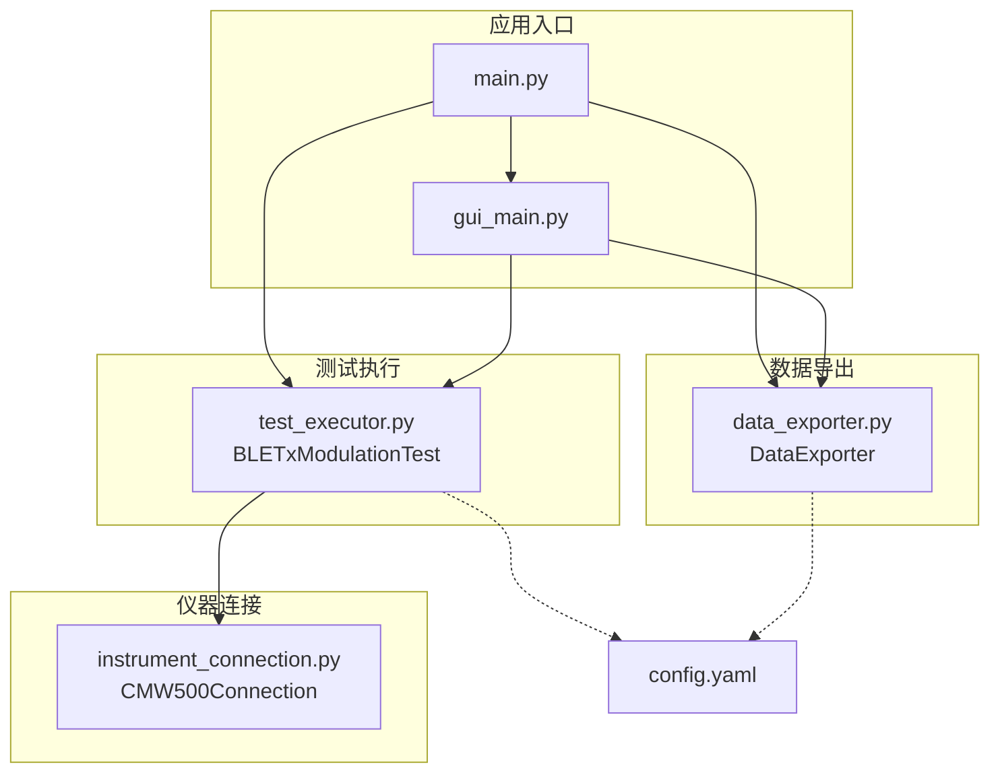
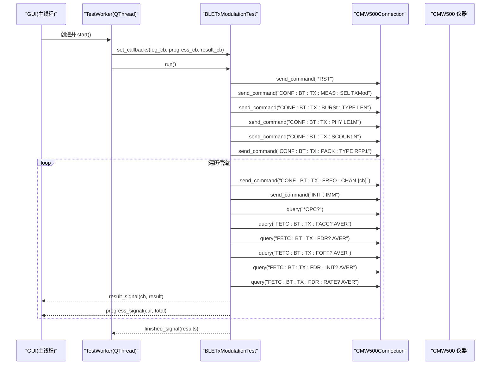
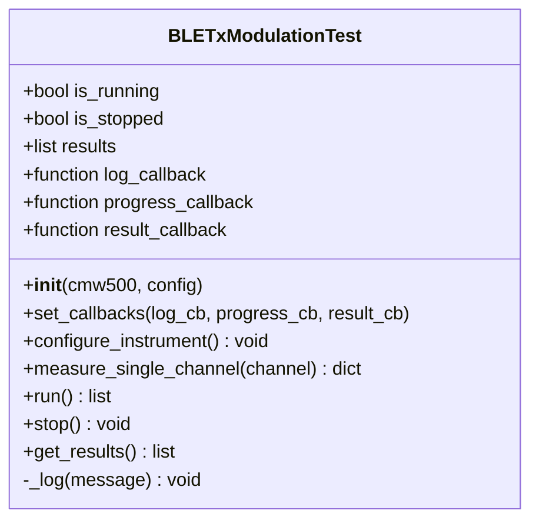
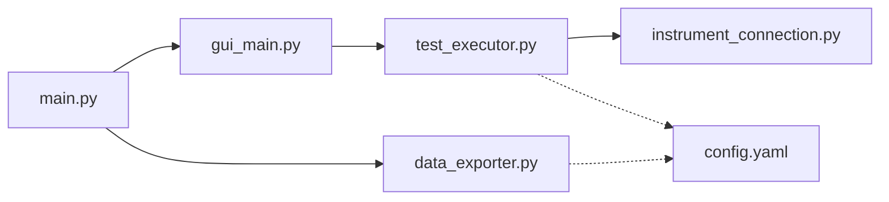

# 测试执行 API

<cite>
**本文引用的文件**
- [test_executor.py](file://test_executor.py)
- [instrument_connection.py](file://instrument_connection.py)
- [gui_main.py](file://gui_main.py)
- [main.py](file://main.py)
- [config.yaml](file://config.yaml)
- [data_exporter.py](file://data_exporter.py)
</cite>

## 目录
1. [简介](#简介)
2. [项目结构](#项目结构)
3. [核心组件](#核心组件)
4. [架构总览](#架构总览)
5. [详细组件分析](#详细组件分析)
6. [依赖关系分析](#依赖关系分析)
7. [性能与稳定性](#性能与稳定性)
8. [故障排查指南](#故障排查指南)
9. [结论](#结论)
10. [附录：完整使用示例](#附录完整使用示例)

## 简介
本文件为 BLETxModulationTest 类的完整 API 文档，面向 BLE TX 调制自动化测试的执行器。内容覆盖：
- 类方法与属性、构造函数参数、配置项说明
- 测试执行流程与结果处理机制
- SCPI 指令序列与测量指标定义
- 回调函数机制（日志、进度、单信道结果）
- 测试状态管理、异常处理与错误恢复
- 从初始化到结果获取的端到端示例
- 测试结果数据结构与分析方法

## 项目结构
本项目围绕 CMW500 仪器控制与 BLE TX 调制测试展开，关键模块如下：
- 仪器连接层：封装 LAN/GPIB/USB 三种接口，提供 send_command/query 等基础通信能力
- 测试执行层：BLETxModulationTest 负责配置仪器、逐信道测量、判定与结果收集
- GUI/CLI 入口：提供图形界面与命令行两种交互方式，驱动测试执行与导出
- 数据导出：将测试结果导出为 Excel，包含明细与摘要两个工作表

图表来源
- [main.py:295-336](file://main.py#L295-L336)
- [gui_main.py:28-73](file://gui_main.py#L28-L73)
- [test_executor.py:22-51](file://test_executor.py#L22-L51)
- [instrument_connection.py:18-54](file://instrument_connection.py#L18-L54)
- [data_exporter.py:23-62](file://data_exporter.py#L23-L62)
- [config.yaml:1-79](file://config.yaml#L1-L79)

章节来源
- [main.py:295-336](file://main.py#L295-L336)
- [gui_main.py:28-73](file://gui_main.py#L28-L73)
- [test_executor.py:22-51](file://test_executor.py#L22-L51)
- [instrument_connection.py:18-54](file://instrument_connection.py#L18-L54)
- [data_exporter.py:23-62](file://data_exporter.py#L23-L62)
- [config.yaml:1-79](file://config.yaml#L1-L79)

## 核心组件
- BLETxModulationTest：BLE TX 调制测试执行器，负责仪器配置、逐信道测量、判定与结果汇总
- CMW500Connection：仪器连接抽象，统一 send_command/query 接口
- DataExporter：测试结果导出为 Excel，含“测试数据”和“测试摘要”两表
- 主程序与 GUI：加载配置、创建连接、启动测试线程、绑定回调、展示结果与导出

章节来源
- [test_executor.py:22-51](file://test_executor.py#L22-L51)
- [instrument_connection.py:18-54](file://instrument_connection.py#L18-L54)
- [data_exporter.py:23-62](file://data_exporter.py#L23-L62)
- [main.py:295-336](file://main.py#L295-L336)
- [gui_main.py:28-73](file://gui_main.py#L28-L73)

## 架构总览
下图展示了 GUI 线程中通过信号槽调用测试执行器的典型流程，以及测试执行器与仪器的交互路径。

图表来源
- [gui_main.py:48-73](file://gui_main.py#L48-L73)
- [test_executor.py:76-103](file://test_executor.py#L76-L103)
- [test_executor.py:105-184](file://test_executor.py#L105-L184)
- [test_executor.py:186-245](file://test_executor.py#L186-L245)
- [instrument_connection.py:192-215](file://instrument_connection.py#L192-L215)

## 详细组件分析

### BLETxModulationTest 类 API

#### 构造与属性
- 构造函数 __init__(cmw500, config)
  - cmw500: 已连接的 CMW500Connection 实例
  - config: 来自 config.yaml 的配置字典，至少包含 test_params 子节
  - 内部读取 channel_start/channel_end/statistic_count/measurements 等参数
- 运行状态
  - is_running: bool，是否正在执行
  - is_stopped: bool，是否被请求停止
- 结果存储
  - results: list[dict]，保存每个信道的结果或错误记录
- 回调
  - log_callback(message): 日志输出回调
  - progress_callback(current, total): 进度更新回调
  - result_callback(channel, data): 单信道结果回调

章节来源
- [test_executor.py:25-51](file://test_executor.py#L25-L51)

#### 回调设置
- set_callbacks(log_cb=None, progress_cb=None, result_cb=None)
  - 用于 GUI 或 CLI 注入回调函数，实现非阻塞式日志、进度与结果推送

章节来源
- [test_executor.py:52-66](file://test_executor.py#L52-L66)

#### 仪器配置
- configure_instrument()
  - 发送复位与测量模式选择指令
  - 设置突发类型、PHY、统计次数、数据包类型
  - 内部通过 _log 输出日志并触发 log_callback

章节来源
- [test_executor.py:76-103](file://test_executor.py#L76-L103)

#### 单信道测量
- measure_single_channel(channel) -> dict
  - 设置当前信道并启动单次测量
  - 等待操作完成标志
  - 读取五项频率相关指标并取绝对值进行判定
  - 返回包含数值与 pass_fail 判定的结果字典

章节来源
- [test_executor.py:105-184](file://test_executor.py#L105-L184)

#### 测试执行流程
- run() -> list[dict]
  - 初始化状态与结果列表
  - 计算总信道数并输出开始日志
  - 配置仪器后逐信道测量
  - 支持 stop() 中断
  - 每次测量完成后触发 result_callback 与 progress_callback
  - 捕获异常并记录错误结果行
  - 结束前输出完成日志并返回 results

章节来源
- [test_executor.py:186-245](file://test_executor.py#L186-L245)

#### 停止与查询
- stop()
  - 设置 is_stopped 标志，run() 循环内检查以退出
- get_results() -> list[dict]
  - 返回所有信道的测试结果

章节来源
- [test_executor.py:247-261](file://test_executor.py#L247-L261)

#### 内部辅助
- _log(message)
  - 格式化时间戳并打印，同时触发 log_callback

章节来源
- [test_executor.py:68-75](file://test_executor.py#L68-L75)

#### 类图（代码级）

图表来源
- [test_executor.py:22-261](file://test_executor.py#L22-L261)

### 仪器连接层 CMW500Connection
- 支持 LAN/GPIB/USB 三种接口
- 提供 connect()/disconnect() 建立与断开连接
- 提供 send_command()/query() 发送 SCPI 命令与查询
- 提供 get_serial_number() 解析 *IDN? 返回的序列号

章节来源
- [instrument_connection.py:18-54](file://instrument_connection.py#L18-L54)
- [instrument_connection.py:85-132](file://instrument_connection.py#L85-L132)
- [instrument_connection.py:134-159](file://instrument_connection.py#L134-L159)
- [instrument_connection.py:161-190](file://instrument_connection.py#L161-L190)
- [instrument_connection.py:192-215](file://instrument_connection.py#L192-L215)

### GUI 集成与回调机制
- TestWorker 在独立线程中创建 BLETxModulationTest 并绑定回调
- 通过 pyqtSignal 将日志、进度、单信道结果与完成事件回传到主线程
- 主窗口根据信号更新表格、进度条与日志区

章节来源
- [gui_main.py:28-73](file://gui_main.py#L28-L73)
- [gui_main.py:499-528](file://gui_main.py#L499-L528)
- [gui_main.py:561-629](file://gui_main.py#L561-L629)

### 数据导出 DataExporter
- 生成带时间戳的文件名，写入“测试数据”与“测试摘要”两个 Sheet
- 对判定列进行着色，自动调整列宽，美化样式
- 支持相对路径输出目录，兼容打包后的 exe 环境

章节来源
- [data_exporter.py:23-62](file://data_exporter.py#L23-L62)
- [data_exporter.py:81-139](file://data_exporter.py#L81-L139)
- [data_exporter.py:141-202](file://data_exporter.py#L141-L202)
- [data_exporter.py:204-283](file://data_exporter.py#L204-L283)

## 依赖关系分析
- BLETxModulationTest 依赖 CMW500Connection 进行仪器通信
- GUI 通过 TestWorker 间接依赖 BLETxModulationTest
- main.py 负责加载配置、创建连接与选择运行模式
- DataExporter 依赖 pandas/openpyxl 进行 Excel 导出

图表来源
- [main.py:295-336](file://main.py#L295-L336)
- [gui_main.py:28-73](file://gui_main.py#L28-L73)
- [test_executor.py:22-51](file://test_executor.py#L22-L51)
- [instrument_connection.py:18-54](file://instrument_connection.py#L18-L54)
- [data_exporter.py:23-62](file://data_exporter.py#L23-L62)
- [config.yaml:1-79](file://config.yaml#L1-L79)

章节来源
- [main.py:295-336](file://main.py#L295-L336)
- [gui_main.py:28-73](file://gui_main.py#L28-L73)
- [test_executor.py:22-51](file://test_executor.py#L22-L51)
- [instrument_connection.py:18-54](file://instrument_connection.py#L18-L54)
- [data_exporter.py:23-62](file://data_exporter.py#L23-L62)
- [config.yaml:1-79](file://config.yaml#L1-L79)

## 性能与稳定性
- 仪器通信延迟：每个信道多次 SCPI 查询，建议合理设置超时与统计次数
- 回调开销：频繁的单信道结果回调可能带来 UI 刷新压力，建议在 GUI 侧做批量渲染或节流
- 异常容错：单个信道测量失败会记录错误行，不影响后续信道继续执行
- 停止响应：stop() 仅设置标志位，需等待当前信道完成后再退出，避免中断仪器状态机

[本节为通用指导，不直接分析具体文件]

## 故障排查指南
- 连接失败
  - 检查接口类型与地址参数是否正确
  - 确认网络连通性或 GPIB/USB 线缆与驱动
  - 查看连接返回的错误提示与详细信息
- 仪器无响应
  - 确认 VISA 资源管理器可用
  - 检查超时设置是否过短
  - 尝试重新连接并再次查询 *IDN?
- 测试中途停止
  - 确认 stop() 已被调用且 is_running 为真
  - 观察日志中“正在停止测试...”与“测试已被用户停止”
- 导出失败
  - 检查输出目录权限与磁盘空间
  - 确认 openpyxl/pandas 依赖安装正确

章节来源
- [instrument_connection.py:85-132](file://instrument_connection.py#L85-L132)
- [instrument_connection.py:134-159](file://instrument_connection.py#L134-L159)
- [test_executor.py:247-261](file://test_executor.py#L247-L261)
- [data_exporter.py:63-79](file://data_exporter.py#L63-L79)

## 结论
BLETxModulationTest 提供了完整的 BLE TX 调制测试执行能力，涵盖仪器配置、逐信道测量、判定与结果收集，并通过回调机制与 GUI/CLI 无缝集成。结合 CMW500Connection 的多接口支持与 DataExporter 的 Excel 导出功能，形成了一套稳定、可扩展的自动化测试方案。

[本节为总结性内容，不直接分析具体文件]

## 附录：完整使用示例

### 端到端流程（从初始化到结果获取）
- 加载配置并规范化
- 创建 CMW500Connection 实例（不立即连接）
- 连接仪器并验证
- 创建 BLETxModulationTest 实例并设置回调
- 启动测试（GUI 线程或 CLI 同步调用）
- 监听进度与结果回调，实时显示
- 测试结束后导出 Excel

章节来源
- [main.py:295-336](file://main.py#L295-L336)
- [gui_main.py:499-528](file://gui_main.py#L499-L528)
- [test_executor.py:186-245](file://test_executor.py#L186-L245)
- [data_exporter.py:81-139](file://data_exporter.py#L81-L139)

### 回调函数机制使用示例（概念性步骤）
- 设置日志回调：接收带时间戳的消息字符串
- 设置进度回调：接收 (current, total)，用于更新进度条
- 设置结果回调：接收 (channel, result_dict)，用于插入表格行
- 在 GUI 中通过 pyqtSignal 将回调映射到主线程槽函数

章节来源
- [gui_main.py:48-73](file://gui_main.py#L48-L73)
- [gui_main.py:561-629](file://gui_main.py#L561-L629)

### 测试结果数据结构与分析方法
- 单信道结果字段
  - channel: int，信道编号
  - timestamp: str，测量时间
  - frequency_accuracy: float|None，频率准确度（kHz）
  - frequency_drift: float|None，频率漂移（kHz）
  - frequency_offset: float|None，频率偏移（kHz）
  - initial_frequency_drift: float|None，初始频率漂移（kHz）
  - max_drift_rate: float|None，最大漂移速率（kHz）
  - pass_fail: dict，每项指标的 PASS/FAIL/ERROR 判定
- 分析方法
  - 逐项比较绝对值与上限/下限阈值
  - 统计各指标通过/失败数量
  - 统计全部通过的信道数与总体判定
  - 导出 Excel 时自动生成“测试数据”与“测试摘要”

章节来源
- [test_executor.py:126-184](file://test_executor.py#L126-L184)
- [data_exporter.py:141-202](file://data_exporter.py#L141-L202)

### SCPI 指令序列与测量指标
- 仪器配置
  - *RST：复位仪器
  - CONF:BT:TX:MEAS:SEL TXMod：选择蓝牙 TX 调制测量
  - CONF:BT:TX:BURSt:TYPE LEN：设置突发类型为 Low Energy
  - CONF:BT:TX:PHY LE1M：设置 PHY 为 LE 1Msps
  - CONF:BT:TX:SCOUNt N：设置统计平均次数
  - CONF:BT:TX:PACK:TYPE RFP1：设置数据包类型
- 单信道测量
  - CONF:BT:TX:FREQ:CHAN {ch}：设置当前信道
  - INIT:IMM：启动单次测量
  - *OPC?：等待操作完成
  - FETC:BT:TX:FACC? AVER：频率准确度
  - FETC:BT:TX:FDR? AVER：频率漂移
  - FETC:BT:TX:FOFF? AVER：频率偏移
  - FETC:BT:TX:FDR:INIT? AVER：初始频率漂移
  - FETC:BT:TX:FDR:RATE? AVER：最大漂移速率

章节来源
- [test_executor.py:76-103](file://test_executor.py#L76-L103)
- [test_executor.py:105-184](file://test_executor.py#L105-L184)

### 测试配置选项（来自配置文件）
- instrument：接口类型与连接参数（LAN/GPIB/USB），超时设置
- test_params：
  - standard/phy_type/burst_type/packet_type：测试标准与 PHY 信息
  - statistic_count：统计次数
  - channel_start/channel_end：信道范围
  - measurements：各项指标的 name/unit/upper_limit/lower_limit
- export：输出目录与文件名前缀

章节来源
- [config.yaml:1-79](file://config.yaml#L1-L79)