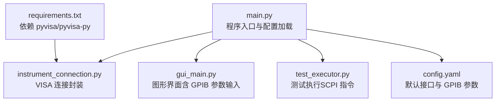
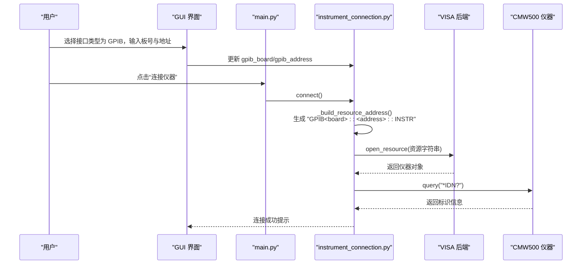
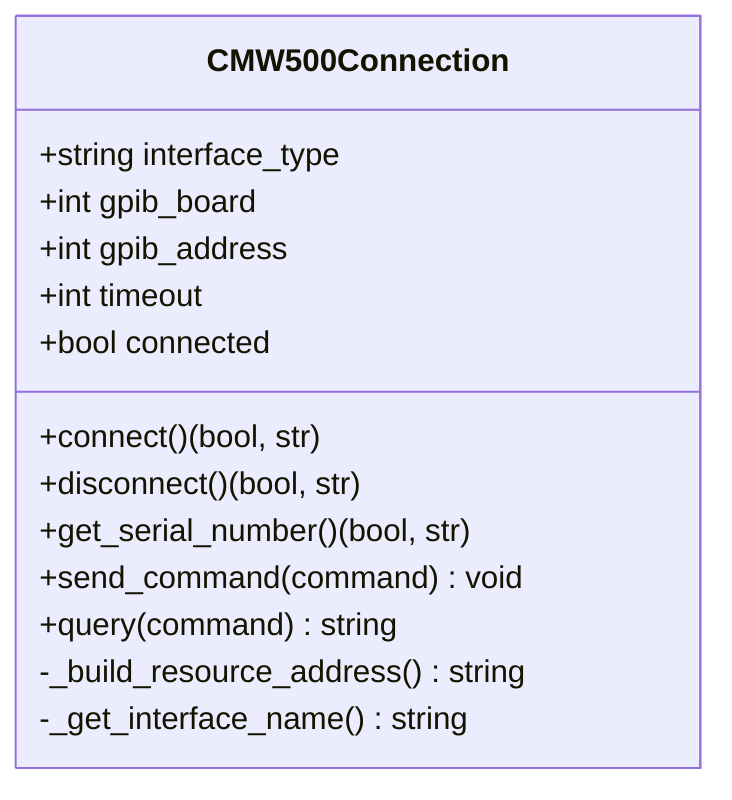
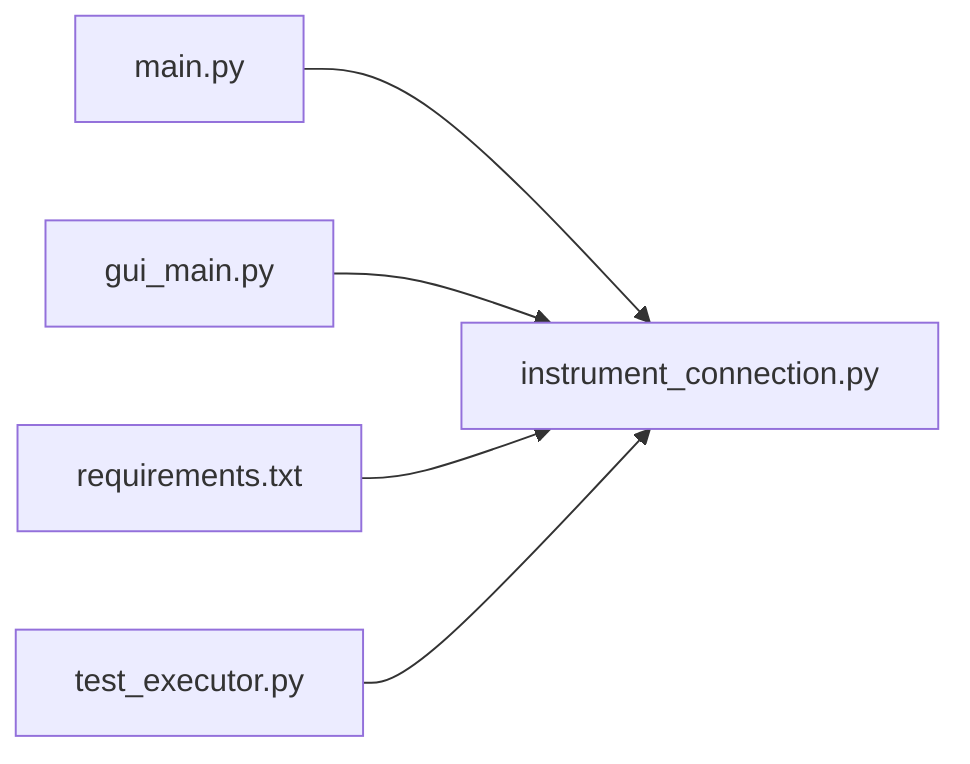

# GPIB (IEEE-488) 连接配置

<cite>
**本文引用的文件列表**
- [main.py](file://main.py)
- [instrument_connection.py](file://instrument_connection.py)
- [config.yaml](file://config.yaml)
- [gui_main.py](file://gui_main.py)
- [requirements.txt](file://requirements.txt)
- [test_executor.py](file://test_executor.py)
</cite>

## 目录
1. [简介](#简介)
2. [项目结构](#项目结构)
3. [核心组件](#核心组件)
4. [架构总览](#架构总览)
5. [详细组件分析](#详细组件分析)
6. [依赖关系分析](#依赖关系分析)
7. [性能与限制](#性能与限制)
8. [故障诊断指南](#故障诊断指南)
9. [结论](#结论)
10. [附录](#附录)

## 简介
本文件面向使用 GPIB（IEEE-488）接口连接 CMW500 仪器的用户，提供从硬件到软件配置的完整说明。文档基于仓库中的实际实现，重点解释：
- 通过 GPIB 线缆连接 CMW500 的硬件要求与步骤
- 主机端 GPIB 板卡安装与驱动配置
- 主/从设备设置与地址分配规则
- VISA 资源字符串格式“GPIB<board>::<address>::INSTR”的参数含义与设置方法
- 拨码开关设置、终端电阻与总线拓扑要点
- 通信协议特点与性能限制
- 常见问题诊断与解决方法（设备不响应、通信错误、地址冲突等）

## 项目结构
本项目为 CMW500 BLE TX 调制自动化测试工具，支持 LAN/GPIB/USB 三种仪器接口。与 GPIB 相关的关键位置如下：
- 配置文件：定义默认接口类型、GPIB 板号与主地址
- 连接模块：根据接口类型构造 VISA 资源字符串并建立连接
- GUI：提供界面化选择接口类型、输入 GPIB 板号与地址
- 命令行模式：打印当前 GPIB 配置摘要
- 依赖库：pyvisa 用于底层仪器通信

图表来源
- [main.py:295-336](file://main.py#L295-L336)
- [instrument_connection.py:55-110](file://instrument_connection.py#L55-L110)
- [gui_main.py:150-276](file://gui_main.py#L150-L276)
- [config.yaml:1-26](file://config.yaml#L1-L26)
- [requirements.txt:1-12](file://requirements.txt#L1-L12)

章节来源
- [main.py:295-336](file://main.py#L295-L336)
- [config.yaml:1-26](file://config.yaml#L1-L26)

## 核心组件
- 连接管理类：负责创建 VISA 资源管理器、构造资源地址、打开仪器、发送/查询 SCPI 命令、处理超时与异常
- 配置管理：YAML 中保存 interface_type、gpib.board、gpib.address 等关键参数；启动时自动补全缺失字段
- 图形界面：提供下拉选择接口类型、输入 GPIB 板号与地址，并在连接前禁用编辑防止误改
- 命令行模式：打印当前接口与 GPIB 配置摘要，便于快速核对

章节来源
- [instrument_connection.py:18-110](file://instrument_connection.py#L18-L110)
- [main.py:245-292](file://main.py#L245-L292)
- [gui_main.py:150-276](file://gui_main.py#L150-L276)
- [main.py:117-142](file://main.py#L117-L142)

## 架构总览
下图展示从用户操作到仪器通信的整体流程，突出 GPIB 路径的资源字符串构建与连接验证。

图表来源
- [gui_main.py:438-479](file://gui_main.py#L438-L479)
- [instrument_connection.py:85-110](file://instrument_connection.py#L85-L110)
- [instrument_connection.py:55-74](file://instrument_connection.py#L55-L74)

## 详细组件分析

### 连接类 CMW500Connection（GPIB 路径）
- 初始化参数包含 interface_type、gpib_board、gpib_address、timeout 等
- 资源地址构造：当接口类型为 GPIB 时，生成“GPIB<board>::<address>::INSTR”
- 连接流程：创建 ResourceManager -> open_resource -> 设置 timeout -> 发送 *IDN? 校验
- 异常处理：捕获 VisaIOError，针对 GPIB 给出具体提示（检查线缆与地址）

图表来源
- [instrument_connection.py:18-110](file://instrument_connection.py#L18-L110)

章节来源
- [instrument_connection.py:18-110](file://instrument_connection.py#L18-L110)

### 配置与默认值（config.yaml 与兼容性处理）
- config.yaml 中 instrument.gpib.board 与 instrument.gpib.address 定义默认 GPIB 参数
- main.py 的 _normalize_config 确保旧版配置兼容，自动补齐缺失字段（如 board=0、address=20）
- 命令行模式会打印当前 GPIB 配置摘要，便于核对

章节来源
- [config.yaml:11-16](file://config.yaml#L11-L16)
- [main.py:245-292](file://main.py#L245-L292)
- [main.py:117-142](file://main.py#L117-L142)

### 图形界面（GPIB 参数输入）
- 下拉框选择接口类型，切换至 GPIB 页面后显示“板号”和“地址”输入控件
- 板号范围 0~10，地址范围 0~30（符合 IEEE-488 主地址范围）
- 点击“连接仪器”时，将界面值写入 cmw500 实例，随后调用 connect()

章节来源
- [gui_main.py:201-228](file://gui_main.py#L201-L228)
- [gui_main.py:438-479](file://gui_main.py#L438-L479)

### 依赖与后端（pyvisa 与 pyvisa-py）
- requirements.txt 声明 pyvisa 与 pyvisa-py，后者为纯 Python 后端，无需安装 NI-VISA
- 在 Windows 上若需更稳定的 GPIB 驱动支持，可考虑安装 NI-VISA 作为后端；否则 pyvisa-py 可作为替代

章节来源
- [requirements.txt:1-12](file://requirements.txt#L1-L12)

## 依赖关系分析
- main.py 负责加载配置、初始化连接类、选择运行模式（CLI/GUI）
- gui_main.py 提供交互界面，读取用户输入的 GPIB 参数并触发连接
- instrument_connection.py 封装 VISA 通信细节，统一处理不同接口的资源字符串
- test_executor.py 使用已连接的仪器进行测量（与 GPIB 无关，但依赖连接状态）

图表来源
- [main.py:295-336](file://main.py#L295-L336)
- [gui_main.py:438-479](file://gui_main.py#L438-L479)
- [instrument_connection.py:85-110](file://instrument_connection.py#L85-L110)
- [requirements.txt:1-12](file://requirements.txt#L1-L12)
- [test_executor.py:1-20](file://test_executor.py#L1-L20)

## 性能与限制
- 通信超时：连接类支持设置 timeout（毫秒），影响所有 write/query 操作的等待时间
- 总线特性：GPIB 标准最大节点数约 15 个（包括控制器），典型速率可达数百 KB/s，受线缆长度与终端电阻影响
- 可靠性建议：合理设置超时、避免过长线缆、正确设置终端电阻以减少反射与误码

章节来源
- [instrument_connection.py:26-42](file://instrument_connection.py#L26-L42)

## 故障诊断指南
以下问题均基于代码中的异常处理与提示信息整理：

- 设备不响应或连接失败
  - 现象：connect() 抛出 VisaIOError，提示无法与仪器通信
  - 排查要点：
    - 确认 GPIB 线缆连接牢固，两端设备供电正常
    - 核对 VISA 资源字符串是否正确（见下节）
    - 检查仪器是否处于可被控制的状态（未被其他控制器占用）
  - 参考：[instrument_connection.py:112-127](file://instrument_connection.py#L112-L127)

- 地址冲突
  - 现象：多个设备设置了相同的主地址，导致控制器无法区分目标
  - 解决：调整拨码开关，确保每个设备的主地址唯一（0~30）
  - 参考：[gui_main.py:216-221](file://gui_main.py#L216-L221)

- 通信错误（读/写失败）
  - 现象：send_command/query 过程中出现 VisaIOError
  - 排查要点：
    - 检查超时设置是否过短
    - 确认 GPIB 总线拓扑与终端电阻设置正确
    - 尝试降低传输速率或缩短线缆长度
  - 参考：[instrument_connection.py:192-215](file://instrument_connection.py#L192-L215)

- 未连接即操作
  - 现象：在未连接状态下调用 send_command/query 抛出 ConnectionError
  - 解决：先执行 connect() 并确认返回成功
  - 参考：[instrument_connection.py:199-201](file://instrument_connection.py#L199-L201)

## 结论
本项目通过统一的连接类与配置机制，实现了 GPIB/LAN/USB 多接口接入。对于 GPIB 路径，关键在于：
- 正确设置 VISA 资源字符串“GPIB<board>::<address>::INSTR”
- 合理配置板号与主地址，避免冲突
- 规范线缆与拓扑，保证通信稳定
- 利用内置异常处理与日志提示快速定位问题

## 附录

### VISA 资源字符串格式与参数说明
- 格式：GPIB<board>::<address>::INSTR
- 参数含义：
  - board：GPIB 板号（控制器侧的板卡索引）。在本项目中由配置项 instrument.gpib.board 指定，GUI 中范围为 0~10
  - address：主地址（仪器侧的 GPIB 地址）。在本项目中由配置项 instrument.gpib.address 指定，GUI 中范围为 0~30
  - INSTR：表示该资源是一个仪器对象
- 示例：GPIB0::20::INSTR 表示板号为 0、主地址为 20 的仪器

章节来源
- [instrument_connection.py:62-64](file://instrument_connection.py#L62-L64)
- [config.yaml:11-16](file://config.yaml#L11-L16)
- [gui_main.py:207-221](file://gui_main.py#L207-L221)

### 硬件要求与连接步骤（基于项目实现）
- 硬件要求
  - 主机端：安装 GPIB 板卡（PCIe/PCMCIA/USB-GPIB 适配器均可），并确保系统识别
  - 仪器端：CMW500 具备 GPIB 接口，且已设置有效主地址
  - 线缆：使用标准 GPIB 线缆，注意两端连接器方向与锁紧
- 连接步骤
  - 物理连接：将 GPIB 线缆一端插入主机 GPIB 板卡，另一端插入 CMW500 的 GPIB 端口
  - 地址设置：在 CMW500 上设置主地址（0~30），确保不与其它设备冲突
  - 软件配置：在 GUI 中选择“GPIB (IEEE-488)”，输入板号与地址；或在 config.yaml 中修改 instrument.gpib.* 字段
  - 连接验证：点击“连接仪器”，程序将构造资源字符串并通过 *IDN? 验证连通性

章节来源
- [gui_main.py:150-228](file://gui_main.py#L150-L228)
- [instrument_connection.py:85-110](file://instrument_connection.py#L85-L110)

### 拨码开关设置方法与地址冲突解决方案
- 拨码开关设置
  - 在 CMW500 面板或背板的地址拨码开关上设置二进制地址，转换为十进制即为 GPIB 主地址（0~30）
  - 常见做法：将 DIP 开关按仪器手册指示设置为所需地址
- 地址冲突解决
  - 使用地址扫描或逐一断开其他设备，确认目标设备地址
  - 确保同一总线上没有两个设备共享相同主地址
  - 必要时更换空闲地址并重新连接验证

章节来源
- [gui_main.py:216-221](file://gui_main.py#L216-L221)

### 终端电阻与总线拓扑
- 终端电阻
  - 总线两端应各有一个 50Ω 终端电阻，以匹配阻抗、减少信号反射
  - 某些 GPIB 适配器或仪器自带终端电阻开关，请根据拓扑启用
- 总线拓扑
  - 推荐星型或链式拓扑，避免环路
  - 线缆总长度不宜过长，尽量保持直线走线，远离强电磁干扰源

章节来源
- [instrument_connection.py:112-127](file://instrument_connection.py#L112-L127)

### 通信协议特点与性能限制
- 协议特点
  - 同步并行总线，支持最多 15 个节点（含控制器）
  - 采用握手信号与时钟同步，具备较好的抗干扰能力
- 性能限制
  - 典型速率在数百 KB/s 量级，受线缆长度、终端电阻、设备处理能力影响
  - 大量数据交换时建议分批传输并合理设置超时

章节来源
- [instrument_connection.py:26-42](file://instrument_connection.py#L26-L42)

### 常见问题的诊断与解决（汇总）
- 设备不响应
  - 检查线缆连接与供电
  - 确认资源字符串与地址设置正确
  - 查看连接失败的提示（包含 GPIB 地址信息）
- 通信错误
  - 调整超时时间
  - 检查终端电阻与拓扑
  - 降低传输速率或缩短线缆
- 地址冲突
  - 逐一核对各设备地址，确保唯一
  - 使用 GUI 或配置文件修正地址后重试

章节来源
- [instrument_connection.py:112-127](file://instrument_connection.py#L112-L127)
- [gui_main.py:438-479](file://gui_main.py#L438-L479)