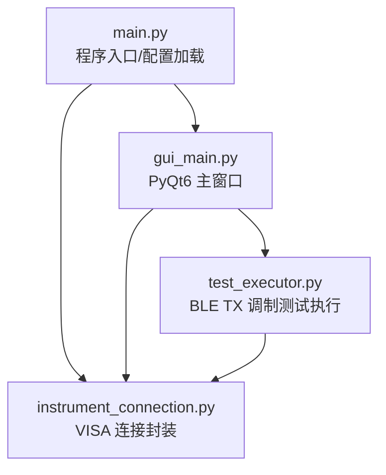
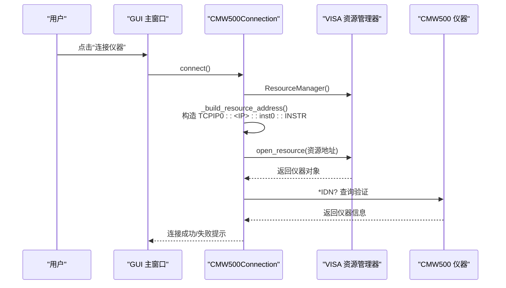
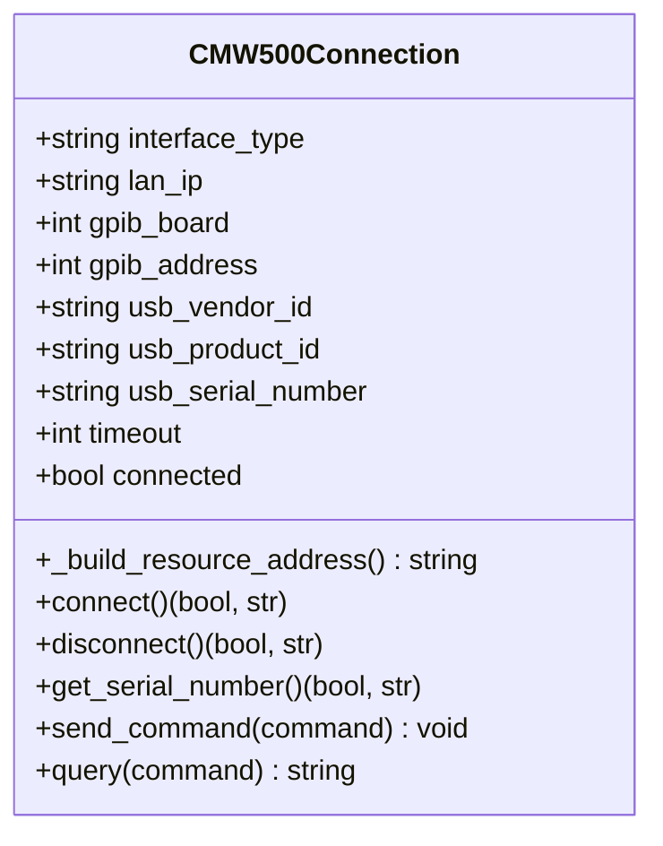
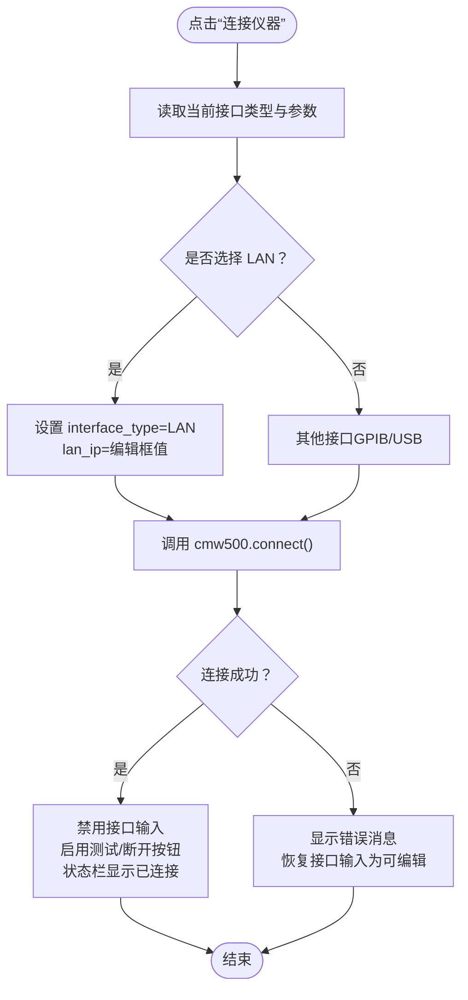
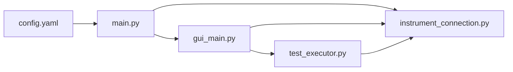

# LAN (TCP/IP) 连接配置

<cite>
**本文引用的文件**   
- [instrument_connection.py](file://instrument_connection.py)
- [config.yaml](file://config.yaml)
- [main.py](file://main.py)
- [gui_main.py](file://gui_main.py)
- [test_executor.py](file://test_executor.py)
</cite>

## 目录
1. [简介](#简介)
2. [项目结构](#项目结构)
3. [核心组件](#核心组件)
4. [架构总览](#架构总览)
5. [详细组件分析](#详细组件分析)
6. [依赖关系分析](#依赖关系分析)
7. [性能与超时优化](#性能与超时优化)
8. [故障排除指南](#故障排除指南)
9. [结论](#结论)

## 简介
本文件面向通过网线直连 CMW500 仪器的用户，提供完整的 LAN（TCP/IP）连接配置说明。内容涵盖：
- 仪器网络设置要点（IP、子网掩码、网关）
- VISA 资源字符串构造规则（TCPIP0::<IP>::inst0::INSTR）
- 网络连接测试方法（ping、端口扫描）
- 连接超时处理机制与错误恢复策略
- 常见网络问题排查（防火墙、路由器、地址冲突）
- 性能优化建议（超时时间、批量命令发送）

## 项目结构
本项目采用分层组织方式：
- 入口与配置加载：main.py、config.yaml
- 图形界面：gui_main.py
- 仪器连接封装：instrument_connection.py
- 测试执行：test_executor.py
- 数据导出：data_exporter.py（与本主题关联度较低）

图表来源
- [main.py:295-336](file://main.py#L295-L336)
- [gui_main.py:75-120](file://gui_main.py#L75-L120)
- [instrument_connection.py:18-100](file://instrument_connection.py#L18-L100)
- [test_executor.py:22-60](file://test_executor.py#L22-L60)

章节来源
- [main.py:295-336](file://main.py#L295-L336)
- [config.yaml:1-26](file://config.yaml#L1-L26)

## 核心组件
- 仪器连接类：负责根据接口类型构建 VISA 资源地址、建立连接、查询仪器标识、发送/查询 SCPI 指令、断开连接。
- GUI 主窗口：提供 LAN/GPIB/USB 三种接口的参数输入与切换，调用连接类进行连接与操作。
- 配置模块：从 YAML 读取默认接口类型、LAN IP、超时等参数，并在启动时做兼容性补全。

章节来源
- [instrument_connection.py:18-100](file://instrument_connection.py#L18-L100)
- [gui_main.py:150-276](file://gui_main.py#L150-L276)
- [config.yaml:1-26](file://config.yaml#L1-L26)
- [main.py:245-292](file://main.py#L245-L292)

## 架构总览
下图展示了 LAN 模式下从 GUI 到仪器通信的端到端流程。

图表来源
- [gui_main.py:438-479](file://gui_main.py#L438-L479)
- [instrument_connection.py:85-132](file://instrument_connection.py#L85-L132)

## 详细组件分析

### 仪器连接类（CMW500Connection）
- 职责
  - 根据当前接口类型构造 VISA 资源地址
  - 创建并管理 VISA 资源管理器与仪器对象
  - 设置通信超时
  - 执行连接验证（*IDN?）
  - 提供 send_command/query/get_serial_number/disconnect 等方法
- 关键实现点
  - 资源地址构造：LAN 模式使用固定格式 TCPIP0::<IP>::inst0::INSTR
  - 超时设置：在打开资源后设置 instrument.timeout
  - 错误处理：捕获 VISA 层异常并给出针对性提示

图表来源
- [instrument_connection.py:18-100](file://instrument_connection.py#L18-L100)
- [instrument_connection.py:85-132](file://instrument_connection.py#L85-L132)

章节来源
- [instrument_connection.py:18-100](file://instrument_connection.py#L18-L100)
- [instrument_connection.py:85-132](file://instrument_connection.py#L85-L132)

### GUI 主窗口（LAN 参数输入与连接）
- 职责
  - 提供接口类型下拉框与对应参数区（LAN/GPIB/USB）
  - 将界面输入同步到连接实例
  - 触发连接并更新状态栏与按钮可用性
- 关键实现点
  - 当选择 LAN 时，读取编辑框中的 IP 地址并写入连接实例
  - 连接成功后禁用接口输入，防止误改；失败则恢复可编辑

图表来源
- [gui_main.py:438-479](file://gui_main.py#L438-L479)

章节来源
- [gui_main.py:150-276](file://gui_main.py#L150-L276)
- [gui_main.py:438-479](file://gui_main.py#L438-L479)

### 配置文件（YAML）
- 作用
  - 定义默认接口类型、LAN IP、超时等参数
  - 支持命令行与 GUI 共用配置
- 关键字段
  - instrument.interface_type：默认接口类型（LAN/GPIB/USB）
  - instrument.lan.ip_address：CMW500 的 IP 地址
  - instrument.timeout：通信超时（毫秒）

章节来源
- [config.yaml:1-26](file://config.yaml#L1-L26)
- [main.py:245-292](file://main.py#L245-L292)

### 测试执行器（与 LAN 相关）
- 作用
  - 在独立线程中执行 BLE TX 调制测试，逐信道测量
  - 通过连接类发送/查询 SCPI 指令
- 与 LAN 的关系
  - 所有仪器交互均通过 CMW500Connection 完成，因此 LAN 连接的稳定性直接影响测试执行

章节来源
- [test_executor.py:22-60](file://test_executor.py#L22-L60)
- [test_executor.py:186-245](file://test_executor.py#L186-L245)

## 依赖关系分析
- main.py 负责加载 config.yaml 并进行兼容性补全，随后创建 CMW500Connection 实例
- gui_main.py 通过信号槽驱动连接与测试流程
- instrument_connection.py 依赖 pyvisa 库进行底层通信
- test_executor.py 依赖 CMW500Connection 进行仪器控制

图表来源
- [main.py:295-336](file://main.py#L295-L336)
- [gui_main.py:75-120](file://gui_main.py#L75-L120)
- [instrument_connection.py:15-20](file://instrument_connection.py#L15-L20)
- [test_executor.py:22-60](file://test_executor.py#L22-L60)

章节来源
- [main.py:295-336](file://main.py#L295-L336)
- [gui_main.py:75-120](file://gui_main.py#L75-L120)
- [instrument_connection.py:15-20](file://instrument_connection.py#L15-L20)
- [test_executor.py:22-60](file://test_executor.py#L22-L60)

## 性能与超时优化
- 超时设置
  - 连接类在打开资源后设置 instrument.timeout，单位毫秒
  - 默认超时来自配置文件的 instrument.timeout
  - 建议根据网络质量调整：局域网直连通常 5~10 秒即可；若存在交换机或跨网段，可适当增大
- 批量命令发送
  - 测试执行器在每个信道内多次查询指标，属于高频 I/O
  - 建议在稳定网络环境下保持合理超时，避免频繁重试导致整体耗时增加
  - 如需进一步优化，可在应用层对非关键查询进行合并或减少频率（需遵循仪器 SCPI 规范）

章节来源
- [instrument_connection.py:102-103](file://instrument_connection.py#L102-L103)
- [config.yaml:24-25](file://config.yaml#L24-L25)
- [test_executor.py:186-245](file://test_executor.py#L186-L245)

## 故障排除指南

### 仪器网络设置（直连场景）
- 电脑与 CMW500 通过网线直连时，建议将两者置于同一子网
- 在仪器侧设置静态 IP、子网掩码与网关（具体步骤请参考仪器手册）
- 确保电脑网卡也设置为同一子网的静态 IP 或 DHCP 能正确分配

章节来源
- [config.yaml:8-10](file://config.yaml#L8-L10)

### VISA 资源字符串构造规则
- LAN 模式资源字符串格式：TCPIP0::<IP地址>::inst0::INSTR
- 构造逻辑由连接类统一生成，GUI 仅负责提供 IP 地址
- 注意：IP 地址必须与仪器实际配置的 IP 一致

章节来源
- [instrument_connection.py:72-74](file://instrument_connection.py#L72-L74)
- [gui_main.py:442-446](file://gui_main.py#L442-L446)

### 网络连接测试方法
- ping 验证
  - 在命令行中使用 ping <仪器IP> 检查连通性
  - 若丢包或超时，优先检查物理链路、网卡配置与防火墙
- 端口扫描工具
  - 可使用 nmap 或其他端口扫描工具探测仪器 TCP 端口（通常为 VISA/TCP 端口）
  - 确认端口可达后再尝试连接

[本节为通用网络诊断建议，不直接分析具体代码文件]

### 连接超时与错误恢复
- 连接类在连接过程中会捕获 VISA 层异常，并返回失败提示与诊断信息
- GUI 在连接失败时会提示错误并恢复接口输入为可编辑，便于重新修改参数
- 建议在测试执行前先用 *IDN? 验证连接有效性（连接类已内置该步骤）

章节来源
- [instrument_connection.py:112-132](file://instrument_connection.py#L112-L132)
- [gui_main.py:474-479](file://gui_main.py#L474-L479)

### 常见网络问题排查
- 防火墙设置
  - 确保本机防火墙允许 Python 进程访问网络
  - 如使用第三方安全软件，请放行相应端口
- 路由器/交换机配置
  - 直连无需路由器；若经过交换机，确认 VLAN 与端口隔离未阻断通信
- 网络冲突解决
  - 避免多台设备使用相同 IP
  - 使用 arp -a 或网络扫描工具确认是否存在地址冲突

[本节为通用网络排障建议，不直接分析具体代码文件]

## 结论
通过本项目的 LAN 连接实现，用户可以基于 GUI 快速配置 CMW500 的 IP 地址并完成连接。连接类统一了 VISA 资源字符串的构造与超时设置，GUI 提供了友好的参数输入与状态反馈。结合本文的网络测试方法与故障排除建议，可有效提升直连场景下的连接成功率与测试效率。