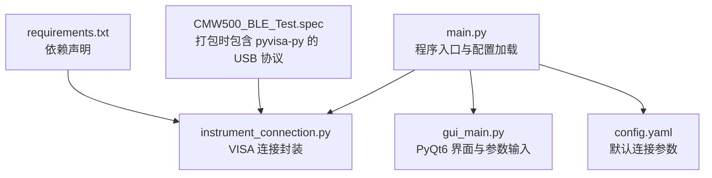
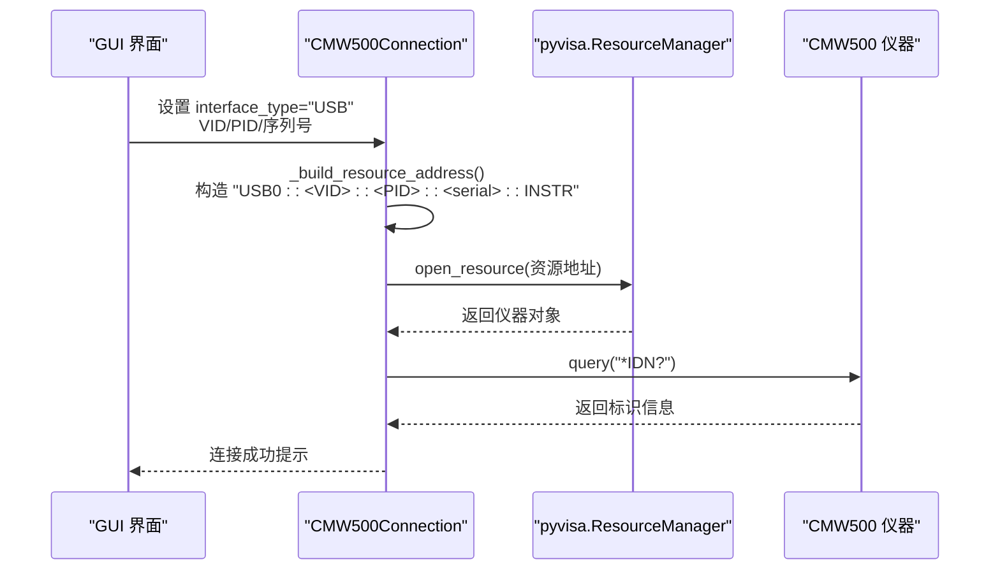
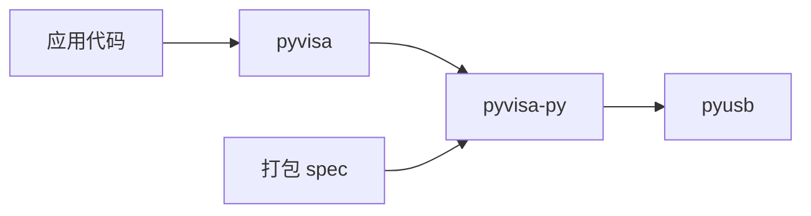

# USB (TMC) 连接配置

<cite>
**本文引用的文件**   
- [instrument_connection.py](file://instrument_connection.py)
- [main.py](file://main.py)
- [config.yaml](file://config.yaml)
- [gui_main.py](file://gui_main.py)
- [requirements.txt](file://requirements.txt)
- [CMW500_BLE_Test.spec](file://CMW500_BLE_Test.spec)
</cite>

## 目录
1. [简介](#简介)
2. [项目结构](#项目结构)
3. [核心组件](#核心组件)
4. [架构总览](#架构总览)
5. [详细组件分析](#详细组件分析)
6. [依赖关系分析](#依赖关系分析)
7. [性能与优化建议](#性能与优化建议)
8. [故障诊断指南](#故障诊断指南)
9. [结论](#结论)
10. [附录](#附录)

## 简介
本文件面向通过 USB 线直连 R&S CMW500 仪器的用户，聚焦于 TMC（Test and Measurement Class）驱动与 VISA 资源字符串的配置方法。文档基于仓库中的实际实现，解释 VID、PID、序列号的作用与获取方式，说明自动搜索模式（序列号为“?”）的工作原理，并给出 Windows 与 Linux 下的安装差异、常见问题排查以及性能优化建议。

## 项目结构
本项目为 CMW500 自动化测试工具，支持 LAN/GPIB/USB 三种接口。其中 USB 相关逻辑集中在仪器连接模块与 GUI 界面中，并通过配置文件提供默认参数。

图表来源
- [main.py:295-336](file://main.py#L295-L336)
- [instrument_connection.py:18-100](file://instrument_connection.py#L18-L100)
- [gui_main.py:150-276](file://gui_main.py#L150-L276)
- [config.yaml:1-26](file://config.yaml#L1-L26)
- [requirements.txt:1-12](file://requirements.txt#L1-L12)
- [CMW500_BLE_Test.spec:1-16](file://CMW500_BLE_Test.spec#L1-L16)

章节来源
- [main.py:295-336](file://main.py#L295-L336)
- [config.yaml:1-26](file://config.yaml#L1-L26)

## 核心组件
- 仪器连接类：负责根据接口类型构造 VISA 资源地址、建立连接、发送 SCPI 命令与查询。
- 配置系统：从 YAML 读取默认参数，并在启动时进行兼容性补全。
- GUI 界面：提供可视化编辑 VID/PID/序列号，切换接口类型，触发连接。
- 依赖与打包：使用 pyvisa-py 作为纯 Python 后端，无需安装 NI-VISA；打包时显式包含 USB 协议。

章节来源
- [instrument_connection.py:18-100](file://instrument_connection.py#L18-L100)
- [main.py:245-292](file://main.py#L245-L292)
- [gui_main.py:150-276](file://gui_main.py#L150-L276)
- [requirements.txt:1-12](file://requirements.txt#L1-L12)
- [CMW500_BLE_Test.spec:1-16](file://CMW500_BLE_Test.spec#L1-L16)

## 架构总览
下图展示了 USB 模式下从界面到 VISA 的连接流程，包括资源地址构建与设备识别验证。

图表来源
- [instrument_connection.py:55-110](file://instrument_connection.py#L55-L110)
- [gui_main.py:438-459](file://gui_main.py#L438-L459)

## 详细组件分析

### USB 资源地址与自动搜索
- 资源地址格式：USB0::<VID>::<PID>::<serial>::INSTR
- 当 serial_number 为空时，代码将使用通配符“?”，由 VISA 自动匹配第一个匹配设备。
- 该行为在连接失败时会输出当前 VID/PID/SN 以便排查。

章节来源
- [instrument_connection.py:66-70](file://instrument_connection.py#L66-L70)
- [instrument_connection.py:119-124](file://instrument_connection.py#L119-L124)

### 配置项与默认值
- 配置文件 instrument.usb 下包含 vendor_id、product_id、serial_number。
- 启动时若缺失字段，会自动补全默认值（vendor_id=0x0AAD，product_id=0x0117，serial_number=""）。
- 超时时间 timeout 用于控制通信等待时长。

章节来源
- [config.yaml:16-25](file://config.yaml#L16-L25)
- [main.py:271-292](file://main.py#L271-L292)

### GUI 输入与更新
- 界面提供 VID、PID、序列号输入框，选择“USB (TMC)”后显示对应控件。
- 点击“连接仪器”时，界面会将当前输入写入 CMW500Connection 实例的属性，随后发起连接。

章节来源
- [gui_main.py:230-265](file://gui_main.py#L230-L265)
- [gui_main.py:438-459](file://gui_main.py#L438-L459)

### 连接与错误处理
- 连接成功后会执行 *IDN? 以验证链路有效。
- 捕获 VisaIOError 时，针对 USB 模式会提示检查线缆与驱动，并打印当前 VID/PID/SN。

章节来源
- [instrument_connection.py:92-127](file://instrument_connection.py#L92-L127)

## 依赖关系分析
- pyvisa：统一仪器控制 API。
- pyvisa-py：纯 Python 后端，内置 USB/TCP/IP/GPIB/Serial 协议，无需安装 NI-VISA。
- pyusb：底层 USB 访问库，被 pyvisa-py 使用。
- 打包 spec：显式包含 pyvisa_py.protocols.usb 等模块，确保可执行文件具备 USB 能力。

图表来源
- [requirements.txt:1-12](file://requirements.txt#L1-L12)
- [CMW500_BLE_Test.spec:1-16](file://CMW500_BLE_Test.spec#L1-L16)

章节来源
- [requirements.txt:1-12](file://requirements.txt#L1-L12)
- [CMW500_BLE_Test.spec:1-16](file://CMW500_BLE_Test.spec#L1-L16)

## 性能与优化建议
- 合理设置超时：根据网络/USB 环境调整 timeout，避免过长阻塞或过短误判。
- 减少无效查询：仅在需要时执行 *IDN? 等查询，批量操作时合并指令。
- 避免频繁重连：保持长连接，必要时再断开重建。
- 使用稳定 USB 端口：优先使用主板原生 USB 2.0/3.0 端口，避免扩展坞或集线器引入延迟。
- 关闭无关后台任务：减少 CPU 占用对实时通信的影响。

[本节为通用指导，不直接分析具体文件]

## 故障诊断指南

### 设备识别失败
- 现象：open_resource 失败或 *IDN? 无响应。
- 排查要点：
  - 确认 VID/PID 是否正确，必要时在系统中查看设备属性。
  - 确认序列号是否留空（自动搜索）或填写正确。
  - 检查 USB 线缆与端口。
- 参考位置：连接失败时的提示信息包含当前 VID/PID/SN。

章节来源
- [instrument_connection.py:119-124](file://instrument_connection.py#L119-L124)

### 驱动冲突或未安装
- 现象：无法枚举设备或打开资源时报错。
- 解决思路：
  - 使用 pyvisa-py 作为后端，无需安装 NI-VISA。
  - 确保已安装 pyusb 并提供底层 USB 访问能力。
  - 在打包环境中，确认 spec 中包含 pyvisa_py.protocols.usb。

章节来源
- [requirements.txt:1-12](file://requirements.txt#L1-L12)
- [CMW500_BLE_Test.spec:1-16](file://CMW500_BLE_Test.spec#L1-L16)

### 权限问题（Linux）
- 现象：非 root 用户无法访问 USB 设备。
- 解决思路：
  - 添加 udev 规则，允许普通用户访问特定 VID/PID 的设备。
  - 或将运行用户加入 dialout/usbgroup 等组（依发行版而定）。
- 注意：本项目未内嵌 udev 规则，需按系统策略自行配置。

[本节为通用指导，不直接分析具体文件]

### 自动搜索模式（序列号为“?”）
- 工作原理：当 serial_number 为空时，资源地址中使用“?”，VISA 将匹配第一个符合 VID/PID 的设备。
- 适用场景：单台设备或临时调试；多设备时应明确指定序列号以避免歧义。
- 风险：若存在多个同型号设备，可能连接到错误的目标。

章节来源
- [instrument_connection.py:66-70](file://instrument_connection.py#L66-L70)

### 常见错误定位路径
- 连接失败：查看连接函数异常分支输出的 USB 参数提示。
- 配置错误：核对 config.yaml 中 instrument.usb 字段与 GUI 输入一致性。
- 打包后不可用：检查 spec 是否包含 USB 协议模块。

章节来源
- [instrument_connection.py:112-127](file://instrument_connection.py#L112-L127)
- [config.yaml:16-25](file://config.yaml#L16-L25)
- [CMW500_BLE_Test.spec:1-16](file://CMW500_BLE_Test.spec#L1-L16)

## 结论
本项目通过 pyvisa-py 提供了无需 NI-VISA 的 USB（TMC）连接方案，结合 GUI 与配置文件，实现了灵活的 VID/PID/序列号设置与自动搜索。理解资源地址格式与自动搜索机制，配合合理的超时与权限配置，可在 Windows 与 Linux 上稳定完成 CMW500 的 USB 直连与控制。

[本节为总结性内容，不直接分析具体文件]

## 附录

### USB 设备标识符说明
- VID（Vendor ID）：厂商标识，R&S 默认为 0x0AAD。
- PID（Product ID）：产品标识，CMW500 常见为 0x0117。
- 序列号：唯一标识单个设备；留空时使用“?”自动搜索。

章节来源
- [config.yaml:16-25](file://config.yaml#L16-L25)
- [main.py:271-292](file://main.py#L271-L292)

### VISA 资源字符串解析
- 格式：USB0::<VID>::<PID>::<serial>::INSTR
- 示例字段含义：
  - USB0：USB 总线索引（通常为 0）
  - VID/PID：厂商与产品标识
  - serial：序列号或“?”（自动搜索）
  - INSTR：表示仪器资源类型

章节来源
- [instrument_connection.py:66-70](file://instrument_connection.py#L66-L70)

### Windows 与 Linux 安装差异与注意事项
- Windows：
  - 使用 pyvisa-py 作为后端，无需安装 NI-VISA。
  - 确保已安装 pyusb，系统能识别 USB 设备。
- Linux：
  - 可能需要配置 udev 规则以允许非 root 访问 USB 设备。
  - 确保系统已安装必要的 USB 开发库（如 libusb），供 pyusb 调用。

[本节为通用指导，不直接分析具体文件]

### 最佳实践清单
- 首次连接建议使用 GUI 输入 VID/PID，序列号留空以自动搜索。
- 在多设备环境中务必填写精确序列号。
- 根据环境调整 timeout，避免误报超时。
- 打包前检查 spec 是否包含 USB 协议模块。

章节来源
- [gui_main.py:230-265](file://gui_main.py#L230-L265)
- [CMW500_BLE_Test.spec:1-16](file://CMW500_BLE_Test.spec#L1-L16)