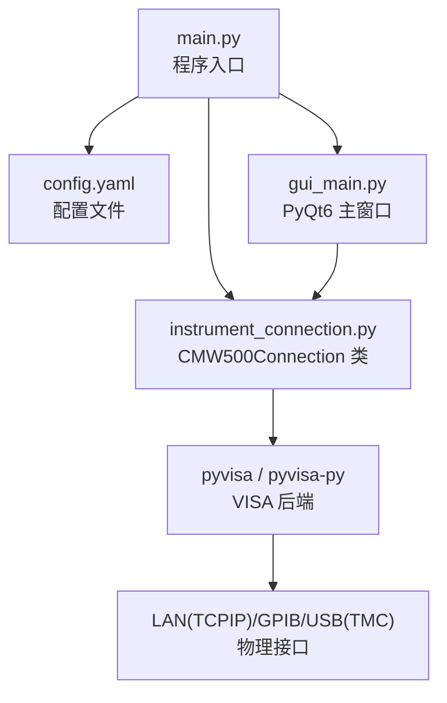
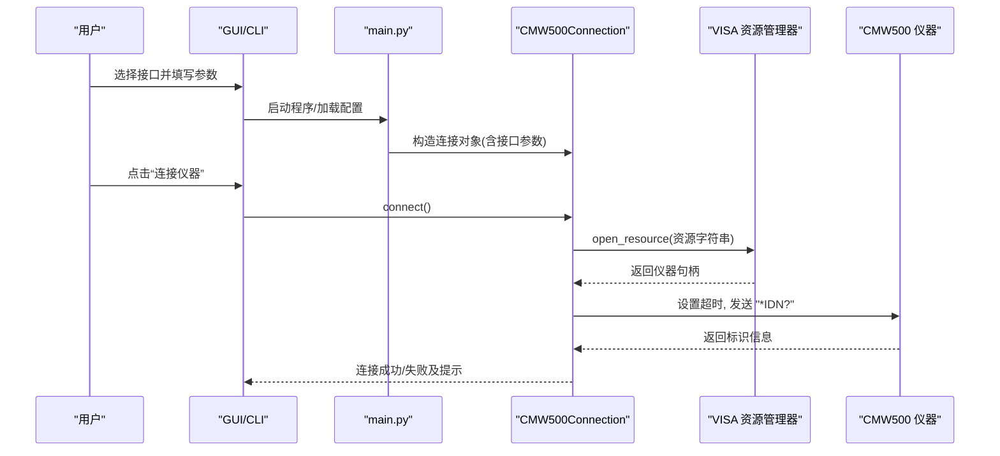
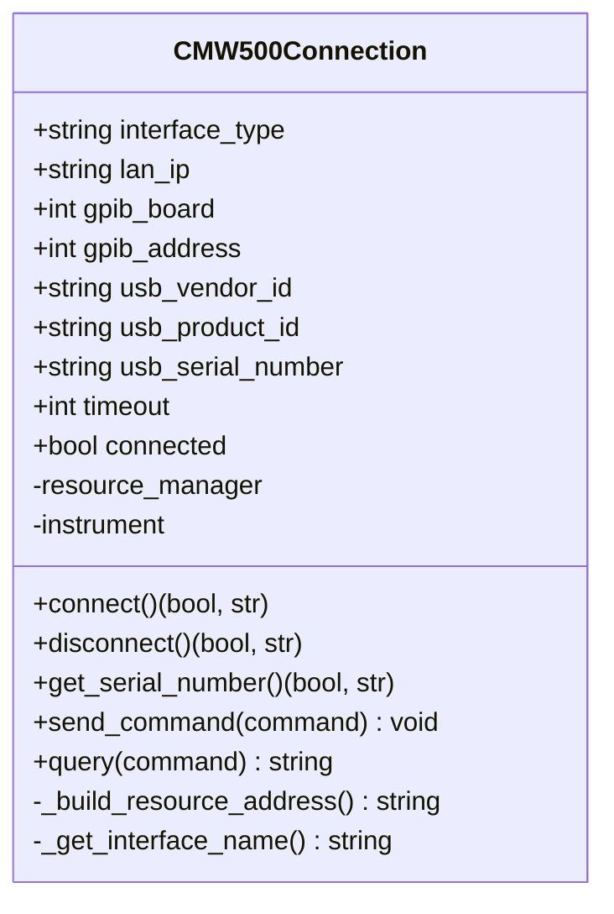
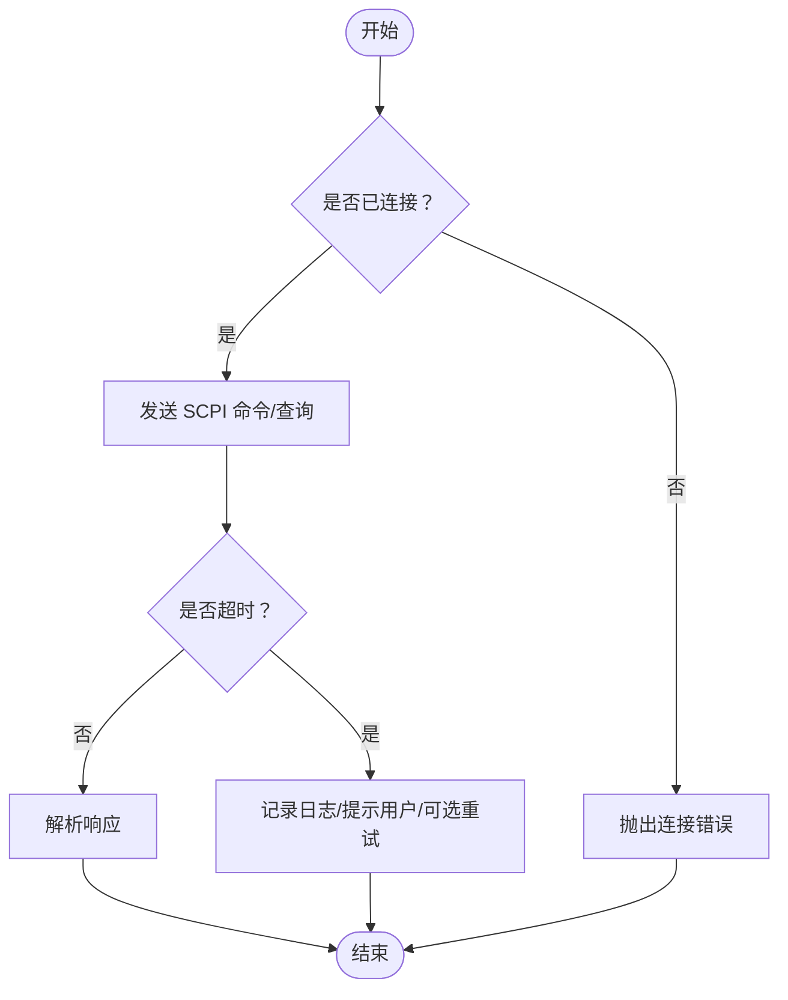
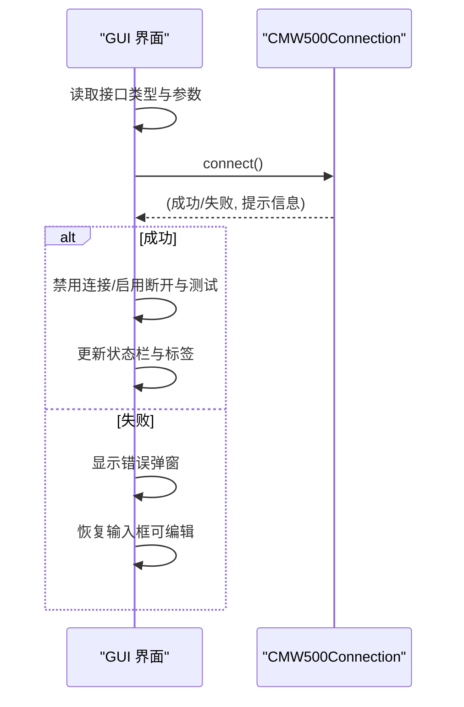
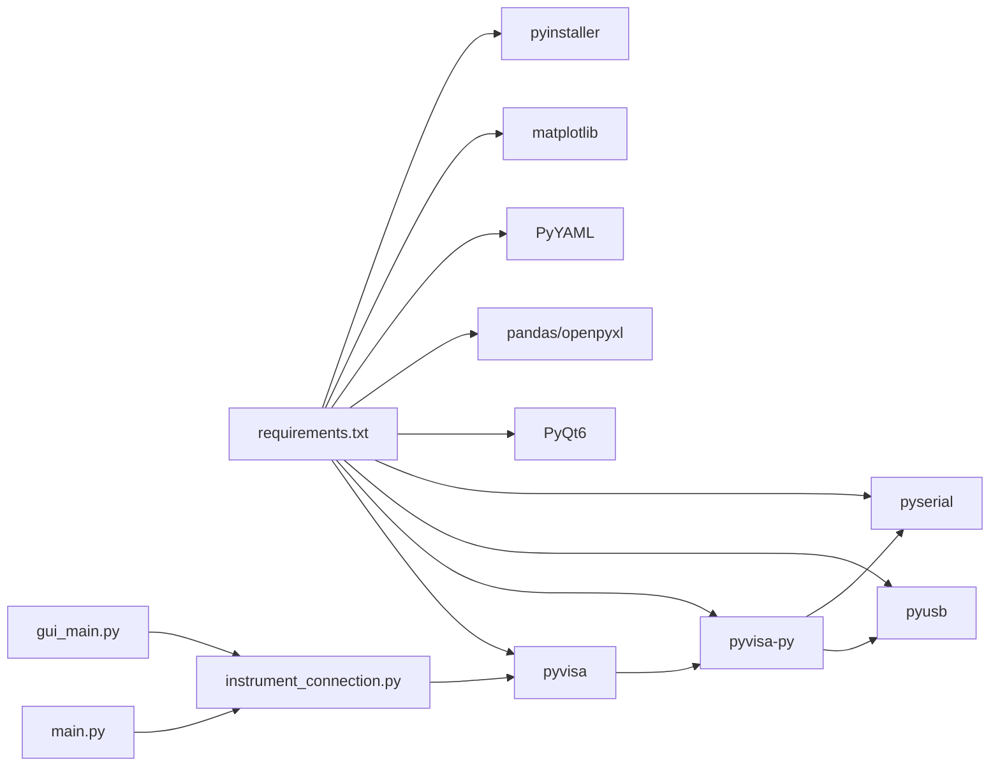

# 仪器连接配置

<cite>
**本文引用的文件**   
- [instrument_connection.py](file://instrument_connection.py)
- [main.py](file://main.py)
- [config.yaml](file://config.yaml)
- [gui_main.py](file://gui_main.py)
- [requirements.txt](file://requirements.txt)
</cite>

## 目录
1. [简介](#简介)
2. [项目结构](#项目结构)
3. [核心组件](#核心组件)
4. [架构总览](#架构总览)
5. [详细组件分析](#详细组件分析)
6. [依赖关系分析](#依赖关系分析)
7. [性能与优化建议](#性能与优化建议)
8. [故障排除指南](#故障排除指南)
9. [结论](#结论)
10. [附录：VISA 资源字符串与 SCPI 协议要点](#附录visa-资源字符串与-scpi-协议要点)

## 简介
本文件面向使用 R&S CMW500 无线通信测试仪的自动化测试场景，聚焦于“仪器连接配置”主题。文档围绕 CMW500Connection 类的设计与实现，系统阐述 LAN（TCP/IP）、GPIB（IEEE-488）、USB（TMC）三种连接方式的硬件要求、网络/驱动配置、参数设置与使用方法；并给出连接状态管理、超时处理、错误恢复机制说明，以及 VISA 资源字符串格式与 SCPI 指令通信的技术细节和最佳实践。

## 项目结构
本项目采用“入口 + 配置 + 连接封装 + GUI/CLI 交互”的分层组织方式：
- main.py：程序入口，负责加载配置、初始化连接对象、选择 CLI/GUI 模式。
- config.yaml：集中存放仪器接口类型与各接口的连接参数、测试参数与导出路径等。
- instrument_connection.py：核心连接封装，提供统一的 connect/disconnect/query/send_command 接口，屏蔽底层 VISA 差异。
- gui_main.py：PyQt6 图形界面，支持在运行时动态切换接口类型与修改地址参数。
- requirements.txt：列出 pyvisa、pyvisa-py、pyusb、pyserial、PyQt6、pandas、openpyxl、PyYAML、matplotlib、pyinstaller 等依赖。

图表来源
- [main.py:295-336](file://main.py#L295-L336)
- [config.yaml:1-25](file://config.yaml#L1-L25)
- [instrument_connection.py:18-110](file://instrument_connection.py#L18-L110)
- [gui_main.py:438-479](file://gui_main.py#L438-L479)

章节来源
- [main.py:295-336](file://main.py#L295-L336)
- [config.yaml:1-25](file://config.yaml#L1-L25)
- [instrument_connection.py:18-110](file://instrument_connection.py#L18-L110)
- [gui_main.py:438-479](file://gui_main.py#L438-L479)

## 核心组件
- CMW500Connection：统一封装仪器连接生命周期与 SCPI 通信，支持 LAN/GPIB/USB 三种接口，内部通过 VISA 资源管理器打开资源并执行 *IDN? 验证。
- 配置加载与归一化：main.py 中 _normalize_config 自动补全缺失字段，确保 instrument.lan/gpib/usb/interface_type/timeout 存在且具备默认值。
- GUI 动态切换：gui_main.py 允许用户在运行时选择接口类型并修改对应参数，点击“连接仪器”后调用 CMW500Connection.connect()。

章节来源
- [instrument_connection.py:18-110](file://instrument_connection.py#L18-L110)
- [main.py:245-292](file://main.py#L245-L292)
- [gui_main.py:438-479](file://gui_main.py#L438-L479)

## 架构总览
下图展示了从用户操作到仪器通信的整体流程：GUI/CLI 读取配置或用户输入，构造 CMW500Connection 实例，调用 connect() 建立 VISA 会话，发送 *IDN? 校验连通性，随后进行查询或命令写入。

图表来源
- [main.py:295-336](file://main.py#L295-L336)
- [instrument_connection.py:85-110](file://instrument_connection.py#L85-L110)
- [gui_main.py:438-479](file://gui_main.py#L438-L479)

## 详细组件分析

### CMW500Connection 类设计与实现
该类是连接管理的核心，职责包括：
- 根据 interface_type 构建 VISA 资源字符串（TCPIP/GPIB/USB）。
- 创建 VISA 资源管理器并打开资源，设置超时。
- 通过 *IDN? 验证连接有效性，维护 connected 标志。
- 提供 disconnect、get_serial_number、send_command、query 等高层 API。

图表来源
- [instrument_connection.py:18-110](file://instrument_connection.py#L18-L110)
- [instrument_connection.py:134-159](file://instrument_connection.py#L134-L159)
- [instrument_connection.py:161-215](file://instrument_connection.py#L161-L215)

章节来源
- [instrument_connection.py:18-110](file://instrument_connection.py#L18-L110)
- [instrument_connection.py:134-159](file://instrument_connection.py#L134-L159)
- [instrument_connection.py:161-215](file://instrument_connection.py#L161-L215)

### 连接方式详解与配置示例

#### LAN（TCP/IP）
- 硬件要求
  - 以太网线缆直连或通过交换机/路由器互联。
  - 确保电脑与 CMW500 在同一网段或路由可达。
- 网络配置
  - 在 CMW500 上设置静态 IP 或启用 DHCP 并确保可解析。
  - 关闭主机防火墙对目标端口的拦截（VISA TCPIP 通常使用标准端口）。
- 驱动程序安装
  - 无需额外驱动；依赖 pyvisa 与后端（推荐 pyvisa-py）。
- 连接参数设置
  - 在 config.yaml 的 instrument.lan.ip_address 指定设备 IP。
  - 或在 GUI 中选择“LAN (TCP/IP)”并在 IP 地址框中输入。
- 资源字符串格式
  - TCPIP0::<IP>::inst0::INSTR
- 配置示例（config.yaml）
  - instrument.interface_type = "LAN"
  - instrument.lan.ip_address = "192.168.1.100"
- 常见错误与恢复
  - 无法访问：检查网线、IP、子网掩码、网关与路由。
  - 超时：适当增大 instrument.timeout（毫秒），或降低测量频率。

章节来源
- [config.yaml:4-11](file://config.yaml#L4-L11)
- [gui_main.py:184-199](file://gui_main.py#L184-L199)
- [instrument_connection.py:72-74](file://instrument_connection.py#L72-L74)
- [instrument_connection.py:85-110](file://instrument_connection.py#L85-L110)

#### GPIB（IEEE-488）
- 硬件要求
  - GPIB 控制器卡（PCI/PCIe/USB-GPIB）+ GPIB 线缆。
  - 确认板号（board）与仪器主地址（address）正确。
- 驱动安装
  - 安装 NI-VISA 或兼容驱动；若使用 pyvisa-py 作为后端，需确保系统已安装相应 GPIB 驱动栈。
- 连接参数设置
  - 在 config.yaml 的 instrument.gpib.board 与 instrument.gpib.address 设置。
  - 或在 GUI 中选择“GPIB (IEEE-488)”并填写板号与地址。
- 资源字符串格式
  - GPIB<board>::<address>::INSTR
- 配置示例（config.yaml）
  - instrument.interface_type = "GPIB"
  - instrument.gpib.board = 0
  - instrument.gpib.address = 20
- 常见错误与恢复
  - 找不到设备：核对板号/地址、线缆连接、终端电阻与中断冲突。
  - 权限问题：以管理员身份运行或调整设备权限。

章节来源
- [config.yaml:12-15](file://config.yaml#L12-L15)
- [gui_main.py:200-230](file://gui_main.py#L200-L230)
- [instrument_connection.py:62-64](file://instrument_connection.py#L62-L64)
- [instrument_connection.py:85-110](file://instrument_connection.py#L85-L110)

#### USB（TMC）
- 硬件要求
  - USB 线缆直连；CMW500 需支持 TMC（Test & Measurement Class）。
- 驱动安装
  - 安装厂商提供的 USB 驱动；pyvisa-py 依赖 pyusb 与 pyserial。
- 连接参数设置
  - 在 config.yaml 的 instrument.usb.vendor_id、product_id、serial_number 设置。
  - 或在 GUI 中选择“USB (TMC)”并填写 VID/PID/SN（SN 留空则自动匹配第一个设备）。
- 资源字符串格式
  - USB0::<VID>::<PID>::<serial>::INSTR
- 配置示例（config.yaml）
  - instrument.interface_type = "USB"
  - instrument.usb.vendor_id = "0x0AAD"
  - instrument.usb.product_id = "0x0117"
  - instrument.usb.serial_number = ""
- 常见错误与恢复
  - 未识别设备：重新插拔、更换线缆/端口、确认驱动安装。
  - 多设备冲突：明确 serial_number 避免误选。

章节来源
- [config.yaml:17-23](file://config.yaml#L17-L23)
- [gui_main.py:231-269](file://gui_main.py#L231-L269)
- [instrument_connection.py:66-70](file://instrument_connection.py#L66-L70)
- [instrument_connection.py:85-110](file://instrument_connection.py#L85-L110)

### 连接状态管理与超时处理
- 状态管理
  - connected 标志在 connect() 成功后置为 True，断开或异常时置为 False。
  - disconnect() 会关闭仪器句柄并清理引用。
- 超时处理
  - 通过 instrument.timeout 设置毫秒级超时，影响所有 write/query 操作。
  - 建议在批量测量时合理调大超时，避免网络抖动导致误判。
- 错误恢复机制
  - connect() 捕获 VisaIOError 并返回具体提示（按接口类型区分）。
  - get_serial_number()/query()/send_command() 在未连接时抛出 ConnectionError，防止非法调用。
  - GUI 在连接失败时恢复接口输入可编辑，便于重试。

图表来源
- [instrument_connection.py:192-215](file://instrument_connection.py#L192-L215)
- [instrument_connection.py:85-110](file://instrument_connection.py#L85-L110)
- [gui_main.py:438-479](file://gui_main.py#L438-L479)

章节来源
- [instrument_connection.py:85-110](file://instrument_connection.py#L85-L110)
- [instrument_connection.py:134-159](file://instrument_connection.py#L134-L159)
- [instrument_connection.py:192-215](file://instrument_connection.py#L192-L215)
- [gui_main.py:438-479](file://gui_main.py#L438-L479)

### GUI 中的连接流程
- 用户在“接口配置”区选择接口类型并填写参数。
- 点击“连接仪器”，GUI 将当前参数同步至 CMW500Connection 实例并调用 connect()。
- 连接成功后禁用连接按钮、启用断开与开始测试按钮，更新状态栏与状态标签。
- 连接失败时弹出警告并恢复输入框可编辑。

图表来源
- [gui_main.py:438-479](file://gui_main.py#L438-L479)
- [instrument_connection.py:85-110](file://instrument_connection.py#L85-L110)

章节来源
- [gui_main.py:438-479](file://gui_main.py#L438-L479)
- [instrument_connection.py:85-110](file://instrument_connection.py#L85-L110)

## 依赖关系分析
- 外部库
  - pyvisa：跨平台仪器控制抽象层。
  - pyvisa-py：纯 Python 后端，无需安装 NI-VISA（适合快速部署）。
  - pyusb、pyserial：pyvisa-py 的 USB/串口后端依赖。
  - PyQt6：图形界面。
  - pandas、openpyxl：数据处理与 Excel 导出。
  - PyYAML：配置文件解析。
  - matplotlib：可视化绘图。
  - pyinstaller：打包为 exe。
- 模块耦合
  - main.py 仅负责加载配置与创建 CMW500Connection 实例，低耦合。
  - gui_main.py 通过信号槽与 CMW500Connection 交互，不直接操作 VISA。
  - instrument_connection.py 唯一依赖 pyvisa，内聚度高。

图表来源
- [requirements.txt:1-12](file://requirements.txt#L1-L12)
- [main.py:295-336](file://main.py#L295-L336)
- [gui_main.py:438-479](file://gui_main.py#L438-L479)
- [instrument_connection.py:15-110](file://instrument_connection.py#L15-L110)

章节来源
- [requirements.txt:1-12](file://requirements.txt#L1-L12)
- [main.py:295-336](file://main.py#L295-L336)
- [gui_main.py:438-479](file://gui_main.py#L438-L479)
- [instrument_connection.py:15-110](file://instrument_connection.py#L15-L110)

## 性能与优化建议
- 超时策略
  - 根据接口特性设置合理超时：LAN 可适当增大，USB 中等，GPIB 视总线负载而定。
  - 批量测量前预分配结果容器，减少频繁 IO。
- 连接复用
  - 长任务保持连接复用，避免频繁 connect/disconnect 带来的开销。
- 命令批量化
  - 合并多条短命令为一条复合命令（如设置多个寄存器），减少往返延迟。
- 数据回传
  - 优先使用二进制块传输（如 :MMEM:DATA? 等，依仪器手册），减少文本解析开销。
- 线程与并发
  - GUI 侧使用独立工作线程执行测试，避免阻塞 UI（已在项目中实现）。
- 资源释放
  - 异常分支确保 close() 被调用，避免资源泄漏。

[本节为通用指导，不直接分析具体文件]

## 故障排除指南
- 无法发现设备
  - LAN：ping 目标 IP，确认防火墙放行；检查 DHCP 分配与静态 IP 冲突。
  - GPIB：检查板卡驱动、中断与地址冲突；确认终端电阻与线缆质量。
  - USB：查看设备管理器是否识别；尝试不同端口/线缆；确认序列号。
- 连接成功但查询失败
  - 检查超时是否过小；在网络不稳定环境下增大超时。
  - 确认 SCPI 命令拼写与大小写；部分仪器对命令敏感。
- 多设备冲突（USB）
  - 明确 serial_number，避免通配符 ? 匹配到错误设备。
- 权限与后端
  - 某些环境需要管理员权限访问 GPIB/USB；确保 pyvisa-py 后端可用。
- 日志定位
  - GUI 日志窗口实时输出连接与错误信息；必要时结合命令行模式打印更详细信息。

章节来源
- [instrument_connection.py:112-132](file://instrument_connection.py#L112-L132)
- [gui_main.py:438-479](file://gui_main.py#L438-L479)

## 结论
CMW500Connection 提供了简洁一致的仪器连接与通信接口，屏蔽了 LAN/GPIB/USB 的差异，并通过 *IDN? 完成连通性自检。配合 config.yaml 与 GUI 的动态配置能力，用户可在不同环境与需求下灵活切换接口。合理的超时设置、错误处理与资源释放策略，有助于提升稳定性与可维护性。

[本节为总结性内容，不直接分析具体文件]

## 附录：VISA 资源字符串与 SCPI 协议要点

### VISA 资源字符串格式
- LAN（TCPIP）
  - 格式：TCPIP0::<IP>::inst0::INSTR
  - 示例：TCPIP0::192.168.1.100::inst0::INSTR
- GPIB（IEEE-488）
  - 格式：GPIB<board>::<address>::INSTR
  - 示例：GPIB0::20::INSTR
- USB（TMC）
  - 格式：USB0::<VID>::<PID>::<serial>::INSTR
  - 示例：USB0::0x0AAD::0x0117::?::INSTR（序列号为 ? 表示自动匹配第一个）

章节来源
- [instrument_connection.py:62-74](file://instrument_connection.py#L62-L74)

### SCPI 指令通信协议要点
- 基本命令
  - *IDN?：查询仪器标识（制造商,型号,序列号,固件版本）。
- 读写语义
  - write：发送无返回值命令。
  - query：发送查询命令并等待返回字符串。
- 错误处理
  - 通信层异常由 pyvisa 抛出（VisaIOError），上层应捕获并提示。
- 时序与超时
  - 所有 I/O 受 instrument.timeout 控制，单位毫秒。

章节来源
- [instrument_connection.py:105-106](file://instrument_connection.py#L105-L106)
- [instrument_connection.py:192-215](file://instrument_connection.py#L192-L215)