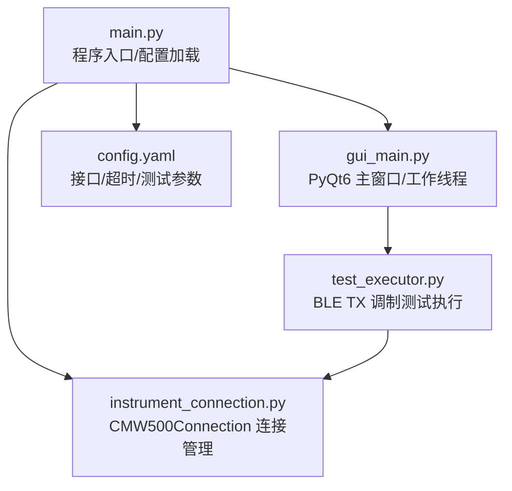
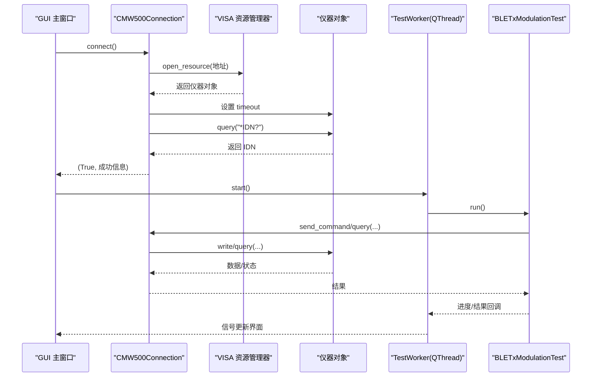
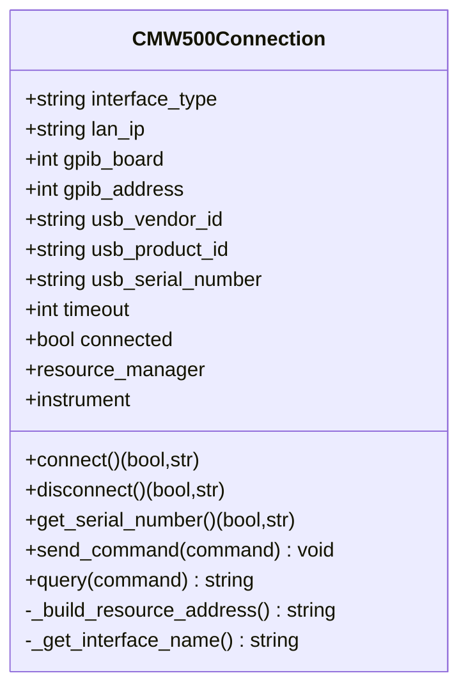
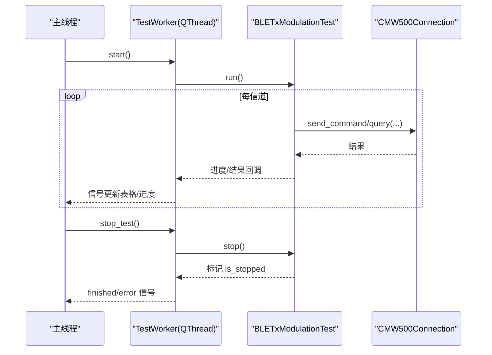
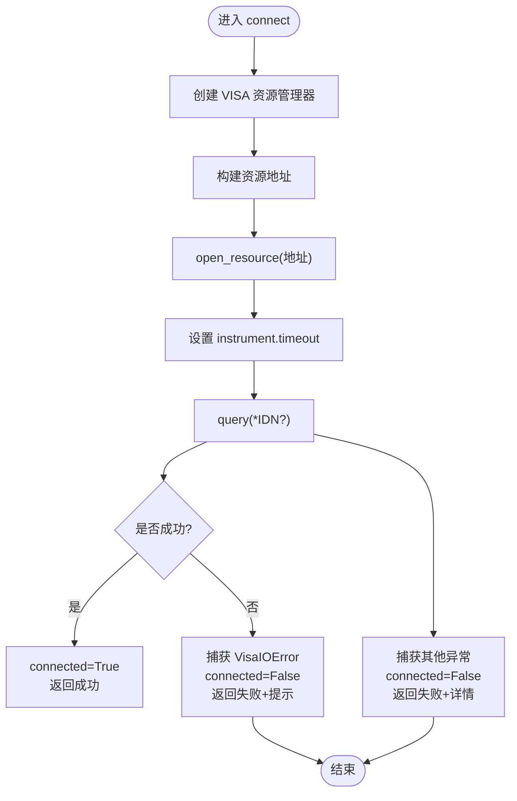
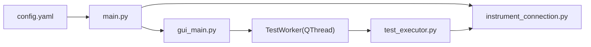

# 连接状态管理和错误处理

<cite>
**本文引用的文件**   
- [instrument_connection.py](file://instrument_connection.py)
- [main.py](file://main.py)
- [gui_main.py](file://gui_main.py)
- [test_executor.py](file://test_executor.py)
- [config.yaml](file://config.yaml)
</cite>

## 目录
1. [引言](#引言)
2. [项目结构](#项目结构)
3. [核心组件](#核心组件)
4. [架构总览](#架构总览)
5. [详细组件分析](#详细组件分析)
6. [依赖关系分析](#依赖关系分析)
7. [性能与超时配置](#性能与超时配置)
8. [故障排查指南](#故障排查指南)
9. [结论](#结论)
10. [附录：最佳实践清单](#附录最佳实践清单)

## 引言
本文件聚焦于 CMW500 自动化测试工具中的“连接状态管理与错误处理”，围绕 CMW500Connection 类的连接生命周期、状态标志 connected 的管理、异常体系（含 pyvisa.VisaIOError）、超时配置、资源清理策略，以及 GUI 线程模型下的安全考虑展开。同时给出连接健康检查与自动重连的实现建议、调试与日志记录的最佳实践，并对连接池与资源复用进行概念性说明。

## 项目结构
本项目采用分层组织方式：
- 入口与配置加载：main.py
- 仪器连接封装：instrument_connection.py
- 图形界面与多线程执行：gui_main.py
- 测试流程编排：test_executor.py
- 配置文件：config.yaml

图表来源
- [main.py:295-336](file://main.py#L295-L336)
- [instrument_connection.py:18-133](file://instrument_connection.py#L18-L133)
- [gui_main.py:75-124](file://gui_main.py#L75-L124)
- [test_executor.py:22-51](file://test_executor.py#L22-L51)
- [config.yaml:1-26](file://config.yaml#L1-L26)

章节来源
- [main.py:295-336](file://main.py#L295-L336)
- [config.yaml:1-26](file://config.yaml#L1-L26)

## 核心组件
- CMW500Connection：封装 VISA 资源管理器与仪器对象，提供 connect/disconnect、查询/写入命令、序列号读取等能力；维护连接状态标志 connected 和通信超时 timeout。
- TestWorker（GUI）：在独立 QThread 中运行测试，通过信号槽与主线程交互，避免阻塞 UI。
- BLETxModulationTest：编排 BLE TX 调制测试流程，逐信道测量并生成结果。
- main.py：加载配置、初始化连接实例、选择 CLI/GUI 模式。

章节来源
- [instrument_connection.py:18-133](file://instrument_connection.py#L18-L133)
- [gui_main.py:28-73](file://gui_main.py#L28-L73)
- [test_executor.py:22-51](file://test_executor.py#L22-L51)
- [main.py:295-336](file://main.py#L295-L336)

## 架构总览
下图展示了从 GUI 到仪器连接的调用链路与关键状态变化点。

图表来源
- [gui_main.py:438-479](file://gui_main.py#L438-L479)
- [instrument_connection.py:85-133](file://instrument_connection.py#L85-L133)
- [gui_main.py:49-73](file://gui_main.py#L49-L73)
- [test_executor.py:186-245](file://test_executor.py#L186-L245)

## 详细组件分析

### CMW500Connection 类：连接生命周期与状态管理
- 构造阶段
  - 保存接口类型、LAN IP、GPIB 板号/地址、USB VID/PID/SN、timeout 等参数。
  - 初始化 resource_manager、instrument 为 None，connected=False。
- 建立连接 connect()
  - 创建 VISA 资源管理器。
  - 根据接口类型构建资源地址字符串。
  - 打开仪器连接并设置 instrument.timeout。
  - 发送 *IDN? 验证连通性，成功后置 connected=True。
  - 捕获 pyvisa.VisaIOError 与其他异常，失败时置 connected=False 并返回提示。
- 断开连接 disconnect()
  - 若未连接或 instrument 为空则直接返回。
  - 关闭 instrument，置 instrument=None、connected=False。
  - 捕获 VisaIOError 与通用异常，保证状态一致。
- 查询与写入
  - send_command()/query() 在未连接时抛出 ConnectionError，防止非法操作。
  - get_serial_number() 基于 *IDN? 解析序列号，包含格式校验与异常分支。
- 资源清理策略
  - 断开时显式关闭 instrument 并清空引用，避免资源泄漏。
  - 未使用 try/finally 包裹所有路径，但每个分支均确保状态重置。

图表来源
- [instrument_connection.py:18-133](file://instrument_connection.py#L18-L133)
- [instrument_connection.py:134-191](file://instrument_connection.py#L134-L191)
- [instrument_connection.py:192-216](file://instrument_connection.py#L192-L216)

章节来源
- [instrument_connection.py:18-133](file://instrument_connection.py#L18-L133)
- [instrument_connection.py:134-191](file://instrument_connection.py#L134-L191)
- [instrument_connection.py:192-216](file://instrument_connection.py#L192-L216)

### GUI 线程模型与连接安全
- TestWorker 继承自 QThread，在独立线程中执行测试，通过自定义信号将日志、进度、结果、错误回传到主线程，避免阻塞 UI。
- 主线程仅负责 UI 更新与按钮状态切换，不直接访问仪器 I/O。
- 停止机制：TestWorker.stop_test() 调用测试执行器的 stop()，设置 is_stopped 标志，循环内检测后退出。

图表来源
- [gui_main.py:28-73](file://gui_main.py#L28-L73)
- [gui_main.py:499-528](file://gui_main.py#L499-L528)
- [test_executor.py:186-245](file://test_executor.py#L186-L245)

章节来源
- [gui_main.py:28-73](file://gui_main.py#L28-L73)
- [gui_main.py:499-528](file://gui_main.py#L499-L528)
- [test_executor.py:186-245](file://test_executor.py#L186-L245)

### 异常处理体系
- 连接层
  - connect() 捕获 pyvisa.VisaIOError（网络不通、地址错误等），并给出面向用户的诊断提示；其他异常统一兜底。
  - disconnect() 对关闭过程中的 VisaIOError 与未知异常进行处理，确保状态复位。
  - get_serial_number() 对通信错误与格式异常分别处理。
  - send_command()/query() 在未连接时抛出 ConnectionError，阻止后续非法操作。
- 测试层
  - test_executor 中对单信道测量各指标读取使用 try/except 包裹，异常项记为 None 并在判定中标记 ERROR，保证整体流程继续。
- GUI 层
  - 工作线程的异常通过 error_signal 上报主线程，弹出错误对话框并恢复按钮状态。

图表来源
- [instrument_connection.py:85-133](file://instrument_connection.py#L85-L133)

章节来源
- [instrument_connection.py:85-133](file://instrument_connection.py#L85-L133)
- [instrument_connection.py:134-191](file://instrument_connection.py#L134-L191)
- [instrument_connection.py:192-216](file://instrument_connection.py#L192-L216)
- [test_executor.py:105-184](file://test_executor.py#L105-L184)
- [gui_main.py:621-629](file://gui_main.py#L621-L629)

## 依赖关系分析
- main.py 负责加载 config.yaml 并进行兼容性处理，随后延迟导入 instrument_connection 模块，创建 CMW500Connection 实例。
- gui_main.py 的 TestWorker 在线程中导入 test_executor 模块，避免循环引用。
- test_executor 通过 CMW500Connection 提供的 send_command/query 与仪器交互。
- 配置项包括接口类型、LAN IP、GPIB 板号/地址、USB VID/PID/SN、timeout 等。

图表来源
- [main.py:295-336](file://main.py#L295-L336)
- [gui_main.py:49-73](file://gui_main.py#L49-L73)
- [test_executor.py:22-51](file://test_executor.py#L22-L51)
- [config.yaml:1-26](file://config.yaml#L1-L26)

章节来源
- [main.py:295-336](file://main.py#L295-L336)
- [gui_main.py:49-73](file://gui_main.py#L49-L73)
- [test_executor.py:22-51](file://test_executor.py#L22-L51)
- [config.yaml:1-26](file://config.yaml#L1-L26)

## 性能与超时配置
- timeout 参数
  - 默认值来源于配置文件的 instrument.timeout（毫秒）。
  - 在 connect() 中设置 instrument.timeout，影响后续所有 write/query 操作的等待时长。
  - 合理设置原则：
    - 网络环境稳定且距离近：可适度降低以提升吞吐。
    - 网络波动或远端设备响应慢：适当增大以避免频繁超时。
    - 批量测试场景：需平衡单次测量耗时与整体测试时间。
- 性能影响
  - 过小的 timeout 会导致频繁中断，增加重试与错误率。
  - 过大的 timeout 会拉长错误反馈时间，拖慢整体测试节奏。
- 建议
  - 以实际链路质量为依据，先基准测试再微调。
  - 结合测试统计次数 statistic_count 综合评估。

章节来源
- [config.yaml:24-25](file://config.yaml#L24-L25)
- [instrument_connection.py:102-104](file://instrument_connection.py#L102-L104)
- [main.py:287-292](file://main.py#L287-L292)

## 故障排查指南
- 常见连接问题
  - LAN：IP 不可达、端口不通、防火墙拦截。
  - GPIB：板号/地址配置错误、线缆接触不良。
  - USB：驱动未安装、VID/PID/SN 不匹配。
- 定位步骤
  - 查看 GUI 日志窗口与状态栏提示。
  - 确认配置文件中接口类型与对应参数正确。
  - 尝试 ping 目标 IP（LAN）或重新插拔线缆（GPIB/USB）。
  - 观察 connect() 返回的错误信息，优先关注 VisaIOError 的描述。
- 恢复措施
  - 修正配置后点击“连接仪器”重试。
  - 若已部分连接，先“断开仪器”再重连。
  - 对于 USB，确认设备管理器中设备正常识别。

章节来源
- [gui_main.py:438-479](file://gui_main.py#L438-L479)
- [instrument_connection.py:112-133](file://instrument_connection.py#L112-L133)
- [instrument_connection.py:134-159](file://instrument_connection.py#L134-L159)

## 结论
CMW500Connection 提供了清晰的连接生命周期与健壮的错误处理，GUI 通过 QThread 实现非阻塞测试执行，配合信号槽完成线程间通信。合理的 timeout 配置与完善的异常分支是保障系统稳定性的关键。建议在现有基础上引入连接健康检查与自动重连机制，进一步提升鲁棒性与用户体验。

## 附录：最佳实践清单
- 连接健康检查
  - 在长时间空闲后或每次测试前，发送轻量查询（如 *IDN?）验证连通性。
  - 若失败，触发自动重连流程（最多 N 次，指数退避）。
- 自动重连建议
  - 封装重试逻辑：捕获 VisaIOError 与超时异常，按策略重试。
  - 重连前确保资源释放（close 并置空 instrument）。
  - 记录重连次数与原因，便于审计与优化。
- 连接池与资源复用
  - 当前为单例连接；如需多任务并发，可引入连接池，按接口类型/地址区分。
  - 池化策略：最小/最大连接数、空闲回收、借还同步。
  - 注意：VISA 底层资源在不同进程/线程间的共享需谨慎，必要时使用进程隔离。
- 调试与日志
  - 在关键路径输出带时间戳的日志（已在测试执行器中实现）。
  - 对异常堆栈进行结构化记录，便于回溯。
  - GUI 日志窗口滚动显示，便于实时跟踪。
- 多线程安全
  - 禁止跨线程直接访问仪器对象；通过信号槽传递数据。
  - 对共享状态（如 is_running/is_stopped）使用原子或锁保护。
  - 在析构/退出时确保线程终止与资源释放顺序正确。

[本节为通用指导，不直接分析具体文件]