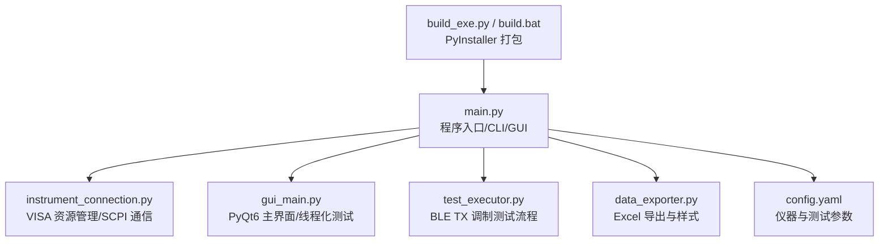
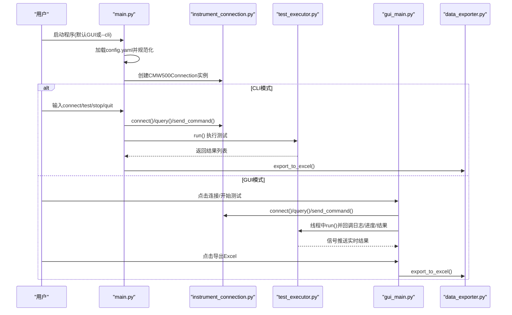
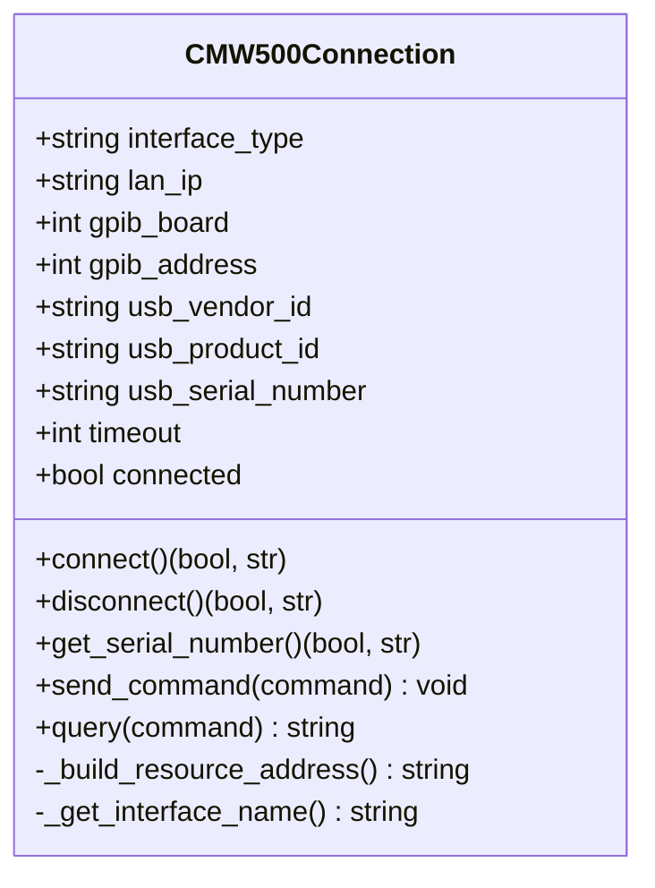
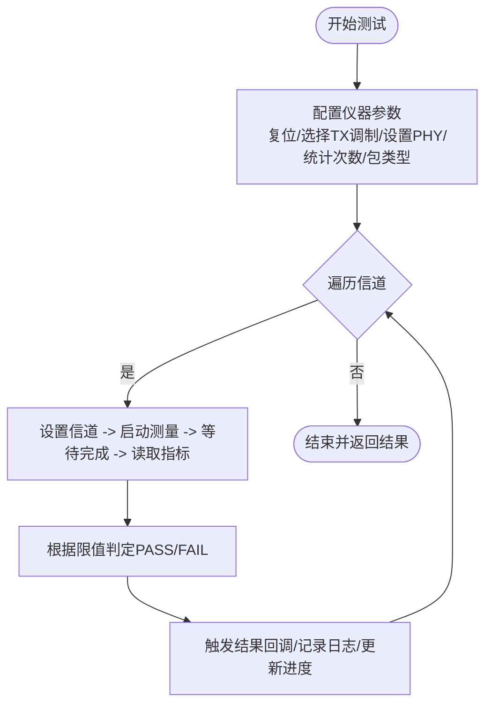
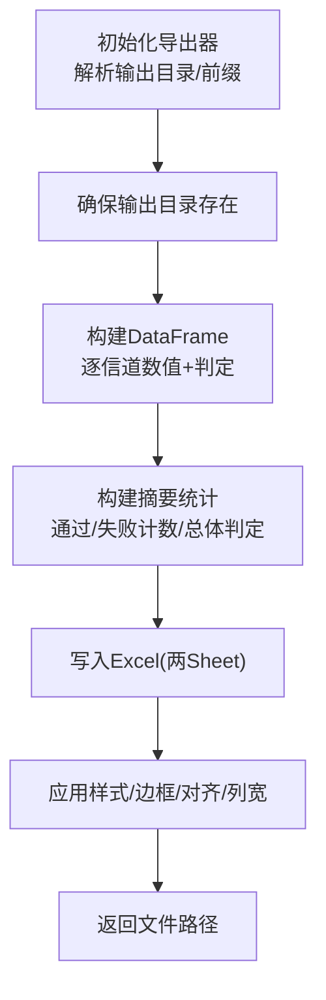
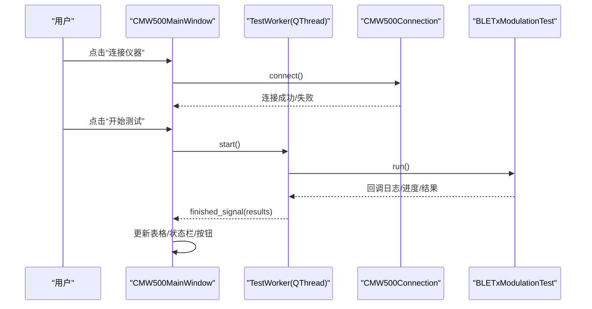
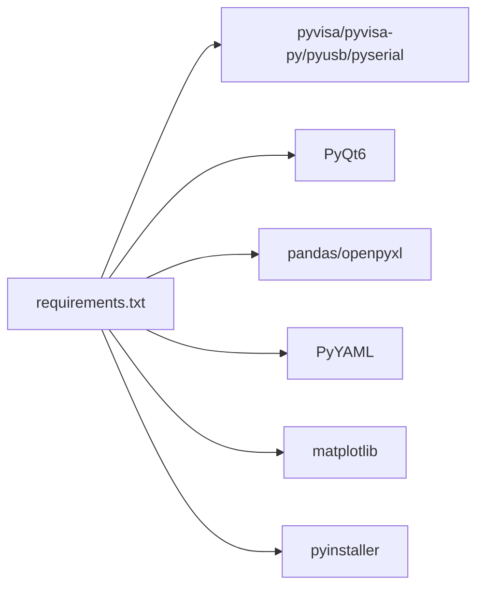

# 安装与环境配置

<cite>
**本文引用的文件**   
- [requirements.txt](file://requirements.txt)
- [config.yaml](file://config.yaml)
- [main.py](file://main.py)
- [instrument_connection.py](file://instrument_connection.py)
- [gui_main.py](file://gui_main.py)
- [test_executor.py](file://test_executor.py)
- [data_exporter.py](file://data_exporter.py)
- [build_exe.py](file://build_exe.py)
- [build.bat](file://build.bat)
</cite>

## 目录
1. [简介](#简介)
2. [项目结构](#项目结构)
3. [核心组件](#核心组件)
4. [架构总览](#架构总览)
5. [详细组件分析](#详细组件分析)
6. [依赖关系分析](#依赖关系分析)
7. [性能与打包注意事项](#性能与打包注意事项)
8. [故障排除指南](#故障排除指南)
9. [结论](#结论)
10. [附录：验证清单与常用命令](#附录：验证清单与常用命令)

## 简介
本指南面向首次使用者与高级用户，提供 CMW500 BLE TX 调制自动化测试工具的安装与环境配置说明。内容涵盖系统要求、依赖安装、配置文件详解、多种安装方式（开发环境运行、命令行模式、可执行文件打包与部署）、常见问题排查以及安装成功验证方法。

## 项目结构
仓库根目录包含程序入口、GUI、仪器连接、测试执行、数据导出、构建脚本与配置文件等关键文件。整体采用模块化设计，便于扩展与维护。

图示来源
- [main.py:1-357](file://main.py#L1-L357)
- [instrument_connection.py:1-216](file://instrument_connection.py#L1-L216)
- [gui_main.py:1-667](file://gui_main.py#L1-L667)
- [test_executor.py:1-261](file://test_executor.py#L1-L261)
- [data_exporter.py:1-283](file://data_exporter.py#L1-L283)
- [config.yaml:1-79](file://config.yaml#L1-L79)
- [build_exe.py:1-87](file://build_exe.py#L1-L87)
- [build.bat:1-106](file://build.bat#L1-L106)

章节来源
- [main.py:1-357](file://main.py#L1-L357)
- [requirements.txt:1-12](file://requirements.txt#L1-L12)

## 核心组件
- 程序入口与启动模式
  - main.py 负责加载配置、初始化仪器连接对象、选择 GUI 或 CLI 模式，并提供全局异常保护与错误弹窗兜底。
- 仪器连接层
  - instrument_connection.py 封装 VISA 资源管理与 SCPI 指令交互，支持 LAN/GPIB/USB 三种接口类型。
- 图形界面
  - gui_main.py 基于 PyQt6 实现主窗口、按钮区、结果表格、日志区与进度条；测试在独立线程中执行并通过信号更新 UI。
- 测试执行器
  - test_executor.py 实现 BLE TX 调制测试流程：配置仪器、逐信道测量、判定与回调推送。
- 数据导出
  - data_exporter.py 将测试结果导出为带样式的 Excel，包含“测试数据”和“测试摘要”两个工作表。
- 构建与打包
  - build_exe.py 与 build.bat 使用 PyInstaller 将应用打包为 Windows 可执行文件，并自动附带 config.yaml。

章节来源
- [main.py:85-115](file://main.py#L85-L115)
- [instrument_connection.py:18-133](file://instrument_connection.py#L18-L133)
- [gui_main.py:28-73](file://gui_main.py#L28-L73)
- [test_executor.py:22-104](file://test_executor.py#L22-L104)
- [data_exporter.py:23-93](file://data_exporter.py#L23-L93)
- [build_exe.py:1-87](file://build_exe.py#L1-L87)
- [build.bat:60-106](file://build.bat#L60-L106)

## 架构总览
下图展示了从启动到测试执行的端到端调用链路与模块职责。

图示来源
- [main.py:295-336](file://main.py#L295-L336)
- [instrument_connection.py:85-133](file://instrument_connection.py#L85-L133)
- [test_executor.py:186-245](file://test_executor.py#L186-L245)
- [gui_main.py:499-528](file://gui_main.py#L499-L528)
- [data_exporter.py:81-139](file://data_exporter.py#L81-L139)

## 详细组件分析

### 仪器连接类（LAN/GPIB/USB）
- 支持三种接口类型，动态构造 VISA 资源地址字符串，统一通过 *IDN? 校验连接有效性。
- 提供 connect/disconnect/get_serial_number/send_command/query 等方法，并对不同接口给出针对性错误提示。

图示来源
- [instrument_connection.py:18-133](file://instrument_connection.py#L18-L133)

章节来源
- [instrument_connection.py:55-84](file://instrument_connection.py#L55-L84)
- [instrument_connection.py:85-133](file://instrument_connection.py#L85-L133)

### 测试执行器（BLE TX 调制）
- 按配置遍历信道范围，逐项发送 SCPI 指令完成测量，计算绝对值并与上限/下限比较得出 PASS/FAIL。
- 支持回调推送日志、进度与单信道结果，便于 GUI 实时更新。

图示来源
- [test_executor.py:76-104](file://test_executor.py#L76-L104)
- [test_executor.py:105-184](file://test_executor.py#L105-L184)
- [test_executor.py:186-245](file://test_executor.py#L186-L245)

章节来源
- [test_executor.py:22-67](file://test_executor.py#L22-L67)
- [test_executor.py:186-245](file://test_executor.py#L186-L245)

### 数据导出器（Excel）
- 生成“测试数据”与“测试摘要”两个 Sheet，自动添加时间戳文件名，并对判定列进行着色与列宽自适应。
- 输出目录支持相对路径解析，兼容 exe 打包后的运行环境。

图示来源
- [data_exporter.py:41-79](file://data_exporter.py#L41-L79)
- [data_exporter.py:81-139](file://data_exporter.py#L81-L139)
- [data_exporter.py:141-202](file://data_exporter.py#L141-L202)
- [data_exporter.py:204-283](file://data_exporter.py#L204-L283)

章节来源
- [data_exporter.py:23-93](file://data_exporter.py#L23-L93)

### 图形界面（PyQt6）
- 顶部接口配置区支持切换 LAN/GPIB/USB 并编辑对应参数；中部显示结果表格与进度条；底部为日志窗口。
- 测试在独立 QThread 中执行，通过信号槽机制安全更新 UI。

图示来源
- [gui_main.py:75-124](file://gui_main.py#L75-L124)
- [gui_main.py:28-73](file://gui_main.py#L28-L73)
- [gui_main.py:499-528](file://gui_main.py#L499-L528)

章节来源
- [gui_main.py:129-276](file://gui_main.py#L129-L276)
- [gui_main.py:499-528](file://gui_main.py#L499-L528)

## 依赖关系分析
- 运行时依赖
  - pyvisa、pyvisa-py、pyusb、pyserial：用于仪器通信（LAN/GPIB/USB）。
  - PyQt6：图形界面。
  - pandas、openpyxl：数据处理与 Excel 导出。
  - PyYAML：配置文件解析。
  - matplotlib：可视化（当前未在主流程中使用，但作为依赖保留）。
  - pyinstaller：打包为 exe。
- 构建期依赖
  - PyInstaller 及其隐藏导入项（如 pyvisa_py.protocols.*、usb.core、serial.tools 等），由 build.bat 显式声明。

图示来源
- [requirements.txt:1-12](file://requirements.txt#L1-L12)

章节来源
- [requirements.txt:1-12](file://requirements.txt#L1-L12)
- [build.bat:76-84](file://build.bat#L76-L84)

## 性能与打包注意事项
- 打包模式
  - 使用目录模式（非单文件）以提升启动速度；UPX 压缩已启用。
- 隐藏导入
  - 需显式包含 pyvisa_py 协议族与 USB/串口相关模块，避免运行时缺失。
- 配置文件
  - config.yaml 会被复制到输出目录，可在 exe 同目录下直接修改。
- 输出目录
  - 测试结果的 test_results 目录会在首次导出时自动创建。

章节来源
- [build_exe.py:56-86](file://build_exe.py#L56-L86)
- [build.bat:76-106](file://build.bat#L76-L106)
- [data_exporter.py:51-66](file://data_exporter.py#L51-L66)

## 故障排除指南

- Python 版本与环境
  - 若找不到 Python，请安装 Python 并确保勾选“添加到 PATH”。构建脚本会尝试多个常见路径。
  - 建议在同一虚拟环境中安装依赖，避免冲突。

- 依赖安装失败
  - 网络问题导致 pip 下载失败：更换镜像源或离线安装 wheel。
  - 缺少编译工具链：某些库需要 C/C++ 编译器，请安装 Visual Studio Build Tools 或使用预编译二进制。

- PyVISA 与后端
  - 本项目使用 pyvisa-py 纯 Python 后端，无需安装 NI-VISA。
  - 若仍出现 VISA 驱动相关错误，确认 pyvisa-py 与 pyusb/pyserial 已正确安装。

- GPIB 驱动配置
  - 检查 GPIB 板卡驱动是否安装且可用。
  - 确认 board 与 address 设置与硬件一致。
  - 在 GUI 的接口配置区选择 “GPIB (IEEE-488)” 并填写板号与地址后重试连接。

- USB 设备识别
  - 确认 VID/PID 与仪器匹配；序列号留空表示自动搜索第一个匹配设备。
  - 若设备未被识别，检查 USB 线缆与系统设备管理器中的驱动状态。
  - 在 GUI 的接口配置区选择 “USB (TMC)” 并核对 VID/PID/序列号。

- LAN 连接失败
  - 检查网线连接与 IP 地址是否正确，确保仪器可达。
  - 在 GUI 的接口配置区选择 “LAN (TCP/IP)” 并填写正确的 IP。

- 配置文件问题
  - 确保 config.yaml 与程序位于同一目录（exe 模式下为 dist 输出目录）。
  - 若旧版配置缺少子节，程序会自动补全默认值；但仍建议保持格式完整。

- 打包后运行异常
  - 确认 dist 目录中存在 config.yaml。
  - 若出现模块缺失报错，检查 build.bat 的隐藏导入是否覆盖所有必要模块。

章节来源
- [build.bat:12-53](file://build.bat#L12-L53)
- [build.bat:76-84](file://build.bat#L76-L84)
- [instrument_connection.py:112-133](file://instrument_connection.py#L112-L133)
- [main.py:108-115](file://main.py#L108-L115)
- [main.py:245-292](file://main.py#L245-L292)

## 结论
本指南提供了从零开始的安装与配置步骤，涵盖开发环境与可执行文件两种运行方式，并针对常见驱动与连接问题给出排查建议。按照本文档操作，即可快速搭建稳定可用的 CMW500 BLE TX 调制自动化测试环境。

## 附录：验证清单与常用命令

- 环境准备
  - 安装 Python 并将 python 加入 PATH。
  - 在项目根目录执行依赖安装。

- 依赖安装命令
  - 使用 requirements.txt 安装全部依赖。

- 启动方式
  - 图形界面模式：直接运行入口脚本。
  - 命令行模式：传入 --cli 参数。

- 配置文件位置
  - 开发环境：与 main.py 同级目录。
  - 打包后：dist 输出目录下的 exe 同级目录。

- 基本配置检查清单
  - 接口类型与参数：LAN IP、GPIB 板号与地址、USB VID/PID/序列号。
  - 超时时间：根据网络与设备响应调整。
  - 测试参数：标准、PHY、突发类型、数据包类型、统计次数、信道范围。
  - 导出目录与文件名前缀：确保有写权限。

- 验证安装成功
  - 启动 GUI，选择接口并连接仪器，查看状态栏与日志。
  - 在 CLI 模式下依次执行 connect、serial、test、stop、quit 命令。
  - 执行一次测试后，检查 test_results 目录是否生成 Excel 文件。

章节来源
- [main.py:8-13](file://main.py#L8-L13)
- [main.py:295-336](file://main.py#L295-L336)
- [config.yaml:1-79](file://config.yaml#L1-L79)
- [data_exporter.py:68-79](file://data_exporter.py#L68-L79)