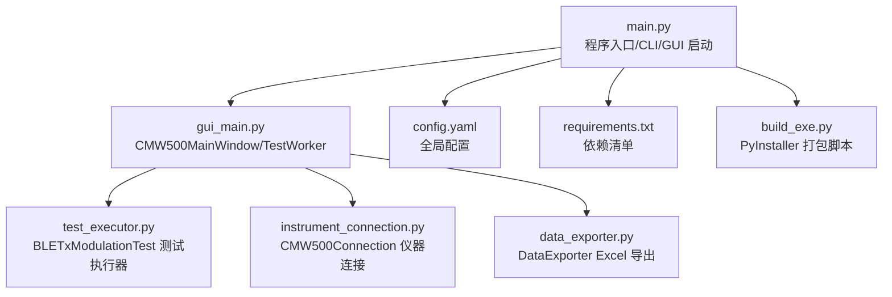
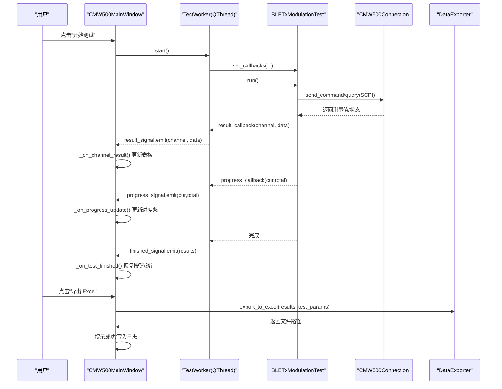
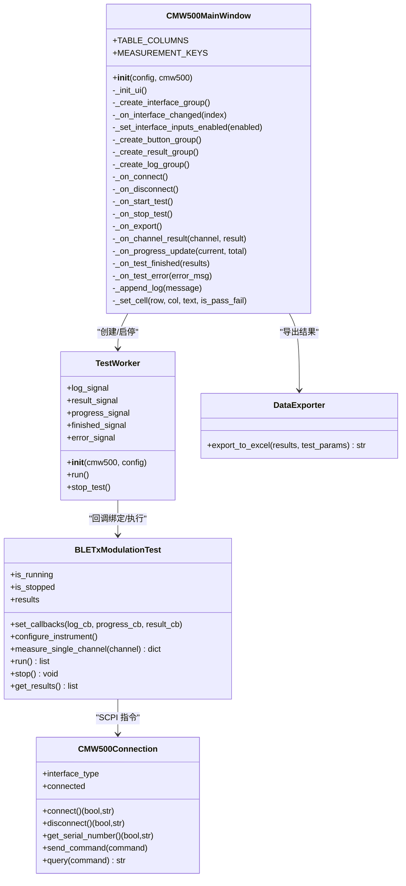
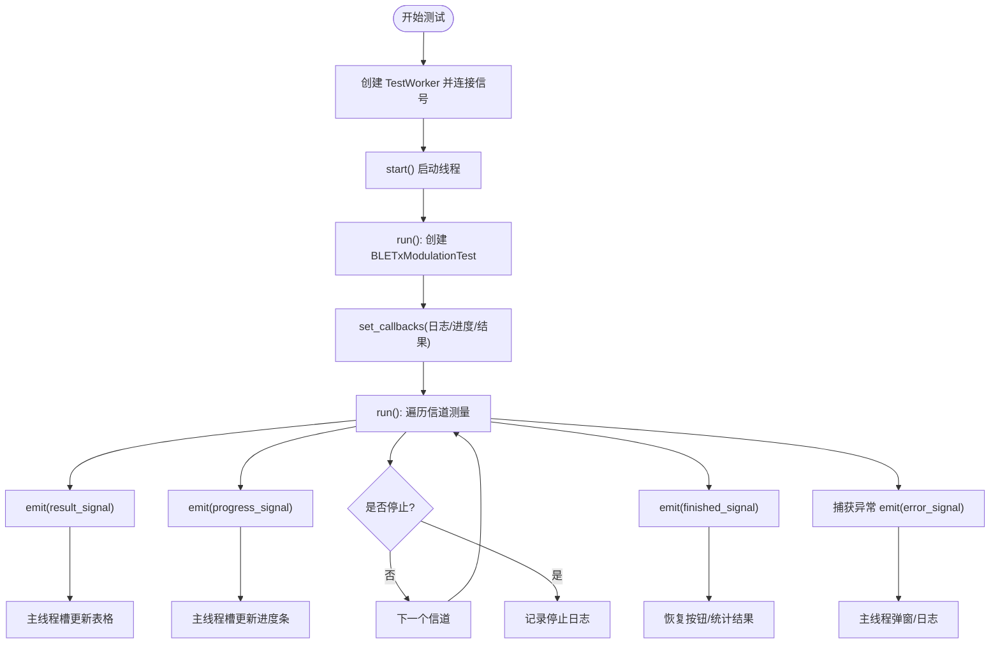
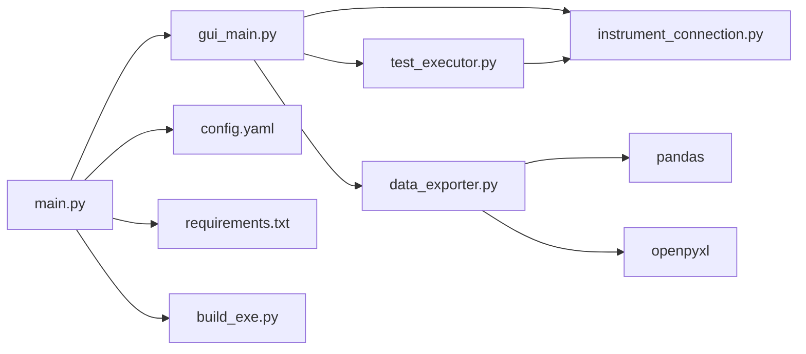

# GUI 开发指南

<cite>
**本文引用的文件**   
- [gui_main.py](file://gui_main.py)
- [main.py](file://main.py)
- [test_executor.py](file://test_executor.py)
- [instrument_connection.py](file://instrument_connection.py)
- [data_exporter.py](file://data_exporter.py)
- [config.yaml](file://config.yaml)
- [requirements.txt](file://requirements.txt)
- [build_exe.py](file://build_exe.py)
</cite>

## 目录
1. [简介](#简介)
2. [项目结构](#项目结构)
3. [核心组件](#核心组件)
4. [架构总览](#架构总览)
5. [详细组件分析](#详细组件分析)
6. [依赖关系分析](#依赖关系分析)
7. [性能与响应性](#性能与响应性)
8. [故障排查指南](#故障排查指南)
9. [结论](#结论)
10. [附录：扩展与规范](#附录扩展与规范)

## 简介
本指南面向使用 PyQt6 构建 CMW500 BLE TX 调制自动化测试工具的开发与维护人员，重点围绕主窗口类 CMW500MainWindow 的设计模式、TestWorker 多线程模型与 Qt 信号槽机制、界面布局与事件处理、样式与主题、异常处理与用户体验设计，以及新功能的扩展流程与代码规范。文档以源码为依据，提供可视化架构图与流程图，帮助读者快速理解并高效扩展系统。

## 项目结构
本项目采用“入口 + 界面 + 业务执行 + 仪器连接 + 数据导出”的分层组织方式，配置集中管理，便于跨平台打包与部署。

图表来源
- [main.py:222-242](file://main.py#L222-L242)
- [gui_main.py:75-124](file://gui_main.py#L75-L124)
- [test_executor.py:22-51](file://test_executor.py#L22-L51)
- [instrument_connection.py:18-54](file://instrument_connection.py#L18-L54)
- [data_exporter.py:23-62](file://data_exporter.py#L23-L62)
- [config.yaml:1-79](file://config.yaml#L1-L79)
- [requirements.txt:1-12](file://requirements.txt#L1-L12)
- [build_exe.py:1-87](file://build_exe.py#L1-L87)

章节来源
- [main.py:1-357](file://main.py#L1-L357)
- [gui_main.py:1-667](file://gui_main.py#L1-L667)
- [test_executor.py:1-261](file://test_executor.py#L1-L261)
- [instrument_connection.py:1-216](file://instrument_connection.py#L1-L216)
- [data_exporter.py:1-283](file://data_exporter.py#L1-L283)
- [config.yaml:1-79](file://config.yaml#L1-L79)
- [requirements.txt:1-12](file://requirements.txt#L1-L12)
- [build_exe.py:1-87](file://build_exe.py#L1-L87)

## 核心组件
- 主窗口 CMW500MainWindow：负责界面布局、用户交互、状态栏与日志展示、进度条更新、表格结果渲染、按钮状态机控制。
- 工作线程 TestWorker：封装测试执行生命周期，通过 pyqtSignal 将日志、进度、单信道结果、完成与错误消息回传到主线程。
- 测试执行器 BLETxModulationTest：实现 BLE TX 调制测量流程（配置仪器、逐信道测量、判定 PASS/FAIL），支持回调推送中间结果。
- 仪器连接 CMW500Connection：统一封装 LAN/GPIB/USB 三种接口，基于 VISA 资源地址建立连接、发送 SCPI 命令与查询。
- 数据导出 DataExporter：将测试结果导出为带样式的 Excel，包含“测试数据”和“测试摘要”两个 Sheet。

章节来源
- [gui_main.py:75-124](file://gui_main.py#L75-L124)
- [gui_main.py:28-73](file://gui_main.py#L28-L73)
- [test_executor.py:22-51](file://test_executor.py#L22-L51)
- [instrument_connection.py:18-54](file://instrument_connection.py#L18-L54)
- [data_exporter.py:23-62](file://data_exporter.py#L23-L62)

## 架构总览
下图展示了从用户操作到仪器通信、再到结果导出与 UI 更新的完整调用链。

图表来源
- [gui_main.py:499-528](file://gui_main.py#L499-L528)
- [gui_main.py:561-629](file://gui_main.py#L561-L629)
- [gui_main.py:537-556](file://gui_main.py#L537-L556)
- [gui_main.py:28-73](file://gui_main.py#L28-L73)
- [test_executor.py:52-75](file://test_executor.py#L52-L75)
- [test_executor.py:186-245](file://test_executor.py#L186-L245)
- [instrument_connection.py:192-215](file://instrument_connection.py#L192-L215)
- [data_exporter.py:81-139](file://data_exporter.py#L81-L139)

## 详细组件分析

### 主窗口 CMW500MainWindow 设计与实现
- 设计模式
  - 组合式布局：QVBoxLayout 作为根容器，分块创建 QGroupBox 并通过 addWidget(stretch=...) 控制比例。
  - 状态机驱动：按钮启用/禁用与状态标签颜色随连接与测试状态变化。
  - 信号槽解耦：TestWorker 的 pyqtSignal 与主窗口槽函数一一对应，避免跨线程直接访问 UI。
- 关键职责
  - 界面初始化：顶部接口配置区（LAN/GPIB/USB）、中部结果表格+进度条、底部日志窗口。
  - 事件处理：连接/断开、开始/停止测试、导出 Excel。
  - 结果渲染：按列映射测量指标与判定结果，自动滚动与着色。
  - 状态反馈：状态栏消息、进度百分比、日志时间戳。
- 重要方法路径参考
  - 初始化与布局：[gui_main.py:101-148](file://gui_main.py#L101-L148)
  - 接口配置区：[gui_main.py:150-276](file://gui_main.py#L150-L276)
  - 按钮组与样式：[gui_main.py:301-382](file://gui_main.py#L301-L382)
  - 结果表格与进度条：[gui_main.py:384-418](file://gui_main.py#L384-L418)
  - 日志窗口：[gui_main.py:420-432](file://gui_main.py#L420-L432)
  - 连接/断开逻辑：[gui_main.py:438-497](file://gui_main.py#L438-L497)
  - 开始/停止测试：[gui_main.py:499-535](file://gui_main.py#L499-L535)
  - 导出 Excel：[gui_main.py:537-556](file://gui_main.py#L537-L556)
  - 信号槽处理：[gui_main.py:561-629](file://gui_main.py#L561-L629)
  - 辅助方法（日志追加/单元格设置）：[gui_main.py:635-666](file://gui_main.py#L635-L666)

图表来源
- [gui_main.py:75-124](file://gui_main.py#L75-L124)
- [gui_main.py:28-73](file://gui_main.py#L28-L73)
- [test_executor.py:22-51](file://test_executor.py#L22-L51)
- [instrument_connection.py:18-54](file://instrument_connection.py#L18-L54)
- [data_exporter.py:23-62](file://data_exporter.py#L23-L62)

章节来源
- [gui_main.py:75-666](file://gui_main.py#L75-L666)

### 多线程编程模型与 Qt 信号槽
- 线程模型
  - TestWorker 继承自 QThread，在 run() 中实例化 BLETxModulationTest 并执行 run()。
  - 所有 UI 更新均在主线程槽函数中完成，避免跨线程访问控件导致崩溃。
- 信号定义与用途
  - log_signal(str)：实时日志
  - result_signal(int, dict)：单信道结果
  - progress_signal(int, int)：进度（当前/总数）
  - finished_signal(list)：全部结果
  - error_signal(str)：异常信息
- 信号槽连接点
  - 主窗口在开始测试时连接各信号到对应槽函数；测试完成后恢复按钮状态。
- 停止机制
  - 通过 stop_test() 触发测试执行器的 stop()，设置 is_stopped 标志，循环内检查退出。

图表来源
- [gui_main.py:499-528](file://gui_main.py#L499-L528)
- [gui_main.py:561-629](file://gui_main.py#L561-L629)
- [gui_main.py:28-73](file://gui_main.py#L28-L73)
- [test_executor.py:186-245](file://test_executor.py#L186-L245)

章节来源
- [gui_main.py:28-73](file://gui_main.py#L28-L73)
- [gui_main.py:499-528](file://gui_main.py#L499-L528)
- [gui_main.py:561-629](file://gui_main.py#L561-L629)
- [test_executor.py:186-245](file://test_executor.py#L186-L245)

### 界面布局管理与事件处理
- 布局策略
  - 顶部接口配置区：使用 QStackedWidget 切换 LAN/GPIB/USB 参数页，下拉框索引驱动页面切换。
  - 中部结果区：QTableWidget 固定列数，表头自适应拉伸，禁止编辑，交替行色提升可读性。
  - 底部日志区：只读 QTextEdit，深色背景，Consolas 字体，自动滚动到底部。
- 事件处理
  - 连接/断开：根据当前接口类型读取输入，更新 CMW500Connection 属性后发起连接，失败则恢复可编辑。
  - 开始/停止：清空表格与进度，创建工作线程并连接信号，运行期间禁用部分按钮，停止仅置位停止标志。
  - 导出：若无结果则提示，否则调用 DataExporter 生成 Excel 并提示成功。
- 交互细节
  - 状态标签颜色与文本随连接状态变化。
  - 进度条显示百分比与“当前/总数”。
  - 判定列着色：PASS 浅绿、FAIL 浅红、ERROR 浅黄。

章节来源
- [gui_main.py:150-276](file://gui_main.py#L150-L276)
- [gui_main.py:301-382](file://gui_main.py#L301-L382)
- [gui_main.py:384-418](file://gui_main.py#L384-L418)
- [gui_main.py:420-432](file://gui_main.py#L420-L432)
- [gui_main.py:438-497](file://gui_main.py#L438-L497)
- [gui_main.py:499-535](file://gui_main.py#L499-L535)
- [gui_main.py:537-556](file://gui_main.py#L537-L556)
- [gui_main.py:635-666](file://gui_main.py#L635-L666)

### 样式定制、主题与响应式
- 主题
  - 应用 Fusion 主题，保证跨平台一致外观。
- 样式
  - 按钮：通过样式表设置背景色、悬停态、禁用态，统一圆角与内边距。
  - 表格：表头加粗居中，列宽 Stretch 自适应。
  - 日志：深色背景与浅色文字，提升长时间运行时的可读性。
- 响应式
  - 使用 SizePolicy 与 stretch 因子控制区域伸缩。
  - 表格列自动调整宽度，内容过长时仍可阅读。

章节来源
- [main.py:234-236](file://main.py#L234-L236)
- [gui_main.py:312-371](file://gui_main.py#L312-L371)
- [gui_main.py:410-418](file://gui_main.py#L410-L418)
- [gui_main.py:428-431](file://gui_main.py#L428-L431)

### 异常处理与用户体验
- 启动期
  - 全局 try/except 捕获启动异常，优先尝试 PyQt6 弹窗，其次 tkinter，最后写本地错误日志文件。
- 连接期
  - 区分 VISA 通信错误与其他异常，给出具体接口提示信息（IP/GPIB 地址/USB VID/PID/SN）。
- 测试期
  - 工作线程捕获异常并通过 error_signal 上报，主线程弹窗与日志记录，同时恢复按钮状态。
- 导出期
  - 捕获异常并提示失败原因，不影响其他功能。

章节来源
- [main.py:339-356](file://main.py#L339-L356)
- [main.py:42-83](file://main.py#L42-L83)
- [instrument_connection.py:112-132](file://instrument_connection.py#L112-L132)
- [gui_main.py:621-629](file://gui_main.py#L621-L629)
- [gui_main.py:553-556](file://gui_main.py#L553-L556)

## 依赖关系分析
- 模块耦合
  - main.py 负责加载配置、构造连接对象、选择 CLI/GUI 模式。
  - gui_main.py 依赖 instrument_connection、test_executor、data_exporter。
  - test_executor 依赖 instrument_connection 进行 SCPI 通信。
  - data_exporter 依赖 pandas/openpyxl 生成 Excel。
- 外部依赖
  - pyvisa/pyvisa-py/pyusb/pyserial：仪器通信后端。
  - PyQt6：GUI 框架。
  - pandas/openpyxl：Excel 读写与样式。
  - PyYAML：配置文件解析。
  - matplotlib：可选绘图（当前未在主流程中使用）。
  - pyinstaller：打包为 exe。

图表来源
- [main.py:222-242](file://main.py#L222-L242)
- [gui_main.py:1-26](file://gui_main.py#L1-L26)
- [test_executor.py:1-20](file://test_executor.py#L1-L20)
- [instrument_connection.py:1-16](file://instrument_connection.py#L1-L16)
- [data_exporter.py:14-21](file://data_exporter.py#L14-L21)
- [config.yaml:1-79](file://config.yaml#L1-L79)
- [requirements.txt:1-12](file://requirements.txt#L1-L12)
- [build_exe.py:1-87](file://build_exe.py#L1-L87)

章节来源
- [main.py:1-357](file://main.py#L1-L357)
- [gui_main.py:1-667](file://gui_main.py#L1-L667)
- [test_executor.py:1-261](file://test_executor.py#L1-L261)
- [instrument_connection.py:1-216](file://instrument_connection.py#L1-L216)
- [data_exporter.py:1-283](file://data_exporter.py#L1-L283)
- [config.yaml:1-79](file://config.yaml#L1-L79)
- [requirements.txt:1-12](file://requirements.txt#L1-L12)
- [build_exe.py:1-87](file://build_exe.py#L1-L87)

## 性能与响应性
- 线程隔离
  - 耗时任务（仪器通信、测量循环）在工作线程执行，避免阻塞 UI。
- 增量更新
  - 每信道测量后立即通过 result_signal 更新一行，减少一次性大数据量渲染。
- 进度反馈
  - 每次测量后更新进度条与文本，提升用户感知。
- 表格优化
  - 禁止编辑、交替行色、列宽自适应，降低重绘开销。
- 建议
  - 若未来增加大量历史数据或复杂图表，考虑分页/虚拟列表与异步渲染。
  - 对频繁 UI 更新可合并批次（例如每 N 个信道批量更新一次），权衡实时性与性能。

## 故障排查指南
- 无法连接仪器
  - 检查接口类型与参数（LAN IP、GPIB Board/Address、USB VID/PID/SN）。
  - 确认网络连通性或 GPIB/USB 线缆与驱动安装。
  - 查看连接失败提示中的详细信息与建议。
- 测试中断或无结果
  - 观察日志窗口是否有 Channel 测量失败记录。
  - 检查工作线程是否被提前停止（is_stopped 标志）。
  - 确认仪器固件版本与 SCPI 指令兼容性。
- 导出失败
  - 检查输出目录权限与磁盘空间。
  - 确认 openpyxl/pandas 可用且版本兼容。
- 启动闪退
  - 查看全局异常弹窗或本地错误日志文件。
  - 确认 config.yaml 存在且格式正确。

章节来源
- [instrument_connection.py:112-132](file://instrument_connection.py#L112-L132)
- [test_executor.py:226-234](file://test_executor.py#L226-L234)
- [data_exporter.py:81-139](file://data_exporter.py#L81-L139)
- [main.py:339-356](file://main.py#L339-L356)

## 结论
本项目以清晰的模块化分层与 Qt 信号槽机制实现了稳定可靠的 GUI 自动化测试工具。主窗口专注于 UI 与交互，工作线程承载耗时任务，测试执行器封装仪器通信与测量逻辑，数据导出模块负责报告生成。整体架构易于扩展与维护，适合持续迭代与功能增强。

## 附录：扩展与规范

### 新功能扩展流程
- 新增测量项
  - 在配置文件中添加 measurement 条目（名称、单位、上下限）。
  - 在测试执行器中添加对应 SCPI 查询与 pass/fail 判定。
  - 在主窗口表格列定义与 MEASUREMENT_KEYS 中同步新增列。
  - 在导出模块中确保该指标参与数据与摘要生成。
- 新增界面功能
  - 在对应 QGroupBox 中增加控件，并在事件处理器中实现逻辑。
  - 如需多页面切换，复用 QStackedWidget 模式。
- 新增导出字段
  - 在 DataExporter 的数据行构建与样式应用中补充新字段。
- 代码规范
  - 保持单一职责：UI、业务、IO 分离。
  - 使用信号槽传递跨线程数据，禁止跨线程直接访问 UI。
  - 对外暴露稳定的接口（如 set_callbacks/run/stop），内部实现可替换。
  - 错误信息对用户友好，并提供可操作的修复建议。

章节来源
- [config.yaml:44-71](file://config.yaml#L44-L71)
- [test_executor.py:166-184](file://test_executor.py#L166-L184)
- [gui_main.py:78-99](file://gui_main.py#L78-L99)
- [data_exporter.py:96-139](file://data_exporter.py#L96-L139)