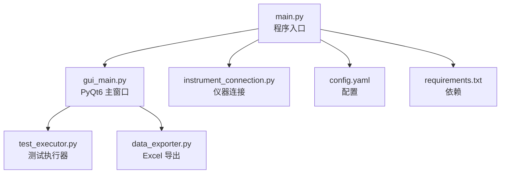
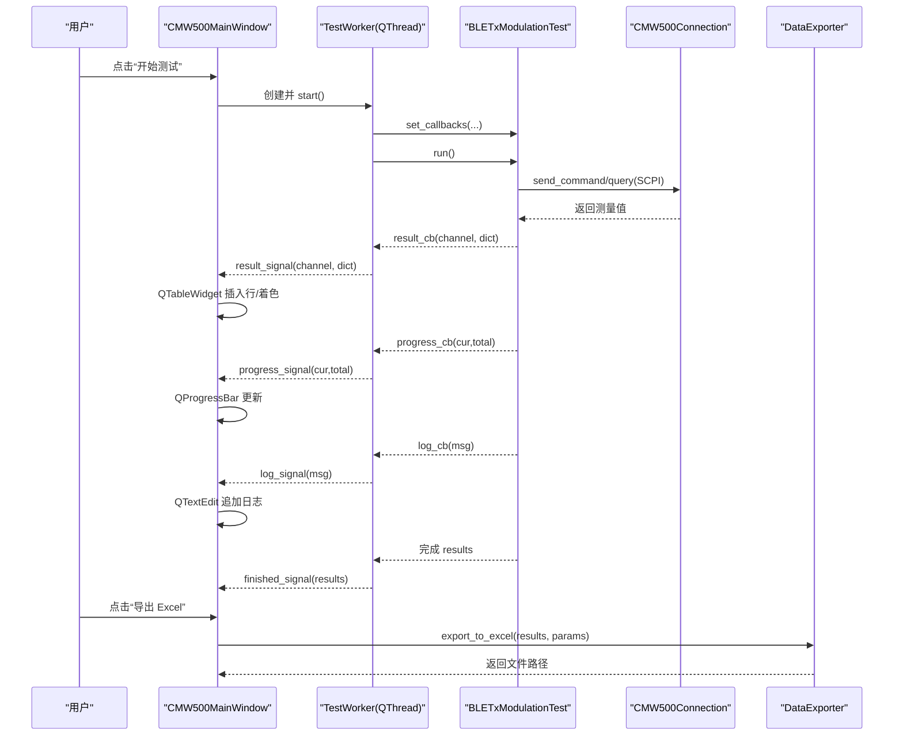
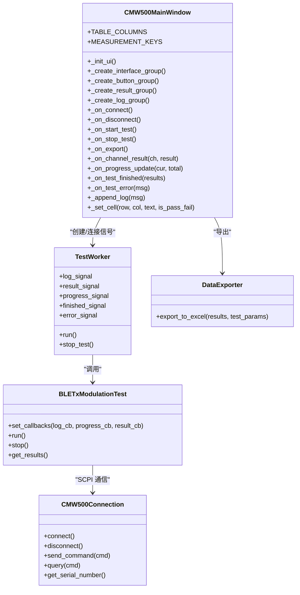
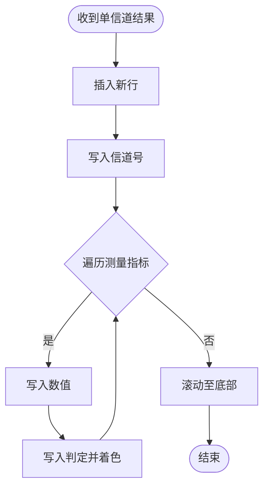
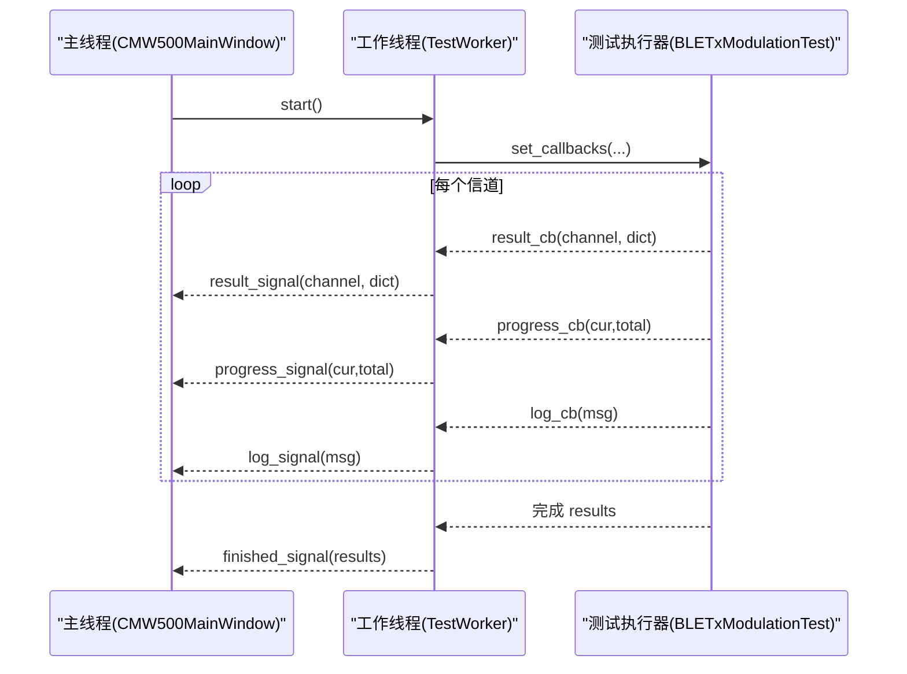
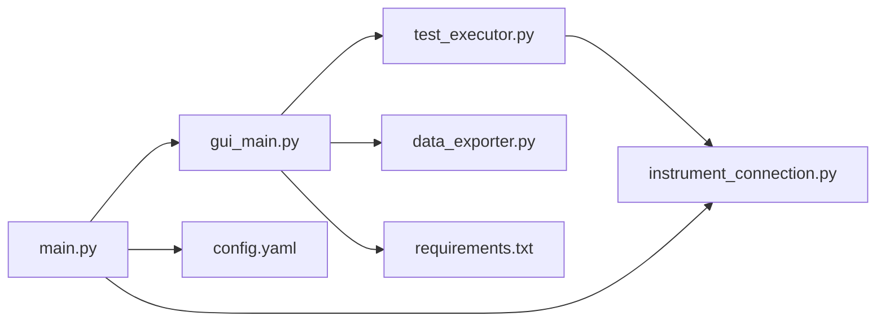

# UI 组件开发

<cite>
**本文引用的文件**   
- [gui_main.py](file://gui_main.py)
- [main.py](file://main.py)
- [test_executor.py](file://test_executor.py)
- [instrument_connection.py](file://instrument_connection.py)
- [data_exporter.py](file://data_exporter.py)
- [config.yaml](file://config.yaml)
- [requirements.txt](file://requirements.txt)
</cite>

## 目录
1. [简介](#简介)
2. [项目结构](#项目结构)
3. [核心组件](#核心组件)
4. [架构总览](#架构总览)
5. [详细组件分析](#详细组件分析)
6. [依赖关系分析](#依赖关系分析)
7. [性能与可维护性建议](#性能与可维护性建议)
8. [故障排查指南](#故障排查指南)
9. [结论](#结论)
10. [附录：样式与主题、可访问性与用户体验](#附录样式与主题可访问性与用户体验)

## 简介
本指南围绕 PyQt6 的 UI 组件开发，结合本项目中的实际实现，系统讲解以下要点：
- 常用控件使用：QTableWidget 数据表格、QTextEdit 日志显示、QProgressBar 进度条、QPushButton 按钮等
- 动态界面更新与数据绑定：工作线程 + Qt 信号槽机制
- 自定义样式与主题切换：QSS 样式表与应用级主题
- 用户交互事件处理模式与表单验证思路
- 界面可访问性与用户体验优化建议
- 组件复用与代码组织最佳实践

## 项目结构
本项目采用“入口 + GUI + 业务逻辑 + 设备通信 + 导出”的分层组织方式：
- main.py：程序入口、配置加载、GUI/CLI 启动
- gui_main.py：PyQt6 主窗口与所有 UI 组件、布局、事件处理
- test_executor.py：BLE TX 调制测试执行器（业务逻辑）
- instrument_connection.py：仪器连接封装（LAN/GPIB/USB）
- data_exporter.py：测试结果导出为 Excel
- config.yaml：配置文件（接口、测试参数、导出设置）
- requirements.txt：运行依赖

图表来源
- [main.py:222-242](file://main.py#L222-L242)
- [gui_main.py:75-148](file://gui_main.py#L75-L148)
- [instrument_connection.py:18-54](file://instrument_connection.py#L18-L54)
- [test_executor.py:22-51](file://test_executor.py#L22-L51)
- [data_exporter.py:23-62](file://data_exporter.py#L23-L62)
- [config.yaml:1-25](file://config.yaml#L1-L25)
- [requirements.txt:1-12](file://requirements.txt#L1-L12)

章节来源
- [main.py:295-336](file://main.py#L295-L336)
- [gui_main.py:129-148](file://gui_main.py#L129-L148)
- [config.yaml:1-25](file://config.yaml#L1-L25)
- [requirements.txt:1-12](file://requirements.txt#L1-L12)

## 核心组件
- 主窗口 CMW500MainWindow：负责整体布局、控件创建、事件处理、状态管理
- 测试工作线程 TestWorker：在独立线程中执行测试，通过信号向主线程推送日志、结果、进度和错误
- 测试执行器 BLETxModulationTest：编排 SCPI 指令、逐信道测量、判定 PASS/FAIL
- 仪器连接 CMW500Connection：封装 LAN/GPIB/USB 三种接口的连接、断开、命令发送与查询
- 数据导出 DataExporter：将测试结果导出为带样式的 Excel 文件

章节来源
- [gui_main.py:28-73](file://gui_main.py#L28-L73)
- [gui_main.py:75-148](file://gui_main.py#L75-L148)
- [test_executor.py:22-51](file://test_executor.py#L22-L51)
- [instrument_connection.py:18-54](file://instrument_connection.py#L18-L54)
- [data_exporter.py:23-62](file://data_exporter.py#L23-L62)

## 架构总览
下图展示了从用户操作到仪器控制、再到结果展示与导出的完整流程。

图表来源
- [gui_main.py:499-528](file://gui_main.py#L499-L528)
- [gui_main.py:561-629](file://gui_main.py#L561-L629)
- [test_executor.py:186-245](file://test_executor.py#L186-L245)
- [instrument_connection.py:192-215](file://instrument_connection.py#L192-L215)
- [data_exporter.py:81-139](file://data_exporter.py#L81-L139)

## 详细组件分析

### 主窗口与布局（CMW500MainWindow）
- 布局策略：垂直主布局，分四段——接口配置区、操作面板、结果表格+进度条、日志窗口
- 关键控件：
  - QComboBox + QStackedWidget：按接口类型切换输入项（LAN/GPIB/USB）
  - QLineEdit/QSpinBox：输入 IP、GPIB 板号/地址、USB VID/PID/SN
  - QPushButton：连接/断开/开始/停止/导出，统一字体与 QSS 样式
  - QTableWidget：列头固定，禁止编辑，交替行色，居中显示，自动滚动
  - QProgressBar：百分比与文本双显
  - QTextEdit：只读日志，深色背景，Consolas 字体
- 状态管理：
  - 连接状态标签颜色变化
  - 按钮启用/禁用状态联动
  - 状态栏消息提示

图表来源
- [gui_main.py:75-148](file://gui_main.py#L75-L148)
- [gui_main.py:28-73](file://gui_main.py#L28-L73)
- [test_executor.py:22-51](file://test_executor.py#L22-L51)
- [instrument_connection.py:18-54](file://instrument_connection.py#L18-L54)
- [data_exporter.py:23-62](file://data_exporter.py#L23-L62)

章节来源
- [gui_main.py:129-148](file://gui_main.py#L129-L148)
- [gui_main.py:150-300](file://gui_main.py#L150-L300)
- [gui_main.py:301-432](file://gui_main.py#L301-L432)
- [gui_main.py:438-556](file://gui_main.py#L438-L556)
- [gui_main.py:561-667](file://gui_main.py#L561-L667)

### 数据表格（QTableWidget）
- 列定义：固定列头，包含“信道”与各指标数值及对应判定列
- 行为：禁止编辑、选择整行、交替行色、表头居中对齐、自适应列宽
- 动态更新：每收到一个信道的结果，插入一行，自动滚动到底部
- 判定着色：根据 PASS/FAIL/ERROR 设置单元格背景与前景色

图表来源
- [gui_main.py:561-594](file://gui_main.py#L561-L594)
- [gui_main.py:642-667](file://gui_main.py#L642-L667)

章节来源
- [gui_main.py:384-418](file://gui_main.py#L384-L418)
- [gui_main.py:561-594](file://gui_main.py#L561-L594)
- [gui_main.py:642-667](file://gui_main.py#L642-L667)

### 日志显示（QTextEdit）
- 只读模式，Consolas 字体，深色背景
- 通过 append 追加内容，并手动滚动到最大位置，保证最新日志可见
- 支持来自工作线程的实时日志推送

章节来源
- [gui_main.py:420-432](file://gui_main.py#L420-L432)
- [gui_main.py:635-641](file://gui_main.py#L635-L641)

### 进度条（QProgressBar）
- 范围 0~100，百分比与“当前/总数”文本同时显示
- 由工作线程回调触发更新，避免阻塞 UI

章节来源
- [gui_main.py:384-400](file://gui_main.py#L384-L400)
- [gui_main.py:595-599](file://gui_main.py#L595-L599)

### 按钮（QPushButton）
- 统一字体与圆角样式，hover 与 disabled 态配色
- 按钮启用/禁用状态随连接与测试状态联动
- 事件绑定：连接/断开/开始/停止/导出

章节来源
- [gui_main.py:301-382](file://gui_main.py#L301-L382)
- [gui_main.py:438-556](file://gui_main.py#L438-L556)

### 动态界面更新与数据绑定（线程安全）
- 工作线程 TestWorker 持有测试执行器实例，设置回调函数
- 测试执行器在测量过程中通过回调推送日志、进度、单信道结果
- 主窗口通过 pyqtSignal 接收信号并在主线程更新 UI，确保线程安全

图表来源
- [gui_main.py:499-528](file://gui_main.py#L499-L528)
- [gui_main.py:561-629](file://gui_main.py#L561-L629)
- [test_executor.py:52-75](file://test_executor.py#L52-L75)
- [test_executor.py:186-245](file://test_executor.py#L186-L245)

章节来源
- [gui_main.py:28-73](file://gui_main.py#L28-L73)
- [gui_main.py:499-528](file://gui_main.py#L499-L528)
- [test_executor.py:52-75](file://test_executor.py#L52-L75)
- [test_executor.py:186-245](file://test_executor.py#L186-L245)

### 用户交互事件处理模式
- 连接/断开：读取界面输入，更新连接对象属性，调用 connect/disconnect，并根据结果更新按钮与状态标签
- 开始/停止：创建并启动工作线程；停止时请求测试执行器中断
- 导出：调用导出器生成 Excel，反馈成功或异常

章节来源
- [gui_main.py:438-556](file://gui_main.py#L438-L556)

### 表单验证与输入校验（建议与实践）
- 当前实现未对输入进行严格正则校验，建议在连接前增加基础校验：
  - LAN：IP 格式校验
  - GPIB：板号/地址范围校验
  - USB：VID/PID 十六进制格式校验
- 可在按钮槽函数中集中校验，失败则提示并阻止后续操作

章节来源
- [gui_main.py:438-479](file://gui_main.py#L438-L479)

### 自定义样式与主题切换
- 按钮样式：使用 QSS 设置背景色、悬停色、禁用色、内边距与圆角
- 日志样式：深色背景与浅色文字，提升可读性
- 应用级主题：在入口处设置 app.setStyle("Fusion")，获得跨平台一致外观
- 可扩展方案：将样式表抽离为外部文件或主题字典，运行时切换

章节来源
- [gui_main.py:312-371](file://gui_main.py#L312-L371)
- [gui_main.py:428-430](file://gui_main.py#L428-L430)
- [main.py:234-235](file://main.py#L234-L235)

### 组件复用与代码组织最佳实践
- 将按钮样式映射表化，减少重复代码
- 将不同接口的输入页封装为独立方法或子组件类，便于扩展新的接口类型
- 将表格列头与指标键映射集中管理，避免硬编码散落各处
- 将导出样式常量集中管理，便于统一风格

章节来源
- [gui_main.py:312-371](file://gui_main.py#L312-L371)
- [gui_main.py:79-99](file://gui_main.py#L79-L99)
- [data_exporter.py:26-39](file://data_exporter.py#L26-L39)

## 依赖关系分析
- GUI 层依赖：
  - PyQt6 提供 UI 框架与信号槽机制
  - pandas/openpyxl 用于 Excel 导出
  - PyYAML 用于配置文件解析
- 业务层依赖：
  - pyvisa/pyvisa-py 用于仪器通信
  - 测试执行器编排 SCPI 指令序列
- 入口层：
  - 根据命令行参数选择 CLI 或 GUI 模式
  - 全局异常捕获与错误弹窗兜底

图表来源
- [gui_main.py:17-25](file://gui_main.py#L17-L25)
- [test_executor.py:18-19](file://test_executor.py#L18-L19)
- [instrument_connection.py:15](file://instrument_connection.py#L15)
- [data_exporter.py:14-20](file://data_exporter.py#L14-L20)
- [main.py:230-242](file://main.py#L230-L242)
- [config.yaml:1-25](file://config.yaml#L1-L25)
- [requirements.txt:1-12](file://requirements.txt#L1-L12)

章节来源
- [requirements.txt:1-12](file://requirements.txt#L1-L12)
- [main.py:295-336](file://main.py#L295-L336)

## 性能与可维护性建议
- 表格渲染优化：
  - 批量插入行或使用模型/视图替代 QTableWidget（大数据量场景）
  - 关闭不必要的重绘与动画
- 线程与信号：
  - 保持信号粒度适中，避免过于频繁的信号导致 UI 卡顿
  - 进度更新可合并阈值（如每 N% 更新一次）
- 样式与主题：
  - 将样式表集中管理，按需加载，避免每次创建控件都重复计算样式
- 配置与兼容性：
  - 继续完善 _normalize_config 以兼容更多旧版字段
  - 将导出样式与主题参数化，支持用户自定义

[本节为通用建议，不直接分析具体文件]

## 故障排查指南
- 连接失败：
  - 检查接口类型与参数是否正确（LAN IP、GPIB 板号/地址、USB VID/PID/SN）
  - 查看错误提示中的诊断信息，必要时尝试其他接口
- 测试异常终止：
  - 检查工作线程 error_signal 捕获的错误消息
  - 确认仪器是否在线、驱动与 VISA 后端是否正常
- 导出失败：
  - 检查输出目录权限与磁盘空间
  - 确认 openpyxl 与 pandas 版本兼容

章节来源
- [instrument_connection.py:85-132](file://instrument_connection.py#L85-L132)
- [gui_main.py:621-629](file://gui_main.py#L621-L629)
- [gui_main.py:537-556](file://gui_main.py#L537-L556)

## 结论
本项目基于 PyQt6 构建了一个功能完整的 BLE TX 调制自动化测试工具。其 UI 设计清晰、线程模型合理、样式统一且具备较好的可维护性。通过信号槽机制实现了线程安全的动态界面更新，配合 QSS 与 Fusion 主题提供了良好的视觉体验。建议在后续迭代中引入更完善的输入校验、样式主题管理与大数据表格优化，进一步提升可用性与性能。

[本节为总结，不直接分析具体文件]

## 附录：样式与主题、可访问性与用户体验

### 样式与主题
- 应用级主题：在入口设置 Fusion 主题，确保跨平台一致性
- 控件样式：按钮 hover/disabled 态、日志深色主题、表格交替行色
- 主题切换：可将样式表抽取为外部资源，运行时动态加载

章节来源
- [main.py:234-235](file://main.py#L234-L235)
- [gui_main.py:312-371](file://gui_main.py#L312-L371)
- [gui_main.py:428-430](file://gui_main.py#L428-L430)

### 可访问性考虑
- 键盘导航：确保主要操作可通过 Tab 顺序访问
- 焦点提示：为关键输入框设置占位符与默认值
- 对比度：日志与判定列使用高对比度配色，便于识别
- 屏幕阅读器：为重要状态标签添加有意义的文本（如“已连接/未连接”）

[本节为通用建议，不直接分析具体文件]

### 用户体验优化
- 即时反馈：连接/断开/导出等操作立即更新状态栏与状态标签
- 防误操作：测试进行中禁用连接与部分按钮
- 进度可视化：进度条与文本同步显示，降低等待焦虑
- 结果可读性：表格居中、交替行色、PASS/FAIL 直观着色

章节来源
- [gui_main.py:438-556](file://gui_main.py#L438-L556)
- [gui_main.py:595-599](file://gui_main.py#L595-L599)
- [gui_main.py:642-667](file://gui_main.py#L642-L667)