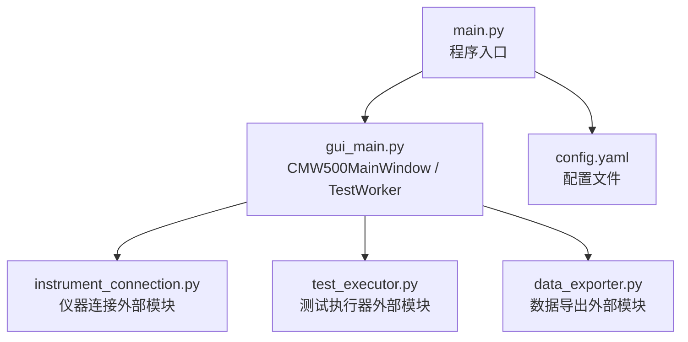
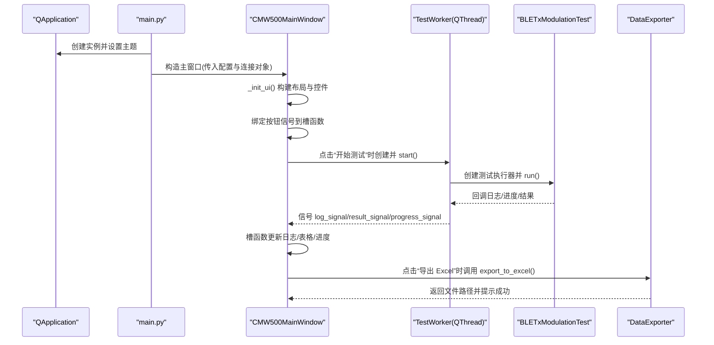
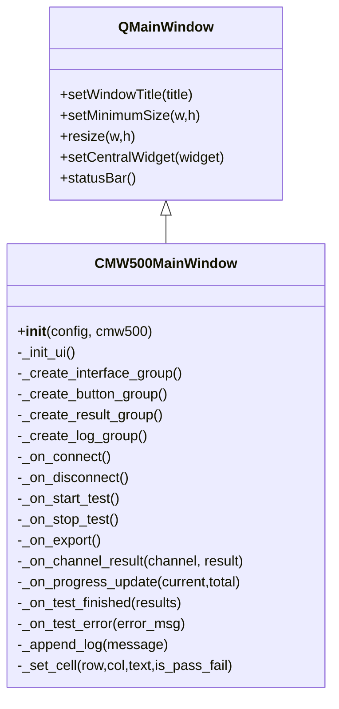
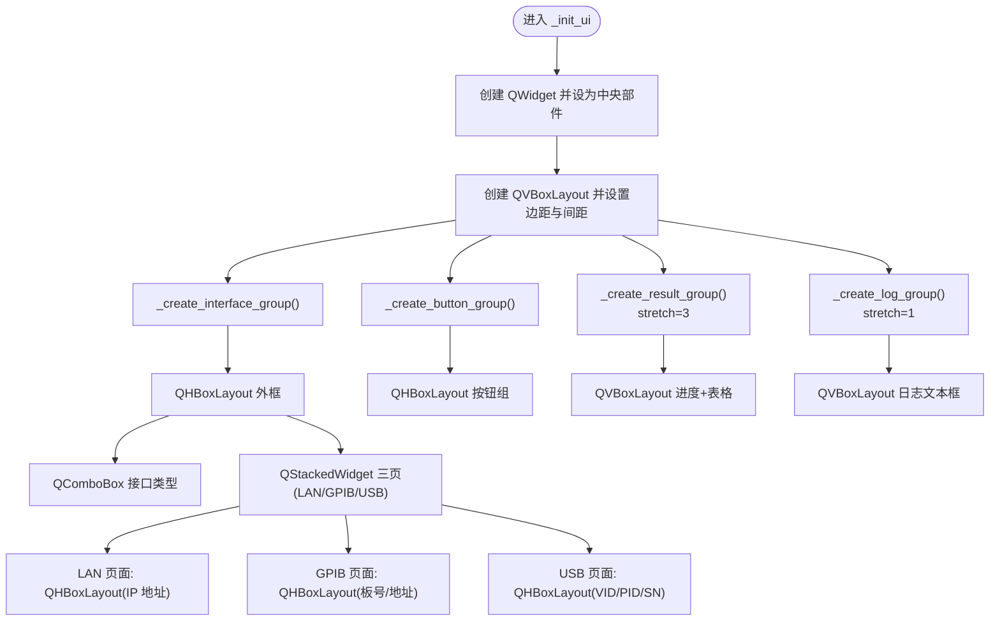
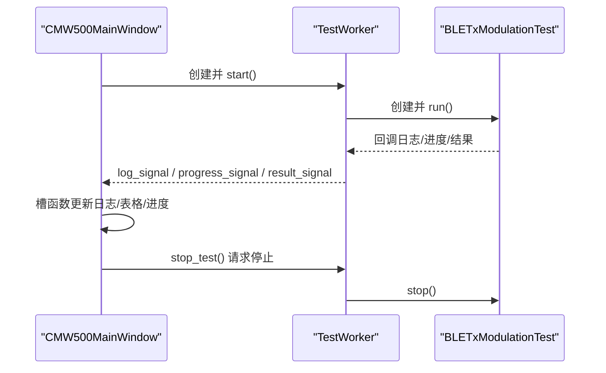
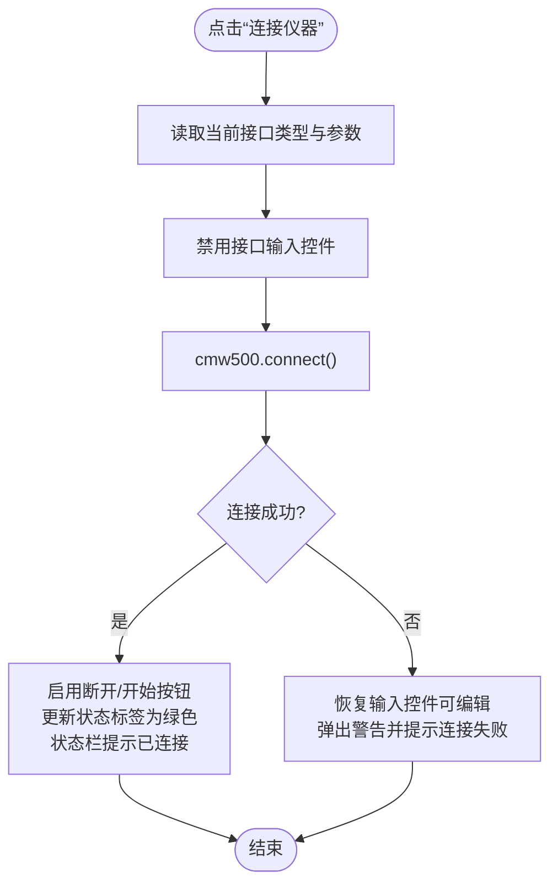
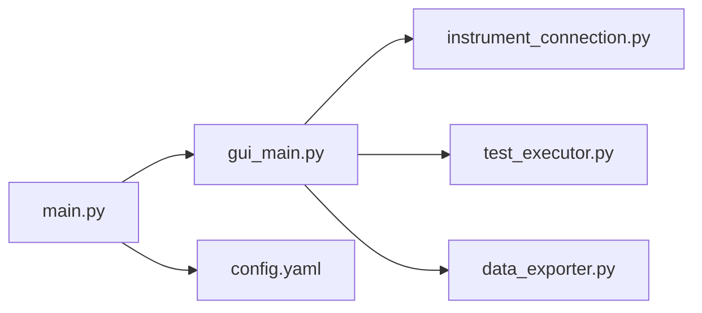

# 主窗口设计模式

<cite>
**本文引用的文件列表**
- [gui_main.py](file://gui_main.py)
- [main.py](file://main.py)
- [config.yaml](file://config.yaml)
</cite>

## 目录
1. [简介](#简介)
2. [项目结构](#项目结构)
3. [核心组件](#核心组件)
4. [架构总览](#架构总览)
5. [详细组件分析](#详细组件分析)
6. [依赖关系分析](#依赖关系分析)
7. [性能与响应式布局](#性能与响应式布局)
8. [故障排查指南](#故障排查指南)
9. [结论](#结论)
10. [附录：样式表（QSS）使用与主题定制最佳实践](#附录样式表qss使用与主题定制最佳实践)

## 简介
本文件聚焦于 CMW500MainWindow 主窗口类的设计模式，系统性说明其继承自 QMainWindow 的结构、初始化流程与组件组织方式；解释界面布局管理器（QVBoxLayout、QHBoxLayout）的使用模式与嵌套策略；划分接口配置区、操作面板、结果表格和日志窗口的职责边界；并给出窗口尺寸管理、最小化设置与响应式布局的实现方法。同时总结样式表（QSS）的使用模式与主题定制最佳实践，帮助读者快速理解与扩展该主窗口。

## 项目结构
本项目采用“入口 + GUI + 业务逻辑”的清晰分层：
- main.py：程序入口，负责加载配置、创建连接对象、选择运行模式（GUI/CLI）、启动 QApplication 事件循环。
- gui_main.py：定义 CMW500MainWindow 主窗口与测试工作线程 TestWorker，实现 UI 构建、信号槽、线程间通信与导出调用。
- config.yaml：仪器连接参数、测试参数与导出路径等配置项。

图表来源
- [main.py:222-242](file://main.py#L222-L242)
- [gui_main.py:75-124](file://gui_main.py#L75-L124)

章节来源
- [main.py:222-242](file://main.py#L222-L242)
- [gui_main.py:75-124](file://gui_main.py#L75-L124)
- [config.yaml:1-79](file://config.yaml#L1-L79)

## 核心组件
- CMW500MainWindow：继承自 QMainWindow，封装了完整的 GUI 生命周期与交互逻辑。
- TestWorker：继承自 QThread，承载耗时测试任务并通过信号向主线程回传日志、进度、结果与错误。
- 界面区域：
  - 接口配置区：支持 LAN/GPIB/USB 三种接口的动态切换与参数输入。
  - 操作面板：连接/断开、开始/停止测试、导出 Excel 按钮及连接状态标签。
  - 结果表格：逐信道显示测量值与 PASS/FAIL 判定，带进度条。
  - 日志窗口：只读文本框，实时滚动输出运行日志。

章节来源
- [gui_main.py:75-124](file://gui_main.py#L75-L124)
- [gui_main.py:129-148](file://gui_main.py#L129-L148)
- [gui_main.py:150-276](file://gui_main.py#L150-L276)
- [gui_main.py:301-382](file://gui_main.py#L301-L382)
- [gui_main.py:384-432](file://gui_main.py#L384-L432)

## 架构总览
下图展示了主窗口在应用启动后的整体交互与数据流：入口创建 QApplication 与主窗口，主窗口通过信号槽与工作线程通信，工作线程回调测试执行器，测试结果经信号更新表格与日志，最终可导出为 Excel。

图表来源
- [main.py:222-242](file://main.py#L222-L242)
- [gui_main.py:129-148](file://gui_main.py#L129-L148)
- [gui_main.py:499-528](file://gui_main.py#L499-L528)
- [gui_main.py:561-629](file://gui_main.py#L561-L629)
- [gui_main.py:537-556](file://gui_main.py#L537-L556)

## 详细组件分析

### 继承结构与初始化流程
- 继承关系：CMW500MainWindow 直接继承 QMainWindow，作为顶层容器承载所有子部件。
- 初始化步骤：
  - 保存配置与连接对象引用。
  - 设置窗口标题、最小尺寸与初始尺寸。
  - 调用 _init_ui() 完成整体布局与子区域创建。
  - 初始化状态栏提示信息。

图表来源
- [gui_main.py:75-124](file://gui_main.py#L75-L124)
- [gui_main.py:129-148](file://gui_main.py#L129-L148)

章节来源
- [gui_main.py:75-124](file://gui_main.py#L75-L124)
- [gui_main.py:129-148](file://gui_main.py#L129-L148)

### 布局管理与嵌套策略
- 顶层布局：使用 QVBoxLayout 作为中央部件的主布局，按从上到下顺序添加四个功能区域，并为结果区和日志区分别设置 stretch=3 与 stretch=1，使结果区占据更多空间。
- 接口配置区：外层 QHBoxLayout 包含“接口类型下拉框”与“QStackedWidget”，后者内部三个页面分别对应 LAN/GPIB/USB 的参数输入布局，每个页面内部再使用 QHBoxLayout 组织标签与输入控件。
- 操作面板：使用 QHBoxLayout 将连接/断开、开始/停止、导出按钮与状态标签水平排列，右侧使用 addStretch() 将状态标签推至右侧。
- 结果表格：使用 QVBoxLayout 包裹进度条行与表格，表格列头设置为居中对齐且自动拉伸填充。
- 日志窗口：使用 QVBoxLayout 包裹只读 QTextEdit，背景色与前景色通过 QSS 设置。

图表来源
- [gui_main.py:129-148](file://gui_main.py#L129-L148)
- [gui_main.py:150-276](file://gui_main.py#L150-L276)
- [gui_main.py:301-382](file://gui_main.py#L301-L382)
- [gui_main.py:384-432](file://gui_main.py#L384-L432)

章节来源
- [gui_main.py:129-148](file://gui_main.py#L129-L148)
- [gui_main.py:150-276](file://gui_main.py#L150-L276)
- [gui_main.py:301-382](file://gui_main.py#L301-L382)
- [gui_main.py:384-432](file://gui_main.py#L384-L432)

### 功能区域职责分离
- 接口配置区：负责读取用户选择的接口类型与对应参数，并在连接前禁用输入防止误改；根据默认配置初始化选中项。
- 操作面板：提供连接/断开、开始/停止测试、导出 Excel 三大操作，维护按钮可用状态与连接状态标签颜色。
- 结果表格：接收工作线程的信号，逐行插入信道结果，并对 PASS/FAIL/ERROR 进行着色；配合进度条展示测试进度。
- 日志窗口：以只读文本形式追加日志，自动滚动到底部，便于问题定位。

章节来源
- [gui_main.py:150-276](file://gui_main.py#L150-L276)
- [gui_main.py:301-382](file://gui_main.py#L301-L382)
- [gui_main.py:384-432](file://gui_main.py#L384-L432)
- [gui_main.py:561-629](file://gui_main.py#L561-L629)

### 窗口尺寸管理与响应式布局
- 最小尺寸与初始尺寸：通过 setMinimumSize 与 resize 设定窗口最小宽高与默认大小，确保在不同分辨率下仍具备良好可用性。
- 弹性伸缩：
  - 顶部配置区与操作面板固定高度，内容自适应宽度。
  - 结果表格区域设置 stretch=3，日志区 stretch=1，使窗口垂直方向按比例分配空间。
  - 表格列头使用 Stretch 模式，保证列宽随窗口宽度变化均匀分布。
- 输入控件尺寸控制：对关键输入控件设置最小/最大宽度或 Expanding 策略，避免在小窗口中挤压变形。

章节来源
- [gui_main.py:115-117](file://gui_main.py#L115-L117)
- [gui_main.py:145-148](file://gui_main.py#L145-L148)
- [gui_main.py:412-416](file://gui_main.py#L412-L416)
- [gui_main.py:171-176](file://gui_main.py#L171-L176)
- [gui_main.py:212-221](file://gui_main.py#L212-L221)
- [gui_main.py:239-256](file://gui_main.py#L239-L256)

### 线程模型与信号槽
- 测试执行在独立线程中进行，避免阻塞 GUI 主线程。
- 工作线程通过自定义信号发送日志、进度、结果与错误消息，主窗口槽函数安全更新 UI。
- 停止测试通过 stop_test() 请求测试执行器中断当前信道处理。

图表来源
- [gui_main.py:28-73](file://gui_main.py#L28-L73)
- [gui_main.py:499-528](file://gui_main.py#L499-L528)
- [gui_main.py:561-629](file://gui_main.py#L561-L629)

章节来源
- [gui_main.py:28-73](file://gui_main.py#L28-L73)
- [gui_main.py:499-528](file://gui_main.py#L499-L528)
- [gui_main.py:561-629](file://gui_main.py#L561-L629)

### 连接与导出流程
- 连接流程：从 UI 读取当前接口参数并写入连接对象，随后调用 connect()，成功后更新按钮状态、状态标签与状态栏信息；失败则恢复输入控件可编辑并提示错误。
- 导出流程：若存在上次测试结果，调用 DataExporter.export_to_excel() 生成 Excel 文件，并在日志与状态栏反馈结果。

图表来源
- [gui_main.py:438-479](file://gui_main.py#L438-L479)

章节来源
- [gui_main.py:438-479](file://gui_main.py#L438-L479)
- [gui_main.py:537-556](file://gui_main.py#L537-L556)

## 依赖关系分析
- 主窗口对外部模块的依赖：
  - instrument_connection.CMW500Connection：提供连接/断开、序列号读取等能力。
  - test_executor.BLETxModulationTest：执行 BLE TX 调制测试，支持 stop() 中断。
  - data_exporter.DataExporter：将测试结果导出为 Excel。
- 入口模块 main.py 负责：
  - 加载与规范化配置（兼容旧版 config.yaml）。
  - 创建 QApplication 并设置 Fusion 主题。
  - 根据命令行参数选择 CLI 或 GUI 模式。

图表来源
- [main.py:222-242](file://main.py#L222-L242)
- [gui_main.py:537-556](file://gui_main.py#L537-L556)
- [gui_main.py:499-528](file://gui_main.py#L499-L528)
- [config.yaml:1-79](file://config.yaml#L1-L79)

章节来源
- [main.py:222-242](file://main.py#L222-L242)
- [gui_main.py:537-556](file://gui_main.py#L537-L556)
- [gui_main.py:499-528](file://gui_main.py#L499-L528)
- [config.yaml:1-79](file://config.yaml#L1-L79)

## 性能与响应式布局
- 线程隔离：测试计算与 I/O 放在 QThread 中，避免阻塞 UI 渲染与事件处理。
- 增量更新：结果表格逐行插入，避免一次性大量更新导致的卡顿。
- 滚动优化：日志与表格在新增内容后主动滚动到底部，提升可读性。
- 布局效率：使用 stretch 与固定最小/最大尺寸减少重排开销，保持界面稳定。

[本节为通用指导，不直接分析具体文件]

## 故障排查指南
- 连接失败：
  - 检查接口类型与参数是否正确（IP/板号/地址/VID/PID/SN）。
  - 查看日志窗口中的错误提示与状态栏信息。
  - 确认仪器网络可达或 GPIB/USB 设备已正确安装驱动。
- 测试异常终止：
  - 关注工作线程 error_signal 触发的严重错误弹窗与日志。
  - 尝试重新连接仪器后再次执行测试。
- 导出失败：
  - 确认是否存在上次测试结果。
  - 检查导出目录权限与 openpyxl/pandas 依赖是否安装。

章节来源
- [gui_main.py:438-479](file://gui_main.py#L438-L479)
- [gui_main.py:621-629](file://gui_main.py#L621-L629)
- [gui_main.py:537-556](file://gui_main.py#L537-L556)

## 结论
CMW500MainWindow 采用清晰的层次化布局与职责分离，结合 QThread 与信号槽机制实现了高响应的图形界面。通过合理的尺寸管理与弹性布局，界面在不同分辨率下具备良好的适配性。样式表（QSS）用于局部美化与状态反馈，配合全局主题（Fusion）保证了跨平台一致性。整体设计易于扩展与维护，适合进一步增加新的接口类型、测试项目与导出格式。

[本节为总结性内容，不直接分析具体文件]

## 附录：样式表（QSS）使用与主题定制最佳实践
- 使用模式：
  - 针对特定控件（如 QPushButton、QTextEdit、QComboBox）设置内联样式，统一字体、圆角、悬停与禁用态颜色。
  - 通过状态标签的 setStyleSheet 动态切换颜色，直观反映连接状态。
- 主题定制建议：
  - 在入口处设置 app.setStyle("Fusion") 以获得一致的跨平台外观。
  - 将常用样式抽取为集中样式文件或常量字典，避免重复字符串拼接。
  - 使用语义化命名（如 btn_connect、btn_start）便于后续批量替换主题。
  - 深色日志背景与浅色文字对比度适中，符合长时间观察需求。

章节来源
- [main.py:234-235](file://main.py#L234-L235)
- [gui_main.py:173-176](file://gui_main.py#L173-L176)
- [gui_main.py:321-327](file://gui_main.py#L321-L327)
- [gui_main.py:344-350](file://gui_main.py#L344-L350)
- [gui_main.py:363-369](file://gui_main.py#L363-L369)
- [gui_main.py:378-379](file://gui_main.py#L378-L379)
- [gui_main.py:427-430](file://gui_main.py#L427-L430)
- [gui_main.py:471-472](file://gui_main.py#L471-L472)
- [gui_main.py:492-493](file://gui_main.py#L492-L493)