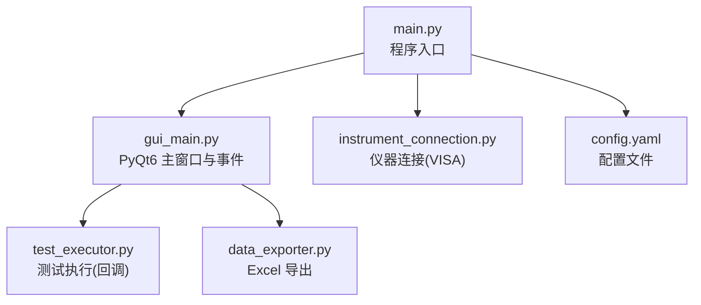
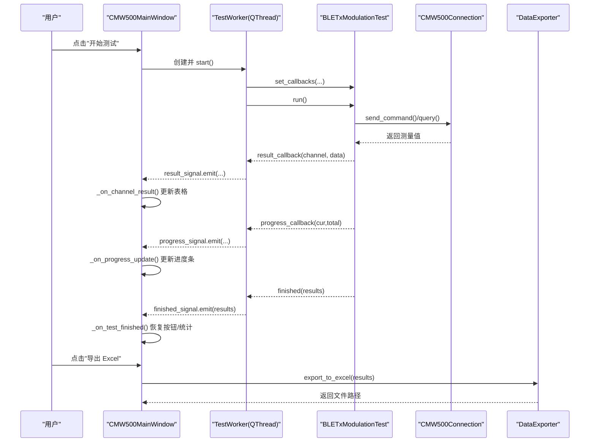
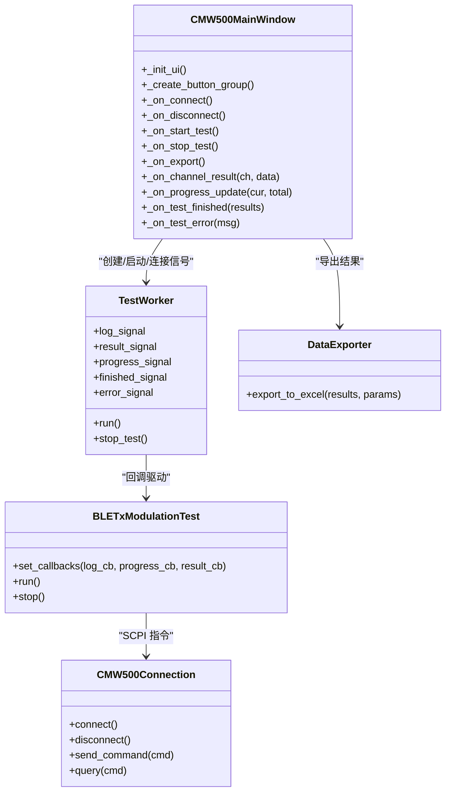
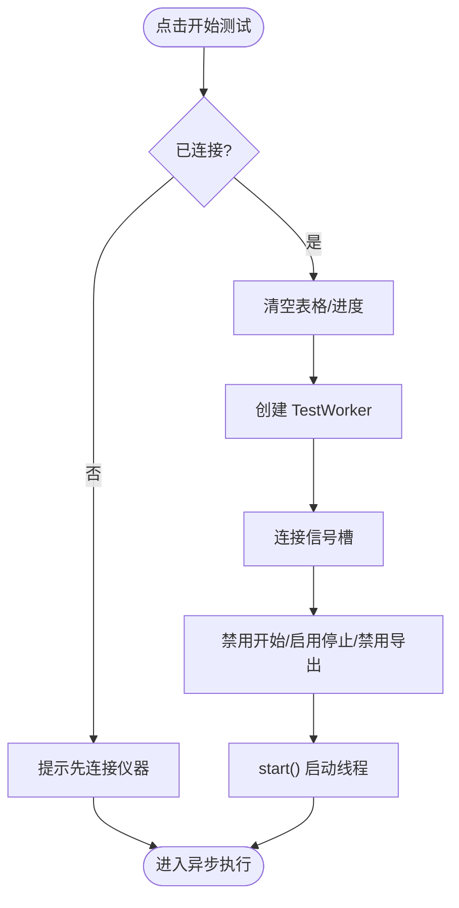
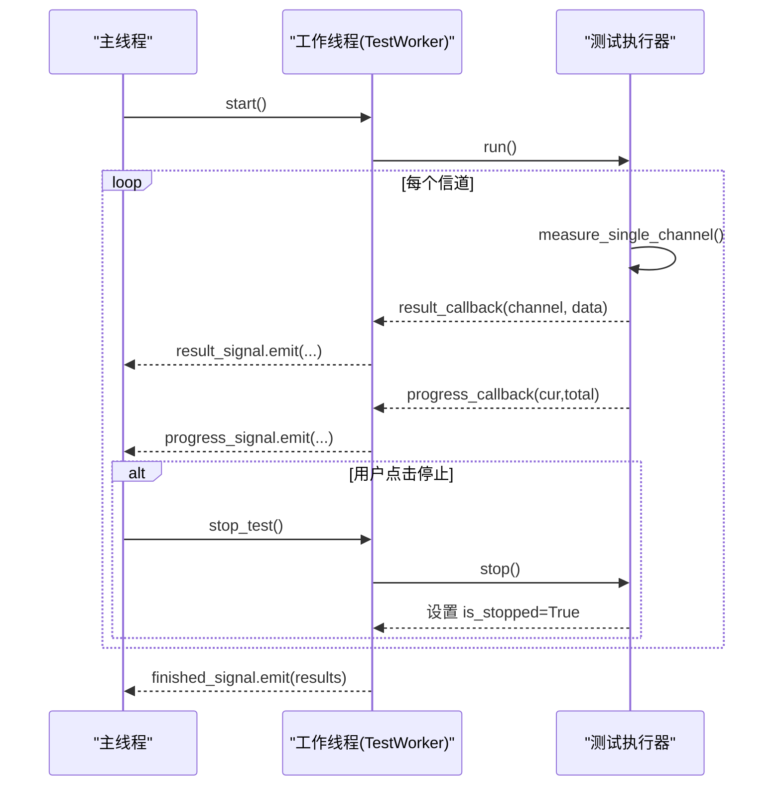
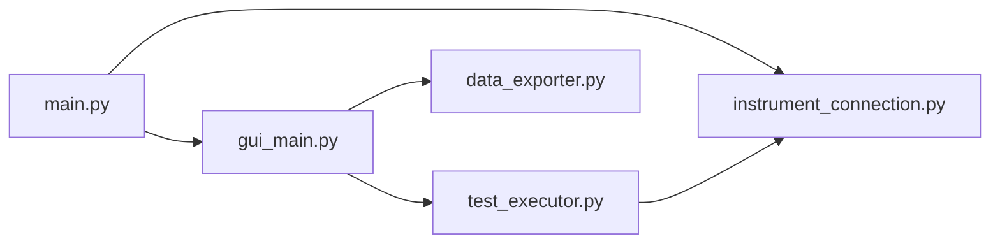

# 事件处理机制

<cite>
**本文引用的文件**   
- [main.py](file://main.py)
- [gui_main.py](file://gui_main.py)
- [test_executor.py](file://test_executor.py)
- [instrument_connection.py](file://instrument_connection.py)
- [data_exporter.py](file://data_exporter.py)
- [config.yaml](file://config.yaml)
</cite>

## 目录
1. [简介](#简介)
2. [项目结构](#项目结构)
3. [核心组件](#核心组件)
4. [架构总览](#架构总览)
5. [详细组件分析](#详细组件分析)
6. [依赖关系分析](#依赖关系分析)
7. [性能与并发特性](#性能与并发特性)
8. [故障排查指南](#故障排查指南)
9. [结论](#结论)
10. [附录：事件驱动扩展模式](#附录事件驱动扩展模式)

## 简介
本文件围绕 PyQt6 的事件处理机制，结合本项目代码，系统性阐述信号槽连接模式与方法绑定、按钮点击/界面状态变更/用户输入事件的处理流程，以及异步事件处理与阻塞操作解决方案。同时覆盖错误处理与异常捕获的用户体验设计、事件冒泡与传播的理解，并提供事件驱动架构的设计模式与扩展方法。

## 项目结构
本项目采用“入口 + GUI + 业务执行 + 仪器通信 + 数据导出”的分层组织方式：
- main.py：程序入口、全局异常保护、GUI/CLI 启动分支
- gui_main.py：PyQt6 主窗口、控件布局、按钮事件绑定、工作线程与信号槽
- test_executor.py：BLE TX 调制测试的业务逻辑（回调驱动）
- instrument_connection.py：VISA 封装的仪器连接与 SCPI 命令收发
- data_exporter.py：测试结果导出为 Excel（样式美化）
- config.yaml：仪器接口、测试参数、导出配置

图表来源
- [main.py:222-242](file://main.py#L222-L242)
- [gui_main.py:75-124](file://gui_main.py#L75-L124)
- [instrument_connection.py:18-54](file://instrument_connection.py#L18-L54)
- [test_executor.py:22-51](file://test_executor.py#L22-L51)
- [data_exporter.py:23-62](file://data_exporter.py#L23-L62)
- [config.yaml:1-25](file://config.yaml#L1-L25)

章节来源
- [main.py:295-336](file://main.py#L295-L336)
- [gui_main.py:129-149](file://gui_main.py#L129-L149)
- [config.yaml:1-25](file://config.yaml#L1-L25)

## 核心组件
- 主窗口 CMW500MainWindow：负责 UI 构建、控件事件绑定、状态栏/日志/表格更新、进度条控制。
- 测试工作线程 TestWorker：继承 QThread，在独立线程中运行测试，通过 pyqtSignal 向主线程推送日志、结果、进度、完成与错误。
- 测试执行器 BLETxModulationTest：实现 BLE TX 调制测试流程，使用回调函数将中间结果上报给上层（GUI）。
- 仪器连接 CMW500Connection：封装 VISA，提供 connect/disconnect/send_command/query 等方法。
- 数据导出 DataExporter：将测试结果导出为带样式的 Excel。

章节来源
- [gui_main.py:75-124](file://gui_main.py#L75-L124)
- [gui_main.py:28-73](file://gui_main.py#L28-L73)
- [test_executor.py:22-67](file://test_executor.py#L22-L67)
- [instrument_connection.py:18-54](file://instrument_connection.py#L18-L54)
- [data_exporter.py:23-62](file://data_exporter.py#L23-L62)

## 架构总览
下图展示从用户交互到仪器测量、再到结果展示的完整事件流。

图表来源
- [gui_main.py:499-528](file://gui_main.py#L499-L528)
- [gui_main.py:512-517](file://gui_main.py#L512-L517)
- [gui_main.py:561-629](file://gui_main.py#L561-L629)
- [gui_main.py:537-555](file://gui_main.py#L537-L555)
- [test_executor.py:52-67](file://test_executor.py#L52-L67)
- [test_executor.py:186-245](file://test_executor.py#L186-L245)
- [instrument_connection.py:192-215](file://instrument_connection.py#L192-L215)
- [data_exporter.py:81-139](file://data_exporter.py#L81-L139)

## 详细组件分析

### 信号槽连接模式与方法绑定
- 控件事件绑定
  - 按钮 clicked 信号连接到槽函数：连接/断开/开始/停止/导出等。
  - 下拉框 currentIndexChanged 信号用于切换不同接口的参数面板。
- 跨线程信号槽
  - TestWorker 定义多个 pyqtSignal，emit 后由主线程槽函数安全更新 UI。
  - 槽函数仅做 UI 更新与状态管理，避免阻塞。

图表来源
- [gui_main.py:75-124](file://gui_main.py#L75-L124)
- [gui_main.py:28-73](file://gui_main.py#L28-L73)
- [test_executor.py:22-67](file://test_executor.py#L22-L67)
- [instrument_connection.py:18-54](file://instrument_connection.py#L18-L54)
- [data_exporter.py:23-62](file://data_exporter.py#L23-L62)

章节来源
- [gui_main.py:329-370](file://gui_main.py#L329-L370)
- [gui_main.py:176-178](file://gui_main.py#L176-L178)
- [gui_main.py:512-517](file://gui_main.py#L512-L517)

### 按钮点击事件处理流程
- 连接/断开
  - 读取当前接口类型与参数，调用仪器连接模块建立或断开连接。
  - 根据成功与否更新按钮可用状态、状态标签、状态栏消息。
- 开始/停止测试
  - 开始：校验连接状态，清空表格与进度，创建工作线程，连接信号槽，更新按钮状态，启动线程。
  - 停止：请求工作线程停止，提示等待当前信道完成。
- 导出 Excel
  - 检查是否存在上次测试结果，调用导出器生成带样式的 Excel，反馈成功/失败信息。

图表来源
- [gui_main.py:499-528](file://gui_main.py#L499-L528)

章节来源
- [gui_main.py:438-497](file://gui_main.py#L438-L497)
- [gui_main.py:530-555](file://gui_main.py#L530-L555)

### 界面状态变更事件与用户输入事件
- 接口类型切换
  - 下拉框 currentIndexChanged 触发，切换 StackedWidget 页面以显示对应参数区。
- 参数编辑
  - QLineEdit/QSpinBox 的值变化不影响自动事件，仅在连接时读取当前值。
- 状态标签与状态栏
  - 连接/断开/测试进行中/完成/错误等状态通过文本与颜色更新，提升可感知性。

章节来源
- [gui_main.py:278-286](file://gui_main.py#L278-L286)
- [gui_main.py:461-497](file://gui_main.py#L461-L497)
- [gui_main.py:601-629](file://gui_main.py#L601-L629)

### 异步事件处理与阻塞操作解决方案
- 工作线程隔离
  - 测试执行在 TestWorker 中运行，避免阻塞 GUI 主线程。
- 信号回调桥接
  - 测试执行器通过回调将日志、进度、单信道结果回传；工作线程将这些回调包装为 pyqtSignal 发出，确保线程安全。
- 停止机制
  - 通过 is_stopped 标志位配合 stop() 方法，允许在信道边界安全退出循环。

图表来源
- [gui_main.py:48-73](file://gui_main.py#L48-L73)
- [test_executor.py:186-245](file://test_executor.py#L186-L245)
- [test_executor.py:247-252](file://test_executor.py#L247-L252)

章节来源
- [gui_main.py:48-73](file://gui_main.py#L48-L73)
- [test_executor.py:186-245](file://test_executor.py#L186-L245)

### 错误处理与异常捕获的用户体验设计
- 全局异常保护
  - 入口 main() 包裹 try/except，捕获启动期异常，优先弹出 QMessageBox，其次 tkinter，最后写入本地日志文件，保证无控制台环境下仍可反馈错误。
- 连接异常
  - 针对 VISA 通信错误给出具体提示（IP/GPIB/USB），帮助用户快速定位问题。
- 测试异常
  - 工作线程捕获异常并通过 error_signal 通知主线程，弹窗提示并恢复按钮状态。
- 导出异常
  - 导出失败时记录日志并弹窗提示。

章节来源
- [main.py:339-356](file://main.py#L339-L356)
- [main.py:42-83](file://main.py#L42-L83)
- [instrument_connection.py:112-132](file://instrument_connection.py#L112-L132)
- [gui_main.py:621-629](file://gui_main.py#L621-L629)
- [gui_main.py:537-555](file://gui_main.py#L537-L555)

### 事件冒泡与传播机制的理解
- Qt 事件模型
  - 控件事件（如 QPushButton.clicked）默认不冒泡到父容器，而是直接路由到已连接的槽函数。
  - 若需拦截或转发，可在父类重写事件过滤器或自定义事件对象，但本项目未使用此机制。
- 本项目实践
  - 所有交互均通过显式 .connect() 绑定，清晰明确，避免隐式冒泡带来的耦合。

章节来源
- [gui_main.py:329-370](file://gui_main.py#L329-L370)

### 事件驱动架构的设计模式与扩展方法
- 回调驱动 + 信号槽桥接
  - 测试执行器通过回调解耦业务与 UI；工作线程将回调转为信号，实现线程安全的跨进程通信。
- 观察者模式
  - 多个槽函数订阅同一信号（如 log_signal），便于多视图同步更新（日志、状态栏、进度等）。
- 可扩展点
  - 新增测量指标：在测试执行器与导出器中增加字段与判定规则。
  - 新增导出格式：复用 DataExporter 的样式框架，扩展新的导出后端。
  - 新增交互动作：在主窗口添加新按钮与槽函数，遵循现有信号槽绑定范式。

章节来源
- [test_executor.py:52-67](file://test_executor.py#L52-L67)
- [gui_main.py:512-517](file://gui_main.py#L512-L517)
- [data_exporter.py:81-139](file://data_exporter.py#L81-L139)

## 依赖关系分析
- 模块耦合
  - main.py 依赖 gui_main.py 与 instrument_connection.py，作为装配层。
  - gui_main.py 依赖 test_executor.py、instrument_connection.py、data_exporter.py。
  - test_executor.py 依赖 instrument_connection.py。
- 外部依赖
  - VISA（pyvisa）用于仪器通信。
  - pandas/openpyxl 用于 Excel 导出与样式。

图表来源
- [main.py:222-242](file://main.py#L222-L242)
- [gui_main.py:17-25](file://gui_main.py#L17-L25)
- [test_executor.py:18-20](file://test_executor.py#L18-L20)
- [instrument_connection.py:15](file://instrument_connection.py#L15)
- [data_exporter.py:14-20](file://data_exporter.py#L14-L20)

章节来源
- [main.py:295-336](file://main.py#L295-L336)
- [gui_main.py:17-25](file://gui_main.py#L17-L25)

## 性能与并发特性
- 非阻塞 UI
  - 耗时操作（仪器通信、批量测量）在工作线程执行，主线程仅响应信号更新 UI。
- 细粒度进度反馈
  - 每信道完成后触发进度信号，保持用户对长时间任务的感知。
- 资源释放
  - 断开连接时关闭 VISA 资源，避免句柄泄漏。

[本节为通用指导，无需特定文件引用]

## 故障排查指南
- 无法连接仪器
  - 检查 IP/GPIB 地址/USB VID/PID/序列号是否正确，确认线缆与驱动。
  - 查看连接失败的提示信息，必要时调整超时时间。
- 测试中途停止
  - 确认 stop() 是否被正确调用，观察日志中的停止提示。
- 导出失败
  - 检查输出目录权限与磁盘空间，确认 openpyxl/pandas 环境正常。
- 全局崩溃
  - 查看程序根目录 error_log.txt，或使用命令行模式获取堆栈信息。

章节来源
- [instrument_connection.py:112-132](file://instrument_connection.py#L112-L132)
- [gui_main.py:621-629](file://gui_main.py#L621-L629)
- [main.py:42-83](file://main.py#L42-L83)

## 结论
本项目通过清晰的信号槽绑定与线程间信号桥接，实现了高内聚、低耦合的事件驱动架构。按钮点击、界面状态变更与用户输入事件均有明确的槽函数处理；异步执行与进度反馈保证了良好的用户体验；完善的异常捕获与提示提升了鲁棒性与可维护性。在此基础上，可通过回调与信号槽扩展更多功能与导出格式。

[本节为总结，无需特定文件引用]

## 附录：事件驱动扩展模式
- 新增测量项
  - 在测试执行器中添加新指标的读取与判定，并在导出器中映射列名与样式。
- 新增导出目标
  - 在导出器中增加 CSV/JSON 等后端，复用样式与摘要逻辑。
- 新增交互动作
  - 在主窗口添加新按钮与槽函数，遵循现有 .connect() 绑定风格，必要时引入新信号进行跨线程通信。

[本节为概念性内容，无需特定文件引用]