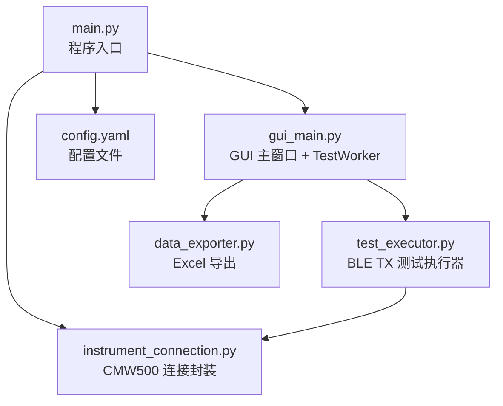
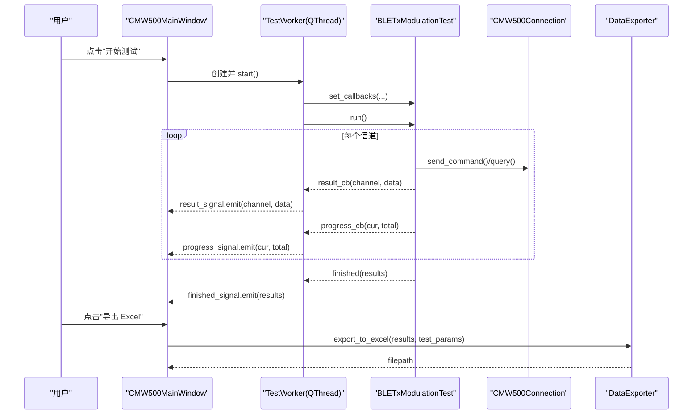
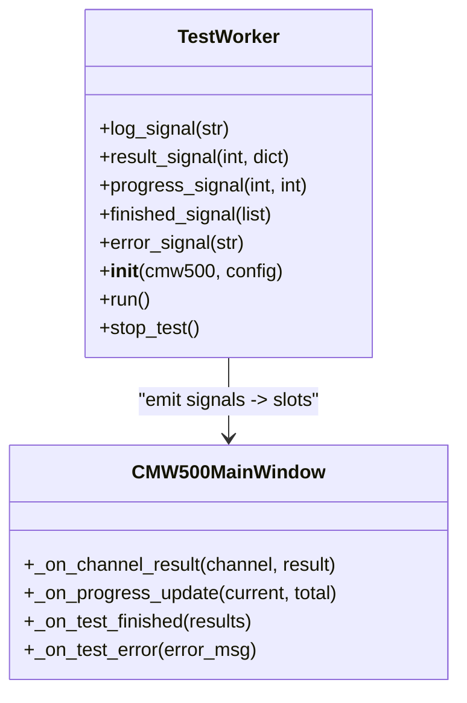
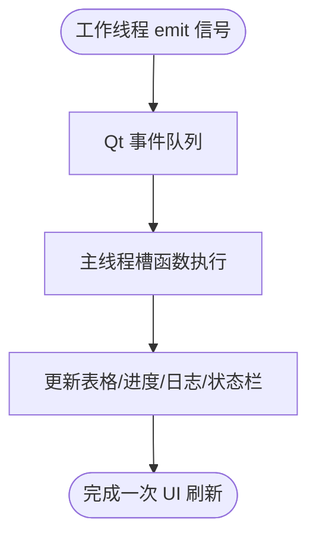
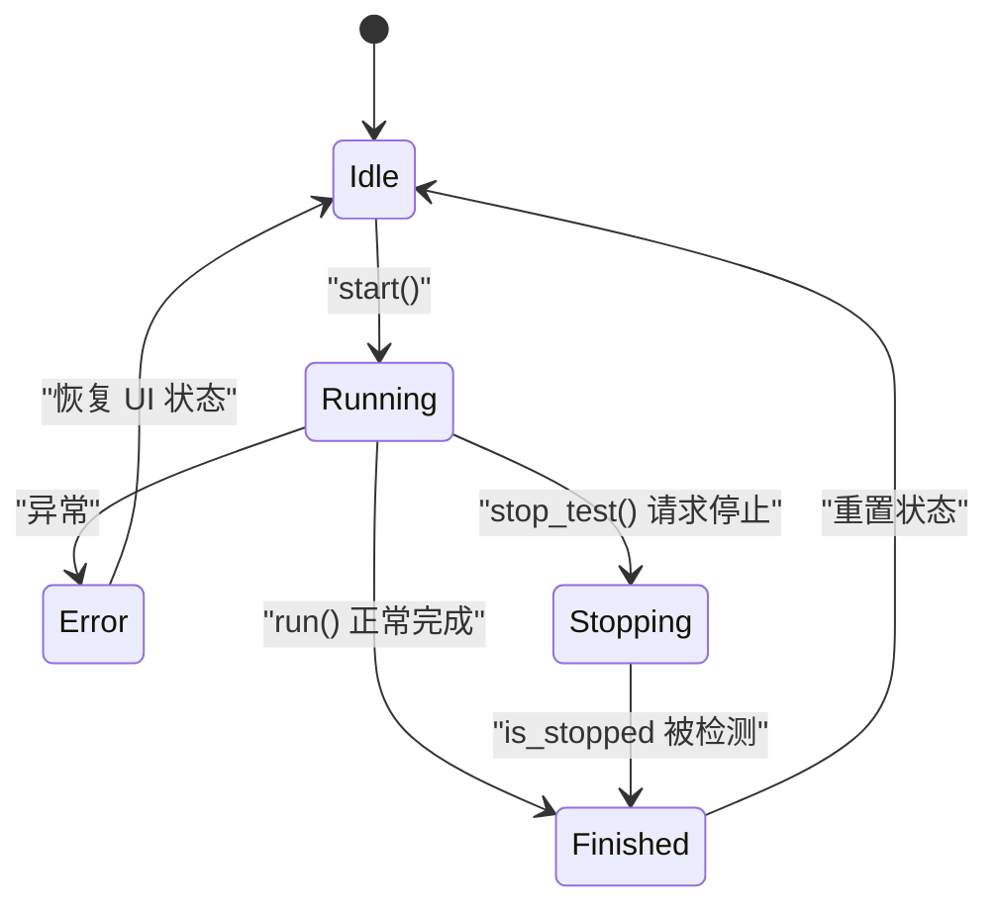
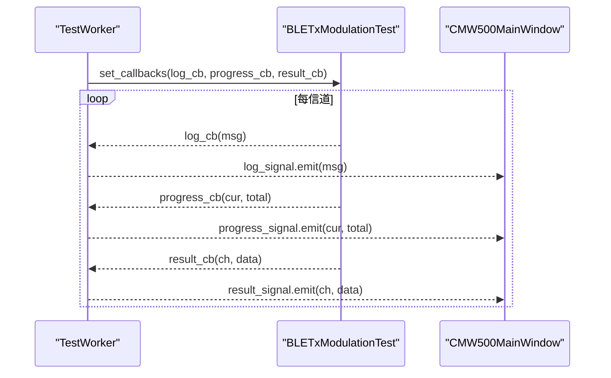
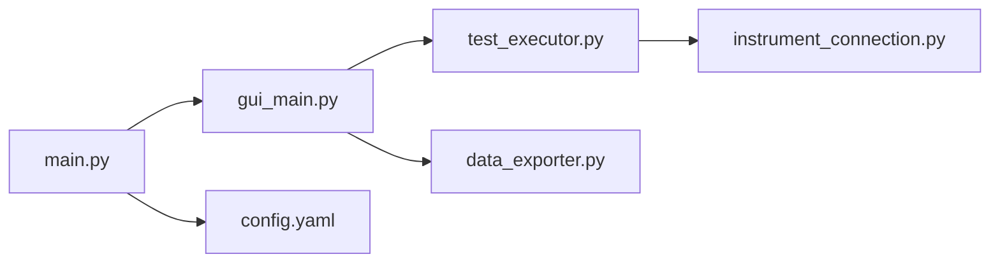

# 多线程编程模型

<cite>
**本文引用的文件**   
- [main.py](file://main.py)
- [gui_main.py](file://gui_main.py)
- [test_executor.py](file://test_executor.py)
- [instrument_connection.py](file://instrument_connection.py)
- [data_exporter.py](file://data_exporter.py)
- [config.yaml](file://config.yaml)
</cite>

## 目录
1. [简介](#简介)
2. [项目结构](#项目结构)
3. [核心组件](#核心组件)
4. [架构总览](#架构总览)
5. [详细组件分析](#详细组件分析)
6. [依赖关系分析](#依赖关系分析)
7. [性能与优化建议](#性能与优化建议)
8. [故障排查指南](#故障排查指南)
9. [结论](#结论)

## 简介
本指南围绕 PyQt6 的多线程编程模型，结合本项目中 BLE TX 调制自动化测试的实际实现，系统阐述以下主题：
- TestWorker QThread 类的设计与实现原理
- Qt 信号槽机制在跨线程通信中的应用（pyqtSignal 定义与使用）
- 线程安全的数据传递模式与状态同步策略
- 工作线程生命周期管理、异常处理与资源清理
- 测试执行器与 GUI 线程的解耦设计与回调机制
- 性能优化建议与常见多线程问题解决方案

## 项目结构
本项目采用“界面层 + 业务逻辑层 + 设备驱动层 + 数据导出层”的分层组织方式：
- main.py：程序入口，负责配置加载、命令行/图形界面选择、全局异常保护
- gui_main.py：PyQt6 主窗口与工作线程封装，包含 TestWorker 和 UI 事件处理
- test_executor.py：BLE TX 调制测试的业务执行器，负责仪器配置、逐信道测量、结果判定与回调
- instrument_connection.py：基于 PyVISA 的 CMW500 连接封装，支持 LAN/GPIB/USB
- data_exporter.py：将测试结果导出为 Excel，并生成摘要统计
- config.yaml：仪器连接参数、测试标准与限值、导出路径等配置

图表来源
- [main.py:295-336](file://main.py#L295-L336)
- [gui_main.py:75-124](file://gui_main.py#L75-L124)
- [test_executor.py:22-51](file://test_executor.py#L22-L51)
- [instrument_connection.py:18-54](file://instrument_connection.py#L18-L54)
- [data_exporter.py:23-62](file://data_exporter.py#L23-L62)
- [config.yaml:1-25](file://config.yaml#L1-L25)

章节来源
- [main.py:295-336](file://main.py#L295-L336)
- [gui_main.py:75-124](file://gui_main.py#L75-L124)
- [test_executor.py:22-51](file://test_executor.py#L22-L51)
- [instrument_connection.py:18-54](file://instrument_connection.py#L18-L54)
- [data_exporter.py:23-62](file://data_exporter.py#L23-L62)
- [config.yaml:1-25](file://config.yaml#L1-L25)

## 核心组件
- TestWorker（QThread）：在工作线程中运行测试执行器，通过 pyqtSignal 向主线程推送日志、进度、单信道结果、完成与错误信号。
- CMW500MainWindow（QMainWindow）：GUI 主窗口，负责用户交互、按钮事件、表格更新、进度条与日志显示；通过信号槽接收工作线程消息。
- BLETxModulationTest：测试执行器，负责仪器配置、逐信道测量、结果判定、回调触发与停止控制。
- CMW500Connection：仪器连接封装，统一接口类型（LAN/GPIB/USB），提供 connect/disconnect/send_command/query 等方法。
- DataExporter：将测试结果导出为 Excel，包含样式美化与摘要统计。

章节来源
- [gui_main.py:28-73](file://gui_main.py#L28-L73)
- [gui_main.py:75-124](file://gui_main.py#L75-L124)
- [test_executor.py:22-51](file://test_executor.py#L22-L51)
- [instrument_connection.py:18-54](file://instrument_connection.py#L18-L54)
- [data_exporter.py:23-62](file://data_exporter.py#L23-L62)

## 架构总览
下图展示了从 GUI 启动到测试执行、再到结果回传与导出的整体流程，以及各模块之间的调用关系。

图表来源
- [gui_main.py:499-528](file://gui_main.py#L499-L528)
- [gui_main.py:561-629](file://gui_main.py#L561-L629)
- [gui_main.py:537-555](file://gui_main.py#L537-L555)
- [test_executor.py:186-245](file://test_executor.py#L186-L245)
- [instrument_connection.py:192-215](file://instrument_connection.py#L192-L215)
- [data_exporter.py:81-139](file://data_exporter.py#L81-L139)

## 详细组件分析

### TestWorker QThread 类设计与实现
- 设计目标
  - 将耗时且阻塞的仪器操作移出 GUI 主线程，避免界面卡顿。
  - 通过 pyqtSignal 将工作线程中的日志、进度、结果、完成与错误信息安全地发送到主线程。
- 关键实现要点
  - 自定义信号：log_signal、result_signal、progress_signal、finished_signal、error_signal。
  - run() 方法中实例化测试执行器，绑定回调函数，执行测试并在完成后发送 finished_signal。
  - stop_test() 方法通过调用测试执行器的 stop() 请求中断当前测试。
- 线程安全
  - 所有 UI 更新均在主线程槽函数中进行，工作线程仅 emit 信号，不直接访问 GUI 对象。
  - 异常捕获后通过 error_signal 上报，由主线程统一弹窗与恢复状态。

图表来源
- [gui_main.py:28-73](file://gui_main.py#L28-L73)
- [gui_main.py:561-629](file://gui_main.py#L561-L629)

章节来源
- [gui_main.py:28-73](file://gui_main.py#L28-L73)
- [gui_main.py:499-528](file://gui_main.py#L499-L528)
- [gui_main.py:561-629](file://gui_main.py#L561-L629)

### Qt 信号槽机制在跨线程通信中的应用
- 信号定义
  - log_signal(str)：工作线程输出日志消息
  - result_signal(int, dict)：单个信道的测量结果
  - progress_signal(int, int)：进度（当前/总数）
  - finished_signal(list)：全部结果列表
  - error_signal(str)：异常信息
- 使用方式
  - 工作线程在 run() 中 emit 这些信号。
  - 主窗口在 _on_start_test() 中将信号连接到对应的槽函数，如 _append_log、_on_channel_result、_on_progress_update、_on_test_finished、_on_test_error。
- 线程安全保证
  - Qt 自动在不同线程间排队处理信号槽，确保 UI 更新在主线程执行，避免竞态条件。

图表来源
- [gui_main.py:35-40](file://gui_main.py#L35-L40)
- [gui_main.py:512-517](file://gui_main.py#L512-L517)
- [gui_main.py:561-629](file://gui_main.py#L561-L629)

章节来源
- [gui_main.py:35-40](file://gui_main.py#L35-L40)
- [gui_main.py:512-517](file://gui_main.py#L512-L517)
- [gui_main.py:561-629](file://gui_main.py#L561-L629)

### 线程安全的数据传递模式与状态同步策略
- 数据传递模式
  - 使用不可变或轻量级数据结构作为信号参数（int、str、dict），避免共享可变状态。
  - 单信道结果以字典形式传递，包含数值与判定结果，主线程只读使用。
- 状态同步策略
  - 工作线程维护 is_running 与 is_stopped 标志位，用于响应停止请求。
  - 主线程通过按钮状态与状态栏反馈测试状态，避免并发修改 UI。
- 注意事项
  - 不要在槽函数中执行耗时操作，以免阻塞主线程。
  - 如需持久化中间状态，应通过信号返回给主线程保存，而非共享内存变量。

章节来源
- [test_executor.py:40-51](file://test_executor.py#L40-L51)
- [test_executor.py:186-245](file://test_executor.py#L186-L245)
- [gui_main.py:561-629](file://gui_main.py#L561-L629)

### 工作线程的生命周期管理、异常处理与资源清理
- 生命周期
  - 创建：用户在 GUI 点击“开始测试”，主窗口创建 TestWorker 实例。
  - 启动：调用 start() 进入 run()，实例化测试执行器并设置回调。
  - 结束：run() 正常完成时 emit finished_signal；异常时 emit error_signal。
- 异常处理
  - 工作线程内部 try-except 捕获异常并通过 error_signal 上报。
  - 主线程在 _on_test_error 中记录日志、恢复按钮状态并弹出错误对话框。
- 资源清理
  - 测试执行器在 stop() 中设置 is_stopped 标志，循环检查以优雅退出。
  - 仪器连接在断开时关闭 VISA 资源，释放句柄。

图表来源
- [gui_main.py:499-528](file://gui_main.py#L499-L528)
- [gui_main.py:530-535](file://gui_main.py#L530-L535)
- [gui_main.py:621-629](file://gui_main.py#L621-L629)
- [test_executor.py:247-252](file://test_executor.py#L247-L252)
- [instrument_connection.py:134-159](file://instrument_connection.py#L134-L159)

章节来源
- [gui_main.py:499-528](file://gui_main.py#L499-L528)
- [gui_main.py:530-535](file://gui_main.py#L530-L535)
- [gui_main.py:621-629](file://gui_main.py#L621-L629)
- [test_executor.py:247-252](file://test_executor.py#L247-L252)
- [instrument_connection.py:134-159](file://instrument_connection.py#L134-L159)

### 测试执行器与 GUI 线程的解耦设计与回调机制
- 解耦设计
  - 测试执行器不依赖任何 GUI 组件，仅通过回调接口与上层通信。
  - GUI 通过 set_callbacks 注入回调函数，将工作线程的输出转发到 UI。
- 回调机制
  - log_cb：格式化时间戳并追加到日志窗口。
  - progress_cb：计算百分比并更新进度条与文本标签。
  - result_cb：插入新行到表格，填充数值与判定结果，自动滚动到底部。
- 优势
  - 可复用性高：同一执行器可用于 CLI 或 GUI。
  - 扩展性强：新增指标或导出格式只需调整回调与展示逻辑。

图表来源
- [gui_main.py:55-60](file://gui_main.py#L55-L60)
- [test_executor.py:52-75](file://test_executor.py#L52-L75)
- [test_executor.py:222-238](file://test_executor.py#L222-L238)
- [gui_main.py:561-600](file://gui_main.py#L561-L600)

章节来源
- [gui_main.py:55-60](file://gui_main.py#L55-L60)
- [test_executor.py:52-75](file://test_executor.py#L52-L75)
- [test_executor.py:222-238](file://test_executor.py#L222-L238)
- [gui_main.py:561-600](file://gui_main.py#L561-L600)

### 仪器连接与 SCPI 命令封装
- 接口类型
  - LAN：TCPIP0::<IP>::inst0::INSTR
  - GPIB：GPIB<board>::<address>::INSTR
  - USB：USB0::<VID>::<PID>::<serial>::INSTR
- 关键方法
  - connect()：建立连接并验证 *IDN?
  - disconnect()：关闭资源并重置状态
  - send_command()/query()：发送无返回值命令与查询命令
- 错误处理
  - 捕获 VisaIOError 并提供针对性提示（网络/地址/驱动）。
  - 未知异常统一返回失败与详细信息。

章节来源
- [instrument_connection.py:55-75](file://instrument_connection.py#L55-L75)
- [instrument_connection.py:85-132](file://instrument_connection.py#L85-L132)
- [instrument_connection.py:134-159](file://instrument_connection.py#L134-L159)
- [instrument_connection.py:192-215](file://instrument_connection.py#L192-L215)

### 数据导出与样式美化
- 功能
  - 生成带时间戳的文件名，写入“测试数据”与“测试摘要”两个 Sheet。
  - 对 PASS/FAIL 单元格着色，表头加粗居中，自动列宽。
- 配置
  - 输出目录支持相对路径（基于程序根目录），兼容打包后的 exe。
  - 文件名前缀与输出目录来自 config.yaml。

章节来源
- [data_exporter.py:41-79](file://data_exporter.py#L41-L79)
- [data_exporter.py:81-139](file://data_exporter.py#L81-L139)
- [data_exporter.py:204-283](file://data_exporter.py#L204-L283)
- [config.yaml:74-79](file://config.yaml#L74-L79)

## 依赖关系分析
- 模块耦合
  - main.py 仅负责入口与配置加载，低耦合。
  - gui_main.py 依赖 test_executor.py 与 instrument_connection.py，通过信号槽解耦。
  - test_executor.py 依赖 instrument_connection.py 进行仪器通信。
  - data_exporter.py 独立于 GUI 与工作线程，仅消费测试结果。
- 外部依赖
  - PyQt6：GUI 框架与线程/信号机制。
  - PyVISA：仪器通信。
  - pandas/openpyxl：Excel 导出与样式。

图表来源
- [main.py:295-336](file://main.py#L295-L336)
- [gui_main.py:75-124](file://gui_main.py#L75-L124)
- [test_executor.py:22-51](file://test_executor.py#L22-L51)
- [instrument_connection.py:18-54](file://instrument_connection.py#L18-L54)
- [data_exporter.py:23-62](file://data_exporter.py#L23-L62)
- [config.yaml:1-25](file://config.yaml#L1-L25)

章节来源
- [main.py:295-336](file://main.py#L295-L336)
- [gui_main.py:75-124](file://gui_main.py#L75-L124)
- [test_executor.py:22-51](file://test_executor.py#L22-L51)
- [instrument_connection.py:18-54](file://instrument_connection.py#L18-L54)
- [data_exporter.py:23-62](file://data_exporter.py#L23-L62)
- [config.yaml:1-25](file://config.yaml#L1-L25)

## 性能与优化建议
- 减少 UI 重绘开销
  - 批量更新表格：若单次结果较多，考虑累积若干行后再一次性插入，降低 insertRow 频率。
  - 禁用交替行颜色与复杂样式在大量数据时的渲染压力。
- 合理设置超时与重试
  - 根据仪器响应特性调整 timeout，避免频繁超时导致整体耗时增加。
- 异步 I/O 与缓冲
  - 对于高频日志，可在工作线程内做简单缓冲，按固定间隔或阈值批量 emit，减轻主线程负担。
- 避免在主线程执行耗时操作
  - 导出 Excel 虽在当前实现位于主线程，但通常较快；若未来导出更复杂，建议移至后台线程并通过信号通知完成。
- 资源复用
  - 仪器连接对象可复用，避免重复创建与销毁带来的开销。

[本节为通用指导，无需具体文件引用]

## 故障排查指南
- 连接失败
  - 现象：无法与仪器通信，提示网络/地址/驱动问题。
  - 排查：确认 IP/板号/地址/VID/PID/序列号是否正确；检查线缆与驱动；查看异常详情。
- 测试中途停止
  - 现象：点击“停止测试”后未立即退出。
  - 说明：停止为软中断，需等待当前信道测量完成；检查 is_stopped 标志是否生效。
- 导出失败
  - 现象：导出 Excel 报错。
  - 排查：检查输出目录权限与路径；确认 openpyxl 可用；查看异常堆栈。
- 界面卡死
  - 现象：测试期间界面无响应。
  - 排查：确认耗时操作在工作线程执行；避免在槽函数中执行长时间任务。

章节来源
- [instrument_connection.py:112-132](file://instrument_connection.py#L112-L132)
- [instrument_connection.py:134-159](file://instrument_connection.py#L134-L159)
- [test_executor.py:247-252](file://test_executor.py#L247-L252)
- [data_exporter.py:81-139](file://data_exporter.py#L81-L139)
- [gui_main.py:621-629](file://gui_main.py#L621-L629)

## 结论
本项目通过 TestWorker QThread 与 Qt 信号槽机制实现了 GUI 与测试执行的完全解耦，保证了界面的流畅性与系统的可维护性。测试执行器以回调方式与上层通信，具备良好的扩展性与复用性。配合完善的异常处理与资源清理策略，系统在真实仪器环境中具备较高的稳定性。针对大规模数据与复杂导出场景，可进一步优化 UI 更新与导出流程，进一步提升用户体验与系统性能。