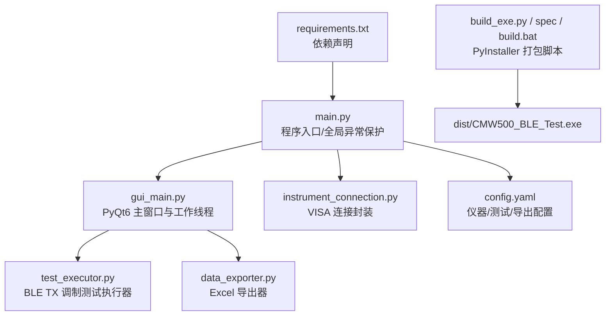
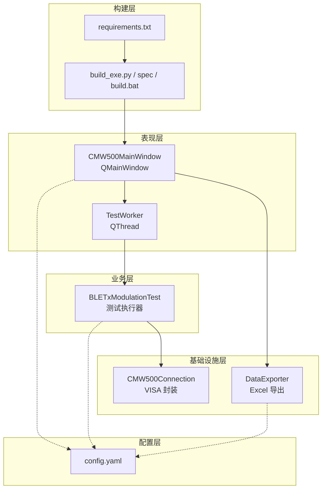
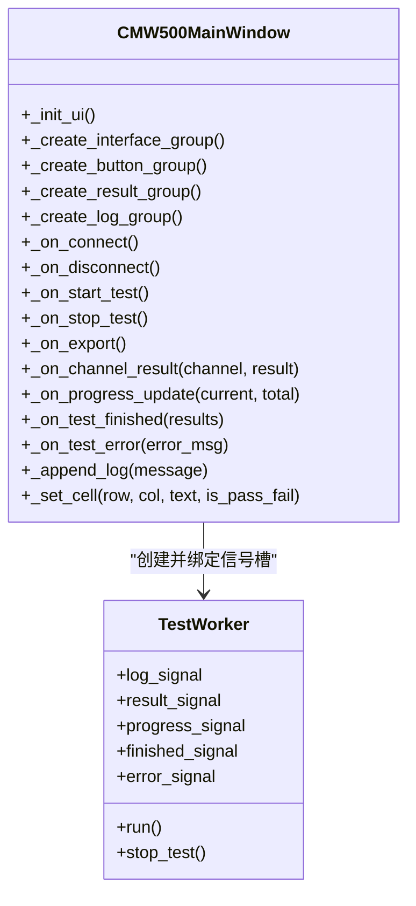
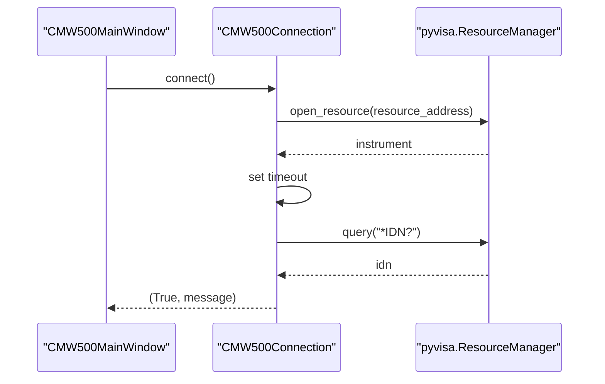
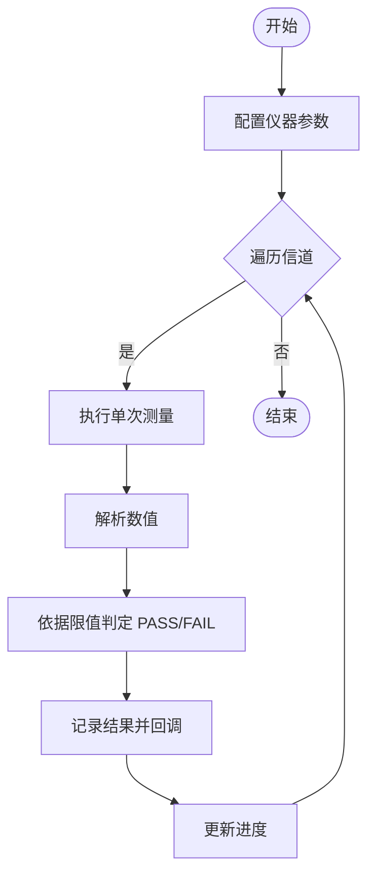
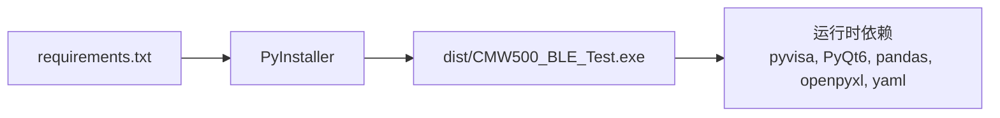

# 开发者指南

<cite>
**本文引用的文件列表**
- [main.py](file://main.py)
- [gui_main.py](file://gui_main.py)
- [instrument_connection.py](file://instrument_connection.py)
- [test_executor.py](file://test_executor.py)
- [data_exporter.py](file://data_exporter.py)
- [config.yaml](file://config.yaml)
- [build_exe.py](file://build_exe.py)
- [CMW500_BLE_Test.spec](file://CMW500_BLE_Test.spec)
- [build.bat](file://build.bat)
- [requirements.txt](file://requirements.txt)
</cite>

## 目录
1. [简介](#简介)
2. [项目结构](#项目结构)
3. [核心组件](#核心组件)
4. [架构总览](#架构总览)
5. [详细组件分析](#详细组件分析)
6. [依赖关系分析](#依赖关系分析)
7. [性能与线程安全](#性能与线程安全)
8. [打包与分发](#打包与分发)
9. [新功能开发流程](#新功能开发流程)
10. [代码审查清单](#代码审查清单)
11. [单元测试编写指南](#单元测试编写指南)
12. [持续集成配置建议](#持续集成配置建议)
13. [调试技巧与性能分析](#调试技巧与性能分析)
14. [扩展点与插件机制](#扩展点与插件机制)
15. [故障排查指南](#故障排查指南)
16. [结论](#结论)

## 简介
本项目为 R&S CMW500 无线通信测试仪的 BLE TX 调制自动化测试工具，提供图形界面与命令行两种运行模式。核心能力包括：
- 通过 LAN/GPIB/USB 三种接口连接仪器并执行 BLE TX 调制测量
- 逐信道扫描、指标判定、实时结果展示与日志输出
- 测试结果导出为格式化 Excel（含“测试数据”和“测试摘要”两个 Sheet）
- 支持 PyInstaller 打包为 Windows 可执行程序，便于离线分发

本指南面向开发者，涵盖架构设计原则、模块划分策略、PyQt6 开发模式与线程安全、信号槽机制、新功能开发流程、打包与跨平台构建、代码审查、单元测试、CI 建议、调试与性能分析方法，以及扩展点与插件化思路。

## 项目结构
项目采用扁平化组织，按职责将入口、GUI、仪器连接、测试执行、数据导出、配置与构建脚本分离，便于独立维护与替换。

图表来源
- [main.py:295-336](file://main.py#L295-L336)
- [gui_main.py:75-124](file://gui_main.py#L75-L124)
- [instrument_connection.py:18-54](file://instrument_connection.py#L18-L54)
- [test_executor.py:22-51](file://test_executor.py#L22-L51)
- [data_exporter.py:23-62](file://data_exporter.py#L23-L62)
- [config.yaml:1-79](file://config.yaml#L1-L79)
- [build_exe.py:21-86](file://build_exe.py#L21-L86)
- [requirements.txt:1-12](file://requirements.txt#L1-L12)

章节来源
- [main.py:1-357](file://main.py#L1-L357)
- [gui_main.py:1-667](file://gui_main.py#L1-L667)
- [instrument_connection.py:1-216](file://instrument_connection.py#L1-L216)
- [test_executor.py:1-261](file://test_executor.py#L1-L261)
- [data_exporter.py:1-283](file://data_exporter.py#L1-L283)
- [config.yaml:1-79](file://config.yaml#L1-L79)
- [build_exe.py:1-87](file://build_exe.py#L1-L87)
- [CMW500_BLE_Test.spec:1-45](file://CMW500_BLE_Test.spec#L1-L45)
- [build.bat:1-106](file://build.bat#L1-L106)
- [requirements.txt:1-12](file://requirements.txt#L1-L12)

## 核心组件
- 程序入口与启动流程：负责加载配置、初始化连接对象、选择 GUI/CLI 模式、全局异常兜底。
- PyQt6 主窗口：包含接口配置区、操作按钮、结果表格、进度条、日志窗口；使用 QThread + pyqtSignal 实现线程安全更新。
- 仪器连接管理：基于 pyvisa 统一封装 LAN/GPIB/USB 资源地址构造、连接/断开、查询命令。
- 测试执行器：编排 SCPI 指令序列，遍历信道范围，采集指标并判定 PASS/FAIL，支持回调推送日志/进度/结果。
- 数据导出器：使用 pandas + openpyxl 生成带样式的 Excel，包含明细与摘要两页。
- 配置文件：集中管理仪器参数、测试标准与限值、导出路径等。
- 构建脚本：PyInstaller 打包配置与一键构建批处理。

章节来源
- [main.py:295-336](file://main.py#L295-L336)
- [gui_main.py:75-124](file://gui_main.py#L75-L124)
- [instrument_connection.py:18-54](file://instrument_connection.py#L18-L54)
- [test_executor.py:22-51](file://test_executor.py#L22-L51)
- [data_exporter.py:23-62](file://data_exporter.py#L23-L62)
- [config.yaml:1-79](file://config.yaml#L1-L79)

## 架构总览
系统采用分层与模块化设计：
- 表现层：PyQt6 主窗口与交互逻辑
- 业务层：测试执行器（编排仪器指令、指标计算与判定）
- 基础设施层：仪器连接封装（VISA）、数据导出（pandas/openpyxl）
- 配置层：YAML 配置驱动行为
- 构建层：PyInstaller 打包与分发

图表来源
- [gui_main.py:75-124](file://gui_main.py#L75-L124)
- [gui_main.py:28-73](file://gui_main.py#L28-L73)
- [test_executor.py:22-51](file://test_executor.py#L22-L51)
- [instrument_connection.py:18-54](file://instrument_connection.py#L18-L54)
- [data_exporter.py:23-62](file://data_exporter.py#L23-L62)
- [config.yaml:1-79](file://config.yaml#L1-L79)
- [requirements.txt:1-12](file://requirements.txt#L1-L12)
- [build_exe.py:21-86](file://build_exe.py#L21-L86)

## 详细组件分析

### 程序入口 main.py
- 职责
  - 获取应用目录（兼容 PyInstaller 打包后路径）
  - 加载 YAML 配置并进行兼容性补全
  - 创建仪器连接实例（不立即连接）
  - 根据命令行参数选择 CLI 或 GUI 模式
  - 全局异常捕获与错误弹窗/日志兜底
- 关键流程
  - 启动时读取 APP_DIR，加载 config.yaml，规范化 instrument 字段
  - 延迟导入 instrument_connection 避免顶层失败导致闪退
  - run_gui 中创建 QApplication、设置 Fusion 主题、显示主窗口
  - run_cli 提供交互式命令循环，调用测试执行器与导出器
- 错误处理
  - show_error_dialog 优先尝试 PyQt6，回退到 tkinter，最后写入 error_log.txt
  - 顶层 try/except 捕获所有异常，弹出友好提示并退出

章节来源
- [main.py:20-36](file://main.py#L20-L36)
- [main.py:85-115](file://main.py#L85-L115)
- [main.py:117-220](file://main.py#L117-L220)
- [main.py:222-243](file://main.py#L222-L243)
- [main.py:245-293](file://main.py#L245-L293)
- [main.py:295-357](file://main.py#L295-L357)

### 图形界面 gui_main.py
- 职责
  - 构建主窗口布局：接口配置区、操作面板、结果表格、进度条、日志窗口
  - 工作线程 TestWorker 在独立线程执行测试，通过 pyqtSignal 向主线程推送日志、进度、结果与完成事件
  - 按钮事件处理：连接/断开、开始/停止测试、导出 Excel
  - 表格渲染：逐行插入结果，PASS/FAIL/ERROR 着色
- 线程安全与信号槽
  - TestWorker 定义 log_signal、result_signal、progress_signal、finished_signal、error_signal
  - 主窗口在 _on_start_test 中将信号连接到槽函数，确保 UI 在主线程更新
  - stop_test 通过回调通知测试执行器停止
- 界面交互要点
  - 接口类型切换使用 QStackedWidget 动态显示不同参数输入控件
  - 连接成功后禁用接口输入，防止误改；断开后恢复
  - 状态栏与标签实时更新连接状态与进度信息

图表来源
- [gui_main.py:75-124](file://gui_main.py#L75-L124)
- [gui_main.py:28-73](file://gui_main.py#L28-L73)
- [gui_main.py:438-556](file://gui_main.py#L438-L556)
- [gui_main.py:561-666](file://gui_main.py#L561-L666)

章节来源
- [gui_main.py:1-667](file://gui_main.py#L1-L667)

### 仪器连接 instrument_connection.py
- 职责
  - 封装 VISA 资源管理器与仪器连接生命周期
  - 根据 interface_type 自动构造资源地址（LAN/GPIB/USB）
  - 提供 connect/disconnect/query/send_command/get_serial_number 等方法
- 关键点
  - 连接成功会发送 *IDN? 验证链路有效性
  - 错误分类：VisaIOError 与其他异常，返回友好的提示信息
  - USB 模式下序列号留空时使用通配符自动匹配首个设备

图表来源
- [instrument_connection.py:85-133](file://instrument_connection.py#L85-L133)
- [instrument_connection.py:55-75](file://instrument_connection.py#L55-L75)

章节来源
- [instrument_connection.py:1-216](file://instrument_connection.py#L1-L216)

### 测试执行器 test_executor.py
- 职责
  - 编排 BLE TX 调制测试流程：复位仪器、选择测量类型、设置 PHY/统计次数/数据包类型
  - 遍历信道范围，逐项测量频率准确度/漂移/偏移/初始漂移/最大漂移速率
  - 依据配置中的上下限进行 PASS/FAIL 判定
  - 通过回调推送日志、进度与单信道结果
- 算法流程
  - 配置仪器 → 循环信道 → 单次测量 → 解析结果 → 判定 → 记录与回调 → 进度更新
  - 支持用户中断（is_stopped 标志位）

图表来源
- [test_executor.py:76-104](file://test_executor.py#L76-L104)
- [test_executor.py:105-184](file://test_executor.py#L105-L184)
- [test_executor.py:186-245](file://test_executor.py#L186-L245)

章节来源
- [test_executor.py:1-261](file://test_executor.py#L1-L261)

### 数据导出 data_exporter.py
- 职责
  - 将测试结果导出为 Excel，包含“测试数据”与“测试摘要”两个 Sheet
  - 自动生成文件名（前缀+时间戳），确保输出目录存在
  - 对表头、数据区域、判定列进行样式美化与列宽自适应
- 关键流程
  - 构建 DataFrame → 写入 Excel → 加载 workbook 应用样式 → 保存

章节来源
- [data_exporter.py:1-283](file://data_exporter.py#L1-L283)

### 配置文件 config.yaml
- 内容结构
  - instrument：默认接口类型与各接口参数、超时
  - test_params：测试标准、PHY、突发类型、数据包类型、统计次数、信道范围、各项指标名称/单位/上限/下限
  - export：输出目录与文件名前缀
- 作用
  - 驱动 GUI 默认值、测试执行器行为、导出器路径与命名

章节来源
- [config.yaml:1-79](file://config.yaml#L1-L79)

## 依赖关系分析
- 运行时依赖
  - pyvisa/pyvisa-py：仪器通信后端
  - pyusb/pyserial：底层 USB/串口支持（pyvisa-py 依赖）
  - PyQt6：图形界面
  - pandas/openpyxl：Excel 读写与样式
  - PyYAML：配置文件解析
  - matplotlib：可选可视化（当前未直接使用）
  - pyinstaller：打包工具
- 构建期依赖
  - PyInstaller 通过 build_exe.py/spec/build.bat 收集隐藏导入与数据文件，生成 dist/CMW500_BLE_Test 目录与 exe

图表来源
- [requirements.txt:1-12](file://requirements.txt#L1-L12)
- [build_exe.py:21-86](file://build_exe.py#L21-L86)
- [build.bat:76-84](file://build.bat#L76-L84)

章节来源
- [requirements.txt:1-12](file://requirements.txt#L1-L12)
- [build_exe.py:1-87](file://build_exe.py#L1-L87)
- [build.bat:1-106](file://build.bat#L1-L106)

## 性能与线程安全
- 线程模型
  - 测试执行在 TestWorker(QThread) 中进行，避免阻塞 GUI 主线程
  - 通过 pyqtSignal 将日志、进度、结果与完成事件发送到主线程槽函数，保证线程安全
- 界面响应
  - 表格逐行插入与滚动、进度条实时更新，提升用户体验
  - 连接/断开期间禁用相关控件，防止并发修改
- 潜在优化点
  - 大量结果写入表格时可考虑批量更新或使用自定义模型以提升性能
  - 导出 Excel 时若数据量较大，可考虑分块写入或异步导出

章节来源
- [gui_main.py:28-73](file://gui_main.py#L28-L73)
- [gui_main.py:499-556](file://gui_main.py#L499-L556)
- [gui_main.py:561-666](file://gui_main.py#L561-L666)

## 打包与分发
- 打包方式
  - 推荐使用 build.bat 一键构建，自动安装依赖、清理旧构建、执行 PyInstaller 并复制配置文件至输出目录
  - 也可使用 build_exe.py 或 CMW500_BLE_Test.spec 直接调用 PyInstaller
- 关键配置
  - hiddenimports 包含 pyvisa_py 及其协议子模块、usb、serial 等
  - datas 将 config.yaml 打包到 exe 根目录
  - console=False 生成纯 GUI 无控制台窗口
- 跨平台说明
  - 当前脚本与 spec 针对 Windows 环境；macOS/Linux 需调整路径分隔符与打包参数
  - 如需多平台分发，建议为各平台准备独立构建脚本与 spec

章节来源
- [build.bat:60-106](file://build.bat#L60-L106)
- [build_exe.py:21-86](file://build_exe.py#L21-L86)
- [CMW500_BLE_Test.spec:1-45](file://CMW500_BLE_Test.spec#L1-L45)

## 新功能开发流程
- 需求分析
  - 明确新增功能的目标、边界条件与影响范围（如新增测量项、新导出格式、新接口类型）
- 设计文档
  - 绘制流程图/时序图，定义输入输出、异常分支与用户交互
  - 评估是否需要新增线程或信号槽
- 编码规范
  - 遵循现有模块职责划分，新增类/方法保持高内聚低耦合
  - 使用配置驱动（config.yaml）控制行为，避免硬编码
  - 增加必要的日志与错误提示，保证可观测性
- 测试验证
  - 编写单元测试覆盖核心逻辑（见下一节）
  - 在 GUI/CLI 下进行端到端验证，确认线程安全与 UI 响应
- 提交与评审
  - 附带变更说明与截图/日志片段，遵循代码审查清单

[本节为通用流程指导，无需源码引用]

## 代码审查清单
- 架构与设计
  - 是否遵循分层与模块化？新增代码是否破坏现有依赖？
  - 是否引入不必要的耦合或循环依赖？
- 线程与并发
  - 是否在独立线程执行耗时任务？是否正确使用 pyqtSignal 更新 UI？
  - 是否存在共享状态竞态风险？
- 错误处理
  - 是否对网络/设备/IO 异常进行分类处理？
  - 是否有兜底日志与用户提示？
- 配置与可维护性
  - 是否通过 config.yaml 驱动行为？是否做了兼容性处理？
- 性能
  - 是否存在频繁 UI 更新导致的卡顿？是否可批量处理？
- 打包与分发
  - 是否更新 hiddenimports/datas？是否在不同平台验证？
- 文档与注释
  - 是否补充了必要的注释与使用说明？

[本节为通用检查项，无需源码引用]

## 单元测试编写指南
- 目标
  - 覆盖仪器连接封装、测试执行器判定逻辑、导出器样式与数据结构
- 建议用例
  - 仪器连接
    - 构造不同接口地址字符串的正确性
    - 连接失败时的错误信息与状态重置
  - 测试执行器
    - 单项指标判定（上限/下限/绝对值）
    - 停止标志位生效
    - 回调触发顺序与数据完整性
  - 数据导出
    - 生成文件路径与目录创建
    - 判定列样式与摘要统计正确性
- 模拟与隔离
  - 使用 mock 替代真实 VISA 连接与文件系统 IO
  - 注入配置字典以覆盖不同场景
- 运行与报告
  - 使用 pytest 或 unittest 框架，生成覆盖率报告

[本节为通用测试指导，无需源码引用]

## 持续集成配置建议
- 触发条件
  - 代码提交/合并请求时自动构建与测试
- 步骤
  - 安装 Python 与依赖（pip install -r requirements.txt）
  - 运行单元测试与覆盖率收集
  - 执行 PyInstaller 构建（Windows 环境）
  - 上传构建产物与测试报告
- 缓存与加速
  - 缓存 pip 包与 PyInstaller 构建缓存
- 多平台矩阵
  - 并行构建 Windows/macOS/Linux（注意平台差异与依赖）

[本节为通用 CI 建议，无需源码引用]

## 调试技巧与性能分析
- 调试技巧
  - 使用命令行模式快速定位问题：python main.py --cli
  - 查看 GUI 日志窗口与状态栏消息
  - 全局异常兜底会在错误弹窗中给出堆栈与目录信息
- 性能分析
  - 使用 cProfile 对测试执行器热点函数进行分析
  - 监控 UI 更新频率，必要时减少逐行更新或改用批量更新
  - 导出 Excel 时关注 openpyxl 样式应用开销，必要时简化样式

章节来源
- [main.py:117-220](file://main.py#L117-L220)
- [main.py:295-357](file://main.py#L295-L357)
- [gui_main.py:561-666](file://gui_main.py#L561-L666)

## 扩展点与插件机制
- 可扩展点
  - 仪器接口：在 instrument_connection.py 中新增接口类型与资源地址构造逻辑
  - 测试项目：在 test_executor.py 中扩展新的测量项与判定规则，并在 config.yaml 中声明
  - 导出格式：在 data_exporter.py 中新增导出目标（CSV/PDF/HTML）与样式
  - 界面模块：在 gui_main.py 中新增页面或控件，并通过信号槽与业务层交互
- 插件化思路
  - 定义统一的插件接口（如 IInstrumentBackend、ITestSuite、IExporter）
  - 使用配置注册插件类名，运行时动态导入与实例化
  - 通过回调/信号机制解耦 UI 与业务逻辑

[本节为概念性扩展设计，无需源码引用]

## 故障排查指南
- 无法连接仪器
  - 检查接口类型与参数（LAN IP、GPIB Board/Address、USB VID/PID/SN）
  - 确认网络连接或 GPIB/USB 线缆与驱动
  - 查看错误弹窗或日志中的详细信息
- 测试执行异常
  - 检查 SCPI 指令是否与固件版本匹配
  - 观察日志中 Channel 级错误信息，定位具体信道
- 导出失败
  - 确认输出目录权限与路径存在
  - 检查 openpyxl 与 pandas 版本兼容性
- 打包后运行问题
  - 确认 config.yaml 位于 exe 同目录
  - 检查 hiddenimports 是否包含必要模块
  - 首次运行可能需要几分钟，等待构建完成

章节来源
- [instrument_connection.py:85-133](file://instrument_connection.py#L85-L133)
- [test_executor.py:186-245](file://test_executor.py#L186-L245)
- [data_exporter.py:63-79](file://data_exporter.py#L63-L79)
- [build.bat:76-106](file://build.bat#L76-L106)

## 结论
本项目以清晰的模块化与分层架构实现了 BLE TX 调制自动化测试的全流程，结合 PyQt6 的线程安全设计与信号槽机制，提供了良好的用户体验与可维护性。通过配置驱动与 PyInstaller 打包，便于跨环境部署与分发。建议在后续迭代中完善插件化机制、增强测试覆盖与 CI 流水线，进一步提升系统的可扩展性与稳定性。