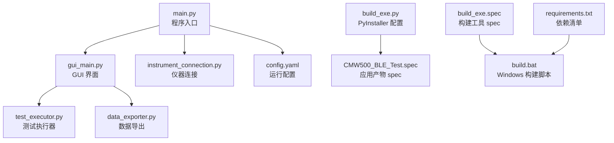
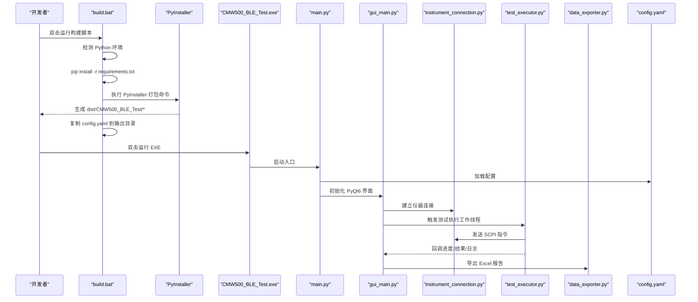
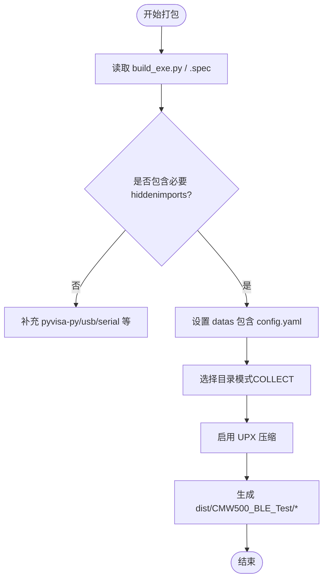
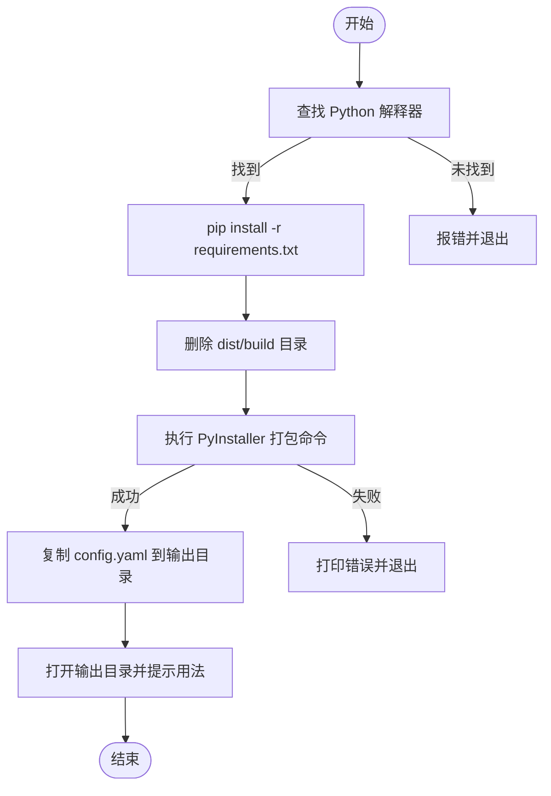
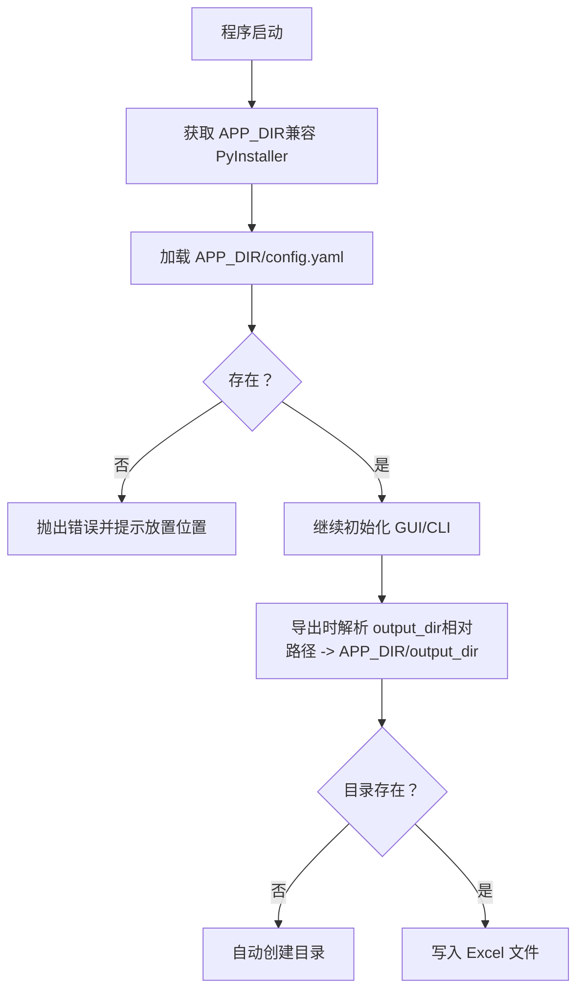
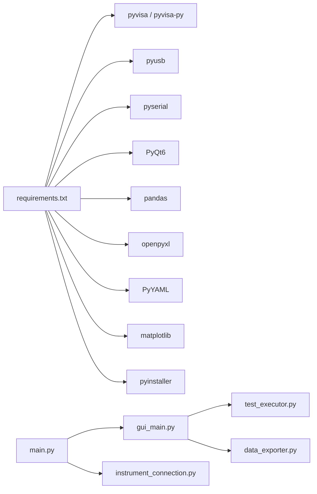

# 构建与部署

<cite>
**本文引用的文件**   
- [build_exe.py](file://build_exe.py)
- [CMW500_BLE_Test.spec](file://CMW500_BLE_Test.spec)
- [build_exe.spec](file://build_exe.spec)
- [build.bat](file://build.bat)
- [config.yaml](file://config.yaml)
- [requirements.txt](file://requirements.txt)
- [main.py](file://main.py)
- [gui_main.py](file://gui_main.py)
- [instrument_connection.py](file://instrument_connection.py)
- [data_exporter.py](file://data_exporter.py)
- [test_executor.py](file://test_executor.py)
</cite>

## 目录
1. [简介](#简介)
2. [项目结构](#项目结构)
3. [核心组件](#核心组件)
4. [架构总览](#架构总览)
5. [详细组件分析](#详细组件分析)
6. [依赖分析](#依赖分析)
7. [性能考虑](#性能考虑)
8. [故障排除指南](#故障排除指南)
9. [结论](#结论)
10. [附录](#附录)

## 简介
本指南面向 CMW500 BLE TX 调制自动化测试工具的构建与部署，覆盖以下主题：
- PyInstaller 打包配置（含 build_exe.py 与 .spec 参数说明）
- 跨平台构建策略（Windows、macOS、Linux）
- 自动化构建流程（依赖管理、资源文件打包）
- 版本控制与发布流程（版本号管理、变更日志维护）
- 安装包制作、数字签名与安全分发最佳实践
- 故障排除与常见问题解决方案

## 项目结构
仓库采用“功能模块 + 构建脚本”的扁平组织方式。关键文件职责如下：
- main.py：程序入口，负责加载配置、选择 GUI/CLI 模式、全局异常保护
- gui_main.py：PyQt6 图形界面，包含线程化测试执行与结果展示
- instrument_connection.py：仪器连接封装（LAN/GPIB/USB），基于 pyvisa
- test_executor.py：BLE TX 调制测试执行逻辑
- data_exporter.py：测试结果导出为 Excel（pandas + openpyxl）
- config.yaml：运行时配置（接口、测试参数、导出路径等）
- requirements.txt：Python 依赖清单
- build_exe.py：PyInstaller 打包主配置（Analysis/PYZ/EXE/COLLECT）
- CMW500_BLE_Test.spec：应用可执行产物 spec
- build_exe.spec：构建工具自身 spec
- build.bat：Windows 一键构建脚本（安装依赖、清理、打包、复制配置文件）

图表来源
- [main.py:1-357](file://main.py#L1-L357)
- [gui_main.py:1-667](file://gui_main.py#L1-L667)
- [instrument_connection.py:1-216](file://instrument_connection.py#L1-L216)
- [test_executor.py:1-261](file://test_executor.py#L1-L261)
- [data_exporter.py:1-283](file://data_exporter.py#L1-L283)
- [config.yaml:1-79](file://config.yaml#L1-L79)
- [build_exe.py:1-87](file://build_exe.py#L1-L87)
- [CMW500_BLE_Test.spec:1-45](file://CMW500_BLE_Test.spec#L1-L45)
- [build_exe.spec:1-45](file://build_exe.spec#L1-L45)
- [build.bat:1-106](file://build.bat#L1-L106)
- [requirements.txt:1-12](file://requirements.txt#L1-L12)

章节来源
- [main.py:1-357](file://main.py#L1-L357)
- [build.bat:1-106](file://build.bat#L1-L106)
- [requirements.txt:1-12](file://requirements.txt#L1-L12)

## 核心组件
- 打包配置
  - build_exe.py：定义 Analysis/PYZ/EXE/COLLECT，指定入口 main.py、隐藏导入、数据文件（config.yaml）、UPX 压缩、窗口模式等
  - CMW500_BLE_Test.spec：应用产物 spec，补充 pyvisa-py 相关 hiddenimports
  - build_exe.spec：构建工具自身 spec（console=True）
- 构建脚本
  - build.bat：自动检测 Python、安装依赖、清理 dist/build、调用 PyInstaller 打包、复制配置文件到输出目录并打开文件夹
- 运行时配置
  - config.yaml：仪器接口、测试参数、导出目录与文件名前缀
- 依赖清单
  - requirements.txt：pyvisa、pyvisa-py、pyusb、pyserial、PyQt6、pandas、openpyxl、PyYAML、matplotlib、pyinstaller

章节来源
- [build_exe.py:1-87](file://build_exe.py#L1-L87)
- [CMW500_BLE_Test.spec:1-45](file://CMW500_BLE_Test.spec#L1-L45)
- [build_exe.spec:1-45](file://build_exe.spec#L1-L45)
- [build.bat:1-106](file://build.bat#L1-L106)
- [config.yaml:1-79](file://config.yaml#L1-L79)
- [requirements.txt:1-12](file://requirements.txt#L1-L12)

## 架构总览
下图展示了从构建到运行的整体流程，包括 PyInstaller 打包阶段与运行时启动阶段的关键交互。

图表来源
- [build.bat:1-106](file://build.bat#L1-L106)
- [build_exe.py:1-87](file://build_exe.py#L1-L87)
- [main.py:1-357](file://main.py#L1-L357)
- [gui_main.py:1-667](file://gui_main.py#L1-L667)
- [instrument_connection.py:1-216](file://instrument_connection.py#L1-L216)
- [test_executor.py:1-261](file://test_executor.py#L1-L261)
- [data_exporter.py:1-283](file://data_exporter.py#L1-L283)
- [config.yaml:1-79](file://config.yaml#L1-L79)

## 详细组件分析

### PyInstaller 打包配置详解
- build_exe.py
  - 入口：main.py
  - 数据文件：将 config.yaml 打包至 exe 根目录
  - 隐藏导入：pyvisa、PyQt6 及其子模块、pandas、openpyxl、yaml、matplotlib
  - 产物模式：目录模式（exclude_binaries=True），使用 COLLECT 收集二进制与数据
  - UPX：启用压缩以减小体积
  - 控制台：False（GUI 应用无控制台窗口）
- CMW500_BLE_Test.spec
  - 在 Analysis.hiddenimports 中补充 pyvisa-py 协议栈与底层 usb/serial 模块，确保纯 Python 后端可用
- build_exe.spec
  - 用于将构建工具本身打包为 console 模式的独立工具（便于二次封装或 CI 集成）

图表来源
- [build_exe.py:1-87](file://build_exe.py#L1-L87)
- [CMW500_BLE_Test.spec:1-45](file://CMW500_BLE_Test.spec#L1-L45)
- [build_exe.spec:1-45](file://build_exe.spec#L1-L45)

章节来源
- [build_exe.py:1-87](file://build_exe.py#L1-L87)
- [CMW500_BLE_Test.spec:1-45](file://CMW500_BLE_Test.spec#L1-L45)
- [build_exe.spec:1-45](file://build_exe.spec#L1-L45)

### 自动化构建流程（Windows）
- build.bat 主要步骤
  - 检测 Python（支持 python/py/python3 及常见安装路径）
  - 安装依赖：pip install -r requirements.txt
  - 清理旧构建：删除 dist 与 build 目录
  - 执行 PyInstaller：传入 --windowed、--name、--add-data、--hidden-import 等参数
  - 复制配置文件：将 config.yaml 复制到输出目录
  - 打开输出目录并提示使用方法

图表来源
- [build.bat:1-106](file://build.bat#L1-L106)

章节来源
- [build.bat:1-106](file://build.bat#L1-L106)
- [requirements.txt:1-12](file://requirements.txt#L1-L12)

### 跨平台构建策略
- Windows
  - 使用 build.bat 一键构建；默认生成无控制台窗口的 GUI 应用
  - 若需调试，可在命令行中使用 PyInstaller 直接运行并查看输出
- macOS
  - 建议使用 PyInstaller 的 .spec 文件进行构建，避免长命令行参数
  - 注意：
    - 隐藏导入需包含 pyvisa-py 协议栈与底层 usb/serial 模块
    - 如需创建 .app 包，可在 EXE 后追加 app 目标（参考 PyInstaller 官方文档）
    - 代码签名可使用 codesign_identity 与 entitlements_file 字段（当前 spec 已预留）
- Linux
  - 建议在容器或干净环境中构建，确保系统库（如 libusb、串口驱动）满足需求
  - 隐藏导入与数据文件配置与 Windows/macOS 一致
  - 若使用桌面环境，建议同样采用目录模式（COLLECT）以便排查问题

章节来源
- [CMW500_BLE_Test.spec:1-45](file://CMW500_BLE_Test.spec#L1-L45)
- [build_exe.py:1-87](file://build_exe.py#L1-L87)

### 资源文件打包与运行时路径处理
- 配置文件
  - config.yaml 通过 datas 或 --add-data 打包到 exe 同目录
  - 运行时优先从 APP_DIR/config.yaml 加载，兼容打包后的路径
- 输出目录
  - data_exporter.py 根据 export.output_dir 解析路径，相对路径基于程序所在目录（兼容 exe）
  - 首次运行会自动创建输出目录

图表来源
- [main.py:1-357](file://main.py#L1-L357)
- [data_exporter.py:1-283](file://data_exporter.py#L1-L283)
- [config.yaml:1-79](file://config.yaml#L1-L79)

章节来源
- [main.py:1-357](file://main.py#L1-L357)
- [data_exporter.py:1-283](file://data_exporter.py#L1-L283)
- [config.yaml:1-79](file://config.yaml#L1-L79)

### 版本控制与发布流程
- 版本号管理
  - 建议在 config.yaml 或单独版本文件中维护版本号，并在构建脚本中注入到 EXE 元数据或导出文件名中
  - 推荐使用语义化版本（主.次.修订），并通过 Git Tag 标记发布点
- 变更日志维护
  - 建议维护 CHANGELOG.md，记录每次发布的特性、修复与已知问题
- 发布产物
  - 将 dist/CMW500_BLE_Test 目录作为发布包，包含 EXE 与 config.yaml
  - 提供 README 说明运行环境与注意事项

章节来源
- [config.yaml:1-79](file://config.yaml#L1-L79)
- [build.bat:1-106](file://build.bat#L1-L106)

### 安装包制作、数字签名与安全分发
- 安装包制作
  - Windows：可使用 Inno Setup 或 NSIS 将 dist 目录打包为 MSI/EXE 安装包
  - macOS：可打包为 .app 并使用 productsign/codesign 签名
  - Linux：可打包为 AppImage 或 .deb/.rpm（视发行版而定）
- 数字签名
  - Windows：使用 Authenticode 对 EXE 签名，提升可信度
  - macOS：使用 Apple Developer ID 对 .app 与框架签名
  - Linux：可对二进制进行 gpg 签名并提供校验和
- 安全分发
  - 提供 SHA256/MD5 校验值
  - 使用 HTTPS 下载站点，限制访问权限
  - 在应用内增加完整性校验与更新机制（可选）

章节来源
- [build_exe.py:1-87](file://build_exe.py#L1-L87)
- [CMW500_BLE_Test.spec:1-45](file://CMW500_BLE_Test.spec#L1-L45)

### 故障排除指南
- 找不到 Python 或依赖安装失败
  - 检查 PATH 是否正确，确认 Python 版本满足要求
  - 使用管理员权限或虚拟环境安装依赖
- 打包后无法连接仪器
  - 确认 pyvisa-py 与底层驱动（libusb、串口驱动）已正确安装
  - 检查 hiddenimports 是否包含 pyvisa_py.protocols.* 与 usb/serial 模块
- 配置文件缺失或格式错误
  - 确保 config.yaml 与 EXE 在同一目录
  - 验证 YAML 语法与必填字段（instrument/test_params/export）
- 导出 Excel 失败
  - 检查输出目录是否存在且可写
  - 确认 openpyxl 与 pandas 已安装
- 界面崩溃或无响应
  - 使用 CLI 模式（--cli）定位问题
  - 查看 error_log.txt 或日志窗口信息

章节来源
- [build.bat:1-106](file://build.bat#L1-L106)
- [main.py:1-357](file://main.py#L1-L357)
- [data_exporter.py:1-283](file://data_exporter.py#L1-L283)
- [instrument_connection.py:1-216](file://instrument_connection.py#L1-L216)

## 依赖分析
- 外部依赖
  - pyvisa、pyvisa-py：仪器通信（支持 LAN/GPIB/USB）
  - pyusb、pyserial：底层 USB/串口通信
  - PyQt6：图形界面
  - pandas、openpyxl：Excel 读写与样式
  - PyYAML：配置文件解析
  - matplotlib：可视化（可选）
  - pyinstaller：打包工具
- 内部模块关系
  - main.py 作为入口，按需导入 GUI/CLI 分支
  - gui_main.py 通过 QThread 调用 test_executor.py
  - instrument_connection.py 封装 VISA 操作
  - data_exporter.py 负责导出与样式美化

图表来源
- [requirements.txt:1-12](file://requirements.txt#L1-L12)
- [main.py:1-357](file://main.py#L1-L357)
- [gui_main.py:1-667](file://gui_main.py#L1-L667)
- [instrument_connection.py:1-216](file://instrument_connection.py#L1-L216)
- [test_executor.py:1-261](file://test_executor.py#L1-L261)
- [data_exporter.py:1-283](file://data_exporter.py#L1-L283)

章节来源
- [requirements.txt:1-12](file://requirements.txt#L1-L12)
- [main.py:1-357](file://main.py#L1-L357)

## 性能考虑
- 打包体积
  - 启用 UPX 可显著减小体积，但可能影响启动速度；可根据场景权衡
  - 使用目录模式（COLLECT）便于排查与增量更新
- 启动时间
  - 减少不必要的隐藏导入与数据文件
  - 延迟导入重型模块（已在 main.py 中体现）
- 运行时 IO
  - 批量写入 Excel 时使用 openpyxl 样式一次性应用，避免频繁刷新
  - 合理设置超时与重试策略，避免阻塞 GUI

[本节为通用指导，不直接分析具体文件]

## 故障排除指南
- 构建阶段
  - 依赖缺失：检查 requirements.txt 与网络镜像源
  - 打包失败：查看 PyInstaller 日志，确认 hiddenimports 完整
- 运行阶段
  - 连接失败：核对接口类型与地址参数（IP/板号/地址/VID/PID/SN）
  - 导出失败：确认输出目录权限与磁盘空间
  - 界面异常：切换 CLI 模式定位问题，查看日志与错误弹窗

章节来源
- [build.bat:1-106](file://build.bat#L1-L106)
- [main.py:1-357](file://main.py#L1-L357)
- [instrument_connection.py:1-216](file://instrument_connection.py#L1-L216)
- [data_exporter.py:1-283](file://data_exporter.py#L1-L283)

## 结论
通过合理的 PyInstaller 配置与自动化构建脚本，本项目可实现跨平台的一键打包与分发。结合完善的依赖管理、资源打包与错误处理机制，能够稳定交付可用的桌面应用。建议在正式发布前完成数字签名与完整性校验，以提升安全性与用户体验。

[本节为总结性内容，不直接分析具体文件]

## 附录
- 快速上手
  - 安装 Python 并确保加入 PATH
  - 双击 build.bat 完成依赖安装与打包
  - 运行 dist/CMW500_BLE_Test/CMW500_BLE_Test.exe
- 常用命令
  - 直接打包：python -m PyInstaller main.py --windowed --name CMW500_BLE_Test --add-data "config.yaml;." --hidden-import pyvisa_py ...
  - 使用 spec：pyinstaller CMW500_BLE_Test.spec

章节来源
- [build.bat:1-106](file://build.bat#L1-L106)
- [build_exe.py:1-87](file://build_exe.py#L1-L87)
- [CMW500_BLE_Test.spec:1-45](file://CMW500_BLE_Test.spec#L1-L45)