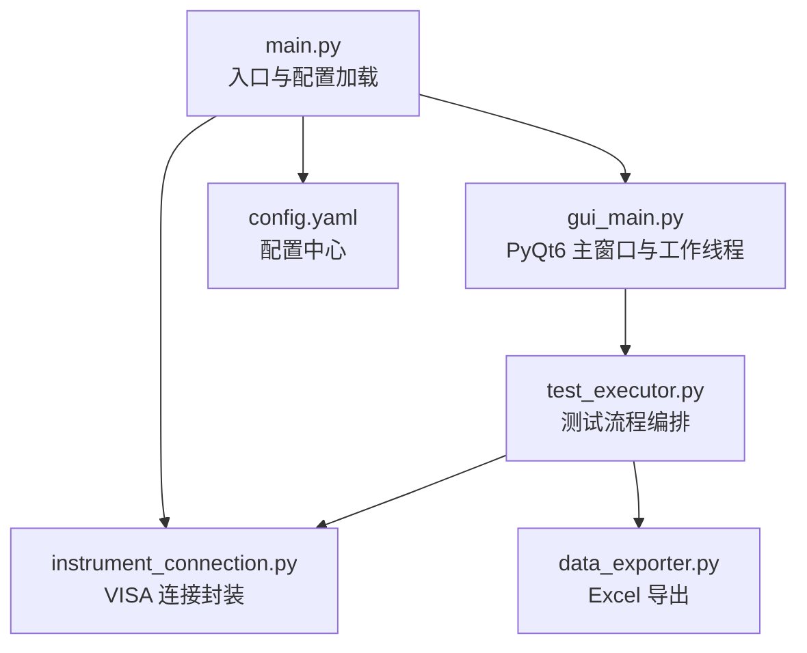
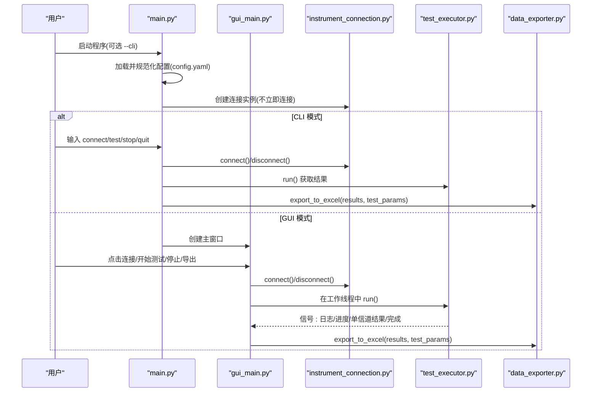
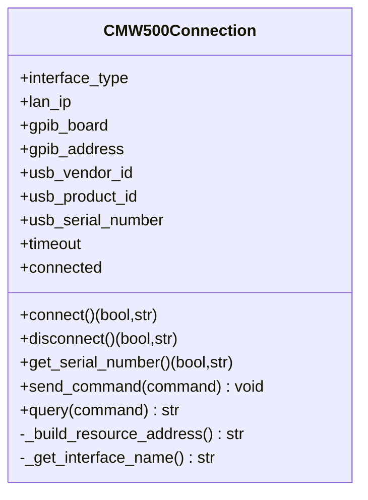
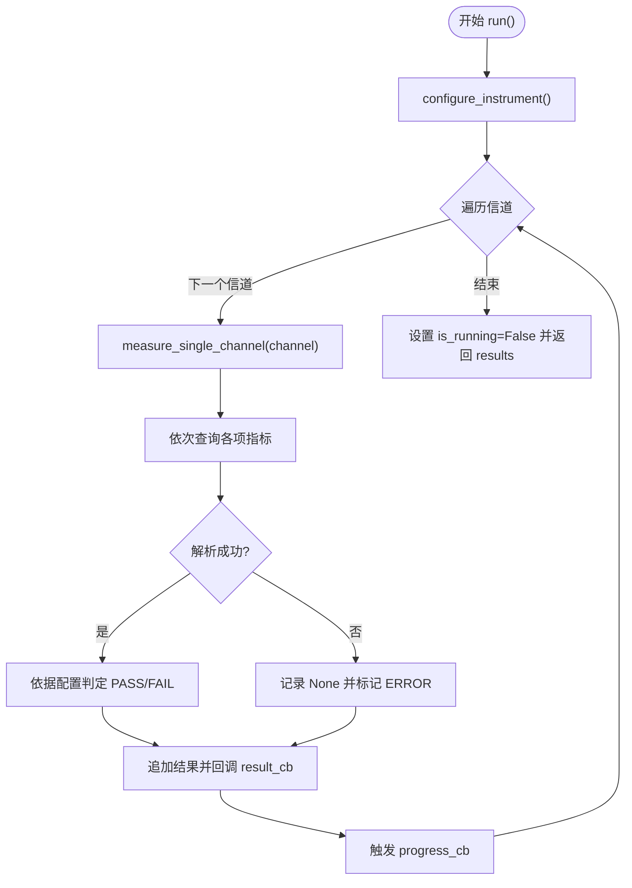
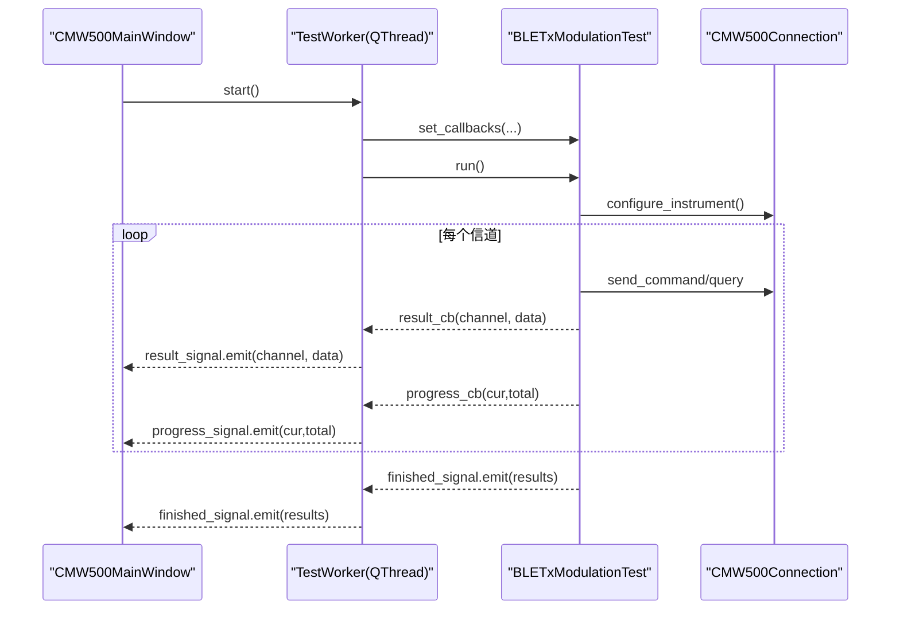
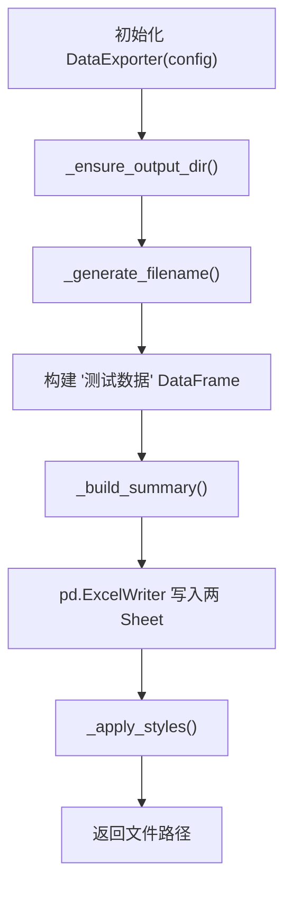
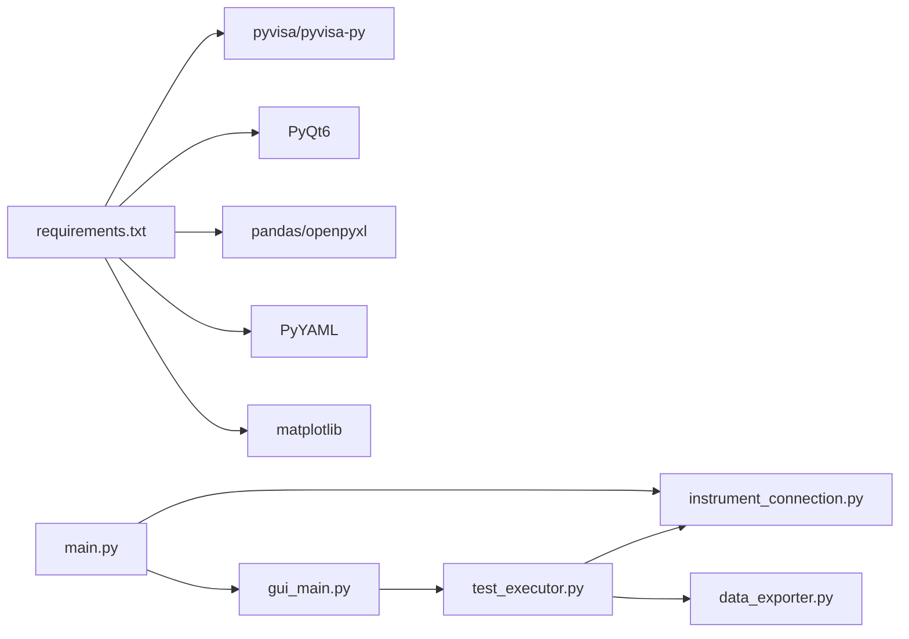

# 测试策略

<cite>
**本文引用的文件**
- [main.py](file://main.py)
- [gui_main.py](file://gui_main.py)
- [instrument_connection.py](file://instrument_connection.py)
- [test_executor.py](file://test_executor.py)
- [data_exporter.py](file://data_exporter.py)
- [config.yaml](file://config.yaml)
- [requirements.txt](file://requirements.txt)
- [build.bat](file://build.bat)
- [build_exe.py](file://build_exe.py)
</cite>

## 目录
1. [引言](#引言)
2. [项目结构](#项目结构)
3. [核心组件](#核心组件)
4. [架构总览](#架构总览)
5. [详细组件分析](#详细组件分析)
6. [依赖分析](#依赖分析)
7. [性能考虑](#性能考虑)
8. [故障排查指南](#故障排查指南)
9. [结论](#结论)
10. [附录](#附录)

## 引言
本测试策略面向 CMW500 BLE TX 调制自动化测试工具，目标是在不依赖真实仪器的情况下，建立可重复、可扩展的测试体系。文档覆盖：
- 单元测试：编写方法、覆盖范围、仪器连接模拟与测试数据生成
- 集成测试：多模块协作、外部依赖处理（VISA/PyQt6/Excel）
- 性能测试：长时间运行与资源使用监控方案
- 回归测试：自动化执行与持续集成配置建议
- 测试环境搭建、测试数据管理、测试结果分析方法
- 调试技巧与性能分析方法，帮助快速定位问题

## 项目结构
本项目采用“入口 + 界面 + 业务逻辑 + 数据导出”的分层组织方式：
- main.py：程序入口，负责加载配置、创建连接对象、选择 CLI/GUI 模式
- gui_main.py：PyQt6 主窗口与工作线程，负责 UI 交互与信号槽通信
- instrument_connection.py：封装 VISA 连接、SCPI 命令发送与查询
- test_executor.py：BLE TX 调制测试流程编排与结果判定
- data_exporter.py：将测试结果导出为带样式的 Excel
- config.yaml：仪器接口、测试参数与导出配置
- requirements.txt：第三方依赖清单
- build.bat / build_exe.py：打包为可执行文件的构建脚本

图表来源
- [main.py:295-336](file://main.py#L295-L336)
- [gui_main.py:75-120](file://gui_main.py#L75-L120)
- [instrument_connection.py:18-54](file://instrument_connection.py#L18-L54)
- [test_executor.py:22-51](file://test_executor.py#L22-L51)
- [data_exporter.py:23-62](file://data_exporter.py#L23-L62)
- [config.yaml:1-26](file://config.yaml#L1-L26)

章节来源
- [main.py:1-40](file://main.py#L1-L40)
- [gui_main.py:1-26](file://gui_main.py#L1-L26)
- [instrument_connection.py:1-14](file://instrument_connection.py#L1-L14)
- [test_executor.py:1-16](file://test_executor.py#L1-L16)
- [data_exporter.py:1-12](file://data_exporter.py#L1-L12)
- [config.yaml:1-26](file://config.yaml#L1-L26)

## 核心组件
- 仪器连接层（CMW500Connection）
  - 职责：根据接口类型构造 VISA 资源地址、建立/断开连接、发送 SCPI 指令与查询
  - 关键能力：支持 LAN/GPIB/USB；异常分类提示；*IDN? 校验连接有效性
- 测试执行器（BLETxModulationTest）
  - 职责：配置仪器、遍历信道、逐项测量、判定 PASS/FAIL、回调日志/进度/结果
  - 关键能力：支持中断停止；错误容错记录；按配置上限判定
- GUI 工作线程（TestWorker + CMW500MainWindow）
  - 职责：在独立线程中执行测试，通过 Qt 信号更新 UI；提供连接/断开/开始/停止/导出按钮
- 数据导出器（DataExporter）
  - 职责：生成带时间戳的文件名；写入“测试数据”和“测试摘要”两个 Sheet；应用样式与列宽

章节来源
- [instrument_connection.py:18-54](file://instrument_connection.py#L18-L54)
- [instrument_connection.py:85-132](file://instrument_connection.py#L85-L132)
- [test_executor.py:22-51](file://test_executor.py#L22-L51)
- [test_executor.py:76-104](file://test_executor.py#L76-L104)
- [test_executor.py:105-184](file://test_executor.py#L105-L184)
- [test_executor.py:186-245](file://test_executor.py#L186-L245)
- [gui_main.py:28-73](file://gui_main.py#L28-L73)
- [gui_main.py:75-120](file://gui_main.py#L75-L120)
- [data_exporter.py:23-62](file://data_exporter.py#L23-L62)
- [data_exporter.py:81-139](file://data_exporter.py#L81-L139)

## 架构总览
下图展示从入口到测试执行与导出的端到端调用关系，以及各模块间的依赖方向。

图表来源
- [main.py:295-336](file://main.py#L295-L336)
- [gui_main.py:499-528](file://gui_main.py#L499-L528)
- [instrument_connection.py:85-132](file://instrument_connection.py#L85-L132)
- [test_executor.py:186-245](file://test_executor.py#L186-L245)
- [data_exporter.py:81-139](file://data_exporter.py#L81-L139)

## 详细组件分析

### 仪器连接层（CMW500Connection）
- 设计要点
  - 统一接口抽象：connect/disconnect/query/send_command
  - 资源地址构造：LAN/GPIB/USB 三种格式
  - 异常分层：VisaIOError 与其他异常分别处理，返回友好提示
- 测试关注点
  - 连接成功路径：资源管理器创建、地址构造、*IDN? 校验
  - 连接失败路径：网络/地址/驱动等错误分支
  - 断开与查询：未连接保护、异常回退
- 模拟策略
  - 使用 mock 替换 pyvisa.ResourceManager 与 open_resource，返回伪造的 instrument 对象
  - 针对 query/write 行为进行断言，验证指令序列与返回值解析

图表来源
- [instrument_connection.py:18-54](file://instrument_connection.py#L18-L54)
- [instrument_connection.py:55-84](file://instrument_connection.py#L55-L84)
- [instrument_connection.py:85-132](file://instrument_connection.py#L85-L132)
- [instrument_connection.py:134-159](file://instrument_connection.py#L134-L159)
- [instrument_connection.py:161-190](file://instrument_connection.py#L161-L190)
- [instrument_connection.py:192-215](file://instrument_connection.py#L192-L215)

章节来源
- [instrument_connection.py:18-54](file://instrument_connection.py#L18-L54)
- [instrument_connection.py:85-132](file://instrument_connection.py#L85-L132)
- [instrument_connection.py:134-159](file://instrument_connection.py#L134-L159)
- [instrument_connection.py:161-190](file://instrument_connection.py#L161-L190)
- [instrument_connection.py:192-215](file://instrument_connection.py#L192-L215)

### 测试执行器（BLETxModulationTest）
- 设计要点
  - 回调机制：log_callback、progress_callback、result_callback
  - 流程编排：configure_instrument -> 循环信道 -> measure_single_channel -> 判定 -> 收集结果
  - 中断控制：is_running/is_stopped 标志位
- 测试关注点
  - 配置阶段：RST、BT:TX 相关配置指令顺序与参数
  - 单信道测量：FETC:* 系列查询与异常处理（None 值）
  - 判定逻辑：基于 measurements 配置的上下限判断 PASS/FAIL/ERROR
  - 中断与错误：stop() 生效、异常记录 error_result
- 模拟策略
  - Mock CMW500Connection 的 send_command/query，注入不同响应以覆盖 PASS/FAIL/ERROR 分支
  - 注入超时或异常，验证错误路径与日志输出

图表来源
- [test_executor.py:186-245](file://test_executor.py#L186-L245)
- [test_executor.py:76-104](file://test_executor.py#L76-L104)
- [test_executor.py:105-184](file://test_executor.py#L105-L184)

章节来源
- [test_executor.py:22-51](file://test_executor.py#L22-L51)
- [test_executor.py:76-104](file://test_executor.py#L76-L104)
- [test_executor.py:105-184](file://test_executor.py#L105-L184)
- [test_executor.py:186-245](file://test_executor.py#L186-L245)
- [test_executor.py:247-260](file://test_executor.py#L247-L260)

### GUI 工作线程与主窗口（TestWorker + CMW500MainWindow）
- 设计要点
  - TestWorker 在独立线程中执行测试，通过 pyqtSignal 向主线程推送日志、进度、结果与错误
  - 主窗口负责按钮状态机、表格渲染、进度条与日志显示
- 测试关注点
  - 信号槽：log_signal/result_signal/progress_signal/finished_signal/error_signal 的触发时机与内容
  - 线程安全：非主线程更新 UI 的正确性（通过信号机制）
  - 状态机：连接/断开/开始/停止/导出按钮的启用禁用逻辑
- 模拟策略
  - 使用 unittest.mock 对 CMW500Connection 进行 mock，避免真实仪器
  - 使用 pytest-qt 或自定义事件循环来驱动 Qt 信号，验证 UI 更新

图表来源
- [gui_main.py:28-73](file://gui_main.py#L28-L73)
- [gui_main.py:499-528](file://gui_main.py#L499-L528)
- [test_executor.py:186-245](file://test_executor.py#L186-L245)
- [instrument_connection.py:85-132](file://instrument_connection.py#L85-L132)

章节来源
- [gui_main.py:28-73](file://gui_main.py#L28-L73)
- [gui_main.py:75-120](file://gui_main.py#L75-L120)
- [gui_main.py:499-528](file://gui_main.py#L499-L528)
- [gui_main.py:561-629](file://gui_main.py#L561-L629)

### 数据导出器（DataExporter）
- 设计要点
  - 文件名自动包含时间戳，避免覆盖历史数据
  - 两 Sheet 输出：“测试数据”与“测试摘要”，并应用样式与列宽
- 测试关注点
  - 输出目录创建与路径解析（兼容 exe 打包）
  - DataFrame 构建与列映射（名称/单位/判定）
  - 样式应用与最终保存
- 模拟策略
  - 使用临时目录与内存文件流，断言生成的 Excel 结构与样式
  - 使用 pandas 读取导出文件，校验列名、行数和统计项

图表来源
- [data_exporter.py:41-62](file://data_exporter.py#L41-L62)
- [data_exporter.py:63-79](file://data_exporter.py#L63-L79)
- [data_exporter.py:81-139](file://data_exporter.py#L81-L139)
- [data_exporter.py:141-202](file://data_exporter.py#L141-L202)
- [data_exporter.py:204-282](file://data_exporter.py#L204-L282)

章节来源
- [data_exporter.py:23-62](file://data_exporter.py#L23-L62)
- [data_exporter.py:81-139](file://data_exporter.py#L81-L139)
- [data_exporter.py:141-202](file://data_exporter.py#L141-L202)
- [data_exporter.py:204-282](file://data_exporter.py#L204-L282)

## 依赖分析
- 外部依赖
  - pyvisa/pyvisa-py：仪器通信后端
  - PyQt6：GUI 框架
  - pandas/openpyxl：Excel 读写与样式
  - PyYAML：配置文件解析
  - matplotlib：可视化（当前代码未直接引用，但已列入依赖）
- 耦合与内聚
  - main.py 仅负责入口与配置，低耦合
  - gui_main.py 依赖 test_executor 与 data_exporter，通过信号解耦
  - test_executor 依赖 instrument_connection，职责清晰
  - data_exporter 仅依赖 pandas/openpyxl，内聚良好
- 潜在循环依赖
  - gui_main.py 与 test_executor.py 通过回调与信号解耦，无直接循环导入
- 外部依赖处理
  - 使用 mock 隔离 VISA 与文件系统
  - 使用临时目录与内存文件流隔离 Excel 输出

图表来源
- [requirements.txt:1-12](file://requirements.txt#L1-L12)
- [main.py:295-336](file://main.py#L295-L336)
- [gui_main.py:499-528](file://gui_main.py#L499-L528)
- [test_executor.py:186-245](file://test_executor.py#L186-L245)
- [data_exporter.py:81-139](file://data_exporter.py#L81-L139)

章节来源
- [requirements.txt:1-12](file://requirements.txt#L1-L12)
- [main.py:295-336](file://main.py#L295-L336)
- [gui_main.py:499-528](file://gui_main.py#L499-L528)
- [test_executor.py:186-245](file://test_executor.py#L186-L245)
- [data_exporter.py:81-139](file://data_exporter.py#L81-L139)

## 性能考虑
- 长时间运行测试
  - 场景：全信道扫描（0~39），多次统计平均，可能耗时较长
  - 方案：在 CI 中使用精简信道范围与较小 statistic_count，缩短周期
- 资源使用监控
  - 进程 CPU/内存：使用系统工具（如 Windows 任务管理器、psutil）采集
  - GUI 线程：确保长耗时操作在工作线程中执行，避免阻塞主线程
- I/O 优化
  - Excel 导出批量写入，减少频繁磁盘访问
  - 日志输出节流：避免高频日志导致 UI 卡顿

[本节为通用指导，无需特定文件来源]

## 故障排查指南
- 常见问题定位
  - 连接失败：检查 interface_type、IP/板号/地址/VID/PID/SN 是否正确；查看异常提示信息
  - 导出失败：确认输出目录权限与路径解析；检查 pandas/openpyxl 版本兼容性
  - GUI 无响应：确认测试是否在工作线程执行；检查信号槽绑定是否正确
- 调试技巧
  - 在 CLI 模式下逐步执行 connect/test/stop/quit，观察日志
  - 使用全局异常捕获打印堆栈信息，辅助定位崩溃点
- 日志与结果分析
  - 日志包含时间戳与通道级统计，便于逐信道定位
  - Excel “测试摘要”提供总体判定与分项统计，便于快速评估

章节来源
- [main.py:42-83](file://main.py#L42-L83)
- [main.py:295-356](file://main.py#L295-L356)
- [gui_main.py:621-629](file://gui_main.py#L621-L629)
- [data_exporter.py:204-282](file://data_exporter.py#L204-L282)

## 结论
本测试策略围绕“可模拟、可隔离、可观测”的原则，构建了覆盖单元、集成、性能与回归的完整方案。通过 mock 仪器连接与数据导出，可在无硬件环境下稳定执行测试；通过信号与回调机制，GUI 与业务逻辑解耦，便于并行测试与自动化。建议在 CI 中引入精简用例集与覆盖率报告，持续提升质量与交付效率。

[本节为总结，无需特定文件来源]

## 附录

### 单元测试设计与覆盖范围
- 仪器连接层（CMW500Connection）
  - 用例：
    - 连接成功：mock ResourceManager.open_resource 返回有效 instrument，断言 connected=True 与 *IDN? 被调用
    - 连接失败：抛出 VisaIOError，断言返回错误信息与提示
    - 断开连接：正常关闭与异常关闭两种路径
    - 查询序列号：成功解析与格式异常分支
    - 发送/查询命令：未连接保护与异常传播
  - 覆盖：所有分支与异常路径
- 测试执行器（BLETxModulationTest）
  - 用例：
    - 配置阶段：验证 RST 与各 CONF 指令顺序
    - 单信道测量：PASS/FAIL/ERROR 分支，含 None 值处理
    - 中断：stop() 后循环退出
    - 错误记录：异常时追加 error_result
  - 覆盖：指令序列、判定逻辑、中断与错误路径
- GUI 工作线程（TestWorker + CMW500MainWindow）
  - 用例：
    - 信号触发：log/result/progress/finished/error 信号内容与时机
    - 状态机：按钮启用/禁用与状态标签更新
    - 线程安全：非主线程更新 UI 的正确性
  - 覆盖：信号槽、状态机与线程模型
- 数据导出器（DataExporter）
  - 用例：
    - 输出目录创建与路径解析（相对/绝对）
    - DataFrame 构建与列映射（名称/单位/判定）
    - 样式应用与列宽调整
    - 摘要统计正确性
  - 覆盖：I/O、样式与统计逻辑

章节来源
- [instrument_connection.py:85-132](file://instrument_connection.py#L85-L132)
- [instrument_connection.py:134-159](file://instrument_connection.py#L134-L159)
- [instrument_connection.py:161-190](file://instrument_connection.py#L161-L190)
- [instrument_connection.py:192-215](file://instrument_connection.py#L192-L215)
- [test_executor.py:76-104](file://test_executor.py#L76-L104)
- [test_executor.py:105-184](file://test_executor.py#L105-L184)
- [test_executor.py:186-245](file://test_executor.py#L186-L245)
- [gui_main.py:28-73](file://gui_main.py#L28-L73)
- [gui_main.py:499-528](file://gui_main.py#L499-L528)
- [gui_main.py:561-629](file://gui_main.py#L561-L629)
- [data_exporter.py:63-79](file://data_exporter.py#L63-L79)
- [data_exporter.py:81-139](file://data_exporter.py#L81-L139)
- [data_exporter.py:141-202](file://data_exporter.py#L141-L202)
- [data_exporter.py:204-282](file://data_exporter.py#L204-L282)

### 仪器连接模拟与测试数据生成
- 仪器连接模拟
  - 使用 unittest.mock.patch 替换 pyvisa.ResourceManager 与 open_resource
  - 构造 mock instrument，实现 write/query 返回预设字符串或抛出异常
  - 针对不同接口类型构造不同的资源地址断言
- 测试数据生成
  - 构造符合 measurements 结构的配置片段，用于判定逻辑验证
  - 生成随机或边界值（接近上限/下限）以覆盖 PASS/FAIL 边界
  - 生成 None 值以触发 ERROR 分支

章节来源
- [config.yaml:44-71](file://config.yaml#L44-L71)
- [test_executor.py:166-184](file://test_executor.py#L166-L184)

### 集成测试设计与外部依赖处理
- 多模块协作
  - 端到端流程：main -> gui_main -> test_executor -> instrument_connection -> data_exporter
  - 通过 mock 外部依赖（VISA、文件系统）保证可重复性
- 外部依赖处理
  - VISA：mock ResourceManager 与 instrument
  - Excel：使用临时目录与内存文件流，断言结构与样式
  - GUI：使用 pytest-qt 或自定义事件循环驱动信号槽

章节来源
- [main.py:295-336](file://main.py#L295-L336)
- [gui_main.py:499-528](file://gui_main.py#L499-L528)
- [test_executor.py:186-245](file://test_executor.py#L186-L245)
- [data_exporter.py:81-139](file://data_exporter.py#L81-L139)

### 性能测试方案
- 长时间运行测试
  - 使用精简信道范围与较小 statistic_count 执行全链路测试
  - 监控 CPU/内存占用，确保 GUI 不阻塞
- 资源使用监控
  - 使用 psutil 采集进程指标，或在 CI 中集成系统监控
  - 记录导出文件大小与耗时，评估 I/O 性能

[本节为通用指导，无需特定文件来源]

### 回归测试自动化与持续集成配置
- 本地执行
  - 安装依赖：pip install -r requirements.txt
  - 运行测试：pytest tests/ --cov=main,gui_main,instrument_connection,test_executor,data_exporter
- CI 建议
  - 构建步骤：安装依赖、运行单元测试与集成测试、生成覆盖率报告
  - 产物归档：导出示例 Excel 与测试报告
  - 条件执行：仅在变更相关模块时运行对应测试集

章节来源
- [requirements.txt:1-12](file://requirements.txt#L1-L12)

### 测试环境搭建
- 基础环境
  - Python 3.9+，Windows 平台（GUI 与打包脚本针对 Windows）
  - 安装依赖：pip install -r requirements.txt
- 构建与运行
  - 使用 build.bat 一键安装依赖并打包 EXE
  - 运行 main.py 进入 GUI 或 CLI 模式

章节来源
- [requirements.txt:1-12](file://requirements.txt#L1-L12)
- [build.bat:60-106](file://build.bat#L60-L106)
- [main.py:295-336](file://main.py#L295-L336)

### 测试数据管理
- 配置管理
  - 使用 config.yaml 集中管理仪器接口、测试参数与导出选项
  - 通过 _normalize_config 兼容旧版配置字段
- 结果存储
  - 导出文件命名包含时间戳，避免覆盖
  - 输出目录可配置，支持相对路径与绝对路径

章节来源
- [config.yaml:1-26](file://config.yaml#L1-L26)
- [config.yaml:73-79](file://config.yaml#L73-L79)
- [main.py:245-292](file://main.py#L245-L292)
- [data_exporter.py:63-79](file://data_exporter.py#L63-L79)

### 测试结果分析方法
- 日志分析
  - 时间戳与通道级统计，快速定位失败信道
- Excel 分析
  - “测试数据”Sheet：逐信道数值与判定
  - “测试摘要”Sheet：总体判定与分项统计
- 可视化（可选）
  - 使用 matplotlib 绘制频率指标趋势图，辅助分析漂移与偏移

章节来源
- [test_executor.py:217-220](file://test_executor.py#L217-L220)
- [data_exporter.py:141-202](file://data_exporter.py#L141-L202)
- [requirements.txt:10](file://requirements.txt#L10)

### 调试技巧与性能分析方法
- 调试技巧
  - CLI 模式逐步执行，观察日志与状态
  - 全局异常捕获打印堆栈，定位崩溃点
- 性能分析
  - 使用 cProfile 分析热点函数（如 measure_single_channel、export_to_excel）
  - 结合 GUI 线程模型，避免主线程阻塞

章节来源
- [main.py:339-356](file://main.py#L339-L356)
- [gui_main.py:28-73](file://gui_main.py#L28-L73)