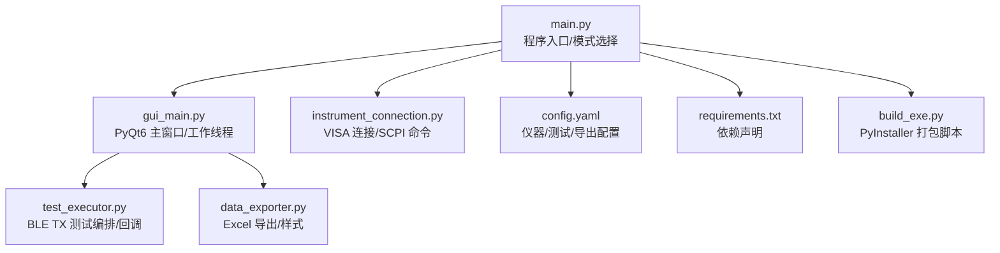
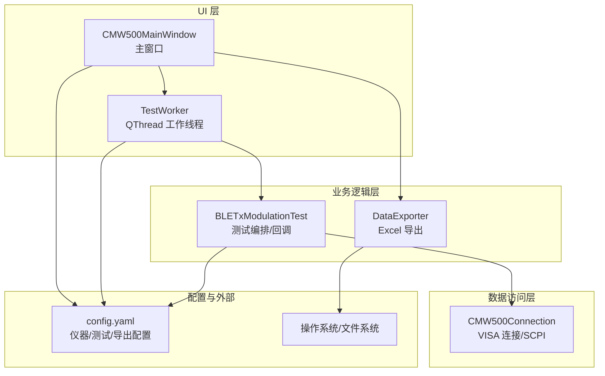
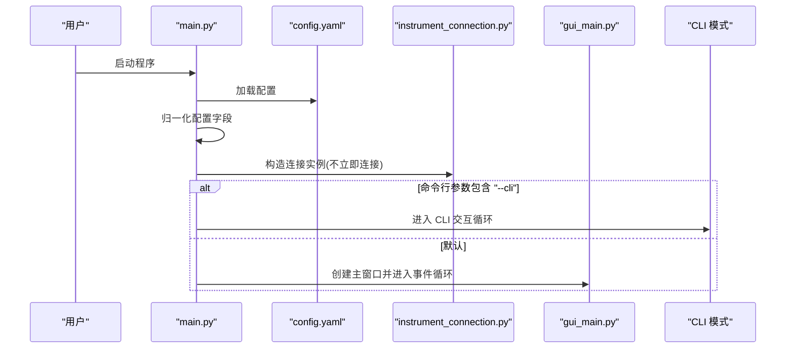
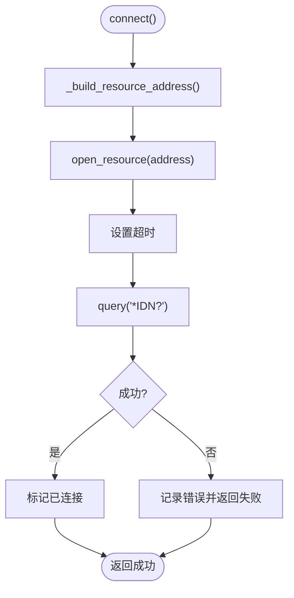
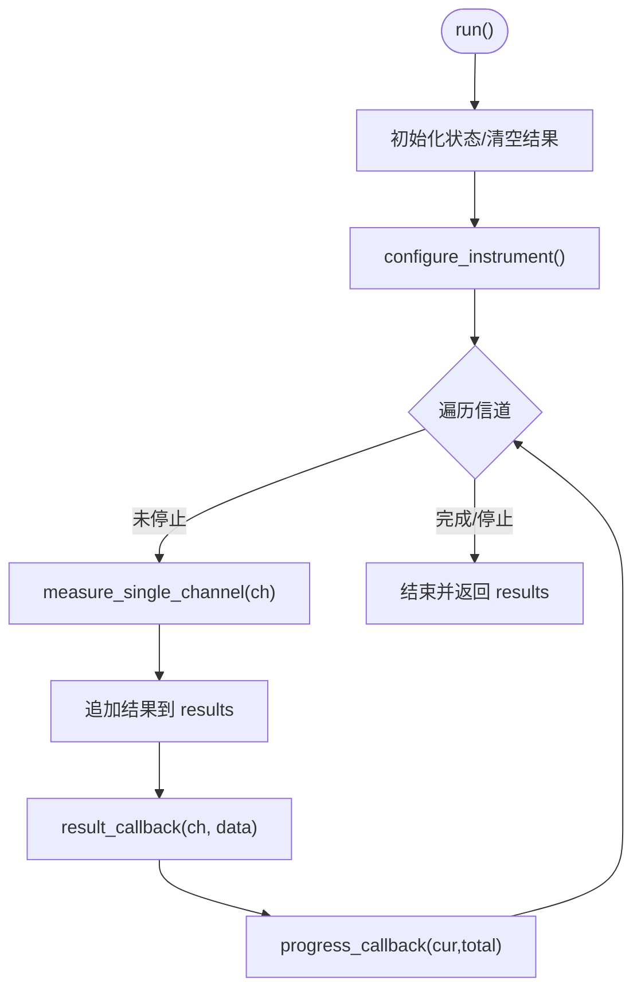
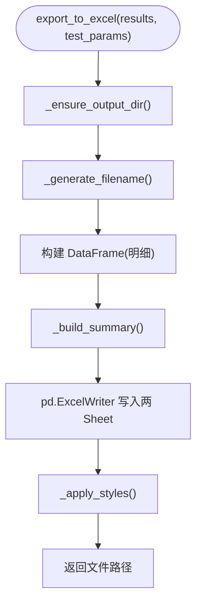
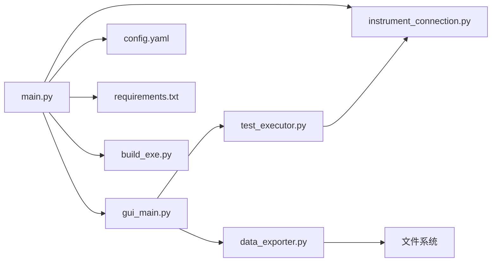

# 项目架构设计

<cite>
**本文引用的文件列表**
- [main.py](file://main.py)
- [gui_main.py](file://gui_main.py)
- [instrument_connection.py](file://instrument_connection.py)
- [test_executor.py](file://test_executor.py)
- [data_exporter.py](file://data_exporter.py)
- [config.yaml](file://config.yaml)
- [requirements.txt](file://requirements.txt)
- [build_exe.py](file://build_exe.py)
</cite>

## 目录
1. [简介](#简介)
2. [项目结构](#项目结构)
3. [核心组件](#核心组件)
4. [架构总览](#架构总览)
5. [详细组件分析](#详细组件分析)
6. [依赖关系分析](#依赖关系分析)
7. [性能与可扩展性](#性能与可扩展性)
8. [故障排查指南](#故障排查指南)
9. [结论](#结论)
10. [附录：配置驱动说明](#附录：配置驱动说明)

## 简介
本项目为 R&S CMW500 无线通信测试仪的自动化测试工具，面向蓝牙 BLE TX 调制测试场景。系统采用分层架构，将 UI 层、业务逻辑层和数据访问层解耦；通过回调函数模式与 Qt 信号槽机制实现跨线程通信；以 YAML 配置文件驱动仪器接口、测试参数与导出行为，支持命令行与图形界面两种运行模式，并可通过 PyInstaller 打包为独立可执行文件。

## 项目结构
项目采用“按职责分文件”的组织方式，入口负责启动与模式选择，UI 层使用 PyQt6 构建交互界面，业务逻辑层封装测试流程与判定，数据访问层统一封装 VISA 通信，数据导出模块负责 Excel 输出，YAML 配置集中管理所有可调参数。



图表来源
- [main.py:295-336](file://main.py#L295-L336)
- [gui_main.py:75-124](file://gui_main.py#L75-L124)
- [instrument_connection.py:18-54](file://instrument_connection.py#L18-L54)
- [test_executor.py:22-51](file://test_executor.py#L22-L51)
- [data_exporter.py:23-62](file://data_exporter.py#L23-L62)
- [config.yaml:1-79](file://config.yaml#L1-L79)
- [requirements.txt:1-12](file://requirements.txt#L1-L12)
- [build_exe.py:21-52](file://build_exe.py#L21-L52)

章节来源
- [main.py:295-336](file://main.py#L295-L336)
- [requirements.txt:1-12](file://requirements.txt#L1-L12)

## 核心组件
- 程序入口与模式路由：加载配置、归一化默认值、创建连接对象、根据参数选择 CLI/GUI 模式。
- GUI 主窗口与工作线程：基于 PyQt6 的信号槽机制，将耗时测试放入 QThread，避免阻塞 UI。
- 仪器连接抽象：统一 LAN/GPIB/USB 三种接口的资源地址构造与 SCPI 命令收发。
- 测试执行器：编排 BLE TX 调制测试流程，逐信道测量、判定并通过回调推送结果。
- 数据导出器：生成带样式的 Excel 报告，包含明细与摘要两个 Sheet。
- 配置中心：YAML 定义仪器接口、测试项限值、导出路径等，支持运行时读取与兼容处理。

章节来源
- [main.py:85-115](file://main.py#L85-L115)
- [main.py:245-292](file://main.py#L245-L292)
- [gui_main.py:28-73](file://gui_main.py#L28-L73)
- [instrument_connection.py:18-54](file://instrument_connection.py#L18-L54)
- [test_executor.py:22-67](file://test_executor.py#L22-L67)
- [data_exporter.py:23-62](file://data_exporter.py#L23-L62)
- [config.yaml:1-79](file://config.yaml#L1-L79)

## 架构总览
系统遵循分层架构与关注点分离原则：
- UI 层（gui_main.py）：用户交互、状态展示、进度反馈、错误提示。
- 业务逻辑层（test_executor.py）：测试流程编排、指标计算与判定、回调通知。
- 数据访问层（instrument_connection.py）：设备连接、资源地址解析、SCPI 指令发送与查询。
- 配置驱动（config.yaml + main.py 归一化）：集中管理仪器接口、测试参数、导出策略。
- 数据导出（data_exporter.py）：将测试结果持久化为结构化报表。



图表来源
- [gui_main.py:75-124](file://gui_main.py#L75-L124)
- [gui_main.py:28-73](file://gui_main.py#L28-L73)
- [test_executor.py:22-67](file://test_executor.py#L22-L67)
- [data_exporter.py:23-62](file://data_exporter.py#L23-L62)
- [instrument_connection.py:18-54](file://instrument_connection.py#L18-L54)
- [config.yaml:1-79](file://config.yaml#L1-L79)

## 详细组件分析

### 程序入口与模式路由（main.py）
- 功能要点
  - 获取应用根目录，兼容 PyInstaller 打包后的运行环境。
  - 加载并校验 config.yaml，提供友好的错误提示。
  - 对旧版配置进行兼容性归一化，确保 instrument 下 lan/gpib/usb 子节完整。
  - 延迟导入仪器连接模块，避免顶层依赖导致闪退。
  - 根据命令行参数 --cli 切换 CLI 或 GUI 模式。
- 关键流程
  - 启动 → 加载配置 → 归一化 → 构造连接实例 → 选择运行模式。
- 异常保护
  - 全局 try-except 捕获启动期异常，优先弹窗提示，失败则写入日志文件。



图表来源
- [main.py:295-336](file://main.py#L295-L336)
- [main.py:85-115](file://main.py#L85-L115)
- [main.py:245-292](file://main.py#L245-L292)
- [main.py:339-357](file://main.py#L339-L357)

章节来源
- [main.py:20-36](file://main.py#L20-L36)
- [main.py:85-115](file://main.py#L85-L115)
- [main.py:245-292](file://main.py#L245-L292)
- [main.py:295-336](file://main.py#L295-L336)
- [main.py:339-357](file://main.py#L339-L357)

### GUI 主窗口与工作线程（gui_main.py）
- 功能要点
  - 主窗口提供接口配置区、操作按钮、结果表格、日志窗口与状态栏。
  - 测试在独立 QThread 中执行，通过 pyqtSignal 向主线程安全更新 UI。
  - 支持动态切换 LAN/GPIB/USB 接口参数，并在连接后禁用输入防止误改。
- 关键类与方法
  - TestWorker：封装测试执行生命周期，绑定回调并转发信号。
  - CMW500MainWindow：UI 布局、事件处理、信号槽绑定、结果渲染与样式。
- 线程安全
  - 仅在工作线程内调用测试执行器；UI 更新全部通过信号槽触发。

```mermaid
classDiagram
class CMW500MainWindow {
+config
+cmw500
-test_worker
+_init_ui()
+_on_connect()
+_on_disconnect()
+_on_start_test()
+_on_stop_test()
+_on_export()
+_on_channel_result(channel, result)
+_on_progress_update(current, total)
+_on_test_finished(results)
+_on_test_error(error_msg)
}
class TestWorker {
+log_signal
+result_signal
+progress_signal
+finished_signal
+error_signal
+run()
+stop_test()
}
CMW500MainWindow --> TestWorker : "创建/控制"
TestWorker --> "pyqtSignal" : "跨线程通信"
```

图表来源
- [gui_main.py:75-124](file://gui_main.py#L75-L124)
- [gui_main.py:28-73](file://gui_main.py#L28-L73)

章节来源
- [gui_main.py:75-124](file://gui_main.py#L75-L124)
- [gui_main.py:28-73](file://gui_main.py#L28-L73)
- [gui_main.py:438-497](file://gui_main.py#L438-L497)
- [gui_main.py:499-556](file://gui_main.py#L499-L556)
- [gui_main.py:561-629](file://gui_main.py#L561-L629)

### 仪器连接抽象（instrument_connection.py）
- 功能要点
  - 统一封装 LAN/GPIB/USB 三种接口的资源地址构造与连接/断开。
  - 通过 *IDN? 验证连接有效性，并提供序列号读取与通用 SCPI 命令发送/查询接口。
- 设计权衡
  - 延迟建立连接：仅在用户点击“连接”时打开资源，降低启动开销。
  - 错误信息友好：针对不同接口给出具体排查提示。



图表来源
- [instrument_connection.py:85-132](file://instrument_connection.py#L85-L132)
- [instrument_connection.py:55-75](file://instrument_connection.py#L55-L75)

章节来源
- [instrument_connection.py:18-54](file://instrument_connection.py#L18-L54)
- [instrument_connection.py:85-132](file://instrument_connection.py#L85-L132)
- [instrument_connection.py:134-159](file://instrument_connection.py#L134-L159)
- [instrument_connection.py:161-190](file://instrument_connection.py#L161-L190)
- [instrument_connection.py:192-216](file://instrument_connection.py#L192-L216)

### 测试执行器（test_executor.py）
- 功能要点
  - 配置 CMW500 为 BLE TX 调制测量模式，遍历 Channel 0~39 逐信道测量。
  - 读取五项频率指标，依据配置中的上下限进行 PASS/FAIL 判定。
  - 通过回调推送日志、进度和单信道结果，支持 stop() 中断。
- 数据处理
  - 结果字典包含时间戳、各指标数值与 pass_fail 判定映射。
  - 异常情况下记录错误行，保证后续统计与导出可用。



图表来源
- [test_executor.py:186-245](file://test_executor.py#L186-L245)
- [test_executor.py:76-104](file://test_executor.py#L76-L104)
- [test_executor.py:105-184](file://test_executor.py#L105-L184)

章节来源
- [test_executor.py:22-67](file://test_executor.py#L22-L67)
- [test_executor.py:76-104](file://test_executor.py#L76-L104)
- [test_executor.py:105-184](file://test_executor.py#L105-L184)
- [test_executor.py:186-245](file://test_executor.py#L186-L245)
- [test_executor.py:247-261](file://test_executor.py#L247-L261)

### 数据导出器（data_exporter.py）
- 功能要点
  - 生成两个 Sheet：“测试数据”（逐信道明细）与“测试摘要”（汇总统计）。
  - 自动创建输出目录，文件名含时间戳避免覆盖历史数据。
  - 使用 openpyxl 美化样式，PASS/FAIL 着色，列宽自适应。
- 数据结构
  - 明细行包含各项指标名称+单位列与对应判定列。
  - 摘要包含测试时间、标准、信道范围、统计次数、总体判定等。



图表来源
- [data_exporter.py:81-139](file://data_exporter.py#L81-L139)
- [data_exporter.py:141-202](file://data_exporter.py#L141-L202)
- [data_exporter.py:204-283](file://data_exporter.py#L204-L283)

章节来源
- [data_exporter.py:23-62](file://data_exporter.py#L23-L62)
- [data_exporter.py:81-139](file://data_exporter.py#L81-L139)
- [data_exporter.py:141-202](file://data_exporter.py#L141-L202)
- [data_exporter.py:204-283](file://data_exporter.py#L204-L283)

### 配置驱动（config.yaml + main.py 归一化）
- 设计理念
  - 将仪器接口、测试参数与导出行为从代码中抽离，便于不同产线/环境快速切换。
  - 通过 _normalize_config 兼容旧格式，提升鲁棒性与可维护性。
- 关键配置项
  - instrument.interface_type：LAN/GPIB/USB 三选一。
  - instrument.lan/gpib/usb：对应接口参数。
  - test_params：标准、PHY、突发类型、数据包类型、统计次数、信道范围、测量项及限值。
  - export.output_dir/file_prefix：导出目录与文件名前缀。

章节来源
- [config.yaml:1-79](file://config.yaml#L1-L79)
- [main.py:245-292](file://main.py#L245-L292)

## 依赖关系分析
- 模块耦合
  - main.py 作为入口，低耦合地组合其他模块；GUI 与工作线程解耦，通过信号槽通信。
  - 测试执行器仅依赖连接抽象与配置，不感知 UI 细节。
  - 导出器独立于测试执行器，仅消费结果数据与配置。
- 外部依赖
  - pyvisa/pyvisa-py：仪器通信后端。
  - PyQt6：GUI 框架。
  - pandas/openpyxl：Excel 读写与样式。
  - PyYAML：配置文件解析。
  - matplotlib：预留可视化能力。
  - pyinstaller：打包为 exe。



图表来源
- [main.py:295-336](file://main.py#L295-L336)
- [gui_main.py:75-124](file://gui_main.py#L75-L124)
- [test_executor.py:22-67](file://test_executor.py#L22-L67)
- [data_exporter.py:23-62](file://data_exporter.py#L23-L62)
- [instrument_connection.py:18-54](file://instrument_connection.py#L18-L54)
- [config.yaml:1-79](file://config.yaml#L1-L79)
- [requirements.txt:1-12](file://requirements.txt#L1-L12)
- [build_exe.py:21-52](file://build_exe.py#L21-L52)

章节来源
- [requirements.txt:1-12](file://requirements.txt#L1-L12)
- [build_exe.py:21-52](file://build_exe.py#L21-L52)

## 性能与可扩展性
- 性能特性
  - 测试在独立线程执行，避免阻塞 UI；进度与结果通过信号增量更新，减少重绘压力。
  - 导出阶段一次性写入 Excel，并使用 openpyxl 批量设置样式，兼顾可读性与效率。
- 优化建议
  - 若未来增加实时绘图，建议使用 matplotlib 的 FigureCanvas 嵌入 Qt，避免频繁刷新导致的卡顿。
  - 对于大批量结果，可在导出前进行内存聚合与分批写入，降低峰值内存占用。
  - 连接池与复用：若需并发多设备测试，可引入连接池与任务队列，提高吞吐。

[本节为通用指导，不涉及具体文件分析]

## 故障排查指南
- 启动失败
  - 检查 config.yaml 是否存在且位于程序同目录；确认 YAML 语法正确。
  - 查看全局异常捕获输出的错误弹窗或 error_log.txt。
- 连接失败
  - LAN：核对 IP 地址与网络连通性。
  - GPIB：核对板号与主地址，检查线缆与驱动。
  - USB：核对 VID/PID/序列号，确认驱动安装与设备枚举。
- 测试中断
  - 点击“停止测试”会置位停止标志，等待当前信道完成后退出。
- 导出失败
  - 检查输出目录权限与磁盘空间；确认 openpyxl 依赖可用。

章节来源
- [main.py:339-357](file://main.py#L339-L357)
- [instrument_connection.py:112-132](file://instrument_connection.py#L112-L132)
- [test_executor.py:247-252](file://test_executor.py#L247-L252)
- [data_exporter.py:63-79](file://data_exporter.py#L63-L79)

## 结论
本方案通过清晰的分层架构与配置驱动设计，实现了高内聚、低耦合的系统组织。UI 层专注交互，业务层专注流程编排与判定，数据访问层屏蔽底层差异；回调与信号槽机制保障了跨线程通信的安全与高效。YAML 配置使系统具备良好可移植性与可维护性，配合 PyInstaller 打包，便于在不同环境中部署与分发。

[本节为总结性内容，不涉及具体文件分析]

## 附录：配置驱动说明
- 配置项分类
  - 仪器接口：interface_type、lan.ip_address、gpib.board/address、usb.vendor_id/product_id/serial_number、timeout。
  - 测试参数：standard、phy_type、burst_type、packet_type、statistic_count、channel_start/end、measurements 及其 upper_limit/lower_limit。
  - 导出配置：output_dir、file_prefix。
- 兼容与默认值
  - 若缺少 instrument 子节或字段，_normalize_config 会自动补全默认值，保障旧配置可用。
- 扩展建议
  - 新增测量项时，仅需在 config.yaml 中添加 measurements 条目，无需修改核心逻辑。
  - 新增导出字段或样式，可在 DataExporter 中扩展，保持与 UI 展示一致。

章节来源
- [config.yaml:1-79](file://config.yaml#L1-L79)
- [main.py:245-292](file://main.py#L245-L292)