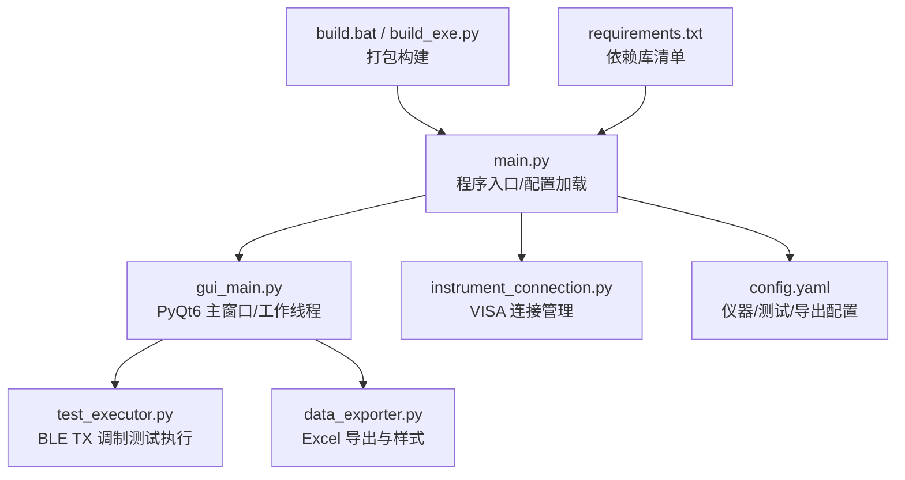
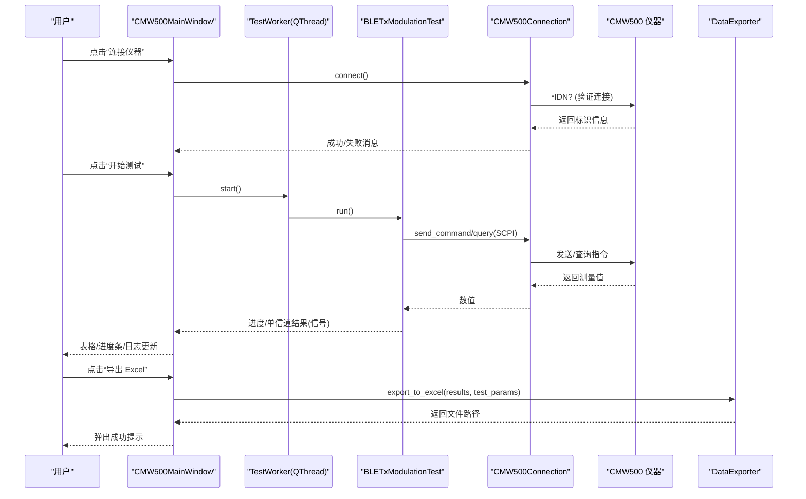
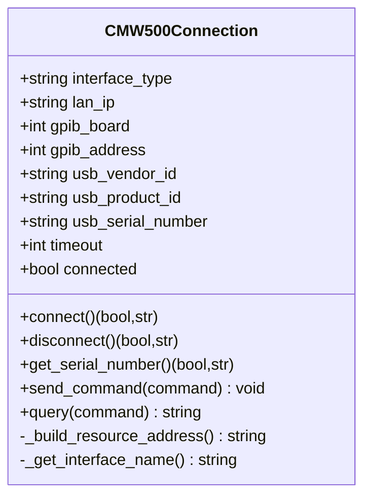
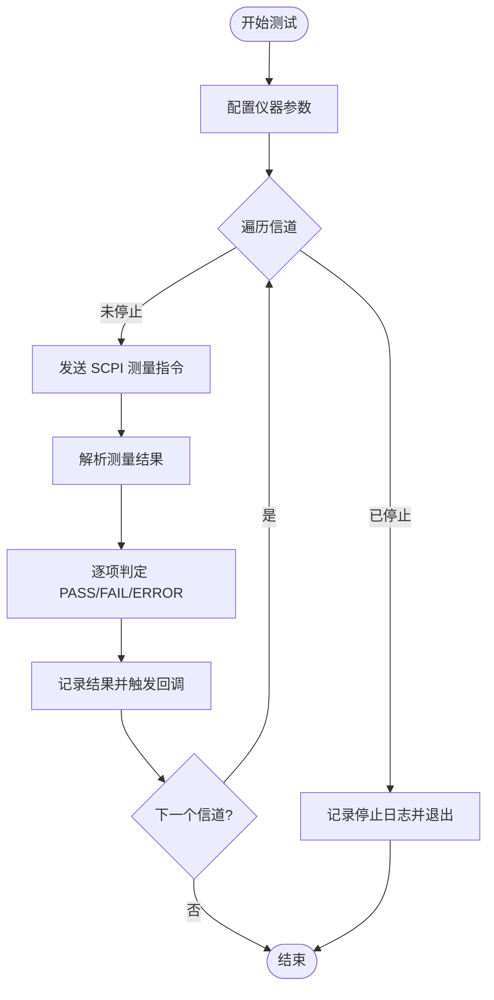
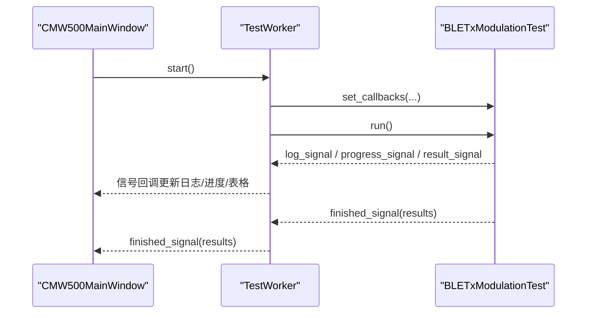
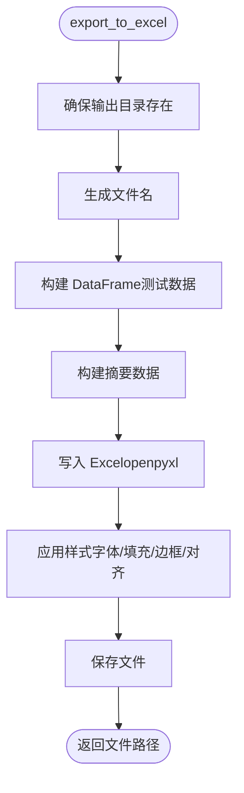
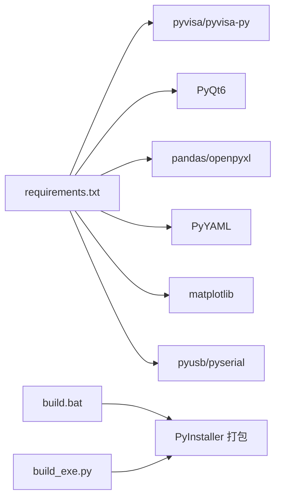
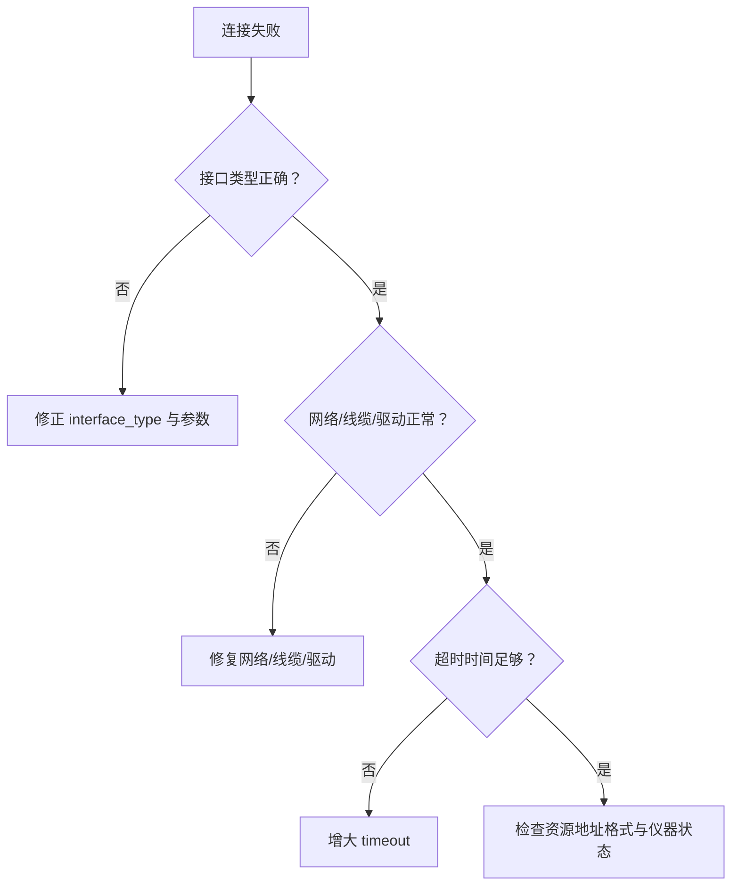
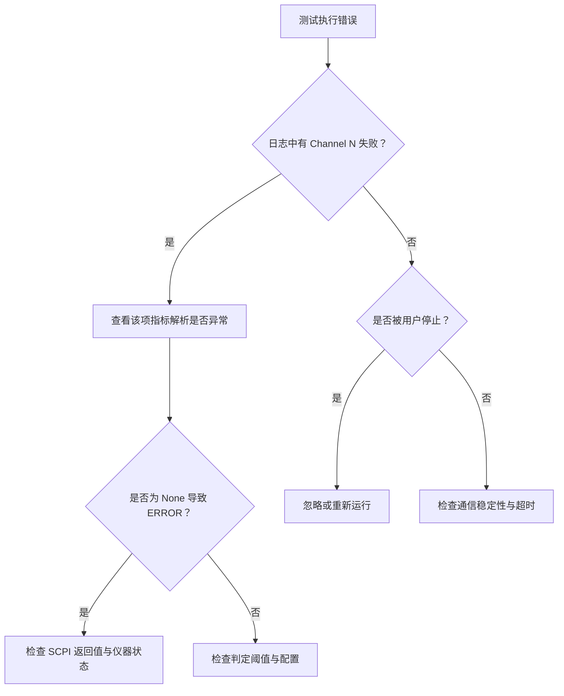
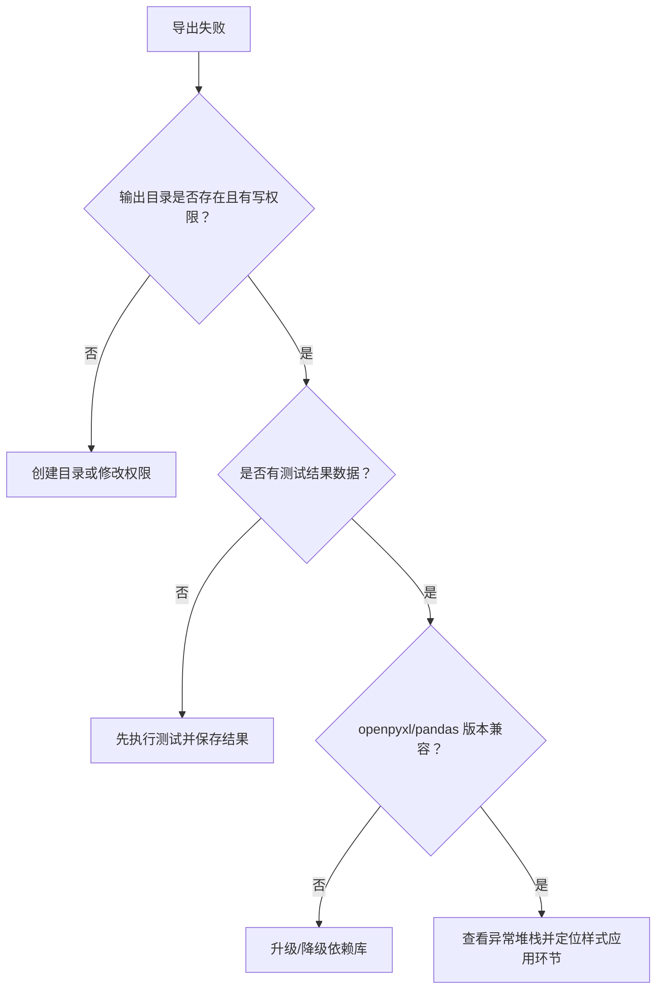

# 故障排除与调试

<cite>
**本文引用的文件**   
- [main.py](file://main.py)
- [gui_main.py](file://gui_main.py)
- [instrument_connection.py](file://instrument_connection.py)
- [test_executor.py](file://test_executor.py)
- [data_exporter.py](file://data_exporter.py)
- [config.yaml](file://config.yaml)
- [requirements.txt](file://requirements.txt)
- [build.bat](file://build.bat)
- [build_exe.py](file://build_exe.py)
</cite>

## 目录
1. [简介](#简介)
2. [项目结构](#项目结构)
3. [核心组件](#核心组件)
4. [架构总览](#架构总览)
5. [详细组件分析](#详细组件分析)
6. [依赖关系分析](#依赖关系分析)
7. [性能考虑](#性能考虑)
8. [故障排除指南](#故障排除指南)
9. [结论](#结论)
10. [附录](#附录)

## 简介
本指南面向使用 CMW500 BLE TX 调制自动化测试工具的用户与维护人员，聚焦于常见问题定位、日志分析方法、调试策略、性能瓶颈分析与优化建议、系统兼容性问题及解决方案，并提供问题诊断流程图与决策树。文档内容严格基于仓库源码实现进行分析与总结。

## 项目结构
本项目为 Python 桌面应用，采用模块化设计：
- 入口与配置加载：main.py
- GUI 界面与线程化测试执行：gui_main.py
- 仪器连接（LAN/GPIB/USB）：instrument_connection.py
- 测试流程与 SCPI 指令封装：test_executor.py
- Excel 数据导出与样式美化：data_exporter.py
- 配置文件：config.yaml
- 打包与构建脚本：build.bat、build_exe.py
- 依赖清单：requirements.txt

图表来源
- [main.py:295-336](file://main.py#L295-L336)
- [gui_main.py:75-124](file://gui_main.py#L75-L124)
- [instrument_connection.py:18-54](file://instrument_connection.py#L18-L54)
- [test_executor.py:22-51](file://test_executor.py#L22-L51)
- [data_exporter.py:23-62](file://data_exporter.py#L23-L62)
- [config.yaml:1-79](file://config.yaml#L1-L79)
- [build.bat:75-106](file://build.bat#L75-L106)
- [build_exe.py:21-87](file://build_exe.py#L21-L87)
- [requirements.txt:1-12](file://requirements.txt#L1-L12)

章节来源
- [main.py:295-336](file://main.py#L295-L336)
- [gui_main.py:75-124](file://gui_main.py#L75-L124)
- [instrument_connection.py:18-54](file://instrument_connection.py#L18-L54)
- [test_executor.py:22-51](file://test_executor.py#L22-L51)
- [data_exporter.py:23-62](file://data_exporter.py#L23-L62)
- [config.yaml:1-79](file://config.yaml#L1-L79)
- [build.bat:75-106](file://build.bat#L75-L106)
- [build_exe.py:21-87](file://build_exe.py#L21-L87)
- [requirements.txt:1-12](file://requirements.txt#L1-L12)

## 核心组件
- 程序入口与全局异常保护：负责加载配置、初始化连接对象、选择 CLI/GUI 模式、捕获顶层异常并弹窗提示。
- GUI 主窗口与工作线程：提供连接/断开/开始/停止/导出按钮；在独立 QThread 中执行测试并通过信号更新 UI。
- 仪器连接模块：封装 VISA 资源地址构造、连接/断开、序列号读取、SCPI 命令发送与查询。
- 测试执行器：按信道范围循环测量，调用 SCPI 获取频率相关指标，计算 PASS/FAIL，支持回调推送进度与结果。
- 数据导出器：将测试结果写入 Excel，生成“测试数据”和“测试摘要”两个 Sheet，并进行样式美化。

章节来源
- [main.py:42-83](file://main.py#L42-L83)
- [main.py:85-115](file://main.py#L85-L115)
- [main.py:295-336](file://main.py#L295-L336)
- [gui_main.py:28-73](file://gui_main.py#L28-L73)
- [gui_main.py:75-124](file://gui_main.py#L75-L124)
- [instrument_connection.py:18-54](file://instrument_connection.py#L18-L54)
- [instrument_connection.py:85-132](file://instrument_connection.py#L85-L132)
- [test_executor.py:22-51](file://test_executor.py#L22-L51)
- [test_executor.py:186-245](file://test_executor.py#L186-L245)
- [data_exporter.py:23-62](file://data_exporter.py#L23-L62)
- [data_exporter.py:81-139](file://data_exporter.py#L81-L139)

## 架构总览
下图展示了从用户操作到仪器通信、数据处理与导出的整体流程。GUI 通过工作线程驱动测试执行器，后者通过连接模块与仪器交互，最终由导出器输出 Excel。

图表来源
- [gui_main.py:438-479](file://gui_main.py#L438-L479)
- [gui_main.py:499-528](file://gui_main.py#L499-L528)
- [gui_main.py:537-556](file://gui_main.py#L537-L556)
- [gui_main.py:28-73](file://gui_main.py#L28-L73)
- [test_executor.py:186-245](file://test_executor.py#L186-L245)
- [instrument_connection.py:85-132](file://instrument_connection.py#L85-L132)
- [data_exporter.py:81-139](file://data_exporter.py#L81-L139)

## 详细组件分析

### 仪器连接模块（instrument_connection.py）
- 关键职责
  - 根据接口类型构造 VISA 资源地址（LAN/GPIB/USB）。
  - 建立连接并验证仪器响应（*IDN?）。
  - 断开连接、读取序列号、发送/查询 SCPI 命令。
- 错误处理
  - 捕获 pyvisa.VisaIOError 并给出针对性提示（网络/地址/线缆/驱动等）。
  - 未知异常统一包装返回。
- 典型问题定位点
  - 资源地址格式是否正确（IP、GPIB 板号/地址、USB VID/PID/SN）。
  - 超时时间是否合理。
  - 驱动或后端（pyvisa-py）是否可用。

图表来源
- [instrument_connection.py:18-54](file://instrument_connection.py#L18-L54)
- [instrument_connection.py:55-84](file://instrument_connection.py#L55-L84)
- [instrument_connection.py:85-132](file://instrument_connection.py#L85-L132)
- [instrument_connection.py:134-159](file://instrument_connection.py#L134-L159)
- [instrument_connection.py:161-190](file://instrument_connection.py#L161-L190)
- [instrument_connection.py:192-216](file://instrument_connection.py#L192-L216)

章节来源
- [instrument_connection.py:18-54](file://instrument_connection.py#L18-L54)
- [instrument_connection.py:55-84](file://instrument_connection.py#L55-L84)
- [instrument_connection.py:85-132](file://instrument_connection.py#L85-L132)
- [instrument_connection.py:134-159](file://instrument_connection.py#L134-L159)
- [instrument_connection.py:161-190](file://instrument_connection.py#L161-L190)
- [instrument_connection.py:192-216](file://instrument_connection.py#L192-L216)

### 测试执行器（test_executor.py）
- 关键职责
  - 配置仪器为 BLE TX 调制测量模式（复位、选择测量项、设置 PHY、统计次数、数据包类型）。
  - 遍历信道范围，逐信道测量 5 项频率指标，计算 PASS/FAIL。
  - 支持 stop() 中断测试，回调推送日志、进度与结果。
- 判定逻辑
  - 对每项指标取绝对值并与上限比较，超过则 FAIL；若配置有下限且低于下限也 FAIL；否则 PASS。
- 常见错误点
  - SCPI 指令返回值解析异常导致某项结果为 None，判定为 ERROR。
  - 长时间测量时网络/总线不稳定导致通信异常。

图表来源
- [test_executor.py:76-104](file://test_executor.py#L76-L104)
- [test_executor.py:105-184](file://test_executor.py#L105-L184)
- [test_executor.py:186-245](file://test_executor.py#L186-L245)
- [test_executor.py:247-252](file://test_executor.py#L247-L252)

章节来源
- [test_executor.py:22-51](file://test_executor.py#L22-L51)
- [test_executor.py:76-104](file://test_executor.py#L76-L104)
- [test_executor.py:105-184](file://test_executor.py#L105-L184)
- [test_executor.py:186-245](file://test_executor.py#L186-L245)
- [test_executor.py:247-252](file://test_executor.py#L247-L252)

### GUI 主窗口与工作线程（gui_main.py）
- 关键职责
  - 提供连接/断开/开始/停止/导出按钮与状态栏。
  - 在工作线程中运行测试，通过信号更新日志、进度与结果表格。
  - 导出 Excel 并展示结果。
- 线程安全
  - 所有 UI 更新在主线程槽函数中进行，避免阻塞。
- 常见问题
  - 工作线程抛出异常时通过 error_signal 上报，需检查测试执行器与连接模块的异常路径。

图表来源
- [gui_main.py:28-73](file://gui_main.py#L28-L73)
- [gui_main.py:499-528](file://gui_main.py#L499-L528)
- [gui_main.py:561-629](file://gui_main.py#L561-L629)
- [test_executor.py:52-75](file://test_executor.py#L52-L75)
- [test_executor.py:186-245](file://test_executor.py#L186-L245)

章节来源
- [gui_main.py:75-124](file://gui_main.py#L75-L124)
- [gui_main.py:438-479](file://gui_main.py#L438-L479)
- [gui_main.py:499-528](file://gui_main.py#L499-L528)
- [gui_main.py:537-556](file://gui_main.py#L537-L556)
- [gui_main.py:561-629](file://gui_main.py#L561-L629)

### 数据导出器（data_exporter.py）
- 关键职责
  - 生成带时间戳的文件名，确保输出目录存在。
  - 写入“测试数据”和“测试摘要”两个 Sheet，并对单元格进行样式美化（表头、边框、对齐、PASS/FAIL 着色）。
- 常见问题
  - 输出目录权限不足或路径不存在导致创建失败。
  - openpyxl/pandas 版本不兼容导致样式应用失败。

图表来源
- [data_exporter.py:63-79](file://data_exporter.py#L63-L79)
- [data_exporter.py:81-139](file://data_exporter.py#L81-L139)
- [data_exporter.py:141-202](file://data_exporter.py#L141-L202)
- [data_exporter.py:204-283](file://data_exporter.py#L204-L283)

章节来源
- [data_exporter.py:23-62](file://data_exporter.py#L23-L62)
- [data_exporter.py:81-139](file://data_exporter.py#L81-L139)
- [data_exporter.py:141-202](file://data_exporter.py#L141-L202)
- [data_exporter.py:204-283](file://data_exporter.py#L204-L283)

### 程序入口与配置（main.py、config.yaml）
- 程序入口
  - 加载 config.yaml，自动补全缺失字段以兼容旧版配置。
  - 初始化连接对象，根据命令行参数选择 CLI 或 GUI 模式。
  - 全局异常捕获，弹窗显示错误详情与排查提示。
- 配置要点
  - instrument.interface_type 决定默认接口（LAN/GPIB/USB）。
  - test_params.measurements 定义各项指标名称、单位与限值。
  - export.output_dir 指定导出目录（相对路径基于程序根目录）。

章节来源
- [main.py:85-115](file://main.py#L85-L115)
- [main.py:245-292](file://main.py#L245-L292)
- [main.py:295-336](file://main.py#L295-L336)
- [config.yaml:1-79](file://config.yaml#L1-L79)

## 依赖关系分析
- 外部依赖
  - pyvisa/pyvisa-py：仪器通信后端。
  - PyQt6：GUI 框架。
  - pandas/openpyxl：Excel 读写与样式。
  - PyYAML：配置文件解析。
  - matplotlib：可视化（当前代码未直接引用，但作为依赖保留）。
  - pyusb/pyserial：pyvisa-py 的 USB/串口协议支持。
- 构建与打包
  - build.bat 自动安装依赖并使用 PyInstaller 打包，隐藏导入必要的 pyvisa-py 协议模块。
  - build_exe.py 提供显式 Analysis/EXE/COLLECT 配置。

图表来源
- [requirements.txt:1-12](file://requirements.txt#L1-L12)
- [build.bat:75-106](file://build.bat#L75-L106)
- [build_exe.py:21-87](file://build_exe.py#L21-L87)

章节来源
- [requirements.txt:1-12](file://requirements.txt#L1-L12)
- [build.bat:75-106](file://build.bat#L75-L106)
- [build_exe.py:21-87](file://build_exe.py#L21-L87)

## 性能考虑
- 测量耗时
  - 每个信道的测量包含多次 SCPI 查询，统计次数越大耗时越长。可通过调整 statistic_count 平衡精度与速度。
- I/O 与 UI 更新
  - 每信道一次结果回调与表格行插入，大量信道时注意 UI 刷新开销。当前实现已在子线程执行，避免阻塞主线程。
- 导出效率
  - 使用 pandas 一次性写入再应用样式，适合中等规模数据；超大数据集可考虑分批写入或仅导出必要列。
- 网络/总线稳定性
  - LAN/GPIB/USB 通信延迟与丢包会影响整体吞吐，建议在稳定网络环境下运行，必要时增大超时时间。

[本节为通用指导，无需特定文件来源]

## 故障排除指南

### 一、仪器连接失败
- 现象
  - 连接后无法获取仪器标识，或提示无法与仪器通信。
- 可能原因
  - 接口类型与参数不匹配（IP/板号/地址/VID/PID/SN）。
  - 网络不可达或 GPIB 线缆未连接。
  - USB 驱动未安装或未识别设备。
  - 超时时间过短。
- 定位步骤
  - 确认 config.yaml 中 instrument.interface_type 与实际物理接口一致。
  - 核对 LAN IP、GPIB board/address、USB VID/PID/SN。
  - 尝试读取序列号（CLI 模式下 serial 命令），观察是否返回有效字符串。
  - 适当增大 timeout。
- 参考实现位置
  - 资源地址构造与连接验证：[instrument_connection.py:55-132](file://instrument_connection.py#L55-L132)
  - 序列号读取：[instrument_connection.py:161-190](file://instrument_connection.py#L161-L190)
  - 连接状态与 UI 反馈：[gui_main.py:438-479](file://gui_main.py#L438-L479)

章节来源
- [instrument_connection.py:55-132](file://instrument_connection.py#L55-L132)
- [instrument_connection.py:161-190](file://instrument_connection.py#L161-L190)
- [gui_main.py:438-479](file://gui_main.py#L438-L479)

### 二、测试执行错误
- 现象
  - 部分信道测量失败、结果为 ERROR 或测试中途终止。
- 可能原因
  - SCPI 指令返回值解析异常（如空值或非数字）。
  - 仪器处于忙态或未完成测量。
  - 用户主动停止测试。
- 定位步骤
  - 查看 GUI 日志窗口中的时间戳日志，关注 Channel N 测量失败的具体错误信息。
  - 检查 test_executor 的 measure_single_channel 中对各指标的 try/except 分支，确认是否为 None 导致 ERROR。
  - 若频繁出现通信错误，检查网络连接/总线稳定性与超时设置。
- 参考实现位置
  - 单信道测量与异常捕获：[test_executor.py:105-184](file://test_executor.py#L105-L184)
  - 测试循环与停止逻辑：[test_executor.py:186-245](file://test_executor.py#L186-L245)
  - 工作线程异常上报：[gui_main.py:28-73](file://gui_main.py#L28-L73)

章节来源
- [test_executor.py:105-184](file://test_executor.py#L105-L184)
- [test_executor.py:186-245](file://test_executor.py#L186-L245)
- [gui_main.py:28-73](file://gui_main.py#L28-L73)

### 三、数据导出问题
- 现象
  - 导出失败、找不到输出目录、Excel 打开无样式或崩溃。
- 可能原因
  - 输出目录权限不足或路径无效。
  - openpyxl/pandas 版本不兼容。
  - 结果数据为空或未执行测试。
- 定位步骤
  - 检查 export.output_dir 是否为绝对路径或相对于程序根目录的有效路径。
  - 确认已执行测试并保存了 _last_results。
  - 在 GUI 导出按钮处查看错误提示与日志。
- 参考实现位置
  - 输出目录创建与文件名生成：[data_exporter.py:63-79](file://data_exporter.py#L63-L79)
  - Excel 写入与样式应用：[data_exporter.py:81-139](file://data_exporter.py#L81-L139)、[data_exporter.py:204-283](file://data_exporter.py#L204-L283)
  - GUI 导出调用与异常处理：[gui_main.py:537-556](file://gui_main.py#L537-L556)

章节来源
- [data_exporter.py:63-79](file://data_exporter.py#L63-L79)
- [data_exporter.py:81-139](file://data_exporter.py#L81-L139)
- [data_exporter.py:204-283](file://data_exporter.py#L204-L283)
- [gui_main.py:537-556](file://gui_main.py#L537-L556)

### 四、日志分析方法
- 日志级别与来源
  - 测试执行器内部通过 _log 方法输出带时间戳的消息，同时触发回调显示在 GUI 日志窗口。
  - GUI 在连接、断开、开始/停止、导出等操作时追加日志。
- 关键信息提取
  - 连接阶段：接口类型、资源地址、*IDN? 返回信息。
  - 测试阶段：Channel N 测量开始/完成、单项指标取值与判定、错误堆栈。
  - 导出阶段：文件路径与异常信息。
- 问题定位技巧
  - 优先关注最近的时间戳日志，结合 GUI 状态栏提示。
  - 若出现 ERROR，回溯至对应模块的异常分支，定位具体指令或数据解析环节。
- 参考实现位置
  - 测试日志输出与回调：[test_executor.py:68-75](file://test_executor.py#L68-L75)
  - GUI 日志窗口与追加方法：[gui_main.py:420-432](file://gui_main.py#L420-L432)、[gui_main.py:635-641](file://gui_main.py#L635-L641)

章节来源
- [test_executor.py:68-75](file://test_executor.py#L68-L75)
- [gui_main.py:420-432](file://gui_main.py#L420-L432)
- [gui_main.py:635-641](file://gui_main.py#L635-L641)

### 五、调试工具与策略
- 启动模式
  - GUI 模式：双击 exe 或通过 main.py 启动，便于直观观察日志与进度。
  - CLI 模式：python main.py --cli，适合批处理与远程调试。
- 断点与打印
  - 在 IDE 中对关键函数（connect、measure_single_channel、export_to_excel）设置断点。
  - 利用 _log 输出辅助定位，必要时临时增加更详细的中间变量日志。
- 线程调试
  - 工作线程异常通过 error_signal 上报，可在 GUI 槽函数中记录完整堆栈。
- 参考实现位置
  - CLI 入口与命令循环：[main.py:117-220](file://main.py#L117-L220)
  - 工作线程与信号绑定：[gui_main.py:28-73](file://gui_main.py#L28-L73)、[gui_main.py:499-528](file://gui_main.py#L499-L528)

章节来源
- [main.py:117-220](file://main.py#L117-L220)
- [gui_main.py:28-73](file://gui_main.py#L28-L73)
- [gui_main.py:499-528](file://gui_main.py#L499-L528)

### 六、性能瓶颈分析与优化建议
- 瓶颈点
  - 高频 SCPI 查询与网络/总线往返延迟。
  - 大量信道时的 UI 行插入与滚动。
  - Excel 样式应用在大数据量时的开销。
- 优化建议
  - 降低 statistic_count 以提升速度（权衡精度）。
  - 批量更新 UI（例如合并多行后再插入），减少重绘次数。
  - 导出时仅写入必要列，或使用流式写入。
  - 在网络环境较差时增大超时时间，提高鲁棒性。
- 参考实现位置
  - 统计次数配置与测量循环：[test_executor.py:186-245](file://test_executor.py#L186-L245)
  - 表格行插入与滚动：[gui_main.py:561-594](file://gui_main.py#L561-L594)
  - Excel 样式应用：[data_exporter.py:204-283](file://data_exporter.py#L204-L283)

章节来源
- [test_executor.py:186-245](file://test_executor.py#L186-L245)
- [gui_main.py:561-594](file://gui_main.py#L561-L594)
- [data_exporter.py:204-283](file://data_exporter.py#L204-L283)

### 七、系统兼容性与环境问题
- 依赖安装
  - 使用 requirements.txt 安装依赖，确保 pyvisa-py 及其协议后端可用。
- 打包与运行
  - build.bat 自动安装依赖并打包，注意隐藏导入 pyvisa-py 协议模块。
  - 打包后 config.yaml 需位于 exe 同目录，程序会优先从该目录加载。
- 常见问题
  - 缺少 USB 驱动导致 USB 模式无法识别设备。
  - 防火墙阻止 LAN 端口访问。
  - 管理员权限不足导致写入 test_results 目录失败。
- 参考实现位置
  - 依赖清单：[requirements.txt:1-12](file://requirements.txt#L1-L12)
  - 打包脚本与隐藏导入：[build.bat:75-106](file://build.bat#L75-L106)
  - 配置加载与兼容性处理：[main.py:85-115](file://main.py#L85-L115)、[main.py:245-292](file://main.py#L245-L292)

章节来源
- [requirements.txt:1-12](file://requirements.txt#L1-L12)
- [build.bat:75-106](file://build.bat#L75-L106)
- [main.py:85-115](file://main.py#L85-L115)
- [main.py:245-292](file://main.py#L245-L292)

### 八、问题诊断流程图与决策树
- 连接失败决策树

- 测试执行错误决策树

- 导出失败决策树

[以上为概念性流程图，无需图表来源]

## 结论
本指南围绕仪器连接、测试执行、数据导出三大关键环节，提供了系统的故障定位方法与优化建议。通过日志分析、线程安全设计与合理的配置调优，可有效提升测试稳定性与效率。对于复杂问题，建议结合 CLI 模式与断点调试，逐步缩小问题范围。

[本节为总结性内容，无需特定文件来源]

## 附录

### 常用命令与入口
- GUI 模式：python main.py
- CLI 模式：python main.py --cli
- 打包构建：运行 build.bat

章节来源
- [main.py:295-336](file://main.py#L295-L336)
- [build.bat:75-106](file://build.bat#L75-L106)

### 技术支持与反馈渠道
- 如遇难以复现的问题，请收集以下信息以便快速定位：
  - 操作系统与 Python 版本。
  - 使用的接口类型与参数（LAN IP/GPIB 板号与地址/USB VID PID SN）。
  - 完整的 GUI 日志窗口内容与时间戳。
  - 导出失败的 Excel 文件路径与异常堆栈。
- 反馈方式
  - 通过项目维护者提供的联系方式提交问题报告（请在实际环境中补充具体邮箱或工单链接）。

[本节为通用说明，无需特定文件来源]