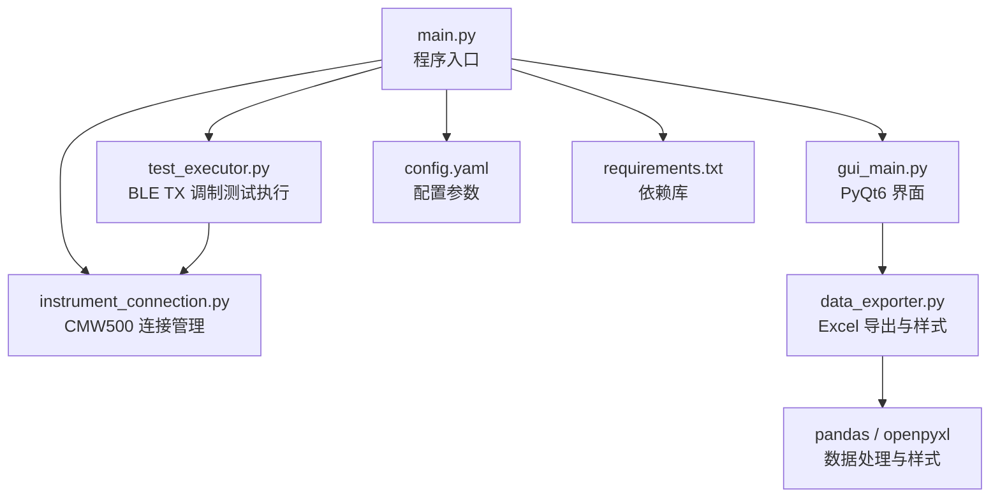
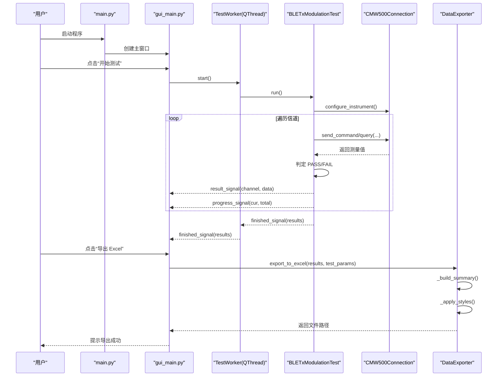
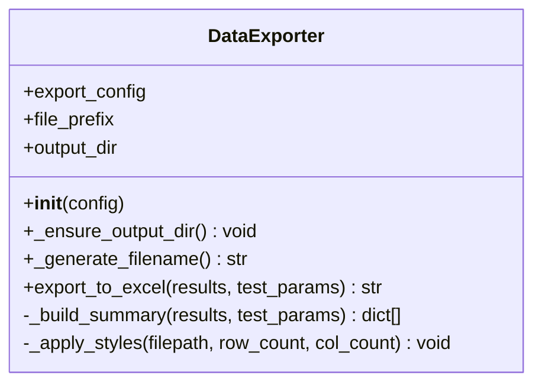
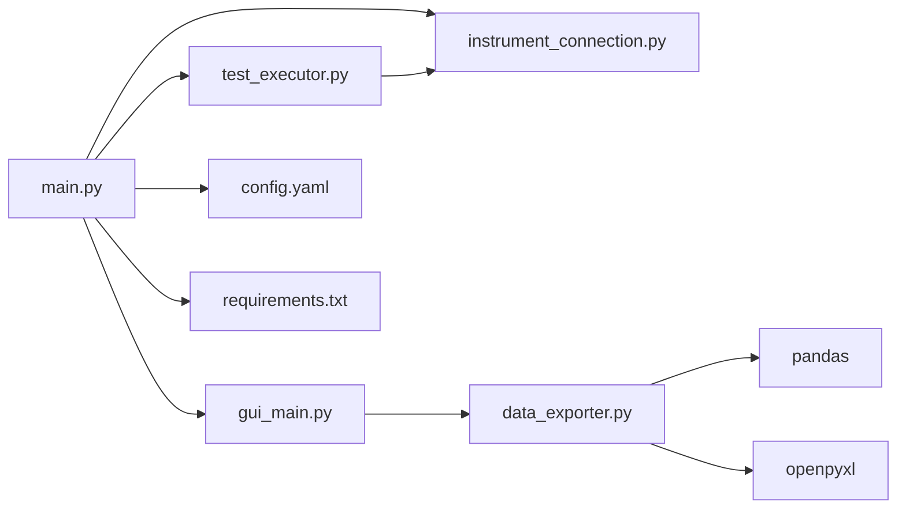

# 数据导出与报告

<cite>
**本文引用的文件**   
- [data_exporter.py](file://data_exporter.py)
- [main.py](file://main.py)
- [gui_main.py](file://gui_main.py)
- [test_executor.py](file://test_executor.py)
- [instrument_connection.py](file://instrument_connection.py)
- [config.yaml](file://config.yaml)
- [requirements.txt](file://requirements.txt)
</cite>

## 目录
1. [简介](#简介)
2. [项目结构](#项目结构)
3. [核心组件](#核心组件)
4. [架构总览](#架构总览)
5. [详细组件分析](#详细组件分析)
6. [依赖关系分析](#依赖关系分析)
7. [性能考虑](#性能考虑)
8. [故障排查指南](#故障排查指南)
9. [结论](#结论)
10. [附录](#附录)

## 简介
本文件聚焦于“数据导出与报告”子系统，围绕 DataExporter 类实现 Excel 报告生成、样式美化、数据统计分析等能力。文档将深入解析：
- 报告模板结构与字段映射
- 数据格式化规则与判定逻辑
- 统计摘要计算方法
- pandas 与 openpyxl 的使用方式与优化技巧
- 自定义报告模板与样式定制方法
- 批量数据处理、过滤与报表自动化方案
- 报告质量检查与数据完整性验证方法

## 项目结构
本项目采用分层组织：入口层（main.py）、GUI 层（gui_main.py）、测试执行层（test_executor.py）、仪器连接层（instrument_connection.py）、数据导出层（data_exporter.py），以及配置与依赖清单（config.yaml、requirements.txt）。

图表来源
- [main.py:1-357](file://main.py#L1-L357)
- [gui_main.py:1-667](file://gui_main.py#L1-L667)
- [test_executor.py:1-261](file://test_executor.py#L1-L261)
- [instrument_connection.py:1-216](file://instrument_connection.py#L1-L216)
- [data_exporter.py:1-283](file://data_exporter.py#L1-L283)
- [config.yaml:1-79](file://config.yaml#L1-L79)
- [requirements.txt:1-12](file://requirements.txt#L1-L12)

章节来源
- [main.py:1-357](file://main.py#L1-L357)
- [config.yaml:1-79](file://config.yaml#L1-L79)
- [requirements.txt:1-12](file://requirements.txt#L1-L12)

## 核心组件
- DataExporter：负责将测试结果导出为带样式的 Excel 文件，包含“测试数据”和“测试摘要”两个 Sheet，并自动计算通过/失败统计与总体判定。
- BLETxModulationTest：驱动 CMW500 进行 BLE TX 调制测量，逐信道采集指标并判定 PASS/FAIL。
- CMW500Connection：封装 LAN/GPIB/USB 三种接口通信，提供 SCPI 命令发送与查询。
- GUI 与 CLI：提供图形化与命令行两种交互模式，触发测试与导出流程。

章节来源
- [data_exporter.py:23-283](file://data_exporter.py#L23-L283)
- [test_executor.py:22-261](file://test_executor.py#L22-L261)
- [instrument_connection.py:18-216](file://instrument_connection.py#L18-L216)
- [gui_main.py:75-667](file://gui_main.py#L75-L667)
- [main.py:117-242](file://main.py#L117-L242)

## 架构总览
下图展示了从用户操作到最终生成 Excel 报告的完整调用链，包括线程安全更新与回调机制。

图表来源
- [main.py:222-242](file://main.py#L222-L242)
- [gui_main.py:499-556](file://gui_main.py#L499-L556)
- [gui_main.py:28-73](file://gui_main.py#L28-L73)
- [test_executor.py:186-245](file://test_executor.py#L186-L245)
- [instrument_connection.py:85-132](file://instrument_connection.py#L85-L132)
- [data_exporter.py:81-139](file://data_exporter.py#L81-L139)

## 详细组件分析

### DataExporter 类详解
DataExporter 是数据导出与报告的核心，主要职责包括：
- 输出目录与文件名管理（含时间戳）
- 构建“测试数据”Sheet：按配置动态生成列名（名称+单位），填充数值与判定结果
- 构建“测试摘要”Sheet：汇总统计信息（测试时间、标准、信道范围、统计次数、各指标通过/失败数、总体判定）
- 应用样式：表头、边框、对齐、PASS/FAIL 着色、列宽自适应
- 使用 pandas 写入 Excel，openpyxl 加载工作簿进行样式处理

#### 关键方法与流程
- __init__：解析配置中的导出目录与前缀，兼容 PyInstaller 打包后的路径
- _ensure_output_dir：确保输出目录存在
- _generate_filename：生成带时间戳的文件名
- export_to_excel：组装 DataFrame，写入两页，调用样式美化
- _build_summary：统计各指标通过/失败数量，计算全部通过信道数与总体判定
- _apply_styles：设置字体、填充色、对齐、边框，自动调整列宽，保存工作簿

图表来源
- [data_exporter.py:23-283](file://data_exporter.py#L23-L283)

章节来源
- [data_exporter.py:41-79](file://data_exporter.py#L41-L79)
- [data_exporter.py:81-139](file://data_exporter.py#L81-L139)
- [data_exporter.py:141-202](file://data_exporter.py#L141-L202)
- [data_exporter.py:204-283](file://data_exporter.py#L204-L283)

#### 报告模板结构
- “测试数据”Sheet
  - 基础列：信道、测量时间
  - 指标列：每项指标的名称+单位（如“频率准确度 (kHz)”）
  - 判定列：对应指标的“名称 判定”，值为 PASS/FAIL/ERROR
- “测试摘要”Sheet
  - 基本信息：测试时间、测试标准、信道范围、统计次数
  - 指标统计：每项指标的通过/失败计数
  - 总体统计：全部通过信道数、有失败项信道数、总体判定（PASS/FAIL）

章节来源
- [data_exporter.py:95-139](file://data_exporter.py#L95-L139)
- [data_exporter.py:141-202](file://data_exporter.py#L141-L202)

#### 数据格式化规则
- 数值列：来自测试结果字典的键值，缺失时显示占位符
- 判定列：若结果包含 pass_fail 子字典则取对应键的值；否则标记为 ERROR
- 时间格式：统一为“年-月-日 时:分:秒”
- 列名动态生成：依据配置中 measurements 的 name 与 unit 拼接

章节来源
- [data_exporter.py:97-125](file://data_exporter.py#L97-L125)
- [config.yaml:46-71](file://config.yaml#L46-L71)

#### 统计摘要计算方法
- 逐项统计：遍历 results，对每个 key 在 pass_fail 中计数 PASS/FAIL
- 总体判定：当所有信道的 pass_fail 全部为 PASS 时，总体判定为 PASS，否则 FAIL
- 统计次数：来源于配置的 statistic_count，用于说明每个信道的平均样本数

章节来源
- [data_exporter.py:152-202](file://data_exporter.py#L152-L202)
- [config.yaml:38](file://config.yaml#L38)

#### 样式美化策略
- 表头：蓝色背景、白色加粗字体、居中对齐、细边框
- 数据区：常规字体、居中对齐、细边框
- 判定着色：PASS 浅绿背景深绿文字，FAIL 浅红背景深红文字
- 列宽自适应：按字符宽度计算（中文按 2 个字符计），限制最大宽度
- 摘要最后行：根据总体判定高亮显示

章节来源
- [data_exporter.py:204-283](file://data_exporter.py#L204-L283)

#### pandas 与 openpyxl 使用方式
- 使用 pandas.DataFrame 构建数据表，并通过 pd.ExcelWriter(engine="openpyxl") 写入多 Sheet
- 使用 openpyxl.load_workbook 打开已生成的 Excel，应用样式后保存

章节来源
- [data_exporter.py:131-139](file://data_exporter.py#L131-L139)
- [data_exporter.py:213-283](file://data_exporter.py#L213-L283)

#### 性能优化技巧
- 减少重复对象创建：样式常量在类级别定义，避免每次实例化重复构造
- 控制列宽计算复杂度：仅遍历必要行列，限制最大宽度避免过长渲染
- 使用 openpyxl 的迭代器 iter_rows 简化摘要区域样式设置
- 在大数据量场景下，可考虑分批写入或延迟样式应用（当前实现适合中小规模报告）

章节来源
- [data_exporter.py:26-39](file://data_exporter.py#L26-L39)
- [data_exporter.py:240-248](file://data_exporter.py#L240-L248)
- [data_exporter.py:261-266](file://data_exporter.py#L261-L266)

#### 自定义报告模板与样式定制
- 新增指标：在 config.yaml 的 measurements 中添加新键（name、unit、upper_limit、lower_limit），并在 DataExporter 的 measurement_keys 列表中加入该键
- 新增列：在 export_to_excel 的数据构建循环中扩展 measurement_keys 即可自动生成列与判定列
- 样式定制：修改类级样式常量（颜色、字体、边框、对齐），或在 _apply_styles 中增加条件判断以支持更多状态（如 WARNING）
- 模板扩展：可在 _build_summary 中追加新的统计行或分组统计

章节来源
- [config.yaml:46-71](file://config.yaml#L46-L71)
- [data_exporter.py:105-122](file://data_exporter.py#L105-L122)
- [data_exporter.py:26-39](file://data_exporter.py#L26-L39)
- [data_exporter.py:141-202](file://data_exporter.py#L141-L202)

#### 批量数据处理、过滤与报表自动化
- 批量处理：export_to_excel 接收 results 列表，内部构建 DataFrame 一次性写入，天然支持批量
- 数据过滤：可在调用前对 results 进行筛选（例如只保留特定信道或特定日期范围），再传入 exporter
- 报表自动化：结合定时任务或外部调度器，周期性运行 main.py 的 CLI 模式，自动触发测试与导出

章节来源
- [data_exporter.py:81-139](file://data_exporter.py#L81-L139)
- [main.py:117-220](file://main.py#L117-L220)

#### 报告质量检查与数据完整性验证
- 完整性校验：在 _build_summary 中统计 PASS/FAIL 总数，并与总信道数对比，确保无遗漏
- 异常处理：当某项测量读取失败时，pass_fail 标记为 ERROR，便于后续定位问题
- 日志记录：GUI 与 CLI 均会输出进度与错误信息，辅助快速诊断
- 建议增强：可增加对空值或缺失列的检查，并在导出前打印校验报告

章节来源
- [data_exporter.py:172-202](file://data_exporter.py#L172-L202)
- [test_executor.py:166-184](file://test_executor.py#L166-L184)
- [gui_main.py:537-556](file://gui_main.py#L537-L556)

### 测试执行与数据源（BLETxModulationTest）
- 配置仪器：复位、选择 BT TX 调制测量、设置突发类型、PHY、统计次数、数据包类型
- 单信道测量：设置信道、启动测量、等待完成、读取各项指标并四舍五入
- 判定逻辑：基于配置的 upper_limit 与 lower_limit，比较绝对值决定 PASS/FAIL
- 回调机制：向 GUI 推送日志、进度与单信道结果，支持中断停止

章节来源
- [test_executor.py:76-104](file://test_executor.py#L76-L104)
- [test_executor.py:105-184](file://test_executor.py#L105-L184)
- [test_executor.py:186-245](file://test_executor.py#L186-L245)

### 仪器连接（CMW500Connection）
- 资源地址构建：LAN/GPIB/USB 三种格式
- 连接与断开：建立 VISA 连接、查询 *IDN? 验证、关闭连接
- 序列号读取：解析 *IDN? 返回字符串
- 命令发送与查询：send_command 与 query 封装

章节来源
- [instrument_connection.py:55-75](file://instrument_connection.py#L55-L75)
- [instrument_connection.py:85-132](file://instrument_connection.py#L85-L132)
- [instrument_connection.py:161-190](file://instrument_connection.py#L161-L190)
- [instrument_connection.py:192-216](file://instrument_connection.py#L192-L216)

### GUI 与 CLI 集成
- GUI：QThread 执行测试，信号槽更新表格与进度，导出按钮调用 DataExporter
- CLI：交互式命令，支持 connect/disconnect/test/stop/quit，完成后自动导出

章节来源
- [gui_main.py:28-73](file://gui_main.py#L28-L73)
- [gui_main.py:499-556](file://gui_main.py#L499-L556)
- [main.py:117-220](file://main.py#L117-L220)

## 依赖关系分析

图表来源
- [main.py:1-357](file://main.py#L1-L357)
- [gui_main.py:1-667](file://gui_main.py#L1-L667)
- [test_executor.py:1-261](file://test_executor.py#L1-L261)
- [instrument_connection.py:1-216](file://instrument_connection.py#L1-L216)
- [data_exporter.py:1-283](file://data_exporter.py#L1-L283)
- [config.yaml:1-79](file://config.yaml#L1-L79)
- [requirements.txt:1-12](file://requirements.txt#L1-L12)

章节来源
- [requirements.txt:1-12](file://requirements.txt#L1-L12)

## 性能考虑
- 样式应用开销：openpyxl 样式遍历在大行数时可能较慢，建议仅在必要时应用复杂样式，或使用 xlwt/xlsxwriter 替代（需权衡功能）
- 列宽计算：中文字符按双倍宽度计算，避免过宽导致渲染缓慢
- 内存占用：DataFrame 一次性构建，适合中小规模数据；超大规模时可考虑流式写入或分片导出
- I/O 优化：确保输出目录权限与磁盘空间充足，避免频繁小文件写入

[本节为通用指导，不直接分析具体文件]

## 故障排查指南
- 配置文件缺失或格式错误：main.py 会在加载 config.yaml 时抛出运行时错误，请确认文件位置与 YAML 语法
- 仪器连接失败：instrument_connection.py 捕获 VISA 错误并提供提示信息，检查网络/IP、GPIB 地址、USB 驱动
- 导出失败：GUI 与 CLI 均捕获异常并提示，检查输出目录权限与 openpyxl 安装情况
- 数据不完整：查看日志与“测试摘要”的总体判定，定位失败信道与指标

章节来源
- [main.py:85-115](file://main.py#L85-L115)
- [instrument_connection.py:112-132](file://instrument_connection.py#L112-L132)
- [gui_main.py:537-556](file://gui_main.py#L537-L556)

## 结论
DataExporter 提供了完整的 Excel 报告生成能力，涵盖数据格式化、统计摘要与样式美化。配合 BLETxModulationTest 与 CMW500Connection，系统实现了从仪器测量到报告输出的端到端自动化。通过合理的配置与扩展点，用户可以轻松定制报告模板与样式，满足多样化需求。建议在大数据量场景进一步优化样式与 I/O 性能，并增强数据完整性校验与质量检查机制。

[本节为总结性内容，不直接分析具体文件]

## 附录

### 配置项参考（节选）
- instrument.interface_type：默认接口类型（LAN/GPIB/USB）
- test_params.measurements：各项指标的名称、单位与上下限
- export.output_dir：导出目录
- export.file_prefix：Excel 文件名前缀

章节来源
- [config.yaml:1-79](file://config.yaml#L1-L79)

### 依赖库说明
- pyvisa/pyvisa-py：仪器通信后端
- PyQt6：GUI 框架
- pandas/openpyxl：数据处理与 Excel 读写
- PyYAML：配置文件解析
- matplotlib：可选绘图
- pyinstaller：打包工具

章节来源
- [requirements.txt:1-12](file://requirements.txt#L1-L12)