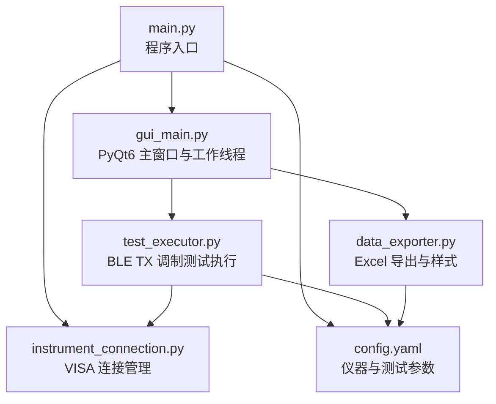
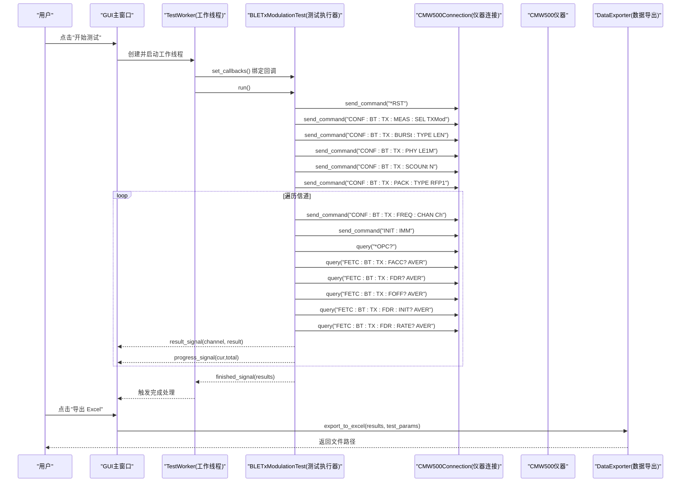
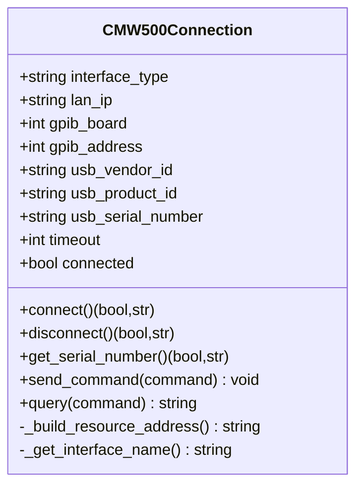
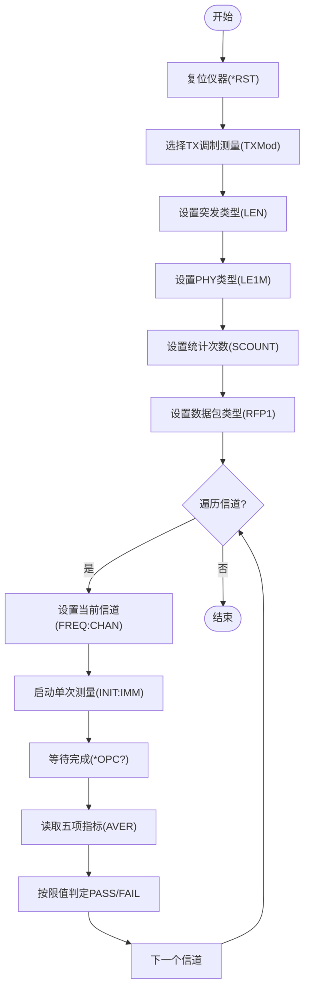
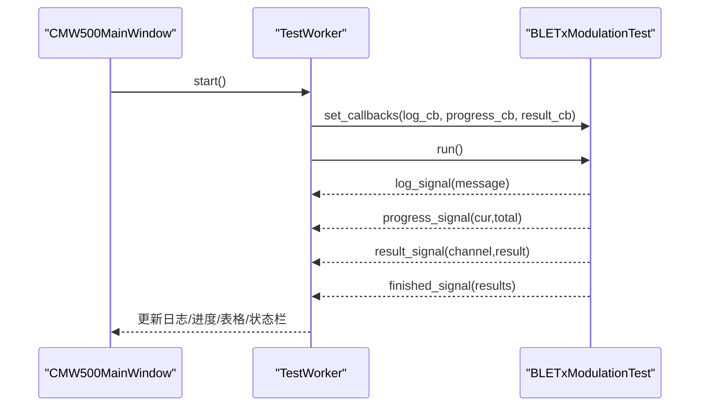
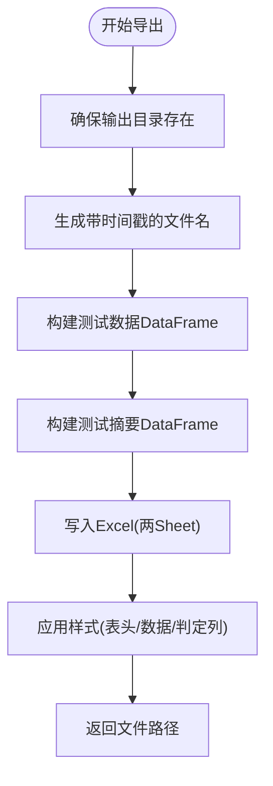
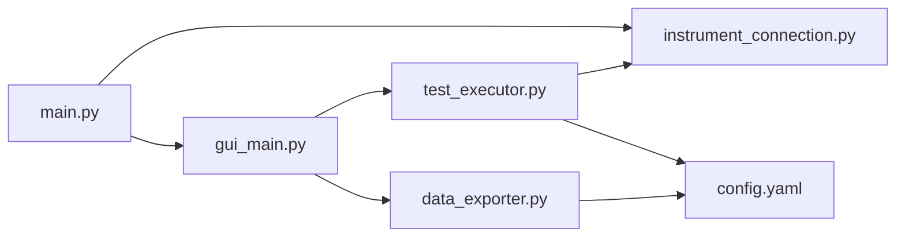
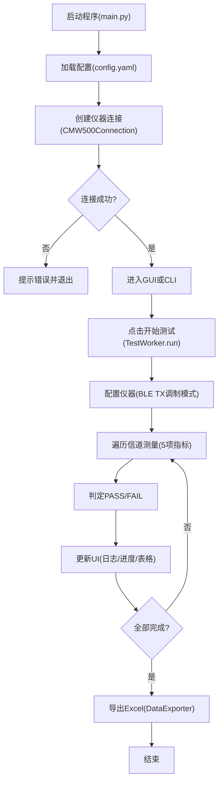

# BLE TX 调制测试原理

<cite>
**本文引用的文件列表**
- [main.py](file://main.py)
- [gui_main.py](file://gui_main.py)
- [test_executor.py](file://test_executor.py)
- [instrument_connection.py](file://instrument_connection.py)
- [data_exporter.py](file://data_exporter.py)
- [config.yaml](file://config.yaml)
- [requirements.txt](file://requirements.txt)
- [build_exe.py](file://build_exe.py)
</cite>

## 目录
1. [引言](#引言)
2. [项目结构](#项目结构)
3. [核心组件](#核心组件)
4. [架构总览](#架构总览)
5. [详细组件分析](#详细组件分析)
6. [依赖关系分析](#依赖关系分析)
7. [性能与稳定性考量](#性能与稳定性考量)
8. [故障排查指南](#故障排查指南)
9. [结论](#结论)
10. [附录：SCPI 指令与配置参数说明](#附录scpi-指令与配置参数说明)

## 引言
本技术文档围绕蓝牙低功耗（BLE）TX 调制测试的原理与实践，结合 CMW500 仪器的测量模式与 SCPI 指令集，系统阐述以下要点：
- 基本概念与测量指标：频率准确度、频率漂移、频率偏移、初始频率漂移、最大漂移速率的物理意义与判定方法。
- CMW500 的 BLE TX 调制测量模式与 SCPI 指令工作原理。
- 测试配置参数对测量结果的影响：突发类型、PHY 类型、统计次数、数据包类型与信道范围。
- 测试流程与时序图，帮助开发者理解从仪器连接、参数配置、逐信道测量到结果导出与可视化的完整链路。

## 项目结构
本项目采用模块化设计，按职责分层组织：
- 入口与界面：main.py 负责程序启动、命令行/图形界面选择；gui_main.py 提供 PyQt6 主窗口与线程化测试执行。
- 仪器控制：instrument_connection.py 封装 VISA 通信，支持 LAN/GPIB/USB 三种接口。
- 测试执行：test_executor.py 实现 BLE TX 调制测试流程与 SCPI 指令序列。
- 数据导出：data_exporter.py 将测试结果导出为 Excel，并生成摘要。
- 配置与打包：config.yaml 定义仪器与测试参数；requirements.txt 列出依赖；build_exe.py 使用 PyInstaller 打包。

图表来源
- [main.py:295-336](file://main.py#L295-L336)
- [gui_main.py:28-73](file://gui_main.py#L28-L73)
- [instrument_connection.py:18-132](file://instrument_connection.py#L18-L132)
- [test_executor.py:22-104](file://test_executor.py#L22-L104)
- [data_exporter.py:23-139](file://data_exporter.py#L23-L139)
- [config.yaml:1-79](file://config.yaml#L1-L79)

章节来源
- [main.py:295-336](file://main.py#L295-L336)
- [gui_main.py:28-73](file://gui_main.py#L28-L73)
- [instrument_connection.py:18-132](file://instrument_connection.py#L18-L132)
- [test_executor.py:22-104](file://test_executor.py#L22-L104)
- [data_exporter.py:23-139](file://data_exporter.py#L23-L139)
- [config.yaml:1-79](file://config.yaml#L1-L79)

## 核心组件
- 仪器连接层（CMW500Connection）：统一封装 VISA 资源地址构建、连接/断开、命令发送与查询，支持 LAN/GPIB/USB 三种接口。
- 测试执行器（BLETxModulationTest）：根据配置初始化 CMW500 的 BLE TX 调制测量模式，遍历信道进行测量，读取五项频率指标并进行 PASS/FAIL 判定。
- GUI 工作线程（TestWorker）：在独立线程中运行测试，通过信号回调更新 UI 日志、进度与结果表格。
- 数据导出器（DataExporter）：将测试结果写入 Excel，包含“测试数据”和“测试摘要”两个 Sheet，并对单元格进行样式美化。
- 配置中心（config.yaml）：集中管理仪器连接参数、测试标准、PHY/突发/数据包类型、统计次数、信道范围与各项指标的限值。

章节来源
- [instrument_connection.py:18-132](file://instrument_connection.py#L18-L132)
- [test_executor.py:22-104](file://test_executor.py#L22-L104)
- [gui_main.py:28-73](file://gui_main.py#L28-L73)
- [data_exporter.py:23-139](file://data_exporter.py#L23-L139)
- [config.yaml:27-79](file://config.yaml#L27-L79)

## 架构总览
下图展示了从用户操作到仪器测量、再到结果展示与导出的整体流程。GUI 通过 TestWorker 调用测试执行器，后者通过仪器连接层发送 SCPI 指令完成测量，并将结果回传给 GUI 显示与导出。

图表来源
- [gui_main.py:499-528](file://gui_main.py#L499-L528)
- [test_executor.py:76-104](file://test_executor.py#L76-L104)
- [test_executor.py:105-184](file://test_executor.py#L105-L184)
- [test_executor.py:186-245](file://test_executor.py#L186-L245)
- [data_exporter.py:81-139](file://data_exporter.py#L81-L139)

## 详细组件分析

### 仪器连接层（CMW500Connection）
- 功能：根据接口类型构造 VISA 资源地址，建立/断开连接，发送 SCPI 命令与查询。
- 关键行为：
  - 资源地址构建：LAN 使用 TCPIP0::IP::inst0::INSTR；GPIB 使用 GPIB<board>::<address>::INSTR；USB 使用 USB0::<VID>::<PID>::<serial>::INSTR。
  - 连接验证：通过 *IDN? 查询仪器标识，确认通信有效。
  - 错误提示：针对不同接口的常见错误给出定位建议。

图表来源
- [instrument_connection.py:18-132](file://instrument_connection.py#L18-L132)

章节来源
- [instrument_connection.py:18-132](file://instrument_connection.py#L18-L132)

### 测试执行器（BLETxModulationTest）
- 功能：配置 CMW500 为 BLE TX 调制测量模式，逐信道测量五项频率指标，依据配置限值进行 PASS/FAIL 判定。
- 关键流程：
  - 仪器配置：复位、选择 TX 调制测量、设置突发类型（LEN）、PHY 类型（LE1M）、统计次数（SCOUNT）、数据包类型（RFP1）。
  - 单信道测量：设置信道、立即启动测量（INIT:IMM）、等待完成（*OPC?）、读取五项指标（FACC/FDR/FOFF/FDR:INIT/FDR:RATE），取绝对值后与上限比较。
  - 循环扫描：遍历 channel_start ~ channel_end，支持中途停止。

图表来源
- [test_executor.py:76-104](file://test_executor.py#L76-L104)
- [test_executor.py:105-184](file://test_executor.py#L105-L184)
- [test_executor.py:186-245](file://test_executor.py#L186-L245)

章节来源
- [test_executor.py:76-104](file://test_executor.py#L76-L104)
- [test_executor.py:105-184](file://test_executor.py#L105-L184)
- [test_executor.py:186-245](file://test_executor.py#L186-L245)

### GUI 工作线程（TestWorker）与主窗口（CMW500MainWindow）
- 功能：在独立线程中执行测试，通过 Qt 信号机制向主线程推送日志、进度与结果，避免阻塞 UI。
- 关键交互：
  - 信号：log_signal、progress_signal、result_signal、finished_signal、error_signal。
  - 槽函数：接收信号后更新日志区、进度条、结果表格，并在完成后启用导出按钮。

图表来源
- [gui_main.py:28-73](file://gui_main.py#L28-L73)
- [gui_main.py:499-528](file://gui_main.py#L499-L528)
- [gui_main.py:561-629](file://gui_main.py#L561-L629)

章节来源
- [gui_main.py:28-73](file://gui_main.py#L28-L73)
- [gui_main.py:499-528](file://gui_main.py#L499-L528)
- [gui_main.py:561-629](file://gui_main.py#L561-L629)

### 数据导出器（DataExporter）
- 功能：将测试结果导出为 Excel，包含“测试数据”与“测试摘要”两个 Sheet，并对表头、数据区域与判定列进行样式美化。
- 关键行为：
  - 文件名自动生成时间戳，避免覆盖历史数据。
  - 摘要统计：汇总各指标通过/失败数量、总体判定等。
  - 样式应用：表头蓝色背景、PASS/FAIL 着色、自动列宽调整。

图表来源
- [data_exporter.py:81-139](file://data_exporter.py#L81-L139)
- [data_exporter.py:141-202](file://data_exporter.py#L141-L202)
- [data_exporter.py:204-283](file://data_exporter.py#L204-L283)

章节来源
- [data_exporter.py:81-139](file://data_exporter.py#L81-L139)
- [data_exporter.py:141-202](file://data_exporter.py#L141-L202)
- [data_exporter.py:204-283](file://data_exporter.py#L204-L283)

## 依赖关系分析
- 外部库：pyvisa/pyvisa-py 用于仪器通信；PyQt6 用于 GUI；pandas/openpyxl 用于 Excel 处理；PyYAML 用于配置文件解析；matplotlib 可用于后续可视化扩展；pyinstaller 用于打包。
- 模块耦合：
  - main.py 依赖 instrument_connection、test_executor、data_exporter、gui_main。
  - gui_main.py 依赖 test_executor 与 data_exporter。
  - test_executor.py 依赖 instrument_connection 与 config.yaml。
  - data_exporter.py 依赖 config.yaml。

图表来源
- [main.py:295-336](file://main.py#L295-L336)
- [gui_main.py:28-73](file://gui_main.py#L28-L73)
- [test_executor.py:22-104](file://test_executor.py#L22-L104)
- [data_exporter.py:23-139](file://data_exporter.py#L23-L139)
- [config.yaml:1-79](file://config.yaml#L1-L79)

章节来源
- [requirements.txt:1-12](file://requirements.txt#L1-L12)
- [build_exe.py:21-52](file://build_exe.py#L21-L52)

## 性能与稳定性考量
- 通信超时：通过配置项 timeout 控制 VISA 通信超时，避免长时间阻塞。
- 统计次数：statistic_count 影响单次测量的平均样本数，增大可提高稳定性但增加耗时。
- 信道范围：channel_start/channel_end 决定测试时长，合理缩小范围可提升效率。
- 异常处理：每个指标读取均包裹 try/except，失败时记录 ERROR 并继续后续测量，保证鲁棒性。
- 线程安全：GUI 与测试逻辑分离，通过信号/槽机制更新 UI，避免界面卡顿。

[本节为通用指导，不直接分析具体文件]

## 故障排查指南
- 连接失败：
  - 检查接口类型与地址是否正确（LAN IP、GPIB Board/Address、USB VID/PID/SN）。
  - 查看错误信息中的提示，确认线缆与驱动安装情况。
- 未获取到仪器信息：
  - 确认 *IDN? 查询是否成功，网络或总线连通性是否正常。
- 测量结果为 ERROR：
  - 检查 SCPI 指令是否被仪器固件支持，必要时调整指令版本。
  - 确认统计次数与数据包类型是否符合被测设备能力。
- 导出失败：
  - 检查输出目录权限与磁盘空间，确认 openpyxl 依赖可用。

章节来源
- [instrument_connection.py:85-132](file://instrument_connection.py#L85-L132)
- [instrument_connection.py:161-190](file://instrument_connection.py#L161-L190)
- [test_executor.py:105-184](file://test_executor.py#L105-L184)
- [data_exporter.py:204-283](file://data_exporter.py#L204-L283)

## 结论
本项目以模块化方式实现了基于 CMW500 的 BLE TX 调制自动化测试，涵盖仪器连接、参数配置、逐信道测量、结果判定与导出。通过合理的配置与异常处理，能够在多种接口环境下稳定运行，并提供直观的 GUI 与格式化的 Excel 报告，便于工程人员快速评估与归档测试结果。

[本节为总结性内容，不直接分析具体文件]

## 附录：SCPI 指令与配置参数说明

### 关键 SCPI 指令（按执行顺序）
- 复位仪器：*RST
- 选择测量模式：CONF:BT:TX:MEAS:SEL TXMod
- 设置突发类型：CONF:BT:TX:BURSt:TYPE LEN
- 设置 PHY 类型：CONF:BT:TX:PHY LE1M
- 设置统计次数：CONF:BT:TX:SCOUNt N
- 设置数据包类型：CONF:BT:TX:PACK:TYPE RFP1
- 设置信道：CONF:BT:TX:FREQ:CHAN Ch
- 启动测量：INIT:IMM
- 等待完成：*OPC?
- 读取指标（AVER 表示取平均）：
  - 频率准确度：FETC:BT:TX:FACC? AVER
  - 频率漂移：FETC:BT:TX:FDR? AVER
  - 频率偏移：FETC:BT:TX:FOFF? AVER
  - 初始频率漂移：FETC:BT:TX:FDR:INIT? AVER
  - 最大漂移速率：FETC:BT:TX:FDR:RATE? AVER

章节来源
- [test_executor.py:76-104](file://test_executor.py#L76-L104)
- [test_executor.py:105-184](file://test_executor.py#L105-L184)

### 配置参数对测量结果的影响
- 突发类型（burst_type）：设置为 Low Energy，匹配 BLE 协议突发特性，影响测量窗口与采样策略。
- PHY 类型（phy_type）：设置为 LE 1Msps，决定射频带宽与解调参数，直接影响频率指标精度。
- 统计次数（statistic_count）：增大可降低随机噪声影响，提高稳定性，但延长测试时间。
- 数据包类型（packet_type）：RF PHY Test Reference Packet 1，提供标准化参考波形，确保测量一致性。
- 信道范围（channel_start/channel_end）：决定测试覆盖范围，影响总测试时长与结果分布。
- 判定限值（measurements.upper_limit/lower_limit）：逐项设定阈值，超过上限或低于下限即 FAIL。

章节来源
- [config.yaml:27-79](file://config.yaml#L27-L79)

### 测试流程图（端到端）

图表来源
- [main.py:295-336](file://main.py#L295-L336)
- [gui_main.py:499-528](file://gui_main.py#L499-L528)
- [test_executor.py:186-245](file://test_executor.py#L186-L245)
- [data_exporter.py:81-139](file://data_exporter.py#L81-L139)