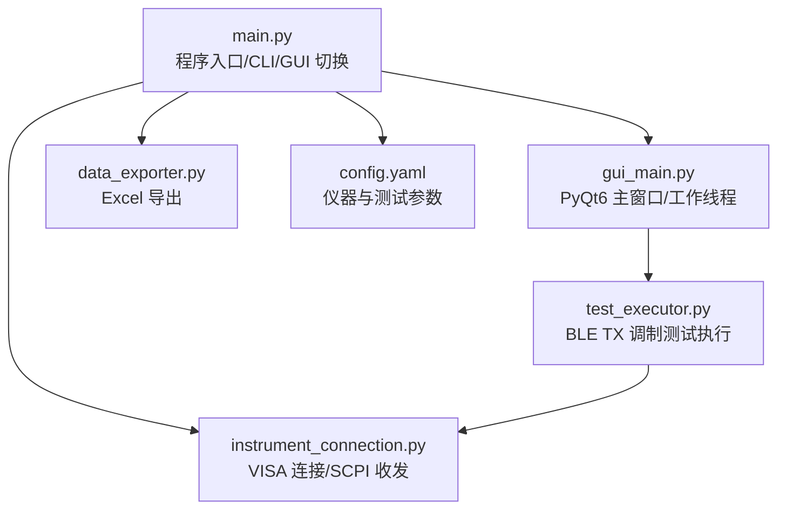
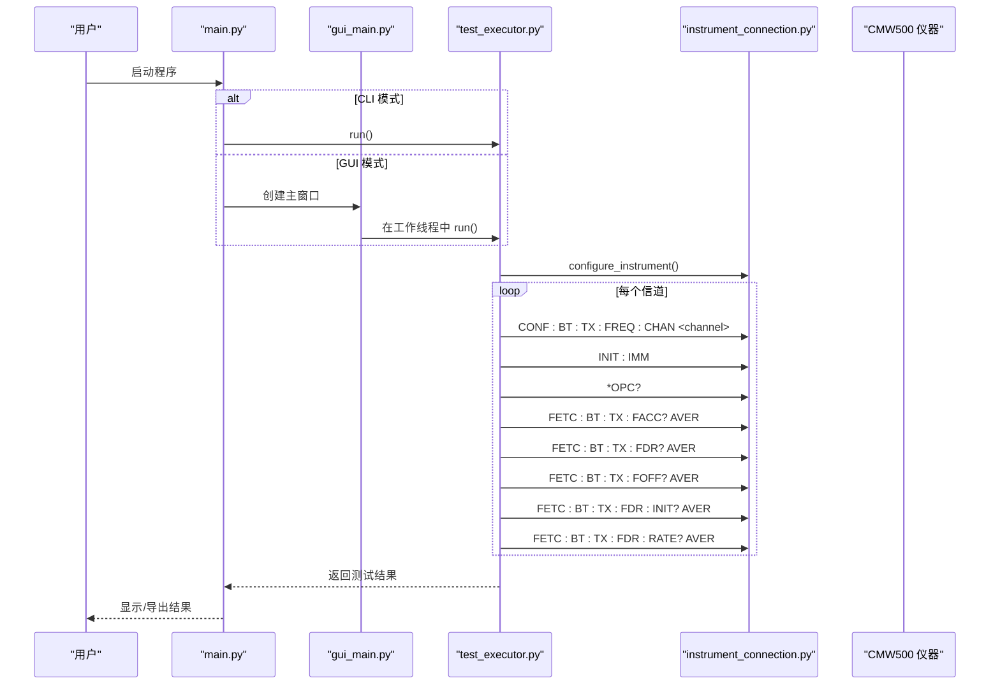
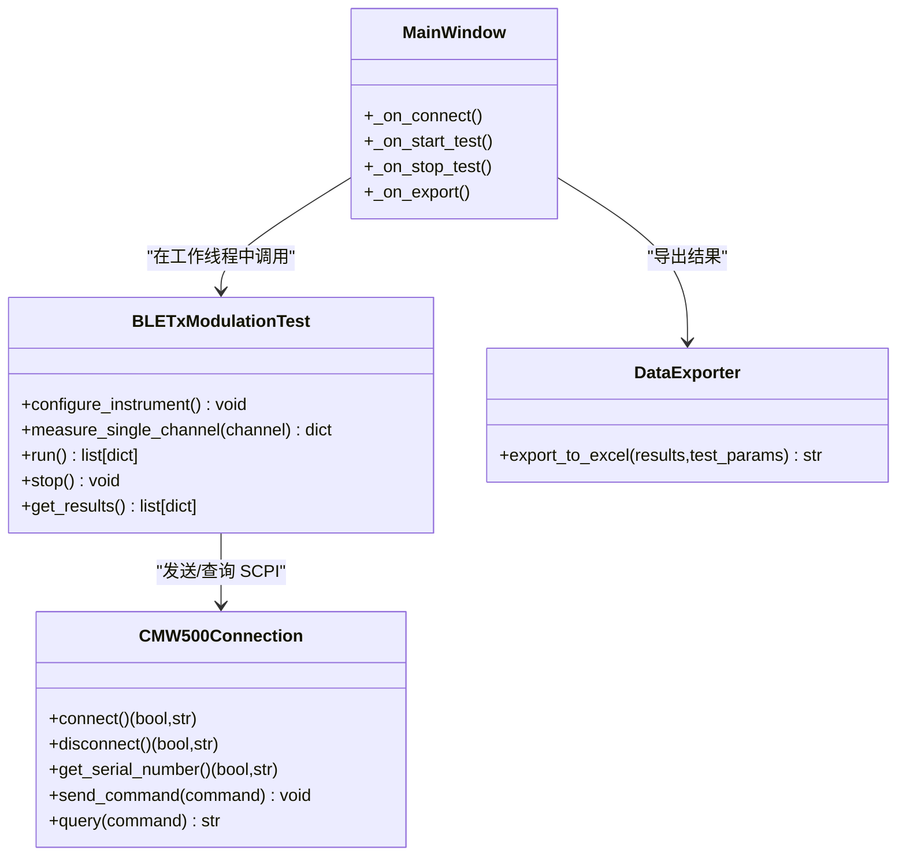
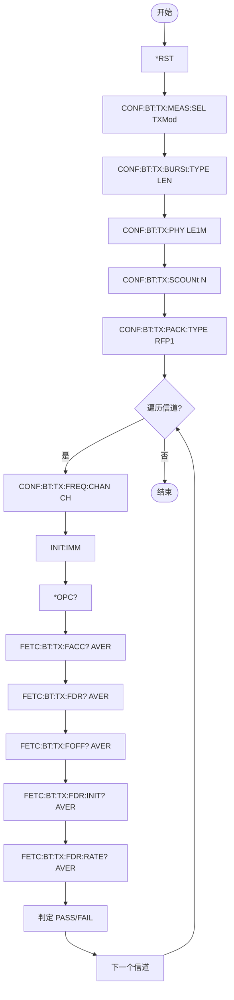

# SCPI 指令集参考

<cite>
**本文引用的文件**   
- [main.py](file://main.py)
- [instrument_connection.py](file://instrument_connection.py)
- [test_executor.py](file://test_executor.py)
- [gui_main.py](file://gui_main.py)
- [data_exporter.py](file://data_exporter.py)
- [config.yaml](file://config.yaml)
</cite>

## 目录
1. [简介](#简介)
2. [项目结构](#项目结构)
3. [核心组件](#核心组件)
4. [架构总览](#架构总览)
5. [详细组件分析](#详细组件分析)
6. [依赖关系分析](#依赖关系分析)
7. [性能与稳定性考虑](#性能与稳定性考虑)
8. [故障排除指南](#故障排除指南)
9. [结论](#结论)
10. [附录：完整指令清单与示例序列](#附录完整指令清单与示例序列)

## 简介
本参考文档基于仓库中的 CMW500 BLE TX 调制自动化测试工具，梳理并归纳了项目中实际使用的 SCPI 指令。内容覆盖配置类、测量类与查询类指令，说明其功能、语法、参数与返回值含义；给出执行顺序与依赖关系；提供完整的指令序列示例；总结常见错误与处理方法；并提供调试技巧与固件版本兼容性建议。

## 项目结构
本项目采用分层模块化设计：
- 入口与模式选择：main.py
- 仪器连接封装：instrument_connection.py（VISA 通信、SCPI 发送/查询）
- 测试执行逻辑：test_executor.py（BLE TX 调制测试流程与 SCPI 调用）
- GUI 界面：gui_main.py（PyQt6 交互、线程化执行）
- 数据导出：data_exporter.py（Excel 结果导出）
- 配置文件：config.yaml（接口、测试参数、限值等）

图表来源
- [main.py:295-336](file://main.py#L295-L336)
- [instrument_connection.py:18-133](file://instrument_connection.py#L18-L133)
- [test_executor.py:22-104](file://test_executor.py#L22-L104)
- [gui_main.py:75-120](file://gui_main.py#L75-L120)
- [data_exporter.py:23-92](file://data_exporter.py#L23-L92)
- [config.yaml:1-25](file://config.yaml#L1-L25)

章节来源
- [main.py:295-336](file://main.py#L295-L336)
- [config.yaml:1-25](file://config.yaml#L1-L25)

## 核心组件
- 仪器连接模块：负责 VISA 资源管理、多接口地址构造、连接/断开、通用 send_command/query 方法，以及 *IDN? 查询解析。
- 测试执行器：实现 BLE TX 调制测试流程，按信道遍历，逐信道配置与测量，汇总结果。
- GUI 与线程：在独立线程中运行测试，通过信号槽更新 UI，避免阻塞。
- 数据导出：将测试结果写入 Excel，包含“测试数据”和“测试摘要”两个 Sheet，并进行样式美化。

章节来源
- [instrument_connection.py:18-133](file://instrument_connection.py#L18-L133)
- [test_executor.py:22-104](file://test_executor.py#L22-L104)
- [gui_main.py:28-73](file://gui_main.py#L28-L73)
- [data_exporter.py:23-92](file://data_exporter.py#L23-L92)

## 架构总览
下图展示了从用户操作到仪器通信的端到端流程，包括 GUI 与 CLI 两条路径，最终都汇聚到 test_executor 与 instrument_connection。

图表来源
- [main.py:295-336](file://main.py#L295-L336)
- [gui_main.py:498-528](file://gui_main.py#L498-L528)
- [test_executor.py:76-184](file://test_executor.py#L76-L184)
- [instrument_connection.py:192-215](file://instrument_connection.py#L192-L215)

## 详细组件分析

### 仪器连接模块（instrument_connection.py）
- 支持 LAN/GPIB/USB 三种接口，自动构造 VISA 资源地址字符串。
- 提供 connect/disconnect、send_command、query 等方法。
- 使用 *IDN? 进行连通性验证与序列号读取。

关键职责
- 资源地址构建：根据接口类型生成 TCPIP/GPIB/USB 格式地址。
- 超时设置：统一设置通信超时。
- 异常处理：捕获 VISA 通信错误并给出友好提示。

章节来源
- [instrument_connection.py:55-75](file://instrument_connection.py#L55-L75)
- [instrument_connection.py:85-133](file://instrument_connection.py#L85-L133)
- [instrument_connection.py:192-215](file://instrument_connection.py#L192-L215)

### 测试执行器（test_executor.py）
- 负责 BLE TX 调制测试全流程：复位、选择测量类型、配置突发/PHY/统计次数/数据包类型、逐信道测量与判定。
- 单信道测量流程：设置信道 -> 立即触发测量 -> 等待完成 -> 读取各项指标 -> 判定 PASS/FAIL。

关键职责
- 配置仪器：发送一组初始化 SCPI 指令。
- 测量循环：遍历信道范围，收集结果并回调进度与日志。
- 容错处理：单项读取失败时记录为 None，并在判定中标记 ERROR。

章节来源
- [test_executor.py:76-104](file://test_executor.py#L76-L104)
- [test_executor.py:105-184](file://test_executor.py#L105-L184)
- [test_executor.py:186-245](file://test_executor.py#L186-L245)

### GUI 与线程（gui_main.py）
- 主窗口提供连接、开始/停止测试、导出 Excel 等操作。
- 测试在 QThread 中执行，通过 pyqtSignal 向主线程推送日志、进度、结果与错误。
- 表格实时展示各信道的数值与判定结果，支持颜色区分 PASS/FAIL/ERROR。

章节来源
- [gui_main.py:28-73](file://gui_main.py#L28-L73)
- [gui_main.py:498-528](file://gui_main.py#L498-L528)
- [gui_main.py:561-629](file://gui_main.py#L561-L629)

### 数据导出（data_exporter.py）
- 将测试结果导出为 Excel，包含“测试数据”和“测试摘要”两个 Sheet。
- 自动生成带时间戳的文件名，应用表头、边框、对齐与判定列着色等样式。

章节来源
- [data_exporter.py:81-139](file://data_exporter.py#L81-L139)
- [data_exporter.py:141-202](file://data_exporter.py#L141-L202)
- [data_exporter.py:204-283](file://data_exporter.py#L204-L283)

## 依赖关系分析
- main.py 作为入口，加载 config.yaml，实例化 CMW500Connection，并根据命令行参数进入 CLI 或 GUI 模式。
- gui_main.py 通过 TestWorker 在独立线程中调用 test_executor.py 的 BLETxModulationTest。
- test_executor.py 通过 instrument_connection.py 的 send_command/query 与仪器通信。
- data_exporter.py 仅依赖测试结果与配置，不直接访问仪器。

图表来源
- [instrument_connection.py:18-133](file://instrument_connection.py#L18-L133)
- [test_executor.py:22-104](file://test_executor.py#L22-L104)
- [gui_main.py:75-120](file://gui_main.py#L75-L120)
- [data_exporter.py:23-92](file://data_exporter.py#L23-L92)

章节来源
- [main.py:295-336](file://main.py#L295-L336)
- [gui_main.py:498-528](file://gui_main.py#L498-L528)
- [test_executor.py:186-245](file://test_executor.py#L186-L245)
- [data_exporter.py:81-139](file://data_exporter.py#L81-L139)

## 性能与稳定性考虑
- 通信超时：统一通过 timeout 控制，避免长时间阻塞。
- 单次测量同步：使用 *OPC? 确保测量完成后才读取结果，避免竞态。
- 逐项读取保护：对每项 FETC 查询使用 try/except，失败项置空并标记 ERROR，保证整体流程继续。
- 批量导出：使用 pandas/openpyxl 一次性写入并应用样式，减少 I/O 开销。

章节来源
- [instrument_connection.py:102-104](file://instrument_connection.py#L102-L104)
- [test_executor.py:121-164](file://test_executor.py#L121-L164)
- [data_exporter.py:131-139](file://data_exporter.py#L131-L139)

## 故障排除指南
常见问题与定位要点
- 无法连接仪器
  - 检查接口类型与地址是否正确（LAN IP、GPIB Board/Address、USB VID/PID/SN）。
  - 确认网络/驱动/线缆正常，查看 VISA 层错误信息。
- 读取序列号失败
  - 确认已建立连接，*IDN? 返回格式是否符合预期。
- 测量结果为空或全部 ERROR
  - 检查是否成功发送 INIT:IMM 并等待 *OPC? 返回。
  - 核对当前信道配置是否正确。
  - 关注单项读取异常时的异常堆栈。
- 导出失败
  - 检查输出目录权限与路径是否存在。
  - 确认 openpyxl/pandas 可用。

章节来源
- [instrument_connection.py:112-133](file://instrument_connection.py#L112-L133)
- [instrument_connection.py:161-190](file://instrument_connection.py#L161-L190)
- [test_executor.py:121-184](file://test_executor.py#L121-L184)
- [data_exporter.py:63-79](file://data_exporter.py#L63-L79)

## 结论
本项目围绕 CMW500 的蓝牙 TX 调制测量，构建了从连接、配置、测量到结果导出的完整链路。SCPI 指令集中在配置与测量两类，配合标准系统命令完成设备复位、状态同步与信息查询。通过合理的异常处理与线程化执行，保证了测试流程的健壮性与用户体验。

## 附录：完整指令清单与示例序列

### 一、系统命令（查询/状态）
- *IDN?
  - 功能：查询仪器标识（制造商,型号,序列号,固件版本）。
  - 语法：*IDN?
  - 返回值：逗号分隔的字符串。
  - 用途：连通性验证、序列号读取。
- *RST
  - 功能：复位仪器至默认状态。
  - 语法：*RST
  - 返回值：无。
  - 用途：测试前初始化。
- *OPC?
  - 功能：查询操作是否完成，完成后返回 “1”。
  - 语法：*OPC?
  - 返回值：字符串 “1”。
  - 用途：同步测量完成。

章节来源
- [instrument_connection.py:105-110](file://instrument_connection.py#L105-L110)
- [instrument_connection.py:174-184](file://instrument_connection.py#L174-L184)
- [test_executor.py:84-86](file://test_executor.py#L84-L86)
- [test_executor.py:121-123](file://test_executor.py#L121-L123)

### 二、配置类指令（BLE TX 调制）
- CONF:BT:TX:MEAS:SEL TXMod
  - 功能：选择蓝牙 TX 调制测量。
  - 语法：CONF:BT:TX:MEAS:SEL TXMod
  - 返回值：无。
- CONF:BT:TX:BURSt:TYPE LEN
  - 功能：设置突发类型为 Low Energy。
  - 语法：CONF:BT:TX:BURSt:TYPE LEN
  - 返回值：无。
- CONF:BT:TX:PHY LE1M
  - 功能：设置 PHY 类型为 LE 1Msps。
  - 语法：CONF:BT:TX:PHY LE1M
  - 返回值：无。
- CONF:BT:TX:SCOUNt N
  - 功能：设置统计平均次数 N。
  - 语法：CONF:BT:TX:SCOUNt N
  - 参数：N 为正整数。
  - 返回值：无。
- CONF:BT:TX:PACK:TYPE RFP1
  - 功能：设置数据包类型为 RF PHY Test Reference Packet 1。
  - 语法：CONF:BT:TX:PACK:TYPE RFP1
  - 返回值：无。
- CONF:BT:TX:FREQ:CHAN CH
  - 功能：设置当前测量信道 CH（BLE 0~39）。
  - 语法：CONF:BT:TX:FREQ:CHAN CH
  - 参数：CH 为整数。
  - 返回值：无。

章节来源
- [test_executor.py:88-101](file://test_executor.py#L88-L101)
- [test_executor.py:115-116](file://test_executor.py#L115-L116)

### 三、测量触发与查询类指令
- INIT:IMM
  - 功能：立即触发一次测量。
  - 语法：INIT:IMM
  - 返回值：无。
- FETC:BT:TX:FACC? AVER
  - 功能：读取频率准确度平均值。
  - 语法：FETC:BT:TX:FACC? AVER
  - 返回值：浮点数（kHz）。
- FETC:BT:TX:FDR? AVER
  - 功能：读取频率漂移平均值。
  - 语法：FETC:BT:TX:FDR? AVER
  - 返回值：浮点数（kHz）。
- FETC:BT:TX:FOFF? AVER
  - 功能：读取频率偏移平均值。
  - 语法：FETC:BT:TX:FOFF? AVER
  - 返回值：浮点数（kHz）。
- FETC:BT:TX:FDR:INIT? AVER
  - 功能：读取初始频率漂移平均值。
  - 语法：FETC:BT:TX:FDR:INIT? AVER
  - 返回值：浮点数（kHz）。
- FETC:BT:TX:FDR:RATE? AVER
  - 功能：读取最大漂移速率平均值。
  - 语法：FETC:BT:TX:FDR:RATE? AVER
  - 返回值：浮点数（kHz）。

章节来源
- [test_executor.py:118-164](file://test_executor.py#L118-L164)

### 四、典型执行顺序与依赖关系
- 初始化阶段
  - *RST → 等待 → 选择测量类型 → 设置突发/PHY/统计次数/数据包类型。
- 单信道测量
  - 设置信道 → 触发测量 → 等待完成 → 读取五项指标 → 判定 PASS/FAIL。
- 依赖关系
  - 必须先完成配置再触发测量；*OPC? 必须在 INIT:IMM 之后用于同步；读取结果需在测量完成后进行。

图表来源
- [test_executor.py:76-184](file://test_executor.py#L76-L184)

### 五、完整指令序列示例（单个信道）
- 复位与配置
  - *RST
  - CONF:BT:TX:MEAS:SEL TXMod
  - CONF:BT:TX:BURSt:TYPE LEN
  - CONF:BT:TX:PHY LE1M
  - CONF:BT:TX:SCOUNt N
  - CONF:BT:TX:PACK:TYPE RFP1
- 单信道测量
  - CONF:BT:TX:FREQ:CHAN CH
  - INIT:IMM
  - *OPC?
  - FETC:BT:TX:FACC? AVER
  - FETC:BT:TX:FDR? AVER
  - FETC:BT:TX:FOFF? AVER
  - FETC:BT:TX:FDR:INIT? AVER
  - FETC:BT:TX:FDR:RATE? AVER

章节来源
- [test_executor.py:84-101](file://test_executor.py#L84-L101)
- [test_executor.py:115-164](file://test_executor.py#L115-L164)

### 六、常见错误代码与处理方法
- 通信层错误（VISAIOError）
  - 现象：连接失败、查询超时、读写失败。
  - 处理：检查接口地址、网络/驱动/线缆；适当增大 timeout；重试机制。
- 仪器未连接
  - 现象：发送/查询前抛出连接错误。
  - 处理：先执行 connect，确认 connected 标志为真。
- 测量结果缺失
  - 现象：某项指标为 None，判定为 ERROR。
  - 处理：检查 INIT:*OPC? 同步是否成功；确认信道配置正确；查看异常堆栈定位具体 FETC 指令。

章节来源
- [instrument_connection.py:112-133](file://instrument_connection.py#L112-L133)
- [instrument_connection.py:199-215](file://instrument_connection.py#L199-L215)
- [test_executor.py:121-184](file://test_executor.py#L121-L184)

### 七、调试技巧与故障排除
- 启用日志：GUI 日志窗口会打印每一步操作与错误信息，便于定位问题。
- 逐步验证：先执行 *IDN? 确认连接，再执行 *RST 与基础配置，最后进行单信道测量。
- 最小化复现：缩小信道范围，降低 statistic_count，快速验证指令序列。
- 导出对比：导出 Excel 后核对“测试摘要”的总体判定与各指标通过/失败计数。

章节来源
- [gui_main.py:561-629](file://gui_main.py#L561-L629)
- [data_exporter.py:141-202](file://data_exporter.py#L141-L202)

### 八、固件版本兼容性与迁移建议
- 指令差异：不同固件版本的蓝牙 TX 测量子树可能存在差异。若出现未知命令或参数错误，请对照仪器手册调整对应子树名称或参数值。
- 渐进式适配：优先保持系统命令（*RST/*OPC?/*IDN?）不变，针对配置与测量指令做最小改动。
- 回退策略：当新版本指令不可用时，可回退到上一稳定版本固件或保留旧版指令分支。
- 参数校验：对可变参数（如统计次数、信道号）增加边界检查，避免因固件限制导致异常。

章节来源
- [test_executor.py:13-16](file://test_executor.py#L13-L16)