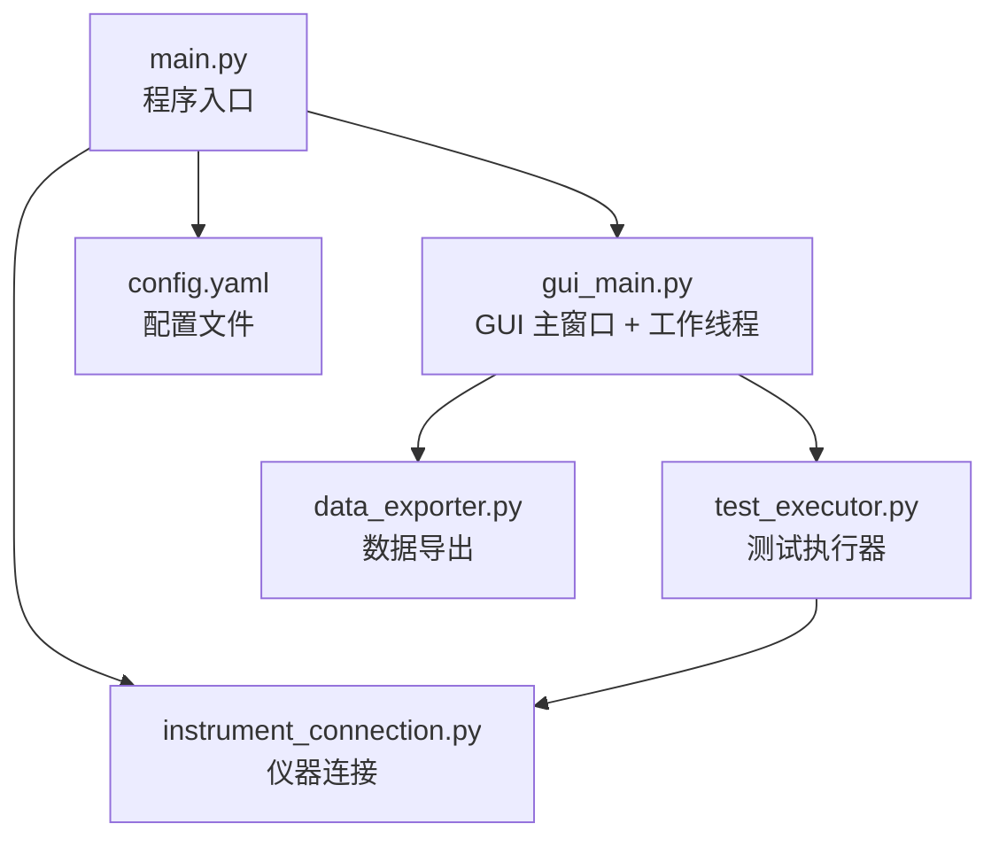
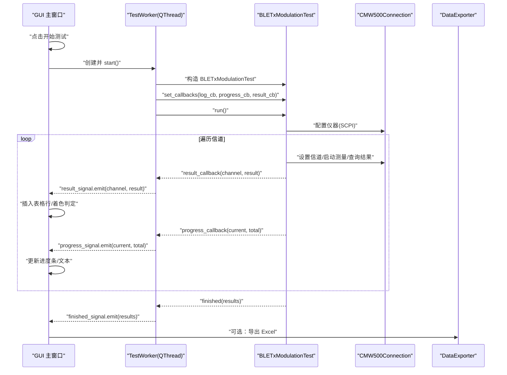
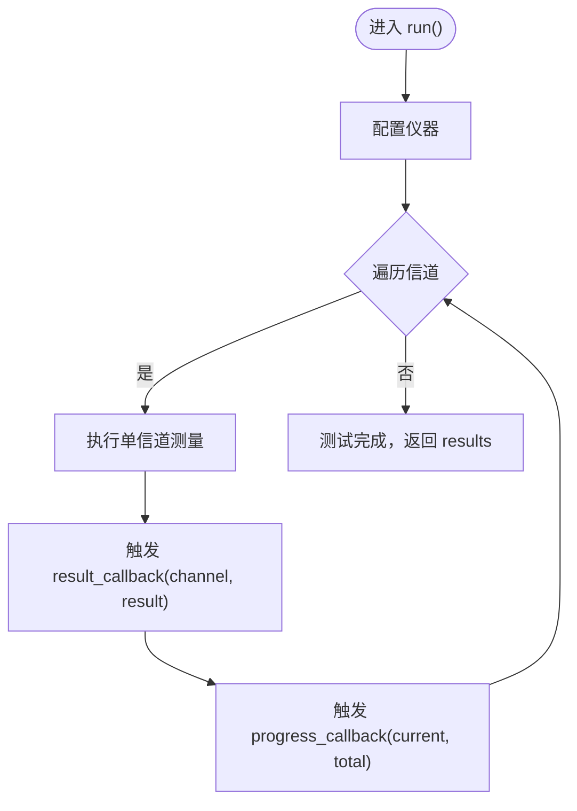
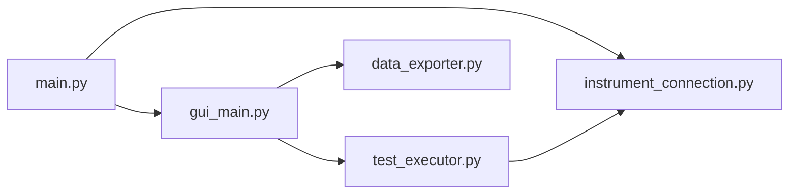

# 回调系统架构

<cite>
**本文引用的文件**   
- [main.py](file://main.py)
- [test_executor.py](file://test_executor.py)
- [gui_main.py](file://gui_main.py)
- [instrument_connection.py](file://instrument_connection.py)
- [data_exporter.py](file://data_exporter.py)
- [config.yaml](file://config.yaml)
</cite>

## 目录
1. [简介](#简介)
2. [项目结构](#项目结构)
3. [核心组件](#核心组件)
4. [架构总览](#架构总览)
5. [详细组件分析](#详细组件分析)
6. [依赖关系分析](#依赖关系分析)
7. [性能与并发安全](#性能与并发安全)
8. [故障排查指南](#故障排查指南)
9. [结论](#结论)
10. [附录：扩展与最佳实践](#附录扩展与最佳实践)

## 简介
本技术文档聚焦于“测试执行器与 GUI 界面的通信机制”，围绕日志回调、进度回调和结果回调的设计模式，深入解析 set_callbacks() 的接口设计与参数规范，说明回调函数的触发时机、数据格式与错误处理机制。同时提供多线程环境下的回调安全考虑、性能优化建议，以及完整的实现示例与最佳实践，帮助读者快速理解并扩展该回调系统。

## 项目结构
本项目采用分层清晰的模块化设计：
- main.py：程序入口，负责配置加载、命令行/图形界面模式选择、全局异常保护。
- gui_main.py：PyQt6 主窗口与工作线程，封装信号槽机制，驱动 UI 更新。
- test_executor.py：测试执行器，负责仪器配置、逐信道测量、结果判定与回调触发。
- instrument_connection.py：仪器连接管理，封装 VISA 通信（LAN/GPIB/USB）。
- data_exporter.py：测试结果导出为 Excel，包含样式美化与摘要统计。
- config.yaml：配置文件，定义仪器连接、测试参数与导出路径等。

图表来源
- [main.py:295-336](file://main.py#L295-L336)
- [gui_main.py:75-120](file://gui_main.py#L75-L120)
- [test_executor.py:22-67](file://test_executor.py#L22-L67)
- [instrument_connection.py:18-54](file://instrument_connection.py#L18-L54)
- [data_exporter.py:23-62](file://data_exporter.py#L23-L62)
- [config.yaml:1-79](file://config.yaml#L1-L79)

章节来源
- [main.py:295-336](file://main.py#L295-L336)
- [gui_main.py:75-120](file://gui_main.py#L75-L120)
- [test_executor.py:22-67](file://test_executor.py#L22-L67)
- [instrument_connection.py:18-54](file://instrument_connection.py#L18-L54)
- [data_exporter.py:23-62](file://data_exporter.py#L23-L62)
- [config.yaml:1-79](file://config.yaml#L1-L79)

## 核心组件
- 测试执行器（BLETxModulationTest）
  - 职责：配置仪器、逐信道测量、结果判定、触发回调、支持中断。
  - 关键方法：set_callbacks()、run()、measure_single_channel()、stop()、get_results()。
- GUI 主窗口（CMW500MainWindow）与工作线程（TestWorker）
  - 职责：创建 QThread 执行测试；通过 pyqtSignal 将回调事件转发到主线程；更新表格、日志、进度条。
  - 关键信号：log_signal、result_signal、progress_signal、finished_signal、error_signal。
- 仪器连接（CMW500Connection）
  - 职责：VISA 资源管理、SCPI 命令发送与查询、连接状态维护。
- 数据导出（DataExporter）
  - 职责：将测试结果导出为 Excel，生成摘要与样式。

章节来源
- [test_executor.py:22-67](file://test_executor.py#L22-L67)
- [gui_main.py:28-73](file://gui_main.py#L28-L73)
- [instrument_connection.py:18-54](file://instrument_connection.py#L18-L54)
- [data_exporter.py:23-62](file://data_exporter.py#L23-L62)

## 架构总览
下图展示了从 GUI 启动测试到执行器回调触发的完整流程，包括线程间通信与信号槽绑定。

图表来源
- [gui_main.py:499-528](file://gui_main.py#L499-L528)
- [gui_main.py:561-629](file://gui_main.py#L561-L629)
- [test_executor.py:186-245](file://test_executor.py#L186-L245)
- [instrument_connection.py:192-215](file://instrument_connection.py#L192-L215)
- [data_exporter.py:81-139](file://data_exporter.py#L81-L139)

## 详细组件分析

### 回调接口设计：set_callbacks()
- 位置与签名
  - 类：BLETxModulationTest
  - 方法：set_callbacks(log_cb=None, progress_cb=None, result_cb=None)
- 参数规范
  - log_cb(message: str)
    - 用途：推送带时间戳的日志消息。
    - 触发时机：配置仪器前后、每个信道测量前后、停止提示、完成汇总等。
  - progress_cb(current: int, total: int)
    - 用途：推送当前进度与总数，用于进度条与文本显示。
    - 触发时机：每完成一个信道的测量后。
  - result_cb(channel: int, data: dict)
    - 用途：推送单信道测量结果字典。
    - 触发时机：每个信道测量完成后立即触发。
- 返回值
  - 无返回值，仅保存回调引用供后续调用。
- 内部调用点
  - _log()：在需要输出日志时统一调用，确保时间戳一致且可被 GUI 接收。
  - run()：循环中按顺序触发 result_callback 与 progress_callback。

章节来源
- [test_executor.py:52-75](file://test_executor.py#L52-L75)
- [test_executor.py:186-245](file://test_executor.py#L186-L245)

### 回调数据结构与字段约定
- 日志消息
  - 类型：字符串
  - 内容：包含时间戳前缀与业务信息，便于排序与检索。
- 进度数据
  - 类型：(int, int)
  - 含义：(当前已完成的信道数, 总信道数)
- 单信道结果数据
  - 类型：dict
  - 关键字段：
    - channel: int，信道编号
    - timestamp: str，测量时间
    - frequency_accuracy: float|None，频率准确度
    - frequency_drift: float|None，频率漂移
    - frequency_offset: float|None，频率偏移
    - initial_frequency_drift: float|None，初始频率漂移
    - max_drift_rate: float|None，最大漂移速率
    - pass_fail: dict，各指标判定结果（PASS/FAIL/ERROR）
- 错误结果
  - 当某信道测量抛出异常时，记录 error 字段，pass_fail 可能缺失或含 ERROR。

章节来源
- [test_executor.py:126-184](file://test_executor.py#L126-L184)
- [test_executor.py:226-235](file://test_executor.py#L226-L235)

### 回调触发时序与数据流
- 初始化阶段
  - GUI 创建 TestWorker，在其 run() 中构造 BLETxModulationTest 并调用 set_callbacks()。
  - 回调函数通过 lambda 将执行器回调转换为 Qt 信号 emit。
- 运行阶段
  - 执行器在每个信道测量完成后：
    - 调用 result_callback(channel, result)，GUI 收到 result_signal 后插入表格行并着色判定列。
    - 调用 progress_callback(current, total)，GUI 收到 progress_signal 后更新进度条与文本。
- 结束阶段
  - 执行器返回 results，GUI 收到 finished_signal 后恢复按钮状态、统计并通过导出器生成 Excel。

图表来源
- [test_executor.py:186-245](file://test_executor.py#L186-L245)
- [gui_main.py:561-629](file://gui_main.py#L561-L629)

章节来源
- [gui_main.py:499-528](file://gui_main.py#L499-L528)
- [test_executor.py:186-245](file://test_executor.py#L186-L245)

### 错误处理机制
- 单信道异常
  - 捕获异常后记录错误结果（包含 error 字段），继续下一个信道，不影响整体流程。
- 线程异常
  - TestWorker.run() 捕获异常并通过 error_signal 通知 GUI，GUI 弹出错误对话框并恢复按钮状态。
- 连接异常
  - CMW500Connection.connect/query 等方法在异常时返回明确错误信息或抛出 ConnectionError，由上层处理并反馈给用户。

章节来源
- [test_executor.py:226-235](file://test_executor.py#L226-L235)
- [gui_main.py:66-68](file://gui_main.py#L66-L68)
- [gui_main.py:621-629](file://gui_main.py#L621-L629)
- [instrument_connection.py:112-132](file://instrument_connection.py#L112-L132)
- [instrument_connection.py:199-215](file://instrument_connection.py#L199-L215)

### 多线程与线程安全
- 线程模型
  - GUI 主线程：负责 UI 渲染与用户交互。
  - TestWorker（QThread）：执行测试逻辑，避免阻塞 UI。
- 跨线程通信
  - 使用 pyqtSignal 将执行器的回调事件发送到主线程，保证 UI 更新在主线程进行。
- 安全性要点
  - 不要在回调中直接操作共享可变状态而不加锁；当前实现通过信号槽隔离了线程边界。
  - stop_test() 通过设置 is_stopped 标志位，在执行器循环检查处退出，避免竞态。

章节来源
- [gui_main.py:28-73](file://gui_main.py#L28-L73)
- [gui_main.py:499-528](file://gui_main.py#L499-L528)
- [test_executor.py:247-252](file://test_executor.py#L247-L252)

## 依赖关系分析
- 模块耦合
  - main.py 依赖 gui_main.py 与 instrument_connection.py。
  - gui_main.py 依赖 test_executor.py 与 data_exporter.py。
  - test_executor.py 依赖 instrument_connection.py。
- 外部依赖
  - PyQt6：GUI 框架与线程信号槽。
  - PyVISA：仪器通信。
  - pandas/openpyxl：Excel 导出与样式。

图表来源
- [main.py:295-336](file://main.py#L295-L336)
- [gui_main.py:75-120](file://gui_main.py#L75-L120)
- [test_executor.py:22-67](file://test_executor.py#L22-L67)
- [instrument_connection.py:18-54](file://instrument_connection.py#L18-L54)
- [data_exporter.py:23-62](file://data_exporter.py#L23-L62)

章节来源
- [main.py:295-336](file://main.py#L295-L336)
- [gui_main.py:75-120](file://gui_main.py#L75-L120)
- [test_executor.py:22-67](file://test_executor.py#L22-L67)
- [instrument_connection.py:18-54](file://instrument_connection.py#L18-L54)
- [data_exporter.py:23-62](file://data_exporter.py#L23-L62)

## 性能与并发安全
- 减少 UI 重绘开销
  - 批量更新：若未来增加高频回调，可在 GUI 侧合并多次更新或使用队列缓冲。
  - 表格滚动：仅在必要时 scrollToBottom，避免频繁滚动导致卡顿。
- 网络 I/O 与超时
  - 合理设置 timeout，避免长时间阻塞；对慢设备可增加重试与退避策略。
- 线程安全
  - 所有 UI 更新必须通过信号槽在主线程执行，禁止在工作线程直接操作 UI 控件。
  - 共享状态（如 is_stopped）应通过原子方式访问；当前实现简单且足够。
- 内存占用
  - 大量结果存储时注意内存增长，可考虑分页展示或限制历史行数。

[本节为通用指导，不直接分析具体文件]

## 故障排查指南
- 无法连接仪器
  - 检查接口类型与地址参数是否正确（LAN IP、GPIB Board/Address、USB VID/PID/SN）。
  - 查看连接错误提示与详细信息，确认驱动与线缆。
- 测试中途失败
  - 关注单信道错误结果中的 error 字段，定位 SCPI 指令或仪器状态问题。
- 导出失败
  - 检查导出目录权限与 openpyxl 依赖是否安装正确。
- 界面卡死
  - 确认未在回调中直接操作 UI；确保通过信号槽更新界面。

章节来源
- [instrument_connection.py:112-132](file://instrument_connection.py#L112-L132)
- [instrument_connection.py:199-215](file://instrument_connection.py#L199-L215)
- [test_executor.py:226-235](file://test_executor.py#L226-L235)
- [gui_main.py:621-629](file://gui_main.py#L621-L629)
- [data_exporter.py:81-139](file://data_exporter.py#L81-L139)

## 结论
该回调系统以 set_callbacks() 为核心，将测试执行器与 GUI 解耦，通过日志、进度、结果三类回调实现实时反馈与可视化。借助 QThread 与 pyqtSignal，系统在多线程环境下保持线程安全与响应性。配合完善的错误处理与导出功能，形成一套稳定、可扩展的自动化测试架构。

[本节为总结，不直接分析具体文件]

## 附录：扩展与最佳实践

### 添加新的回调类型与事件通知
- 步骤概览
  - 在 BLETxModulationTest 中新增回调属性与方法（例如 status_cb(status: str)）。
  - 在合适的位置调用新回调（如状态切换、告警信息等）。
  - 在 TestWorker 中新增对应 pyqtSignal，并在 set_callbacks 中映射。
  - 在 GUI 中连接新信号到槽函数，更新 UI 或触发其他动作。
- 注意事项
  - 保持回调签名一致，避免破坏现有调用点。
  - 新增回调需考虑线程安全，始终通过信号槽传递到主线程。
  - 对高频回调进行节流或批处理，降低 UI 压力。

章节来源
- [test_executor.py:52-75](file://test_executor.py#L52-L75)
- [gui_main.py:28-73](file://gui_main.py#L28-L73)
- [gui_main.py:499-528](file://gui_main.py#L499-L528)

### 回调实现示例与最佳实践
- 示例路径
  - 日志回调：在 GUI 中通过 log_signal 连接到 _append_log，追加到日志窗口。
  - 进度回调：通过 progress_signal 更新进度条与文本标签。
  - 结果回调：通过 result_signal 插入表格行并对判定列着色。
- 最佳实践
  - 使用统一的日志格式（时间戳+消息），便于检索与分析。
  - 对异常进行分级处理：警告、错误、严重错误，分别用不同 UI 提示。
  - 在导出前校验结果完整性，避免空数据或格式不一致。

章节来源
- [gui_main.py:561-629](file://gui_main.py#L561-L629)
- [data_exporter.py:81-139](file://data_exporter.py#L81-L139)