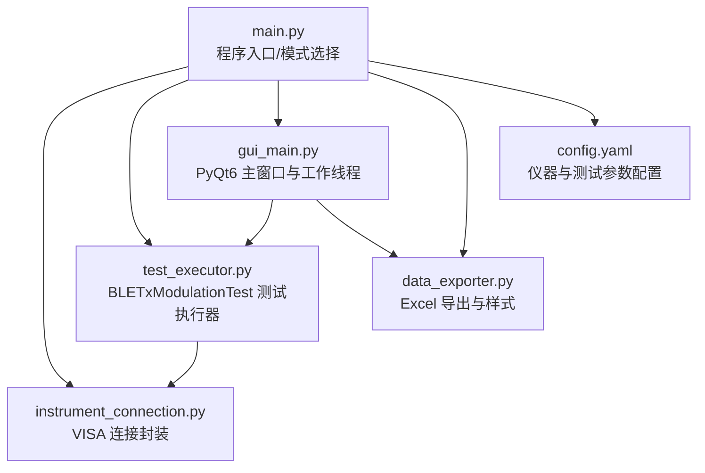
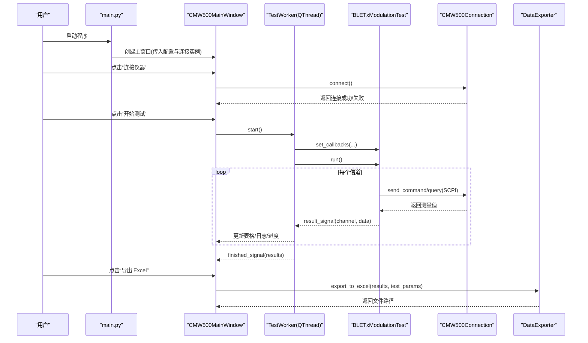
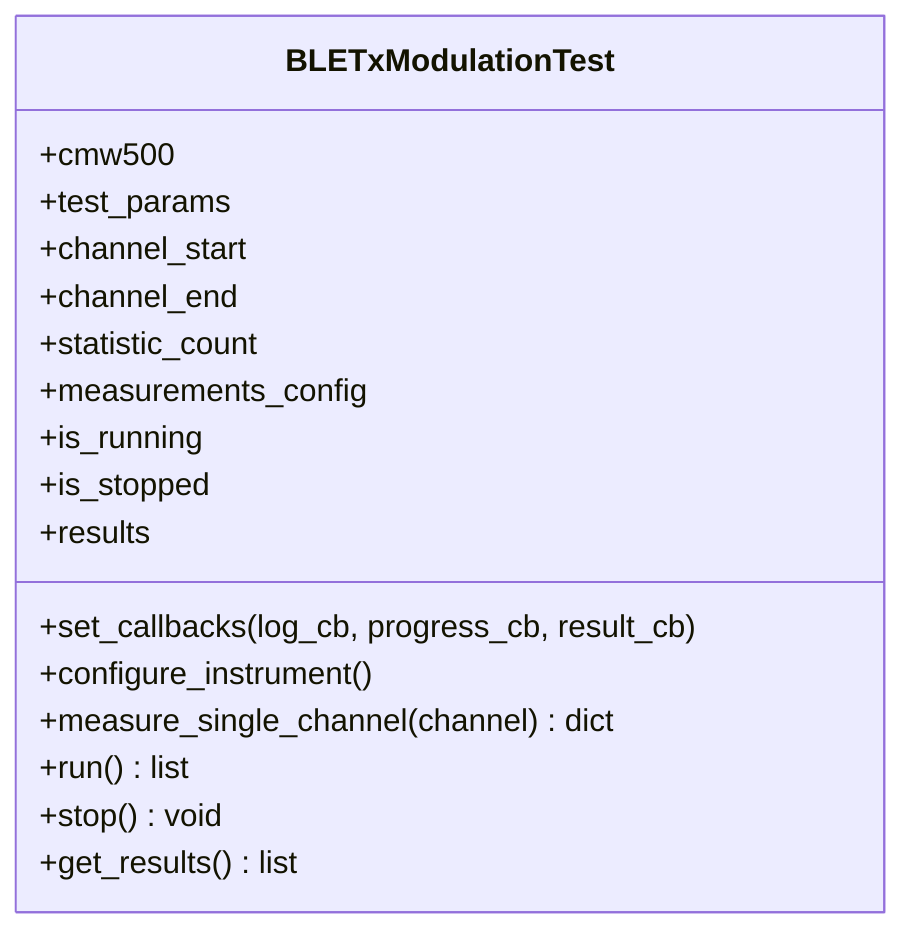
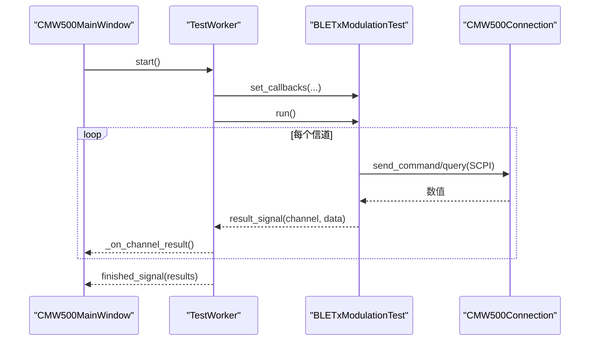
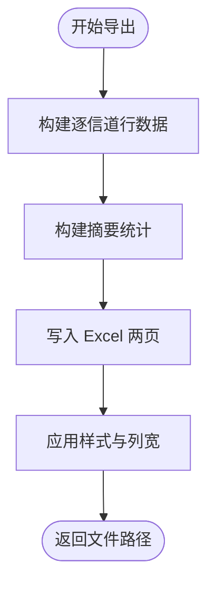
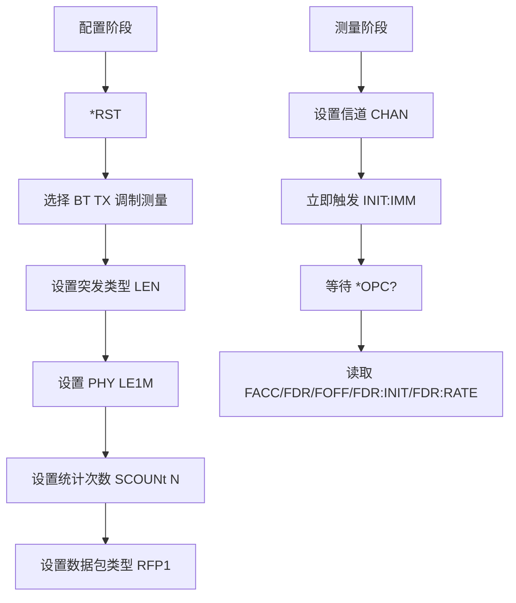
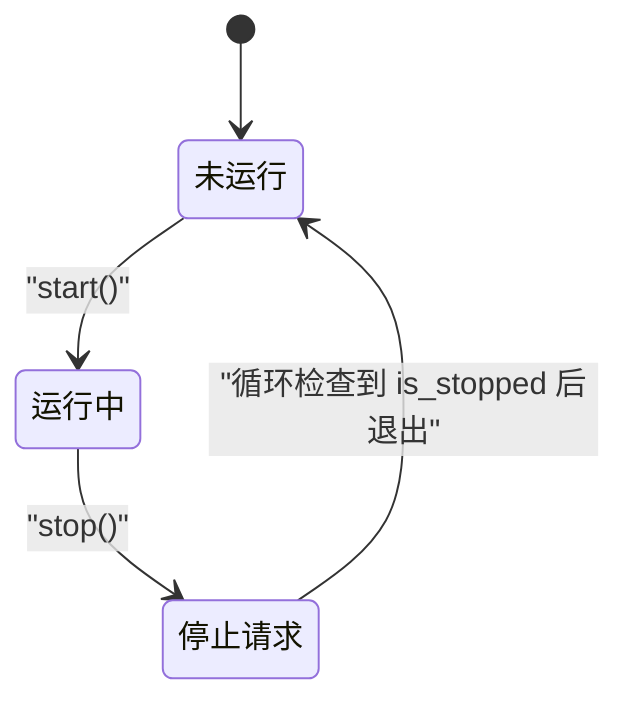
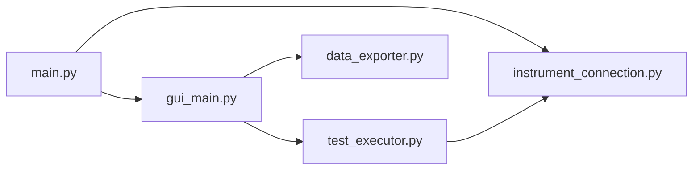

# 测试执行引擎

<cite>
**本文引用的文件**   
- [main.py](file://main.py)
- [test_executor.py](file://test_executor.py)
- [gui_main.py](file://gui_main.py)
- [instrument_connection.py](file://instrument_connection.py)
- [data_exporter.py](file://data_exporter.py)
- [config.yaml](file://config.yaml)
- [requirements.txt](file://requirements.txt)
</cite>

## 目录
1. [简介](#简介)
2. [项目结构](#项目结构)
3. [核心组件](#核心组件)
4. [架构总览](#架构总览)
5. [详细组件分析](#详细组件分析)
6. [依赖关系分析](#依赖关系分析)
7. [性能与批量测试建议](#性能与批量测试建议)
8. [故障排查指南](#故障排查指南)
9. [结论](#结论)
10. [附录：扩展开发与 API 参考](#附录扩展开发与-api-参考)

## 简介
本技术文档围绕 BLE TX 调制自动化测试的“测试执行引擎”展开，重点解析 BLETxModulationTest 类的实现原理、SCPI 指令序列、测试参数配置、信道扫描逻辑、测量指标计算与结果判定标准。同时说明多线程测试执行机制、进度跟踪与中断处理，提供时序图与状态转换图，并给出测试结果存储格式、数据结构与统计分析方法，以及性能调优与批量测试的配置建议。

## 项目结构
本项目采用分层组织方式：入口与模式选择（CLI/GUI）、仪器连接抽象、测试执行器、数据导出、GUI 界面与配置管理。

图表来源
- [main.py:295-336](file://main.py#L295-L336)
- [instrument_connection.py:18-132](file://instrument_connection.py#L18-L132)
- [test_executor.py:22-104](file://test_executor.py#L22-L104)
- [gui_main.py:28-73](file://gui_main.py#L28-L73)
- [data_exporter.py:23-139](file://data_exporter.py#L23-L139)
- [config.yaml:1-79](file://config.yaml#L1-L79)

章节来源
- [main.py:295-336](file://main.py#L295-L336)
- [config.yaml:1-79](file://config.yaml#L1-L79)

## 核心组件
- 仪器连接层：CMW500Connection 封装 VISA 资源地址构建、连接/断开、命令发送与查询，支持 LAN/GPIB/USB 三种接口。
- 测试执行层：BLETxModulationTest 负责配置 CMW500、逐信道测量、读取 SCPI 结果、按限值判定 PASS/FAIL/ERROR，并提供回调用于日志与进度上报。
- GUI 与多线程：TestWorker 在独立 QThread 中运行测试，通过 pyqtSignal 将日志、单信道结果、进度和完成信号回传主线程；CMW500MainWindow 负责 UI 更新与用户交互。
- 数据导出：DataExporter 将测试结果写入 Excel，包含“测试数据”与“测试摘要”两个 Sheet，并对判定列进行着色与自动列宽调整。
- 配置管理：config.yaml 定义仪器连接参数、测试标准与限值、导出路径等；main.py 提供兼容性归一化逻辑以兼容旧版配置。

章节来源
- [instrument_connection.py:18-132](file://instrument_connection.py#L18-L132)
- [test_executor.py:22-104](file://test_executor.py#L22-L104)
- [gui_main.py:28-73](file://gui_main.py#L28-L73)
- [data_exporter.py:23-139](file://data_exporter.py#L23-L139)
- [config.yaml:1-79](file://config.yaml#L1-L79)
- [main.py:245-292](file://main.py#L245-L292)

## 架构总览
系统整体由“入口 -> 连接 -> 测试执行 -> 界面/导出”构成，测试执行器通过回调与 GUI 解耦，GUI 使用工作线程避免阻塞主线程。

图表来源
- [main.py:222-242](file://main.py#L222-L242)
- [gui_main.py:499-528](file://gui_main.py#L499-L528)
- [gui_main.py:28-73](file://gui_main.py#L28-L73)
- [test_executor.py:186-245](file://test_executor.py#L186-L245)
- [instrument_connection.py:192-215](file://instrument_connection.py#L192-L215)
- [data_exporter.py:81-139](file://data_exporter.py#L81-L139)

## 详细组件分析

### BLETxModulationTest 类（BLE TX 调制测试执行器）
- 职责
  - 初始化：从配置加载信道范围、统计次数、测量项及限值。
  - 仪器配置：复位、选择 BT TX 调制测量、设置突发类型、PHY、统计次数、数据包类型。
  - 单信道测量：设置信道、立即触发测量、等待完成、读取 5 项频率指标、按限值判定 PASS/FAIL/ERROR。
  - 全量扫描：遍历信道范围，聚合结果，支持 stop() 中断。
  - 回调：log_callback、progress_callback、result_callback 用于向 GUI 推送日志、进度与单信道结果。
- 关键流程
  - 配置阶段：*RST -> CONF:BT:TX:MEAS:SEL TXMod -> BURSt:TYPE LEN -> PHY LE1M -> SCOUNt N -> PACK:TYPE RFP1
  - 测量阶段：CONF:BT:TX:FREQ:CHAN {channel} -> INIT:IMM -> *OPC? -> 读取 FACC/FDR/FOFF/FDR:INIT/FDR:RATE
  - 判定规则：对每项取绝对值比较 upper_limit/lower_limit，超出上限或低于下限为 FAIL，否则 PASS；读数为 None 时为 ERROR。
- 复杂度
  - 时间复杂度：O(N)，N 为信道数量；每次信道测量固定次数的 SCPI 读写。
  - 空间复杂度：O(N)，保存所有信道的结果字典。
- 错误处理
  - 单项读取异常时置为 None，并在 pass_fail 中标记 ERROR。
  - 循环内 try-except 捕获异常，记录错误行并继续后续信道。
- 中断机制
  - is_stopped 标志位，run() 每信道开始前检查，stop() 设置该标志。

图表来源
- [test_executor.py:22-104](file://test_executor.py#L22-L104)
- [test_executor.py:105-184](file://test_executor.py#L105-L184)
- [test_executor.py:186-261](file://test_executor.py#L186-L261)

章节来源
- [test_executor.py:22-104](file://test_executor.py#L22-L104)
- [test_executor.py:105-184](file://test_executor.py#L105-L184)
- [test_executor.py:186-261](file://test_executor.py#L186-L261)

### 多线程测试执行机制（GUI 侧）
- TestWorker 继承自 QThread，在 run() 中创建 BLETxModulationTest 并绑定回调，调用 run() 执行测试，完成后通过 finished_signal 返回结果列表。
- 信号槽：
  - log_signal：实时日志
  - result_signal：单信道结果
  - progress_signal：当前进度/总数
  - finished_signal：全部完成
  - error_signal：异常信息
- 主线程仅做 UI 更新，保证界面响应性。

图表来源
- [gui_main.py:28-73](file://gui_main.py#L28-L73)
- [gui_main.py:499-528](file://gui_main.py#L499-L528)
- [test_executor.py:186-245](file://test_executor.py#L186-L245)
- [instrument_connection.py:192-215](file://instrument_connection.py#L192-L215)

章节来源
- [gui_main.py:28-73](file://gui_main.py#L28-L73)
- [gui_main.py:499-528](file://gui_main.py#L499-L528)

### 测试结果数据结构与导出
- 单信道结果字段
  - channel: 信道编号
  - timestamp: 测量时间戳
  - frequency_accuracy/frequency_drift/frequency_offset/initial_frequency_drift/max_drift_rate: 各项测量值（kHz），可能为 None
  - pass_fail: 各指标的 PASS/FAIL/ERROR 判定
- 导出结构
  - Sheet “测试数据”：逐信道列出各项数值与判定列
  - Sheet “测试摘要”：汇总统计（测试时间、标准、信道范围、统计次数、各指标通过/失败数、总体判定）
- 样式与可读性
  - 表头蓝色加粗白字，数据区居中、细边框
  - PASS 浅绿背景深绿文字，FAIL 浅红背景深红文字，ERROR 浅黄背景深黄文字
  - 自动列宽（中文按双倍宽度估算）

图表来源
- [data_exporter.py:81-139](file://data_exporter.py#L81-L139)
- [data_exporter.py:141-202](file://data_exporter.py#L141-L202)
- [data_exporter.py:204-283](file://data_exporter.py#L204-L283)

章节来源
- [data_exporter.py:81-139](file://data_exporter.py#L81-L139)
- [data_exporter.py:141-202](file://data_exporter.py#L141-L202)
- [data_exporter.py:204-283](file://data_exporter.py#L204-L283)

### 仪器连接与 SCPI 指令
- 连接方式
  - LAN：TCPIP0::<IP>::inst0::INSTR
  - GPIB：GPIB<board>::<address>::INSTR
  - USB：USB0::<VID>::<PID>::<serial>::INSTR（序列号留空则用 ? 自动匹配）
- 常用 SCPI
  - 配置：*RST、CONF:BT:TX:MEAS:SEL TXMod、CONF:BT:TX:BURSt:TYPE LEN、CONF:BT:TX:PHY LE1M、CONF:BT:TX:SCOUNt N、CONF:BT:TX:PACK:TYPE RFP1
  - 测量：CONF:BT:TX:FREQ:CHAN {ch}、INIT:IMM、*OPC?
  - 读取：FETC:BT:TX:FACC? AVER、FETC:BT:TX:FDR? AVER、FETC:BT:TX:FOFF? AVER、FETC:BT:TX:FDR:INIT? AVER、FETC:BT:TX:FDR:RATE? AVER
  - 设备识别：*IDN?

图表来源
- [test_executor.py:76-104](file://test_executor.py#L76-L104)
- [test_executor.py:105-184](file://test_executor.py#L105-L184)
- [instrument_connection.py:55-75](file://instrument_connection.py#L55-L75)
- [instrument_connection.py:161-190](file://instrument_connection.py#L161-L190)

章节来源
- [test_executor.py:76-104](file://test_executor.py#L76-L104)
- [test_executor.py:105-184](file://test_executor.py#L105-L184)
- [instrument_connection.py:55-75](file://instrument_connection.py#L55-L75)
- [instrument_connection.py:161-190](file://instrument_connection.py#L161-L190)

### 测试参数配置与判定标准
- 测试参数（来自 config.yaml）
  - standard、phy_type、burst_type、packet_type、statistic_count
  - channel_start/channel_end（默认 0~39）
  - measurements：每项含 name、unit、upper_limit、lower_limit（可为 null）
- 判定标准
  - 对每项测量值取绝对值，若存在 upper_limit 且超过则为 FAIL；若存在 lower_limit 且小于则为 FAIL；否则 PASS。
  - 若某项读取失败为 None，则该项标记为 ERROR。

章节来源
- [config.yaml:27-71](file://config.yaml#L27-L71)
- [test_executor.py:166-184](file://test_executor.py#L166-L184)

### 多线程状态机与中断处理
- 状态
  - 未运行：is_running=False
  - 运行中：is_running=True
  - 停止请求：is_stopped=True（由 stop() 设置）
- 中断流程
  - GUI 点击“停止测试” -> TestWorker.stop_test() -> BLETxModulationTest.stop() 设置 is_stopped
  - run() 每信道开始前检查 is_stopped，满足则退出循环并结束测试

图表来源
- [test_executor.py:186-245](file://test_executor.py#L186-L245)
- [test_executor.py:247-252](file://test_executor.py#L247-L252)
- [gui_main.py:530-536](file://gui_main.py#L530-L536)

章节来源
- [test_executor.py:186-245](file://test_executor.py#L186-L245)
- [test_executor.py:247-252](file://test_executor.py#L247-L252)
- [gui_main.py:530-536](file://gui_main.py#L530-L536)

## 依赖关系分析
- main.py 作为入口，根据命令行参数选择 CLI 或 GUI 模式，并统一加载配置、创建连接实例。
- instrument_connection.py 依赖 pyvisa 进行底层通信。
- test_executor.py 依赖 instrument_connection.py 发送/查询 SCPI。
- gui_main.py 依赖 PyQt6，并通过 TestWorker 间接依赖 test_executor.py。
- data_exporter.py 依赖 pandas 与 openpyxl 生成带样式的 Excel。
- requirements.txt 声明了所有第三方库。

图表来源
- [main.py:295-336](file://main.py#L295-L336)
- [gui_main.py:28-73](file://gui_main.py#L28-L73)
- [test_executor.py:22-104](file://test_executor.py#L22-L104)
- [data_exporter.py:23-139](file://data_exporter.py#L23-L139)
- [requirements.txt:1-12](file://requirements.txt#L1-L12)

章节来源
- [requirements.txt:1-12](file://requirements.txt#L1-L12)
- [main.py:295-336](file://main.py#L295-L336)

## 性能与批量测试建议
- 统计次数（statistic_count）
  - 增大可提升稳定性但增加单次测量时间；建议在产线快速检测场景适当降低，研发验证场景适当提高。
- 信道范围
  - 批量测试可按批次划分信道区间，减少单次运行时长，便于并行化与断点续测。
- 超时与重试
  - 合理设置仪器超时（timeout），在网络不稳定时可考虑外层重试逻辑（当前实现未内置）。
- 并发策略
  - 当前为串行逐信道测量；如需加速，可在硬件允许的前提下拆分多套仪器并行执行不同信道段（需改造为任务队列与多进程/多线程调度）。
- 输出优化
  - 大数据量导出时，openpyxl 样式应用会耗时；可考虑分批写入或使用更高效的库（如 xlsxwriter）以提升速度。

[本节为通用指导，不直接分析具体文件]

## 故障排查指南
- 连接失败
  - 现象：connect() 返回失败，提示无法与仪器通信。
  - 排查：确认 IP/板号/地址/VID/PID/序列号是否正确；检查线缆与驱动；查看异常详情。
- 读取序列号失败
  - 现象：get_serial_number() 返回失败。
  - 排查：确认已连接；检查 *IDN? 返回格式是否符合预期。
- 测量异常
  - 现象：某信道测量报错，结果中对应项为 None，pass_fail 标记 ERROR。
  - 排查：检查 SCPI 指令是否被固件支持；确认仪器处于正确测量模式；观察日志中的异常信息。
- 导出失败
  - 现象：导出 Excel 抛出异常。
  - 排查：确认输出目录权限；检查 openpyxl/pandas 版本兼容性；查看异常堆栈。

章节来源
- [instrument_connection.py:85-132](file://instrument_connection.py#L85-L132)
- [instrument_connection.py:161-190](file://instrument_connection.py#L161-L190)
- [test_executor.py:226-234](file://test_executor.py#L226-L234)
- [gui_main.py:537-556](file://gui_main.py#L537-L556)

## 结论
本测试执行引擎以清晰的层次化设计实现了 BLE TX 调制自动化测试：通过统一的仪器连接抽象、可配置的测试参数与判定标准、稳定的多线程执行与中断机制、以及友好的可视化与导出能力，满足了实验室与产线的多样化需求。针对大规模批量测试，可通过信道分段、统计次数调优与导出策略优化进一步提升效率与稳定性。

[本节为总结，不直接分析具体文件]

## 附录：扩展开发与 API 参考

### 自定义测试扩展开发指南
- 新增测量项
  - 在 config.yaml 的 measurements 下添加新项（name、unit、upper_limit、lower_limit）。
  - 在 BLETxModulationTest.measure_single_channel 中增加对应的 SCPI 读取与结果字段。
  - 在 GUI 的 TABLE_COLUMNS 与 MEASUREMENT_KEYS 中同步新增列与键名。
  - 在 DataExporter 的导出列与摘要统计中补充新项。
- 新增测试类型
  - 新建测试执行类（例如 XYZTest），复用 CMW500Connection 与回调机制，遵循相同的 run()/stop()/get_results() 约定。
  - 在 GUI 中注册新的工作线程与按钮事件，复用 TestWorker 的信号槽模型。
- 回调与信号
  - 测试执行器通过 set_callbacks 注入日志、进度与结果回调。
  - GUI 通过 pyqtSignal 将线程内数据安全地传递至主线程更新 UI。

章节来源
- [config.yaml:44-71](file://config.yaml#L44-L71)
- [test_executor.py:105-184](file://test_executor.py#L105-L184)
- [gui_main.py:78-99](file://gui_main.py#L78-L99)
- [data_exporter.py:96-139](file://data_exporter.py#L96-L139)

### API 参考（节选）
- CMW500Connection
  - connect(): (bool, str) 建立连接
  - disconnect(): (bool, str) 断开连接
  - get_serial_number(): (bool, str) 读取序列号
  - send_command(command): 发送无返回值命令
  - query(command): 发送查询并返回字符串
- BLETxModulationTest
  - __init__(cmw500, config)
  - set_callbacks(log_cb, progress_cb, result_cb)
  - configure_instrument()
  - measure_single_channel(channel) -> dict
  - run() -> list
  - stop()
  - get_results() -> list
- DataExporter
  - __init__(config)
  - export_to_excel(results, test_params) -> str

章节来源
- [instrument_connection.py:85-215](file://instrument_connection.py#L85-L215)
- [test_executor.py:22-261](file://test_executor.py#L22-L261)
- [data_exporter.py:41-139](file://data_exporter.py#L41-L139)