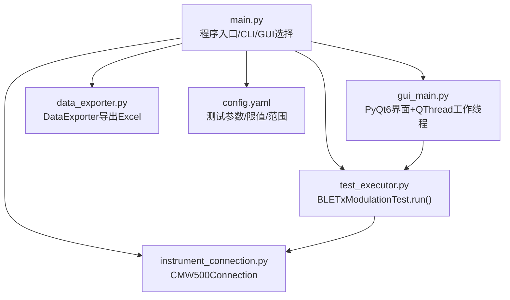
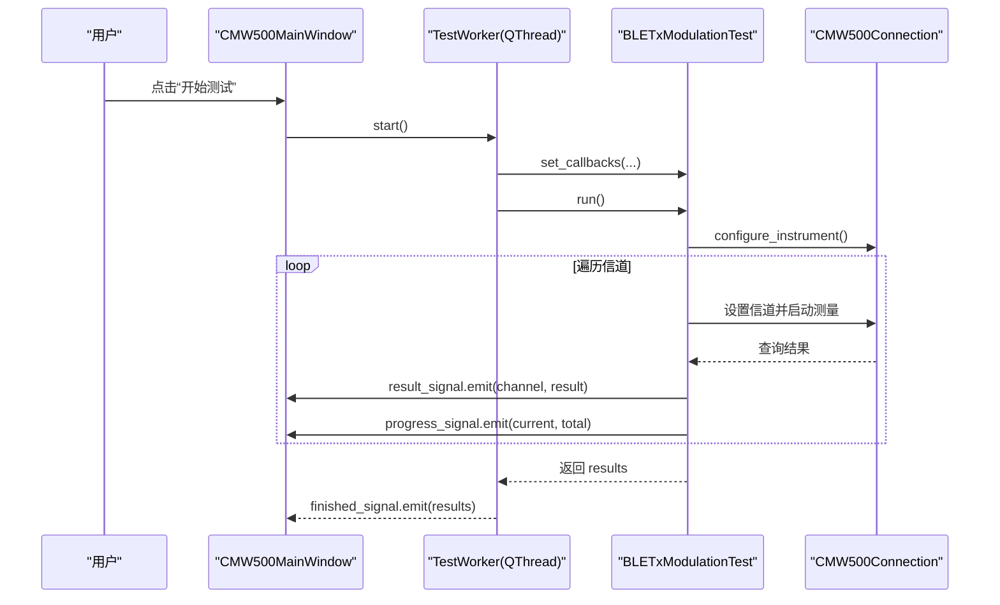
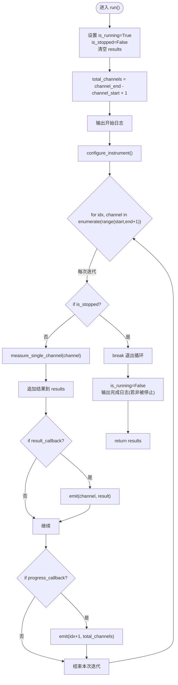
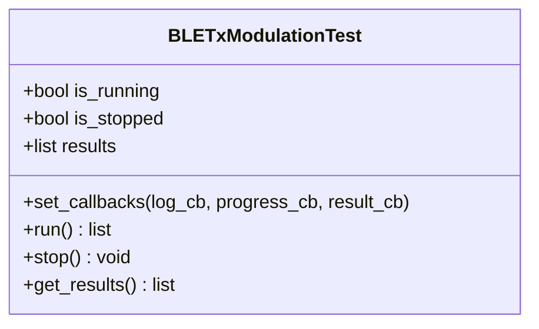
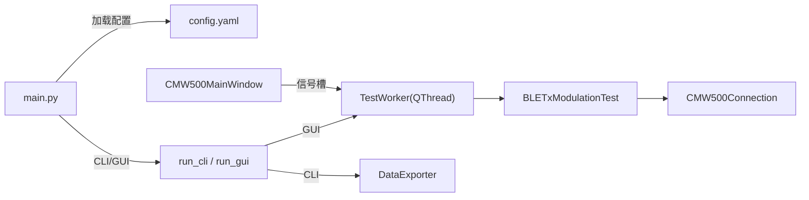

# 主测试循环

<cite>
**本文引用的文件**
- [main.py](file://main.py)
- [test_executor.py](file://test_executor.py)
- [gui_main.py](file://gui_main.py)
- [instrument_connection.py](file://instrument_connection.py)
- [config.yaml](file://config.yaml)
- [data_exporter.py](file://data_exporter.py)
</cite>

## 目录
1. [简介](#简介)
2. [项目结构](#项目结构)
3. [核心组件](#核心组件)
4. [架构总览](#架构总览)
5. [详细组件分析](#详细组件分析)
6. [依赖关系分析](#依赖关系分析)
7. [性能考量](#性能考量)
8. [故障排查指南](#故障排查指南)
9. [结论](#结论)
10. [附录](#附录)

## 简介
本文件聚焦于“主测试循环”的技术实现，围绕 BLETxModulationTest.run() 的完整生命周期与信道遍历逻辑展开。文档将解释：
- is_running 与 is_stopped 状态标志在循环控制中的作用
- 测试中断机制的实现原理
- total_channels 的计算方式与 enumerate 的使用
- 进度跟踪与状态更新机制
- 异常处理策略（单信道测量失败时的错误记录与数据完整性保证）
- 回调函数的触发时机与参数传递（result_callback、progress_callback）
- 测试完成后的清理工作与结果返回机制

## 项目结构
本项目采用分层组织：入口与配置加载（main.py）、仪器连接封装（instrument_connection.py）、测试执行器（test_executor.py）、GUI 线程化工作流（gui_main.py）、数据导出（data_exporter.py），以及配置文件（config.yaml）。

图表来源
- [main.py:295-336](file://main.py#L295-L336)
- [test_executor.py:186-245](file://test_executor.py#L186-L245)
- [gui_main.py:48-73](file://gui_main.py#L48-L73)
- [instrument_connection.py:18-54](file://instrument_connection.py#L18-L54)
- [data_exporter.py:81-139](file://data_exporter.py#L81-L139)
- [config.yaml:27-72](file://config.yaml#L27-L72)

章节来源
- [main.py:295-336](file://main.py#L295-L336)
- [config.yaml:27-72](file://config.yaml#L27-L72)

## 核心组件
- BLETxModulationTest：负责 BLE TX 调制测试的执行流程，包含 run() 主循环、单信道测量、回调通知、停止信号处理等。
- CMW500Connection：封装 VISA 通信，提供 send_command/query 接口供测试执行器调用。
- TestWorker（GUI）：在独立 QThread 中运行 BLETxModulationTest，通过 Qt 信号将日志、进度、结果回传至 UI。
- DataExporter：将测试结果导出为 Excel，生成“测试数据”和“测试摘要”两个 Sheet。

章节来源
- [test_executor.py:22-67](file://test_executor.py#L22-L67)
- [instrument_connection.py:18-54](file://instrument_connection.py#L18-L54)
- [gui_main.py:28-73](file://gui_main.py#L28-L73)
- [data_exporter.py:23-67](file://data_exporter.py#L23-L67)

## 架构总览
下图展示了 GUI 模式下从用户点击“开始测试”到 run() 主循环执行的端到端流程，包括回调与进度更新。

图表来源
- [gui_main.py:498-528](file://gui_main.py#L498-L528)
- [gui_main.py:48-73](file://gui_main.py#L48-L73)
- [test_executor.py:186-245](file://test_executor.py#L186-L245)
- [instrument_connection.py:192-215](file://instrument_connection.py#L192-L215)

## 详细组件分析

### BLETxModulationTest.run() 主循环详解
run() 是主测试循环的核心，负责：
- 初始化运行状态与结果容器
- 计算 total_channels = channel_end - channel_start + 1
- 配置仪器（configure_instrument）
- 使用 enumerate(range(channel_start, channel_end + 1)) 逐信道测量
- 在每个信道迭代中检查 is_stopped 以支持中断
- 捕获单个信道的异常，记录错误结果以保证数据完整性
- 触发 result_callback 与 progress_callback
- 完成后重置 is_running，返回 results

图表来源
- [test_executor.py:186-245](file://test_executor.py#L186-L245)

章节来源
- [test_executor.py:186-245](file://test_executor.py#L186-L245)

#### 状态标志与中断机制
- is_running：标记测试是否正在执行，用于外部判断（如 CLI 中的 stop 命令）。
- is_stopped：由 stop() 方法置位，run() 在每次迭代开始时检查，若为真则立即 break 退出循环，从而实现“请求停止”。
- stop() 仅设置 is_stopped 并记录日志；实际退出发生在下一次迭代检查点。

图表来源
- [test_executor.py:22-67](file://test_executor.py#L22-L67)
- [test_executor.py:247-252](file://test_executor.py#L247-L252)

章节来源
- [test_executor.py:40-51](file://test_executor.py#L40-L51)
- [test_executor.py:247-252](file://test_executor.py#L247-L252)

#### 信道范围与 enumerate 的使用
- total_channels 基于 channel_start 与 channel_end 计算，确保进度条分母正确。
- enumerate(range(self.channel_start, self.channel_end + 1)) 产生 (idx, channel) 对，idx 从 0 开始，channel 按顺序递增。
- 进度回调使用 idx + 1 作为当前进度，避免 0 起始导致百分比显示问题。

章节来源
- [test_executor.py:197-204](file://test_executor.py#L197-L204)
- [test_executor.py:236-238](file://test_executor.py#L236-L238)

#### 进度跟踪与状态更新
- progress_callback 在每次信道测量后触发，传入 (current=idx+1, total=total_channels)。
- GUI 层将 current/total 转换为百分比并更新进度条与文本标签。

章节来源
- [test_executor.py:236-238](file://test_executor.py#L236-L238)
- [gui_main.py:595-599](file://gui_main.py#L595-L599)

#### 异常处理策略与数据完整性
- 每个信道的测量包裹 try/except，捕获异常后记录错误信息并构造 error_result 追加到 results，确保即使个别信道失败也不影响整体结果列表长度与索引一致性。
- 未捕获异常会向上传播，GUI 层通过 error_signal 展示严重错误并恢复按钮状态。

章节来源
- [test_executor.py:212-234](file://test_executor.py#L212-L234)
- [gui_main.py:621-629](file://gui_main.py#L621-L629)

#### 回调函数触发时机与参数传递
- result_callback：在成功获取单信道结果后触发，参数为 (channel, result)，GUI 将其映射到表格行。
- progress_callback：在每次信道测量后触发，参数为 (current, total)，GUI 更新进度条。
- log_callback：内部 _log 统一输出带时间戳的日志，同时触发回调。

章节来源
- [test_executor.py:52-75](file://test_executor.py#L52-L75)
- [test_executor.py:222-238](file://test_executor.py#L222-L238)
- [gui_main.py:561-599](file://gui_main.py#L561-L599)

#### 测试完成清理与结果返回
- run() 结束时将 is_running 置为 False，并在未被停止的情况下输出完成日志。
- 返回 results 列表，GUI 保存为 _last_results 以便后续导出。

章节来源
- [test_executor.py:240-245](file://test_executor.py#L240-L245)
- [gui_main.py:601-619](file://gui_main.py#L601-L619)

### 单信道测量 measure_single_channel(channel)
- 设置目标信道，启动单次测量，等待 *OPC? 完成。
- 读取五项指标（频率准确度、频率漂移、频率偏移、初始频率漂移、最大漂移速率），每项取绝对值并与配置上限比较判定 PASS/FAIL。
- 任一指标读取失败时对应字段记为 None，判定为 ERROR，不影响其他指标。

章节来源
- [test_executor.py:105-184](file://test_executor.py#L105-L184)
- [config.yaml:46-71](file://config.yaml#L46-L71)

### GUI 线程化工作流 TestWorker
- 在独立线程中创建 BLETxModulationTest 并绑定回调，将日志、进度、结果通过 pyqtSignal 发送到主线程。
- stop_test() 调用 test_executor.stop() 请求停止。

章节来源
- [gui_main.py:28-73](file://gui_main.py#L28-L73)

### 仪器连接 CMW500Connection
- 提供 send_command 与 query 接口，底层通过 VISA 与仪器通信。
- 所有 SCPI 指令均通过该模块发送与查询，测试执行器不直接操作 VISA。

章节来源
- [instrument_connection.py:192-215](file://instrument_connection.py#L192-L215)

### 数据导出 DataExporter
- 将 results 写入 Excel，包含“测试数据”与“测试摘要”两个 Sheet，并对判定列进行着色。
- 文件名自动包含时间戳，避免覆盖历史数据。

章节来源
- [data_exporter.py:81-139](file://data_exporter.py#L81-L139)
- [data_exporter.py:141-202](file://data_exporter.py#L141-L202)

## 依赖关系分析
- main.py 根据命令行参数选择 CLI 或 GUI 模式，并加载 config.yaml。
- GUI 模式通过 TestWorker 在子线程中运行 BLETxModulationTest。
- BLETxModulationTest 依赖 CMW500Connection 进行仪器通信。
- 结果导出由 DataExporter 完成，依赖 pandas/openpyxl。

图表来源
- [main.py:295-336](file://main.py#L295-L336)
- [gui_main.py:498-528](file://gui_main.py#L498-L528)
- [test_executor.py:186-245](file://test_executor.py#L186-L245)
- [instrument_connection.py:192-215](file://instrument_connection.py#L192-L215)
- [data_exporter.py:81-139](file://data_exporter.py#L81-L139)
- [config.yaml:27-72](file://config.yaml#L27-L72)

章节来源
- [main.py:295-336](file://main.py#L295-L336)
- [gui_main.py:498-528](file://gui_main.py#L498-L528)
- [test_executor.py:186-245](file://test_executor.py#L186-L245)
- [instrument_connection.py:192-215](file://instrument_connection.py#L192-L215)
- [data_exporter.py:81-139](file://data_exporter.py#L81-L139)
- [config.yaml:27-72](file://config.yaml#L27-L72)

## 性能考量
- 单信道测量阻塞式等待 *OPC?，适合串行扫描；如需并行需重构为并发模型，但需注意仪器资源竞争。
- 进度回调频率较高，GUI 层应节流更新（例如每 N 次更新一次 UI），减少重绘开销。
- 大量结果写入 Excel 时，建议分批写入或使用流式写入以降低内存占用。

[本节为通用指导，无需源码引用]

## 故障排查指南
- 连接失败：检查 LAN IP、GPIB 板号/地址、USB VID/PID/序列号是否正确；确认驱动与线缆连接。
- 测试中断无效：确认 stop() 已被调用且 run() 已到达下一次迭代检查点；长时间测量期间无法立即中断。
- 单信道失败：查看 results 中对应项的 error 字段与 pass_fail 判定；必要时调整测量限值或重试。
- 导出失败：确认输出目录权限与 openpyxl/pandas 安装情况。

章节来源
- [instrument_connection.py:85-132](file://instrument_connection.py#L85-L132)
- [test_executor.py:212-234](file://test_executor.py#L212-L234)
- [gui_main.py:621-629](file://gui_main.py#L621-L629)
- [data_exporter.py:81-139](file://data_exporter.py#L81-L139)

## 结论
run() 主循环通过清晰的状态标志与检查点实现了可中断的串行信道扫描，结合回调机制提供了良好的实时反馈。异常处理保证了数据完整性，配合 GUI 的信号槽与数据导出模块，形成了完整的自动化测试闭环。

[本节为总结性内容，无需源码引用]

## 附录
- 关键路径参考
  - 主循环实现：[test_executor.py:186-245](file://test_executor.py#L186-L245)
  - 单信道测量：[test_executor.py:105-184](file://test_executor.py#L105-L184)
  - 回调设置与触发：[test_executor.py:52-75](file://test_executor.py#L52-75), [test_executor.py:222-238](file://test_executor.py#L222-L238)
  - GUI 线程与信号：[gui_main.py:28-73](file://gui_main.py#L28-L73), [gui_main.py:561-599](file://gui_main.py#L561-L599)
  - 仪器通信接口：[instrument_connection.py:192-215](file://instrument_connection.py#L192-L215)
  - 配置与限值：[config.yaml:27-72](file://config.yaml#L27-L72)
  - 数据导出：[data_exporter.py:81-139](file://data_exporter.py#L81-L139)