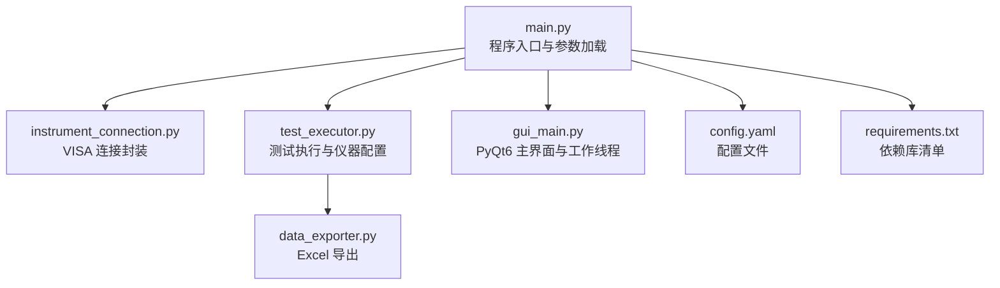
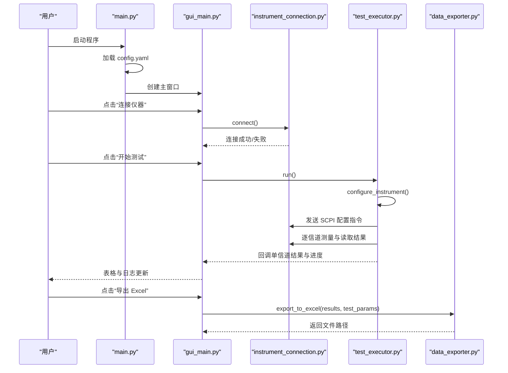
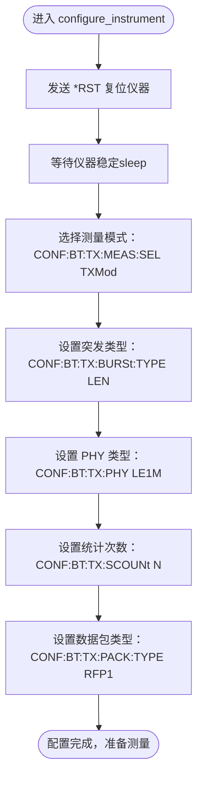
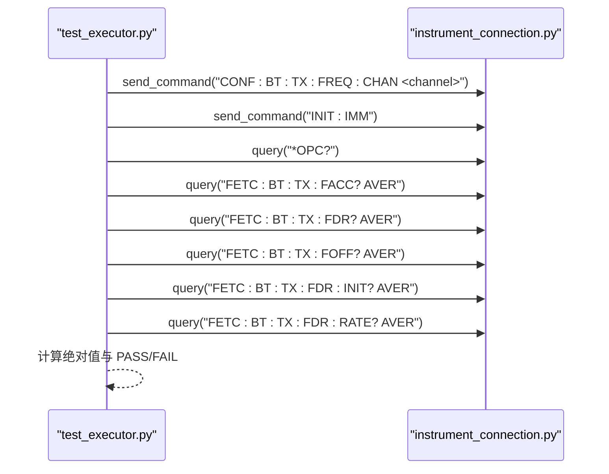
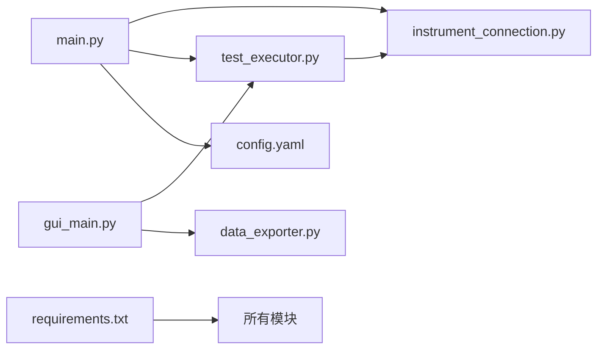
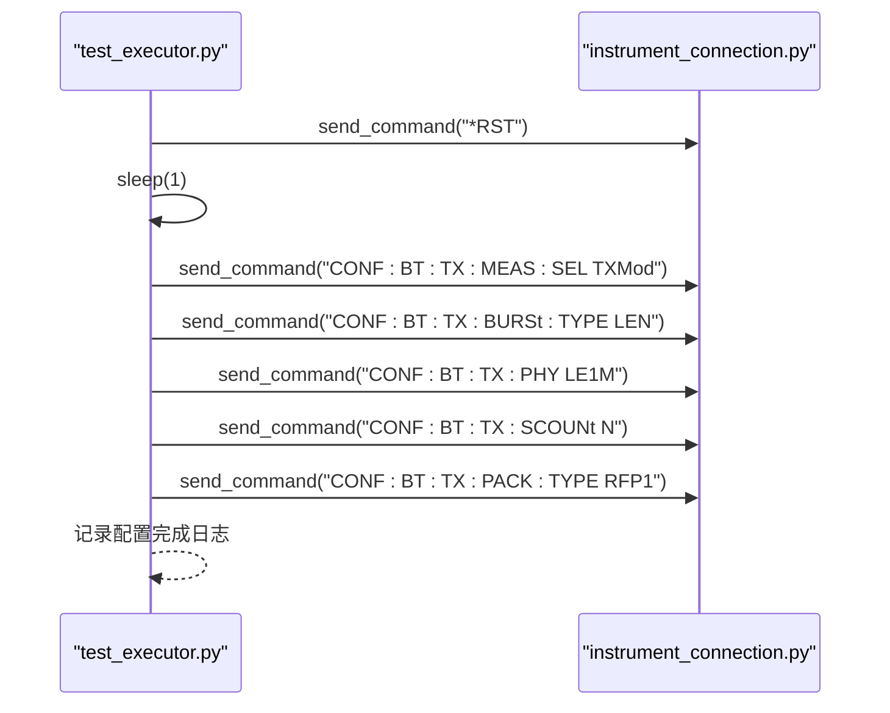

# 仪器配置流程

<cite>
**本文引用的文件**   
- [main.py](file://main.py)
- [instrument_connection.py](file://instrument_connection.py)
- [test_executor.py](file://test_executor.py)
- [gui_main.py](file://gui_main.py)
- [config.yaml](file://config.yaml)
- [data_exporter.py](file://data_exporter.py)
- [requirements.txt](file://requirements.txt)
</cite>

## 目录
1. [简介](#简介)
2. [项目结构](#项目结构)
3. [核心组件](#核心组件)
4. [架构总览](#架构总览)
5. [详细组件分析](#详细组件分析)
6. [依赖关系分析](#依赖关系分析)
7. [性能与精度考量](#性能与精度考量)
8. [故障排查指南](#故障排查指南)
9. [结论](#结论)
10. [附录：SCPI 指令参考与执行时序](#附录scpi-指令参考与执行时序)

## 简介
本技术文档聚焦于 CMW500 蓝牙 BLE TX 调制自动化测试中的“仪器配置流程”，深入解析 configure_instrument() 方法的完整实现，包括 SCPI 指令序列的执行顺序、每条指令的作用与意义。重点说明以下关键步骤：
- *RST 复位操作的重要性
- CONF:BT:TX:MEAS:SEL TXMod 测量模式选择
- CONF:BT:TX:BURSt:TYPE LEN 突发类型设置
- CONF:BT:TX:PHY LE1M PHY 类型配置
- CONF:BT:TX:SCOUNt 统计次数对测量精度的影响
- CONF:BT:TX:PACK:TYPE RFP1 数据包类型的选择依据

同时提供完整的 SCPI 指令参考与执行时序图，并说明配置过程中的错误处理与异常恢复机制。

## 项目结构
本项目为基于 Python 的 CMW500 自动化测试工具，支持 LAN/GPIB/USB 三种接口连接，提供命令行与图形界面两种运行模式，完成 BLE TX 调制测试、结果判定与 Excel 导出。

图表来源
- [main.py:295-336](file://main.py#L295-L336)
- [instrument_connection.py:18-133](file://instrument_connection.py#L18-L133)
- [test_executor.py:22-104](file://test_executor.py#L22-L104)
- [gui_main.py:75-124](file://gui_main.py#L75-L124)
- [data_exporter.py:23-139](file://data_exporter.py#L23-L139)
- [config.yaml:1-79](file://config.yaml#L1-L79)
- [requirements.txt:1-12](file://requirements.txt#L1-L12)

章节来源
- [main.py:295-336](file://main.py#L295-L336)
- [config.yaml:1-79](file://config.yaml#L1-L79)

## 核心组件
- 仪器连接模块（CMW500Connection）：封装 VISA 资源管理、连接/断开、查询与命令发送，支持 LAN/GPIB/USB 三种接口。
- 测试执行模块（BLETxModulationTest）：负责仪器配置、逐信道测量、结果收集与判定。
- GUI 主窗口（CMW500MainWindow）：提供可视化操作、实时日志与进度展示，通过工作线程避免阻塞 UI。
- 数据导出模块（DataExporter）：将测试结果导出为带样式的 Excel 文件，包含明细与摘要两个 Sheet。
- 配置与依赖：config.yaml 定义仪器连接参数、测试范围与限值；requirements.txt 列出运行时依赖。

章节来源
- [instrument_connection.py:18-216](file://instrument_connection.py#L18-L216)
- [test_executor.py:22-261](file://test_executor.py#L22-L261)
- [gui_main.py:75-667](file://gui_main.py#L75-L667)
- [data_exporter.py:23-283](file://data_exporter.py#L23-L283)
- [config.yaml:1-79](file://config.yaml#L1-L79)
- [requirements.txt:1-12](file://requirements.txt#L1-L12)

## 架构总览
整体控制流从 main.py 启动，加载 config.yaml 后创建 CMW500Connection 实例，GUI 或 CLI 模式下由用户触发连接与测试。测试执行器在独立线程中调用 configure_instrument() 完成仪器初始化与参数设置，随后逐信道进行测量与结果判定，最终可导出 Excel。

图表来源
- [main.py:295-336](file://main.py#L295-L336)
- [gui_main.py:499-528](file://gui_main.py#L499-L528)
- [instrument_connection.py:85-133](file://instrument_connection.py#L85-L133)
- [test_executor.py:186-245](file://test_executor.py#L186-L245)
- [data_exporter.py:81-139](file://data_exporter.py#L81-L139)

## 详细组件分析

### 仪器配置流程（configure_instrument）详解
configure_instrument() 是仪器初始化的核心方法，按固定顺序发送一组 SCPI 指令以建立 BLE TX 调制测量环境。其关键步骤如下：

- *RST 复位操作
  - 作用：将仪器恢复到默认状态，清除之前的会话配置与中间状态，确保后续配置的一致性与可重复性。
  - 重要性：避免残留配置导致测量偏差或指令冲突；在批量测试前必须执行。
  - 注意：复位后建议短暂休眠等待仪器内部状态稳定。

- 选择测量模式：CONF:BT:TX:MEAS:SEL TXMod
  - 作用：进入蓝牙发射端（TX）调制测量子菜单，启用相关测量功能集。
  - 影响：未正确选择会导致后续配置或读取指令无效。

- 设置突发类型：CONF:BT:TX:BURSt:TYPE LEN
  - 作用：指定突发类型为 Low Energy（LEN），适配 BLE 协议帧结构。
  - 影响：不同突发类型对应不同的帧格式与测量算法，需与 PHY 和包类型匹配。

- 设置 PHY 类型：CONF:BT:TX:PHY LE1M
  - 作用：选择 LE 1Msps 物理层速率，符合 BLE 标准常用速率。
  - 影响：PHY 类型决定射频带宽、调制方式与采样率等底层参数。

- 设置统计次数：CONF:BT:TX:SCOUNt N
  - 作用：设定每个信道的平均样本数 N，用于提升测量稳定性与精度。
  - 影响：N 越大，测量越稳健但耗时越长；过小可能导致波动较大。
  - 配置来源：来自 config.yaml 的 statistic_count。

- 设置数据包类型：CONF:BT:TX:PACK:TYPE RFP1
  - 作用：选择 RF PHY Test Reference Packet 1（RFP1），作为标准化测试数据包。
  - 选择依据：RFP1 是常用的参考包，便于在不同设备间对比与复现实验条件。
  - 影响：包类型应与突发类型与 PHY 类型一致，否则可能无法正确测量。

- 配置完成后记录日志，表示仪器已就绪，可进行逐信道测量。

图表来源
- [test_executor.py:76-104](file://test_executor.py#L76-L104)
- [config.yaml:27-38](file://config.yaml#L27-L38)

章节来源
- [test_executor.py:76-104](file://test_executor.py#L76-L104)
- [config.yaml:27-38](file://config.yaml#L27-L38)

### 单信道测量流程（measure_single_channel）
- 设置当前信道：CONF:BT:TX:FREQ:CHAN <channel>
- 启动单次测量：INIT:IMM
- 等待测量完成：*OPC?（操作完成时返回“1”）
- 读取五项指标（取绝对值比较）：
  - 频率准确度：FETC:BT:TX:FACC? AVER
  - 频率漂移：FETC:BT:TX:FDR? AVER
  - 频率偏移：FETC:BT:TX:FOFF? AVER
  - 初始频率漂移：FETC:BT:TX:FDR:INIT? AVER
  - 最大漂移速率：FETC:BT:TX:FDR:RATE? AVER
- 根据配置限值进行 PASS/FAIL 判定，并记录时间戳与信道号。

图表来源
- [test_executor.py:105-184](file://test_executor.py#L105-L184)

章节来源
- [test_executor.py:105-184](file://test_executor.py#L105-L184)

### 运行与停止（run / stop）
- run()：遍历信道范围，调用 configure_instrument() 一次，然后逐信道测量，支持中断。
- stop()：设置停止标志，当前信道完成后退出循环。

章节来源
- [test_executor.py:186-261](file://test_executor.py#L186-L261)

### GUI 集成与线程安全
- 主窗口使用 QThread 执行测试，通过信号槽向 UI 推送日志、进度与结果，避免阻塞界面。
- 按钮事件处理连接/断开、开始/停止测试与导出 Excel。

章节来源
- [gui_main.py:28-73](file://gui_main.py#L28-L73)
- [gui_main.py:499-528](file://gui_main.py#L499-L528)
- [gui_main.py:530-556](file://gui_main.py#L530-L556)

### 数据导出（DataExporter）
- 生成带时间戳的文件名，写入“测试数据”与“测试摘要”两个 Sheet。
- 应用样式（表头、边框、对齐、PASS/FAIL 着色）。
- 自动调整列宽，保存文件。

章节来源
- [data_exporter.py:81-139](file://data_exporter.py#L81-L139)
- [data_exporter.py:204-283](file://data_exporter.py#L204-L283)

## 依赖关系分析
- 外部依赖：pyvisa（VISA 通信）、pyvisa-py（纯 Python 后端）、pyusb/pyserial（底层驱动）、PyQt6（GUI）、pandas/openpyxl（Excel 导出）、PyYAML（配置解析）、matplotlib（可选绘图）、pyinstaller（打包）。
- 模块耦合：
  - main.py 负责加载配置与启动模式，延迟导入 instrument_connection 与 test_executor。
  - gui_main.py 通过 TestWorker 调用 test_executor，并通过信号槽更新 UI。
  - test_executor 依赖 instrument_connection 发送/查询 SCPI 指令。
  - data_exporter 仅依赖测试结果与配置，无仪器直接交互。

图表来源
- [main.py:295-336](file://main.py#L295-L336)
- [gui_main.py:499-528](file://gui_main.py#L499-L528)
- [test_executor.py:186-245](file://test_executor.py#L186-L245)
- [instrument_connection.py:85-133](file://instrument_connection.py#L85-L133)
- [data_exporter.py:81-139](file://data_exporter.py#L81-L139)
- [config.yaml:1-79](file://config.yaml#L1-L79)
- [requirements.txt:1-12](file://requirements.txt#L1-L12)

章节来源
- [requirements.txt:1-12](file://requirements.txt#L1-L12)
- [main.py:295-336](file://main.py#L295-L336)
- [gui_main.py:499-528](file://gui_main.py#L499-L528)
- [test_executor.py:186-245](file://test_executor.py#L186-L245)
- [instrument_connection.py:85-133](file://instrument_connection.py#L85-L133)
- [data_exporter.py:81-139](file://data_exporter.py#L81-L139)
- [config.yaml:1-79](file://config.yaml#L1-L79)

## 性能与精度考量
- 统计次数（statistic_count）
  - 增大 N 可降低随机噪声影响，提高测量稳定性，但会线性增加每信道测量时间。
  - 推荐根据现场环境与测试时长要求权衡，常见取值 5~20。
- 突发类型与 PHY 类型
  - LEN 与 LE1M 组合适用于大多数 BLE TX 场景；若需更高吞吐或不同帧结构，应相应调整。
- 数据包类型（RFP1）
  - 作为参考包，有利于跨设备一致性；如需特定业务负载特征，可考虑其他包类型（需确认仪器支持）。
- 超时与重试
  - 合理设置 VISA 超时（config.yaml 中 timeout），并在异常分支加入重试或回退逻辑以提升鲁棒性。

[本节为通用指导，不直接分析具体文件]

## 故障排查指南
- 连接失败
  - 现象：connect() 返回失败，提示网络/地址/驱动问题。
  - 排查：检查 IP/板号/地址/VID/PID/序列号是否正确；确认线缆与驱动安装；查看 pyvisa 后端是否可用。
  - 参考：instrument_connection.py 的连接与错误处理分支。
- 配置无效或测量异常
  - 现象：*OPC? 长时间无响应或读取结果为空。
  - 排查：确认 *RST 已执行且仪器稳定；检查突发类型、PHY 类型与包类型是否匹配；核对统计次数是否在仪器允许范围内。
  - 参考：test_executor.py 的配置与测量流程。
- 导出失败
  - 现象：Excel 导出抛出异常。
  - 排查：确认输出目录权限与磁盘空间；检查 pandas/openpyxl 版本兼容性。
  - 参考：data_exporter.py 的导出与样式应用。

章节来源
- [instrument_connection.py:85-133](file://instrument_connection.py#L85-L133)
- [test_executor.py:76-104](file://test_executor.py#L76-L104)
- [data_exporter.py:81-139](file://data_exporter.py#L81-L139)

## 结论
configure_instrument() 通过标准化的 SCPI 指令序列完成 CMW500 的 BLE TX 调制测量环境初始化。*RST 复位确保状态一致，随后的测量模式选择、突发类型、PHY 类型、统计次数与数据包类型共同决定了测量的准确性与效率。配合逐信道测量与 PASS/FAIL 判定，系统实现了端到端的自动化测试与报告导出。建议在工程实践中结合现场环境优化统计次数与超时策略，以提升稳定性与吞吐量。

[本节为总结，不直接分析具体文件]

## 附录：SCPI 指令参考与执行时序

### SCPI 指令参考
- 复位与状态
  - *RST：复位仪器到默认状态
  - *OPC?：查询操作是否完成（返回“1”表示完成）
- 配置类
  - CONF:BT:TX:MEAS:SEL TXMod：选择蓝牙 TX 调制测量
  - CONF:BT:TX:BURSt:TYPE LEN：设置突发类型为 Low Energy
  - CONF:BT:TX:PHY LE1M：设置 PHY 类型为 LE 1Msps
  - CONF:BT:TX:SCOUNt N：设置统计次数（N 来自配置）
  - CONF:BT:TX:PACK:TYPE RFP1：设置数据包类型为 RF PHY Test Reference Packet 1
  - CONF:BT:TX:FREQ:CHAN <channel>：设置当前测量信道
  - INIT:IMM：立即启动单次测量
- 读取类
  - FETC:BT:TX:FACC? AVER：频率准确度（平均值）
  - FETC:BT:TX:FDR? AVER：频率漂移（平均值）
  - FETC:BT:TX:FOFF? AVER：频率偏移（平均值）
  - FETC:BT:TX:FDR:INIT? AVER：初始频率漂移（平均值）
  - FETC:BT:TX:FDR:RATE? AVER：最大漂移速率（平均值）

章节来源
- [test_executor.py:76-184](file://test_executor.py#L76-L184)

### 执行时序图（配置阶段）

图表来源
- [test_executor.py:76-104](file://test_executor.py#L76-L104)

### 执行时序图（单信道测量）

图表来源
- [test_executor.py:105-184](file://test_executor.py#L105-L184)