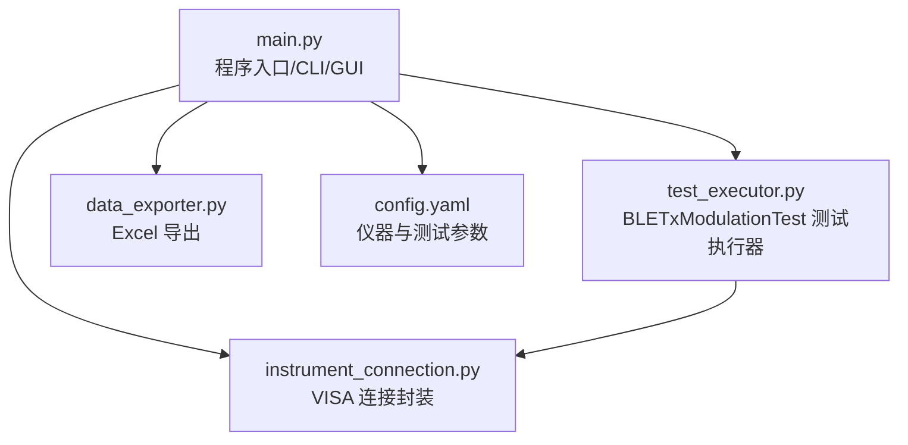
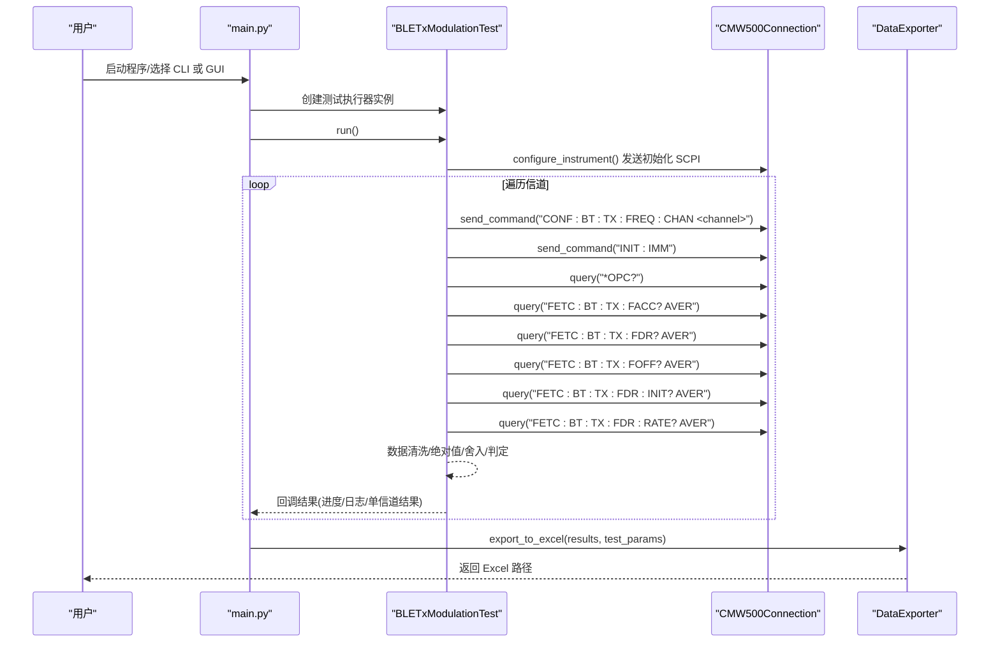
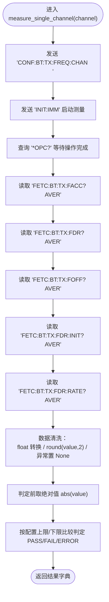
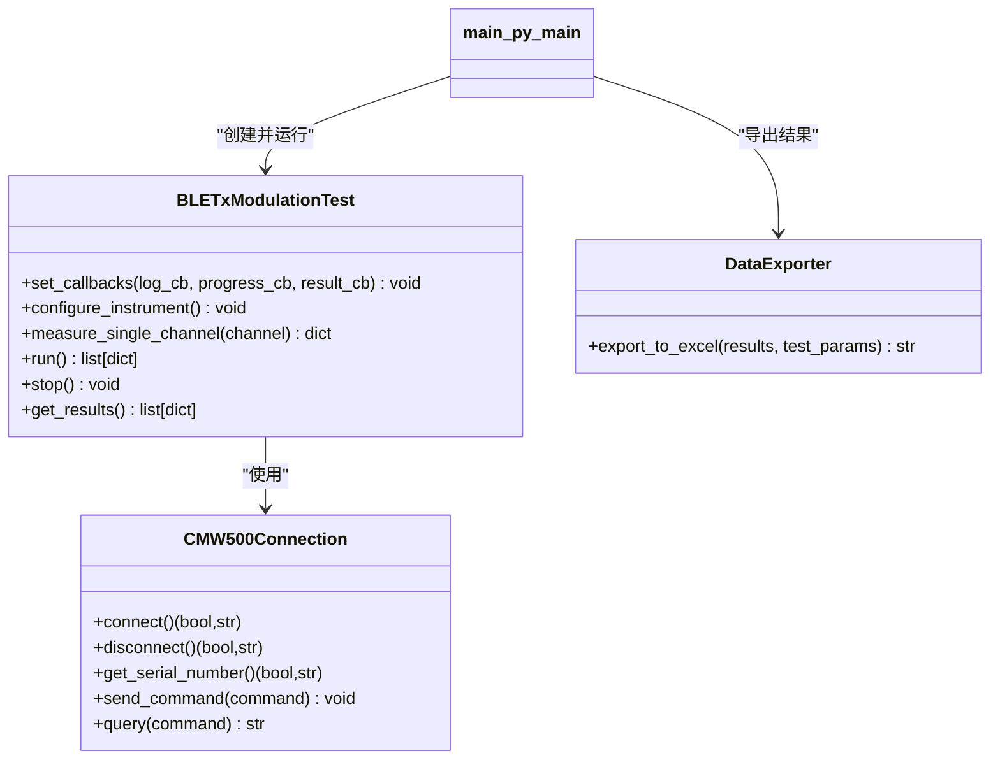
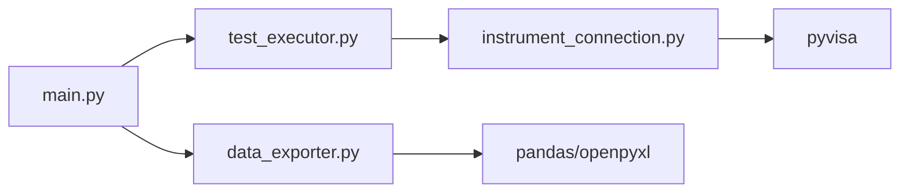

# 单信道测量执行

<cite>
**本文引用的文件**
- [main.py](file://main.py)
- [test_executor.py](file://test_executor.py)
- [instrument_connection.py](file://instrument_connection.py)
- [config.yaml](file://config.yaml)
- [data_exporter.py](file://data_exporter.py)
</cite>

## 目录
1. [简介](#简介)
2. [项目结构](#项目结构)
3. [核心组件](#核心组件)
4. [架构总览](#架构总览)
5. [详细组件分析](#详细组件分析)
6. [依赖关系分析](#依赖关系分析)
7. [性能考量](#性能考量)
8. [故障排查指南](#故障排查指南)
9. [结论](#结论)
10. [附录](#附录)

## 简介
本技术文档聚焦于“单信道测量执行”的完整实现，围绕 BLETxModulationTest.measure_single_channel() 方法展开，系统阐述以下要点：
- 信道设置 CONF:BT:TX:FREQ:CHAN 与测量启动 INIT:IMM 的执行流程
- *OPC? 操作完成查询机制的工作原理及如何确保测量结果完整性
- 五项频率指标的测量过程与数据清洗、绝对值转换、精度舍入逻辑
- 异常处理机制与容错策略（测量失败时的错误记录）

该功能用于控制 R&S CMW500 无线通信测试仪，对 BLE TX 调制进行自动化测试，逐信道采集并判定频率准确度、频率漂移、频率偏移、初始频率漂移和最大漂移速率等指标。

## 项目结构
本项目采用分层组织方式：
- 入口与配置加载：main.py
- 仪器连接封装：instrument_connection.py
- 测试执行与单信道测量：test_executor.py
- 数据导出与样式美化：data_exporter.py
- 配置文件：config.yaml

图表来源
- [main.py:295-336](file://main.py#L295-L336)
- [instrument_connection.py:18-110](file://instrument_connection.py#L18-L110)
- [test_executor.py:22-104](file://test_executor.py#L22-L104)
- [data_exporter.py:23-93](file://data_exporter.py#L23-L93)
- [config.yaml:1-79](file://config.yaml#L1-L79)

章节来源
- [main.py:295-336](file://main.py#L295-L336)
- [config.yaml:1-79](file://config.yaml#L1-L79)

## 核心组件
- BLETxModulationTest：负责仪器初始化、逐信道测量、结果收集与回调通知。
- CMW500Connection：封装 VISA 资源管理，提供 send_command/query 等 SCPI 指令交互能力。
- DataExporter：将测试结果导出为 Excel，包含样式与摘要统计。
- main.py：统一入口，支持 CLI/GUI 两种模式，加载配置并驱动测试执行。

章节来源
- [test_executor.py:22-104](file://test_executor.py#L22-L104)
- [instrument_connection.py:18-110](file://instrument_connection.py#L18-L110)
- [data_exporter.py:23-93](file://data_exporter.py#L23-L93)
- [main.py:295-336](file://main.py#L295-L336)

## 架构总览
下图展示了从入口到仪器、再到结果导出的整体调用链，重点标注了单信道测量的关键步骤。

图表来源
- [main.py:178-204](file://main.py#L178-L204)
- [test_executor.py:186-245](file://test_executor.py#L186-L245)
- [test_executor.py:105-184](file://test_executor.py#L105-L184)
- [instrument_connection.py:192-215](file://instrument_connection.py#L192-L215)
- [data_exporter.py:81-139](file://data_exporter.py#L81-L139)

## 详细组件分析

### 单信道测量执行流程（measure_single_channel）
该方法的核心职责是：
- 设置当前信道
- 立即启动单次测量
- 等待操作完成
- 读取五项频率指标
- 数据清洗、绝对值转换与精度舍入
- 基于限值进行 PASS/FAIL/ERROR 判定

图表来源
- [test_executor.py:105-184](file://test_executor.py#L105-L184)
- [instrument_connection.py:192-215](file://instrument_connection.py#L192-L215)

章节来源
- [test_executor.py:105-184](file://test_executor.py#L105-L184)
- [instrument_connection.py:192-215](file://instrument_connection.py#L192-L215)

#### 关键步骤说明
- 信道设置：通过 CONF:BT:TX:FREQ:CHAN 指定当前 BLE 信道编号（0~39）。
- 测量启动：INIT:IMM 触发一次即时测量。
- 完成查询：*OPC? 在操作完成后返回 “1”，确保后续读取的数据来自本次测量。
- 指标读取：依次读取 FETC:BT:TX:FACC?、FETC:BT:TX:FDR?、FETC:BT:TX:FOFF?、FETC:BT:TX:FDR:INIT?、FETC:BT:TX:FDR:RATE?，均带 AVER 后缀以获取平均结果。
- 数据清洗：
  - float 转换：将字符串响应转为浮点数
  - 精度舍入：round(value, 2)，保留两位小数
  - 异常保护：捕获异常并将对应字段置为 None
- 绝对值转换：判定阶段使用 abs(value) 比较，避免负值导致误判
- 判定逻辑：依据 config.yaml 中 measurements 的 upper_limit/lower_limit 进行 PASS/FAIL；若值为 None，则标记为 ERROR

章节来源
- [test_executor.py:105-184](file://test_executor.py#L105-L184)
- [config.yaml:44-71](file://config.yaml#L44-L71)

### 操作完成查询机制（*OPC?）
- 工作原理：*OPC? 查询操作状态寄存器，当所有挂起操作完成后返回 “1”。
- 作用：保证 INIT:IMM 触发的测量已稳定结束，再读取各项指标，避免读到未完成或部分更新的数据。
- 完整性保障：
  - 在读取任何指标之前必须成功完成 *OPC? 查询
  - 若 *OPC? 抛出异常（如通信中断），上层循环会捕获并记录错误结果，防止污染后续信道数据

章节来源
- [test_executor.py:118-123](file://test_executor.py#L118-L123)
- [instrument_connection.py:203-215](file://instrument_connection.py#L203-L215)

### 五项频率指标的测量与数据处理
- 频率准确度（Frequency Accuracy）：FETC:BT:TX:FACC? AVER
- 频率漂移（Frequency Drift）：FETC:BT:TX:FDR? AVER
- 频率偏移（Frequency Offset）：FETC:BT:TX:FOFF? AVER
- 初始频率漂移（Initial Frequency Drift）：FETC:BT:TX:FDR:INIT? AVER
- 最大漂移速率（Max Drift Rate）：FETC:BT:TX:FDR:RATE? AVER

数据处理逻辑：
- 读取后执行 float 转换与 round(value, 2) 精度舍入
- 异常时置 None，并在判定阶段标记为 ERROR
- 判定前对数值取绝对值，确保正负偏差一致对待

章节来源
- [test_executor.py:131-164](file://test_executor.py#L131-L164)
- [test_executor.py:166-183](file://test_executor.py#L166-L183)
- [config.yaml:44-71](file://config.yaml#L44-L71)

### 异常处理与容错策略
- 单指标异常：每个指标读取都包裹 try/except，异常时将该字段设为 None，不影响其他指标继续读取
- 通道级异常：run() 中对 measure_single_channel 的调用也包裹 try/except，捕获后将错误信息写入结果字典，并继续下一个信道
- 停止信号：run() 每轮迭代检查 is_stopped，允许用户中途停止测试
- 连接层异常：CMW500Connection.send_command/query 在未连接时抛出 ConnectionError，由上层捕获并记录

章节来源
- [test_executor.py:212-234](file://test_executor.py#L212-L234)
- [test_executor.py:247-251](file://test_executor.py#L247-L251)
- [instrument_connection.py:192-215](file://instrument_connection.py#L192-L215)

### 类结构与依赖关系

图表来源
- [test_executor.py:22-104](file://test_executor.py#L22-L104)
- [instrument_connection.py:18-110](file://instrument_connection.py#L18-L110)
- [data_exporter.py:23-93](file://data_exporter.py#L23-L93)
- [main.py:295-336](file://main.py#L295-L336)

章节来源
- [test_executor.py:22-104](file://test_executor.py#L22-L104)
- [instrument_connection.py:18-110](file://instrument_connection.py#L18-L110)
- [data_exporter.py:23-93](file://data_exporter.py#L23-L93)
- [main.py:295-336](file://main.py#L295-L336)

## 依赖关系分析
- 模块耦合
  - BLETxModulationTest 强依赖 CMW500Connection 的 send_command/query 接口
  - main.py 作为编排者，协调测试执行与数据导出
  - DataExporter 仅依赖测试结果与配置，无仪器访问
- 外部依赖
  - pyvisa：用于 VISA 资源管理与 SCPI 指令通信
  - pandas/openpyxl：用于 Excel 导出与样式应用
- 潜在风险
  - 网络/总线不稳定可能导致 *OPC? 或指标读取超时
  - 仪器固件差异可能影响 SCPI 子命令可用性（AVER 后缀需确认）

图表来源
- [main.py:295-336](file://main.py#L295-L336)
- [test_executor.py:186-245](file://test_executor.py#L186-L245)
- [instrument_connection.py:15-110](file://instrument_connection.py#L15-L110)
- [data_exporter.py:14-20](file://data_exporter.py#L14-L20)

章节来源
- [instrument_connection.py:15-110](file://instrument_connection.py#L15-L110)
- [data_exporter.py:14-20](file://data_exporter.py#L14-L20)

## 性能考量
- 测量时序
  - 每次测量包含多次 SCPI 读写，建议合理设置 timeout（默认 10000ms）
  - 统计次数 statistic_count 越大，单次测量耗时越长
- 批量扫描
  - 逐信道串行测量，可通过回调实时推送进度，提升用户体验
- 数据量
  - 40 个信道 × 5 项指标，导出 Excel 时注意列宽与样式渲染开销

[本节为通用指导，不直接分析具体文件]

## 故障排查指南
- 无法连接仪器
  - 检查 interface_type 与地址参数（LAN IP、GPIB Board/Address、USB VID/PID/SN）
  - 查看 connect() 返回的错误提示与 hint 信息
- 测量失败或结果为 ERROR
  - 检查 *OPC? 是否成功返回
  - 逐项核对 FETC:* 指令是否被仪器支持
  - 关注异常堆栈与错误日志
- 导出失败
  - 确认输出目录权限与路径存在
  - 检查 openpyxl/pandas 依赖安装情况

章节来源
- [instrument_connection.py:85-132](file://instrument_connection.py#L85-L132)
- [instrument_connection.py:192-215](file://instrument_connection.py#L192-L215)
- [test_executor.py:212-234](file://test_executor.py#L212-L234)
- [data_exporter.py:63-79](file://data_exporter.py#L63-L79)

## 结论
measure_single_channel() 实现了完整的单信道测量闭环：信道设置、立即测量、操作完成查询、指标读取、数据清洗与判定。通过 *OPC? 确保测量结果的完整性，结合 try/except 与错误结果记录实现良好的容错性。配合 DataExporter 可生成格式化的 Excel 报告，便于分析与归档。

[本节为总结性内容，不直接分析具体文件]

## 附录

### 配置项参考（节选）
- 仪器连接
  - interface_type：LAN/GPIB/USB
  - lan.ip_address、gpib.board/address、usb.vendor_id/product_id/serial_number、timeout
- 测试参数
  - standard、phy_type、burst_type、packet_type、statistic_count
  - channel_start/channel_end
  - measurements：每项含 name/unit/upper_limit/lower_limit

章节来源
- [config.yaml:1-79](file://config.yaml#L1-L79)