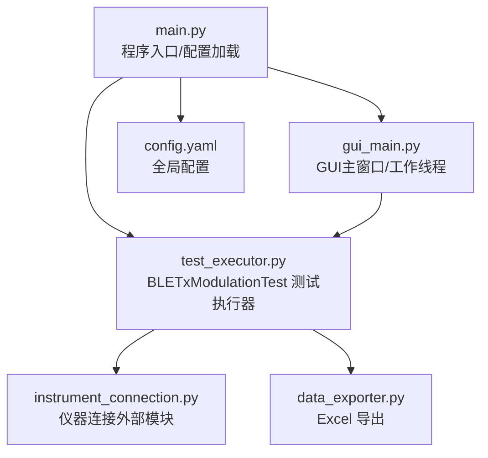
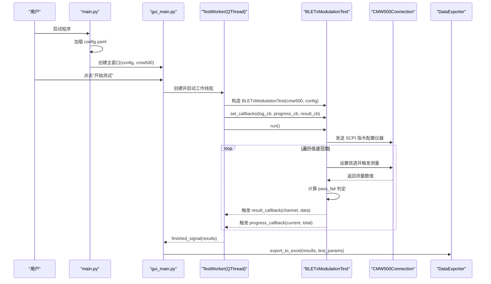
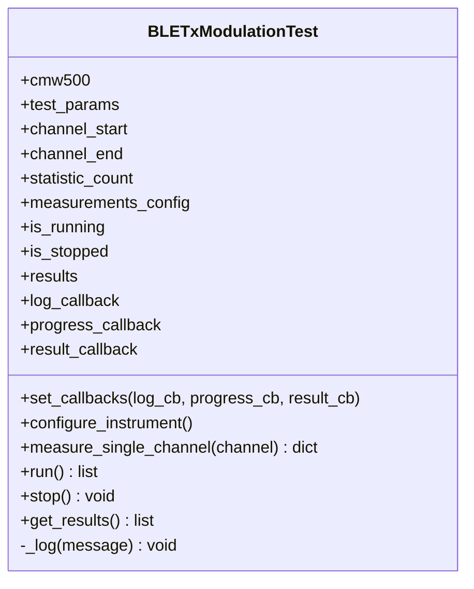
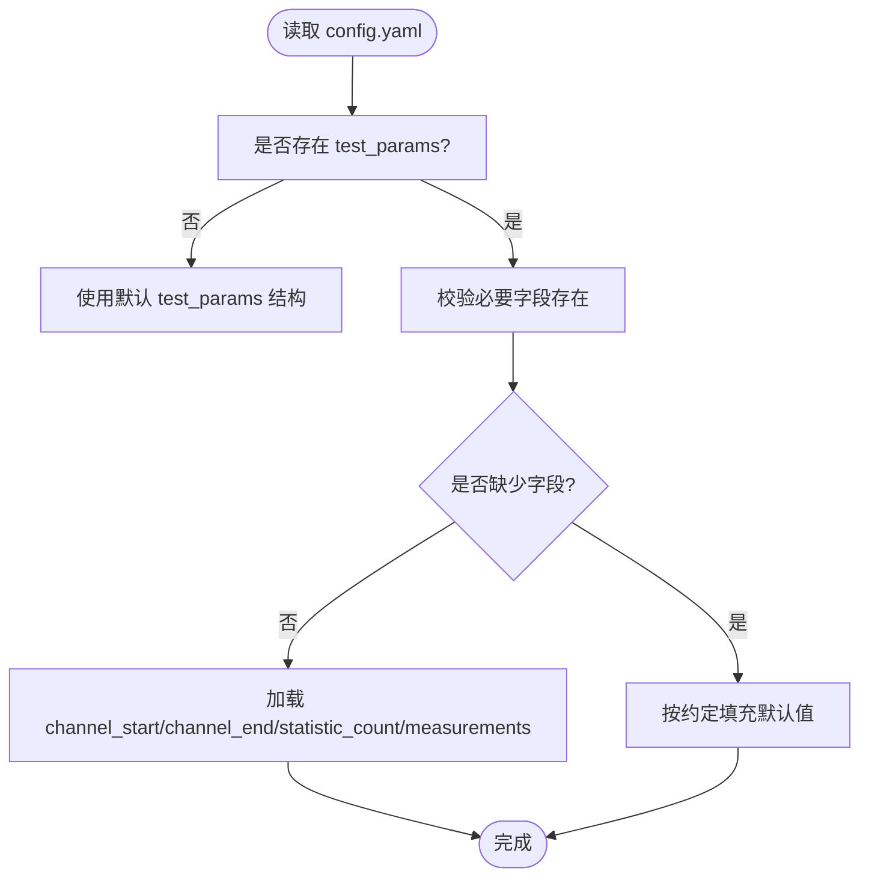
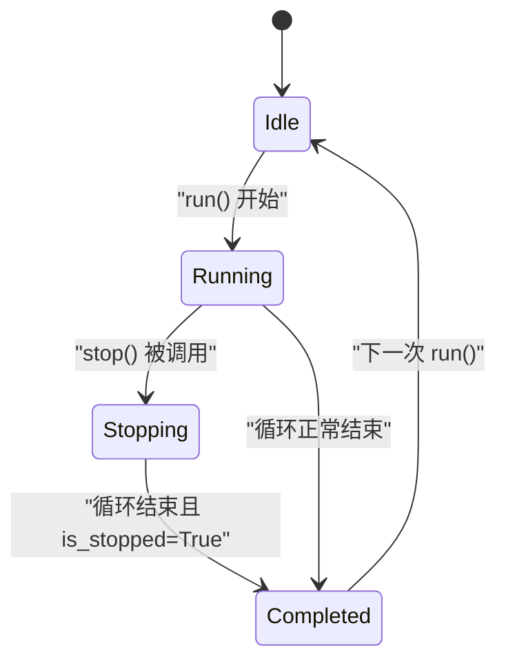
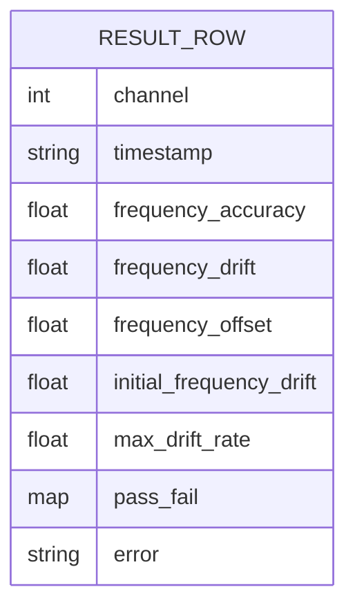
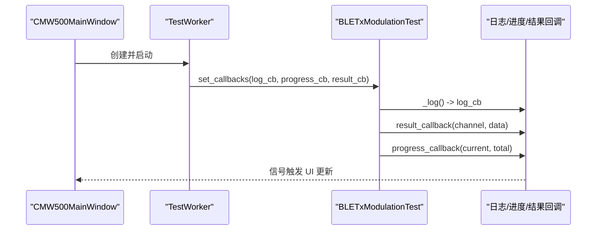
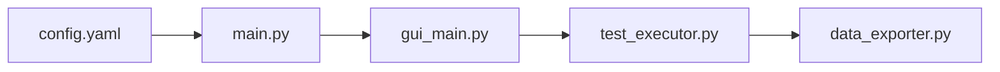

# 测试初始化配置

<cite>
**本文引用的文件**   
- [test_executor.py](file://test_executor.py)
- [config.yaml](file://config.yaml)
- [main.py](file://main.py)
- [gui_main.py](file://gui_main.py)
- [data_exporter.py](file://data_exporter.py)
</cite>

## 目录
1. [简介](#简介)
2. [项目结构](#项目结构)
3. [核心组件](#核心组件)
4. [架构总览](#架构总览)
5. [详细组件分析](#详细组件分析)
6. [依赖关系分析](#依赖关系分析)
7. [性能与稳定性考量](#性能与稳定性考量)
8. [故障排查指南](#故障排查指南)
9. [结论](#结论)
10. [附录：配置示例与最佳实践](#附录配置示例与最佳实践)

## 简介
本技术文档聚焦于 BLETxModulationTest 类的初始化配置，系统性解析其 __init__ 方法在参数读取、状态变量初始化、回调函数设置机制等方面的实现细节；同时深入说明 test_params 配置项（channel_start、channel_end、statistic_count、measurements 等）的解析过程、默认值来源与使用方式。文档还涵盖 is_running 与 is_stopped 状态标志的管理逻辑、results 列表的数据结构设计，并提供配置示例与最佳实践建议，帮助用户正确设置测试参数以获得准确可靠的测量结果。

## 项目结构
本项目为 CMW500 BLE TX 调制自动化测试工具，主要模块包括：
- 入口与配置加载：main.py
- 测试执行器：test_executor.py（包含 BLETxModulationTest）
- GUI 界面与线程调度：gui_main.py
- 数据导出：data_exporter.py
- 配置文件：config.yaml

图表来源
- [main.py:295-336](file://main.py#L295-L336)
- [gui_main.py:42-73](file://gui_main.py#L42-L73)
- [test_executor.py:22-51](file://test_executor.py#L22-L51)
- [data_exporter.py:81-139](file://data_exporter.py#L81-L139)
- [config.yaml:27-71](file://config.yaml#L27-L71)

章节来源
- [main.py:295-336](file://main.py#L295-L336)
- [gui_main.py:42-73](file://gui_main.py#L42-L73)
- [test_executor.py:22-51](file://test_executor.py#L22-L51)
- [data_exporter.py:81-139](file://data_exporter.py#L81-L139)
- [config.yaml:27-71](file://config.yaml#L27-L71)

## 核心组件
- BLETxModulationTest：负责 BLE TX 调制测试的执行流程，包括仪器配置、逐信道测量、结果收集与判定、进度与日志回调、停止控制等。
- DataExporter：将测试结果导出为 Excel，生成“测试数据”和“测试摘要”两个 Sheet，并应用样式。
- main.py：加载 config.yaml，进行兼容性处理，创建仪器连接实例，启动 CLI 或 GUI 模式。
- gui_main.py：提供图形界面，通过 QThread 运行测试，绑定回调信号更新 UI。

章节来源
- [test_executor.py:22-51](file://test_executor.py#L22-L51)
- [data_exporter.py:23-62](file://data_exporter.py#L23-L62)
- [main.py:85-114](file://main.py#L85-L114)
- [gui_main.py:42-73](file://gui_main.py#L42-L73)

## 架构总览
下图展示了从配置加载到测试执行的总体流程，以及回调机制如何驱动 GUI 更新。

图表来源
- [main.py:295-336](file://main.py#L295-L336)
- [gui_main.py:42-73](file://gui_main.py#L42-L73)
- [test_executor.py:186-245](file://test_executor.py#L186-L245)
- [data_exporter.py:81-139](file://data_exporter.py#L81-L139)

## 详细组件分析

### BLETxModulationTest.__init__ 方法详解
- 参数与来源
  - cmw500：已连接的仪器连接实例（由 main.py 或 GUI 传入）。
  - config：从 config.yaml 加载的配置字典，包含 instrument、test_params、export 等键。
- 关键步骤
  - 提取 test_params 子配置，并直接引用 channel_start、channel_end、statistic_count、measurements。
  - 初始化运行状态标志：is_running、is_stopped。
  - 初始化 results 列表用于存储每个信道的结果字典。
  - 初始化回调函数占位符：log_callback、progress_callback、result_callback。
- 参数验证
  - 当前实现未对 test_params 字段进行显式校验；若缺失键会在后续访问时抛出异常。建议在调用方或入口处增加校验与默认值补全。
- 状态变量管理
  - is_running：run() 开始时置 True，结束时置 False。
  - is_stopped：stop() 置 True，run() 循环中检查该标志以支持中断。
- 回调函数设置机制
  - set_callbacks() 允许外部（如 GUI）注入日志、进度、单信道结果回调。
  - _log() 内部统一输出带时间戳的日志，并触发 log_callback。
  - run() 在每个信道完成后触发 result_callback 与 progress_callback。

图表来源
- [test_executor.py:22-51](file://test_executor.py#L22-L51)
- [test_executor.py:52-74](file://test_executor.py#L52-L74)
- [test_executor.py:76-103](file://test_executor.py#L76-L103)
- [test_executor.py:105-184](file://test_executor.py#L105-L184)
- [test_executor.py:186-245](file://test_executor.py#L186-L245)
- [test_executor.py:247-260](file://test_executor.py#L247-L260)

章节来源
- [test_executor.py:25-51](file://test_executor.py#L25-L51)
- [test_executor.py:52-74](file://test_executor.py#L52-L74)
- [test_executor.py:186-245](file://test_executor.py#L186-L245)

### test_params 配置项解析与默认值
- 数据来源
  - config.yaml 中的 test_params 节点定义了标准、PHY 类型、突发类型、数据包类型、统计次数、信道范围与各项测量指标及限值。
- 关键字段与作用
  - channel_start、channel_end：定义扫描的信道范围（BLE 共 40 个信道，通常 0~39）。
  - statistic_count：每个信道测量的平均样本数，影响测量精度与耗时。
  - measurements：每项指标的 name、unit、upper_limit、lower_limit，用于结果展示与 PASS/FAIL 判定。
- 默认值策略
  - 当前代码未对 test_params 做默认值填充；所有字段必须存在于配置文件中，否则运行时可能抛出 KeyError。
  - 建议在入口层（如 main.py 的 _normalize_config）增加对 test_params 的兼容性与默认值补齐，提升鲁棒性。

图表来源
- [config.yaml:27-71](file://config.yaml#L27-L71)
- [main.py:245-292](file://main.py#L245-L292)

章节来源
- [config.yaml:27-71](file://config.yaml#L27-L71)
- [main.py:245-292](file://main.py#L245-L292)

### is_running 与 is_stopped 状态标志管理
- 生命周期
  - run() 开始时设置 is_running=True、is_stopped=False、清空 results。
  - 循环内每次迭代前检查 is_stopped，若为 True 则记录日志并退出循环。
  - 循环结束后设置 is_running=False，并在非主动停止的情况下记录完成日志。
- stop() 行为
  - 仅在 is_running 为 True 时将 is_stopped 置为 True，并记录停止日志。
- 线程安全
  - GUI 通过 TestWorker 线程调用 stop_test()，进而调用 test_executor.stop()，避免阻塞主线程。

图表来源
- [test_executor.py:186-245](file://test_executor.py#L186-L245)
- [test_executor.py:247-251](file://test_executor.py#L247-L251)

章节来源
- [test_executor.py:186-245](file://test_executor.py#L186-L245)
- [test_executor.py:247-251](file://test_executor.py#L247-L251)

### results 列表数据结构设计
- 元素结构
  - 成功信道结果：包含 channel、timestamp、各测量指标数值（frequency_accuracy、frequency_drift、frequency_offset、initial_frequency_drift、max_drift_rate）、pass_fail 判定字典。
  - 错误信道结果：包含 channel、timestamp、error 字段，便于定位失败原因。
- 生成时机
  - measure_single_channel() 构建单信道结果字典，run() 将其追加至 results。
  - 异常捕获后写入 error_result，确保结果列表长度与信道数量一致。
- 下游使用
  - GUI 通过 result_callback 实时渲染表格。
  - DataExporter 基于 results 与 test_params 生成 Excel 的“测试数据”与“测试摘要”。

图表来源
- [test_executor.py:105-184](file://test_executor.py#L105-L184)
- [test_executor.py:226-234](file://test_executor.py#L226-L234)
- [data_exporter.py:95-139](file://data_exporter.py#L95-L139)

章节来源
- [test_executor.py:105-184](file://test_executor.py#L105-L184)
- [test_executor.py:226-234](file://test_executor.py#L226-L234)
- [data_exporter.py:95-139](file://data_exporter.py#L95-L139)

### 回调函数设置机制与 GUI 集成
- 设置方式
  - set_callbacks() 接收三个可选回调：日志、进度、单信道结果。
- GUI 绑定
  - TestWorker.run() 中创建 BLETxModulationTest 并调用 set_callbacks()，将内部回调映射为 Qt 信号。
  - 主窗口槽函数接收信号并更新表格、进度条与日志。
- 优点
  - 解耦测试执行与界面更新，保证 UI 响应性。
  - 支持 CLI 与 GUI 两种模式复用同一测试执行器。

图表来源
- [gui_main.py:42-73](file://gui_main.py#L42-L73)
- [test_executor.py:52-74](file://test_executor.py#L52-L74)
- [test_executor.py:186-245](file://test_executor.py#L186-L245)

章节来源
- [gui_main.py:42-73](file://gui_main.py#L42-L73)
- [test_executor.py:52-74](file://test_executor.py#L52-L74)
- [test_executor.py:186-245](file://test_executor.py#L186-L245)

## 依赖关系分析
- 模块耦合
  - main.py 负责加载配置与创建连接，不直接参与测试逻辑。
  - gui_main.py 通过 TestWorker 组织测试执行与 UI 更新。
  - test_executor.py 依赖仪器连接接口与配置，输出结构化结果。
  - data_exporter.py 依赖测试结果与 test_params，生成 Excel。
- 潜在风险
  - 配置缺失或未校验可能导致运行时异常。
  - 回调未设置时，部分功能不可用（但不会崩溃，因为有条件判断）。

图表来源
- [main.py:85-114](file://main.py#L85-L114)
- [gui_main.py:42-73](file://gui_main.py#L42-L73)
- [test_executor.py:22-51](file://test_executor.py#L22-L51)
- [data_exporter.py:81-139](file://data_exporter.py#L81-L139)

章节来源
- [main.py:85-114](file://main.py#L85-L114)
- [gui_main.py:42-73](file://gui_main.py#L42-L73)
- [test_executor.py:22-51](file://test_executor.py#L22-L51)
- [data_exporter.py:81-139](file://data_exporter.py#L81-L139)

## 性能与稳定性考量
- statistic_count 的影响
  - 增大统计次数可提高测量稳定性，但会线性增加单次信道测量时间。
- 信道范围
  - 全信道扫描（0~39）耗时较长，可先缩小范围进行快速验证。
- 异常处理
  - 单信道测量异常会被捕获并记录错误结果，不影响整体流程。
- 回调开销
  - 频繁回调可能带来 UI 刷新压力，建议批量更新或节流（当前实现为逐信道更新，适合少量信道）。

[本节为通用指导，无需特定文件来源]

## 故障排查指南
- 常见错误
  - 配置文件缺失或格式错误：检查 config.yaml 路径与 YAML 语法。
  - 仪器连接失败：确认接口类型与地址参数，查看连接日志。
  - 测试中途停止：检查 is_stopped 标志与 stop() 调用时机。
  - 导出失败：确认输出目录权限与 openpyxl 依赖。
- 定位方法
  - 查看日志输出（含时间戳），结合 GUI 日志窗口。
  - 检查 results 列表中是否存在 error 字段，定位失败信道。
  - 核对 test_params 中 measurements 的 key 是否与测量项一致。

章节来源
- [main.py:85-114](file://main.py#L85-L114)
- [test_executor.py:226-234](file://test_executor.py#L226-L234)
- [data_exporter.py:81-139](file://data_exporter.py#L81-L139)

## 结论
BLETxModulationTest 的初始化配置围绕 test_params 展开，直接读取信道范围、统计次数与测量指标配置，并通过状态标志与回调机制实现可控的测试执行与界面反馈。当前实现简洁高效，但缺乏对配置的显式校验与默认值补齐。建议在入口层增强配置校验与默认值填充，以提升鲁棒性与易用性。

[本节为总结性内容，无需特定文件来源]

## 附录：配置示例与最佳实践

- 配置示例要点
  - 明确 channel_start 与 channel_end，覆盖目标信道范围。
  - 合理设置 statistic_count，平衡精度与效率。
  - 在 measurements 中为每项指标配置 name、unit、upper_limit、lower_limit，确保导出与判定正确。
- 最佳实践建议
  - 在 main.py 的 _normalize_config 中增加 test_params 的默认值补齐与字段校验。
  - 在 GUI 中提供配置预览与校验提示，避免运行时错误。
  - 对于大批量信道扫描，考虑分批次执行与中间结果保存。
  - 定期清理历史导出文件，避免磁盘占用过大。

章节来源
- [config.yaml:27-71](file://config.yaml#L27-L71)
- [main.py:245-292](file://main.py#L245-L292)
- [data_exporter.py:141-202](file://data_exporter.py#L141-L202)