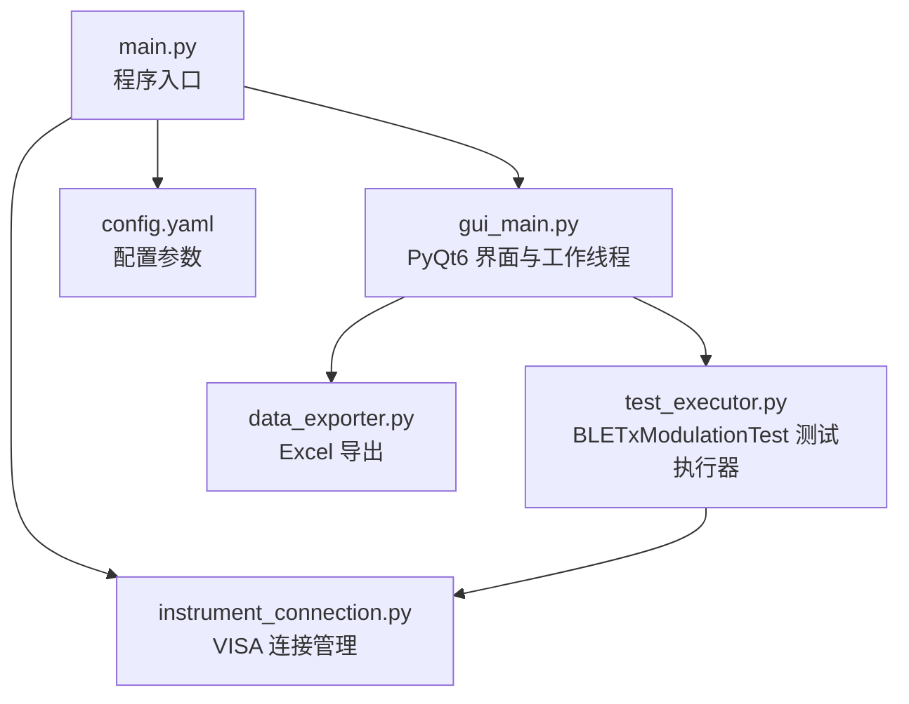
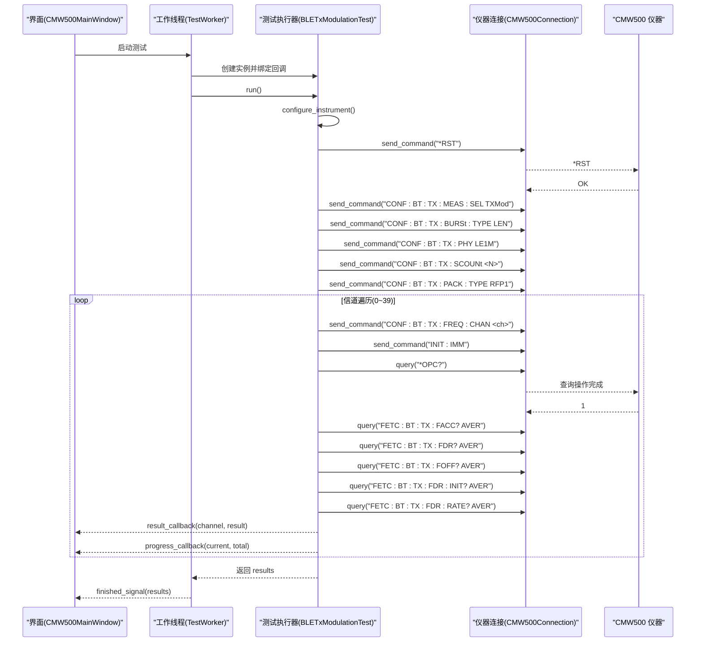
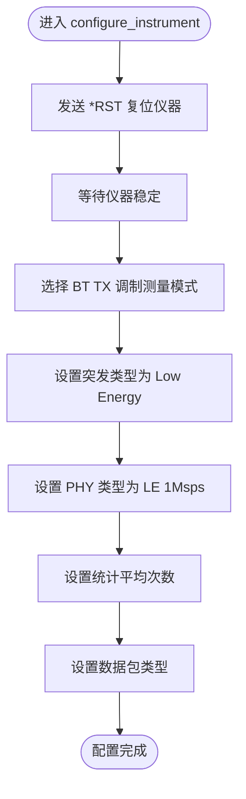
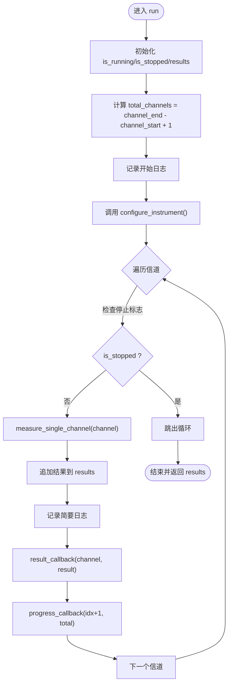
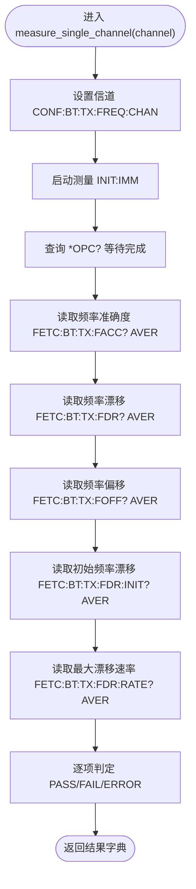
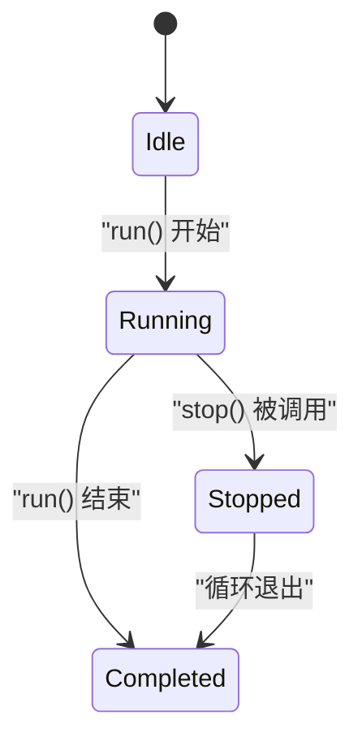
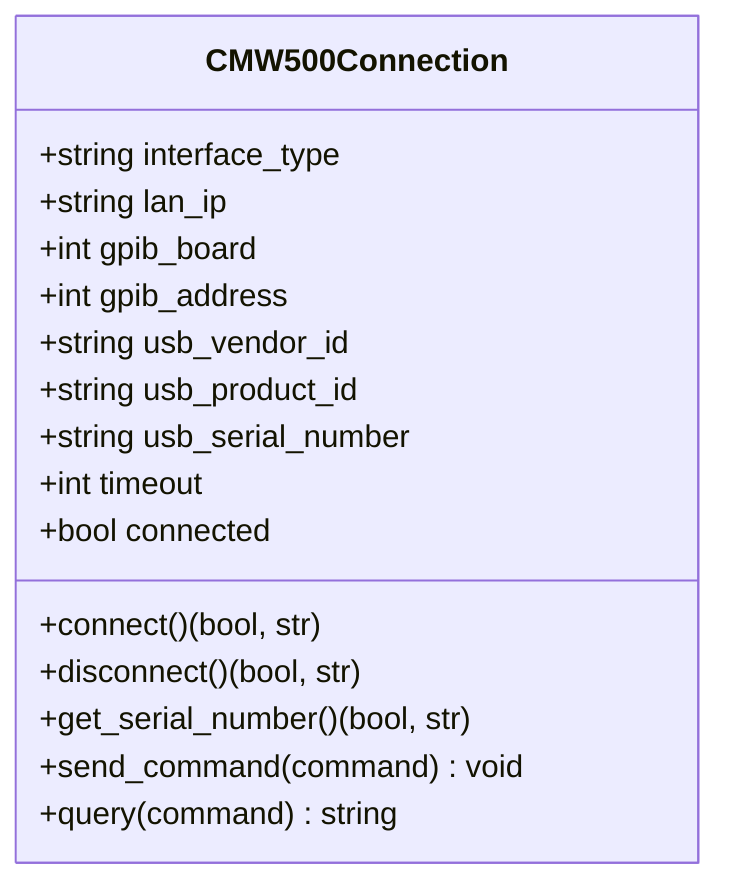
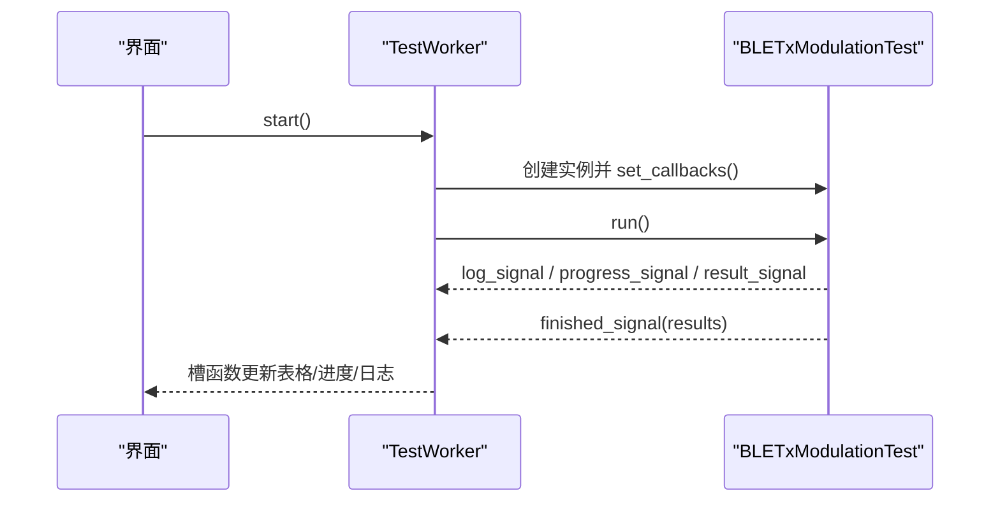
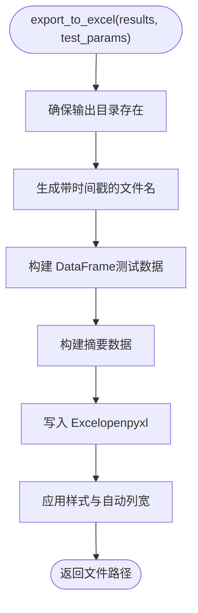
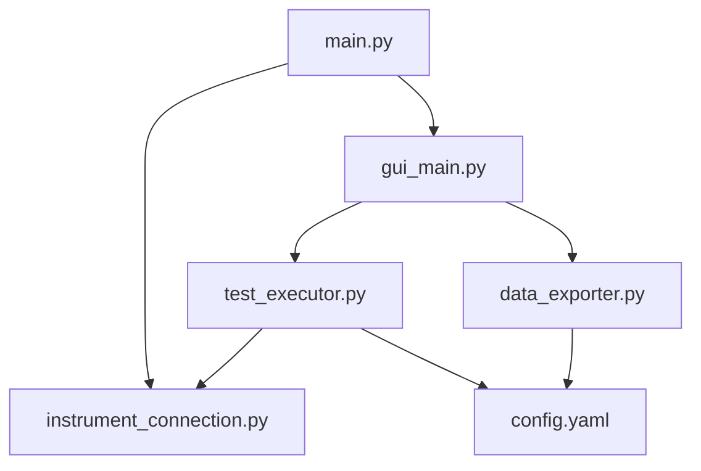

# 测试执行流程

<cite>
**本文引用的文件**   
- [test_executor.py](file://test_executor.py)
- [main.py](file://main.py)
- [instrument_connection.py](file://instrument_connection.py)
- [config.yaml](file://config.yaml)
- [gui_main.py](file://gui_main.py)
- [data_exporter.py](file://data_exporter.py)
</cite>

## 目录
1. [简介](#简介)
2. [项目结构](#项目结构)
3. [核心组件](#核心组件)
4. [架构总览](#架构总览)
5. [详细组件分析](#详细组件分析)
6. [依赖关系分析](#依赖关系分析)
7. [性能与稳定性考量](#性能与稳定性考量)
8. [故障排查指南](#故障排查指南)
9. [结论](#结论)

## 简介
本技术文档聚焦于 BLE LE 1Msps TX 调制自动化测试的完整执行流程，重点解析 BLETxModulationTest 类从初始化配置到信道扫描的每一步。文档涵盖：
- configure_instrument() 仪器配置序列（复位、测量模式选择、参数设置）
- run() 主循环逻辑（信道遍历、进度跟踪、异常处理）
- measure_single_channel() 单信道测量流程（信道设置、启动测量、结果读取与判定）
- 状态转换与时序图，展示测试生命周期与关键状态点
- 错误处理与恢复机制的实现细节

## 项目结构
本项目采用分层组织方式：入口与界面层、测试执行层、仪器通信层、数据导出层以及配置文件。核心执行路径如下：
- main.py 负责加载配置、创建连接对象、选择 CLI/GUI 模式并启动测试
- gui_main.py 提供图形界面，通过工作线程调用测试执行器
- test_executor.py 实现 BLETxModulationTest 测试执行器
- instrument_connection.py 封装 VISA 通信，统一 LAN/GPIB/USB 接口
- data_exporter.py 将测试结果导出为 Excel
- config.yaml 定义仪器连接参数、测试范围与判定限值

图表来源
- [main.py:295-336](file://main.py#L295-L336)
- [gui_main.py:28-73](file://gui_main.py#L28-L73)
- [test_executor.py:22-50](file://test_executor.py#L22-L50)
- [instrument_connection.py:18-54](file://instrument_connection.py#L18-L54)
- [data_exporter.py:23-62](file://data_exporter.py#L23-L62)
- [config.yaml:1-26](file://config.yaml#L1-L26)

章节来源
- [main.py:295-336](file://main.py#L295-L336)
- [gui_main.py:28-73](file://gui_main.py#L28-L73)
- [test_executor.py:22-50](file://test_executor.py#L22-L50)
- [instrument_connection.py:18-54](file://instrument_connection.py#L18-L54)
- [data_exporter.py:23-62](file://data_exporter.py#L23-L62)
- [config.yaml:1-26](file://config.yaml#L1-L26)

## 核心组件
- BLETxModulationTest：BLE TX 调制测试执行器，负责仪器配置、逐信道测量、结果收集与判定
- CMW500Connection：CMW500 仪器连接管理，支持 LAN/GPIB/USB 三种接口，封装 SCPI 命令发送与查询
- DataExporter：测试结果导出器，生成带样式与摘要的 Excel 报告
- TestWorker（GUI）：在独立线程中运行测试执行器，并通过信号向 UI 推送日志、进度和结果

章节来源
- [test_executor.py:22-50](file://test_executor.py#L22-L50)
- [instrument_connection.py:18-54](file://instrument_connection.py#L18-L54)
- [data_exporter.py:23-62](file://data_exporter.py#L23-L62)
- [gui_main.py:28-73](file://gui_main.py#L28-L73)

## 架构总览
下图展示了 GUI 模式下测试执行的端到端时序：用户点击“开始测试”，界面在工作线程中创建测试执行器，执行器依次完成仪器配置、逐信道测量、结果回调与进度更新，最终汇总结果并返回给界面。

图表来源
- [gui_main.py:48-73](file://gui_main.py#L48-L73)
- [test_executor.py:76-103](file://test_executor.py#L76-L103)
- [test_executor.py:186-245](file://test_executor.py#L186-L245)
- [instrument_connection.py:192-215](file://instrument_connection.py#L192-L215)

## 详细组件分析

### BLETxModulationTest 类分析
该类是测试执行的核心，包含以下关键方法：
- __init__：加载配置、初始化状态与回调
- set_callbacks：注册日志、进度、结果回调
- _log：内部日志输出，触发回调
- configure_instrument：仪器配置序列
- measure_single_channel：单信道测量与判定
- run：主循环，遍历信道、进度跟踪、异常处理
- stop/get_results：控制与结果访问

#### 仪器配置序列（configure_instrument）
配置步骤包括：
- 复位仪器到默认状态
- 选择蓝牙 TX 调制测量模式
- 设置突发类型为 Low Energy
- 设置 PHY 类型为 LE 1Msps
- 设置统计平均次数
- 设置数据包类型

图表来源
- [test_executor.py:76-103](file://test_executor.py#L76-L103)

章节来源
- [test_executor.py:76-103](file://test_executor.py#L76-L103)

#### 主循环逻辑（run）
主循环负责：
- 初始化运行状态与结果列表
- 计算总信道数并记录日志
- 调用 configure_instrument() 进行仪器配置
- 遍历信道范围，逐信道执行 measure_single_channel()
- 统计并通过回调推送进度与结果
- 捕获异常并记录错误结果
- 结束测试后更新状态并返回结果

图表来源
- [test_executor.py:186-245](file://test_executor.py#L186-L245)

章节来源
- [test_executor.py:186-245](file://test_executor.py#L186-L245)

#### 单信道测量流程（measure_single_channel）
单信道测量步骤包括：
- 设置当前信道频率
- 启动单次测量
- 等待操作完成（*OPC?）
- 读取五项指标（取绝对值并四舍五入）
- 根据配置中的上下限进行 PASS/FAIL/ERROR 判定
- 返回结果字典

图表来源
- [test_executor.py:105-184](file://test_executor.py#L105-L184)

章节来源
- [test_executor.py:105-184](file://test_executor.py#L105-L184)

#### 状态转换图
测试执行器的状态转换包括：
- 未运行 -> 运行中（run 开始时）
- 运行中 -> 已停止（stop 被调用）
- 运行中 -> 已完成（run 结束时）

图表来源
- [test_executor.py:186-245](file://test_executor.py#L186-L245)
- [test_executor.py:247-252](file://test_executor.py#L247-L252)

章节来源
- [test_executor.py:186-245](file://test_executor.py#L186-L245)
- [test_executor.py:247-252](file://test_executor.py#L247-L252)

### 仪器连接管理（CMW500Connection）
该模块封装了 VISA 资源管理与 SCPI 指令交互，支持 LAN/GPIB/USB 三种接口：
- connect/disconnect：建立与断开连接，验证 *IDN?
- get_serial_number：解析序列号
- send_command/query：发送命令与查询返回值

图表来源
- [instrument_connection.py:18-54](file://instrument_connection.py#L18-L54)
- [instrument_connection.py:85-132](file://instrument_connection.py#L85-L132)
- [instrument_connection.py:161-190](file://instrument_connection.py#L161-L190)
- [instrument_connection.py:192-215](file://instrument_connection.py#L192-L215)

章节来源
- [instrument_connection.py:18-54](file://instrument_connection.py#L18-L54)
- [instrument_connection.py:85-132](file://instrument_connection.py#L85-L132)
- [instrument_connection.py:161-190](file://instrument_connection.py#L161-L190)
- [instrument_connection.py:192-215](file://instrument_connection.py#L192-L215)

### GUI 工作线程（TestWorker）
TestWorker 在独立线程中运行测试执行器，并通过 Qt 信号向主线程推送日志、进度、结果与错误信息：
- run：创建执行器、绑定回调、执行 run()、发出完成信号
- stop_test：请求停止测试

图表来源
- [gui_main.py:28-73](file://gui_main.py#L28-L73)
- [test_executor.py:52-75](file://test_executor.py#L52-L75)

章节来源
- [gui_main.py:28-73](file://gui_main.py#L28-L73)
- [test_executor.py:52-75](file://test_executor.py#L52-L75)

### 数据导出（DataExporter）
DataExporter 将测试结果导出为 Excel，包含两个 Sheet：
- “测试数据”：逐信道数值与判定
- “测试摘要”：统计信息与总体判定

图表来源
- [data_exporter.py:81-139](file://data_exporter.py#L81-L139)
- [data_exporter.py:141-202](file://data_exporter.py#L141-L202)
- [data_exporter.py:204-283](file://data_exporter.py#L204-L283)

章节来源
- [data_exporter.py:81-139](file://data_exporter.py#L81-L139)
- [data_exporter.py:141-202](file://data_exporter.py#L141-L202)
- [data_exporter.py:204-283](file://data_exporter.py#L204-L283)

## 依赖关系分析
- main.py 依赖 instrument_connection.py 与 gui_main.py/test_executor.py/data_exporter.py
- gui_main.py 依赖 test_executor.py 与 data_exporter.py
- test_executor.py 依赖 instrument_connection.py 与 config.yaml
- data_exporter.py 依赖 pandas/openpyxl 与 config.yaml

图表来源
- [main.py:295-336](file://main.py#L295-L336)
- [gui_main.py:28-73](file://gui_main.py#L28-L73)
- [test_executor.py:22-50](file://test_executor.py#L22-L50)
- [data_exporter.py:23-62](file://data_exporter.py#L23-L62)
- [config.yaml:1-26](file://config.yaml#L1-L26)

章节来源
- [main.py:295-336](file://main.py#L295-L336)
- [gui_main.py:28-73](file://gui_main.py#L28-L73)
- [test_executor.py:22-50](file://test_executor.py#L22-L50)
- [data_exporter.py:23-62](file://data_exporter.py#L23-L62)
- [config.yaml:1-26](file://config.yaml#L1-L26)

## 性能与稳定性考量
- 仪器通信超时：通过 CMW500Connection.timeout 控制，避免长时间阻塞
- 测量等待策略：使用 *OPC? 查询操作完成，确保每次测量完成后才读取结果
- 异常隔离：每个信道的测量异常被捕获并记录错误结果，不影响后续信道继续执行
- 回调驱动 UI：通过信号/回调机制避免阻塞主线程，提升界面响应性
- 统计次数配置：statistic_count 影响单次测量的样本数量，需权衡精度与耗时

[本节为通用指导，不直接分析具体文件]

## 故障排查指南
- 连接失败
  - 现象：connect() 返回失败提示
  - 可能原因：IP 地址错误、GPIB 地址或板号不正确、USB 驱动未安装或 VID/PID 不匹配
  - 建议：检查网络连通性、确认 GPIB 线缆与地址、验证 USB 设备识别
  - 参考实现：连接错误分支与提示信息构造
- 仪器无响应
  - 现象：query("*OPC?") 或测量读取超时
  - 可能原因：仪器固件异常、SCPI 指令不兼容、通信链路不稳定
  - 建议：重试连接、降低 statistic_count、检查仪器状态
- 结果缺失或判定 ERROR
  - 现象：某项指标值为 None，判定为 ERROR
  - 可能原因：仪器返回格式异常、通信中断
  - 建议：查看日志与错误堆栈，必要时重新配置仪器
- 导出失败
  - 现象：Excel 导出抛出异常
  - 可能原因：输出目录权限不足、pandas/openpyxl 版本不兼容
  - 建议：检查目录权限与依赖库版本

章节来源
- [instrument_connection.py:85-132](file://instrument_connection.py#L85-L132)
- [instrument_connection.py:161-190](file://instrument_connection.py#L161-L190)
- [test_executor.py:226-234](file://test_executor.py#L226-L234)
- [gui_main.py:621-629](file://gui_main.py#L621-L629)

## 结论
BLETxModulationTest 提供了完整的 BLE TX 调制自动化测试流程，从仪器配置到逐信道测量与结果判定均具备清晰的实现与良好的异常隔离。配合 GUI 工作线程与数据导出模块，系统实现了高可用性与可观测性的测试执行环境。建议在大规模批量测试中关注通信超时与统计次数的平衡，并结合日志与导出报告进行问题定位与质量评估。