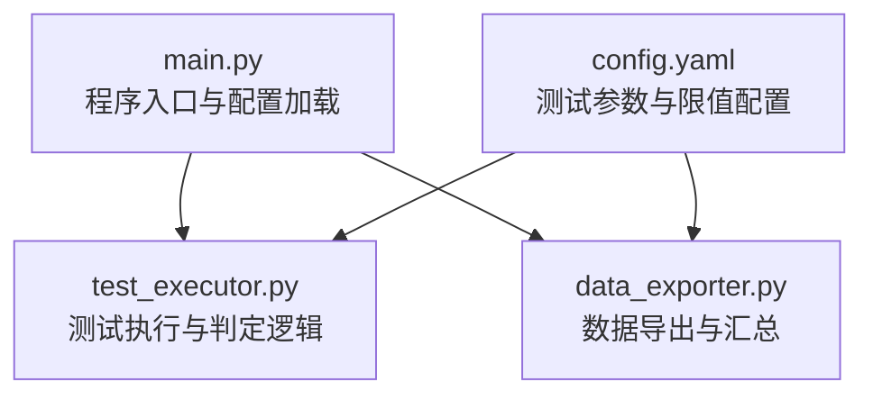
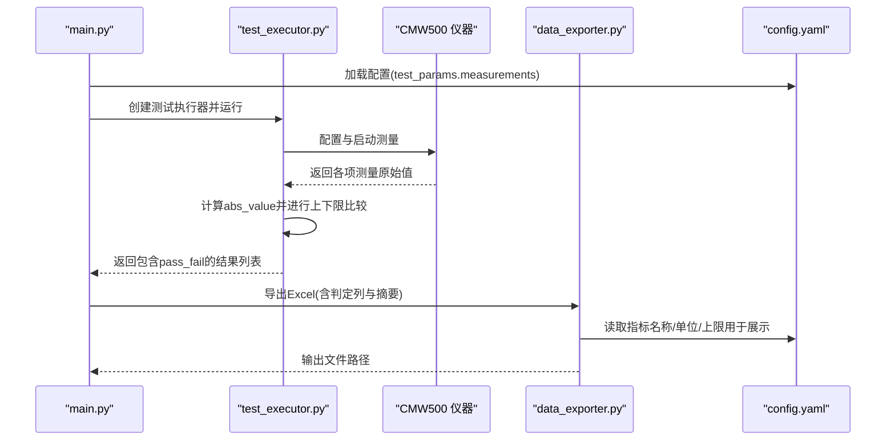
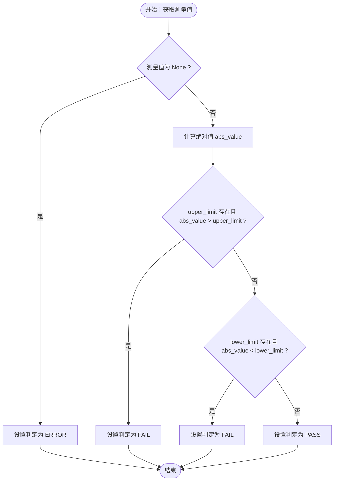
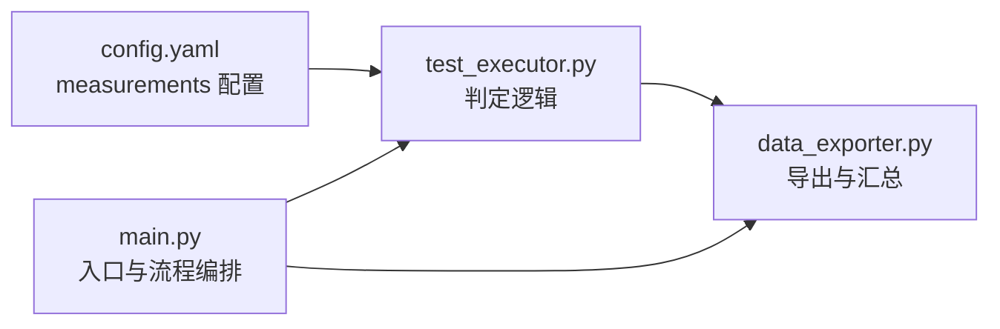

# 测量结果判定

<cite>
**本文引用的文件**   
- [main.py](file://main.py)
- [test_executor.py](file://test_executor.py)
- [config.yaml](file://config.yaml)
- [data_exporter.py](file://data_exporter.py)
</cite>

## 目录
1. [简介](#简介)
2. [项目结构](#项目结构)
3. [核心组件](#核心组件)
4. [架构总览](#架构总览)
5. [详细组件分析](#详细组件分析)
6. [依赖关系分析](#依赖关系分析)
7. [性能与边界条件](#性能与边界条件)
8. [故障排查指南](#故障排查指南)
9. [结论](#结论)
10. [附录：扩展与测试建议](#附录扩展与测试建议)

## 简介
本技术文档聚焦于“测量结果判定”的实现机制，围绕 pass_fail 判定逻辑、上下限比较算法、PASS/FAIL/ERROR 三种状态规则、measurements_config 配置项（upper_limit、lower_limit）以及 abs_value 绝对值比较原理进行系统化说明。同时给出 ERROR 状态的产生条件与处理策略，并提供自定义扩展方法与单元测试示例建议，确保判定结果的准确性与可靠性。

## 项目结构
本项目为 CMW500 BLE TX 调制自动化测试工具，核心判定逻辑位于测试执行模块中，配置通过 YAML 文件提供，导出模块负责将判定结果写入 Excel 并生成摘要统计。

图表来源
- [main.py:295-336](file://main.py#L295-L336)
- [test_executor.py:22-184](file://test_executor.py#L22-L184)
- [data_exporter.py:81-202](file://data_exporter.py#L81-L202)
- [config.yaml:27-71](file://config.yaml#L27-L71)

章节来源
- [main.py:295-336](file://main.py#L295-L336)
- [config.yaml:27-71](file://config.yaml#L27-L71)

## 核心组件
- 测试执行器（BLETxModulationTest）：负责仪器配置、逐信道测量、数值读取、pass_fail 判定与结果收集。
- 数据导出器（DataExporter）：负责将测试结果与判定结果导出到 Excel，并生成测试摘要。
- 配置文件（config.yaml）：定义 measurements 各指标的 upper_limit 与 lower_limit，以及单位与名称等元信息。

章节来源
- [test_executor.py:22-184](file://test_executor.py#L22-L184)
- [data_exporter.py:81-202](file://data_exporter.py#L81-L202)
- [config.yaml:44-71](file://config.yaml#L44-L71)

## 架构总览
下图展示了从配置加载到测量执行、判定与导出的整体流程，重点标注了 pass_fail 判定在单信道测量中的位置。

图表来源
- [main.py:117-216](file://main.py#L117-L216)
- [test_executor.py:105-184](file://test_executor.py#L105-L184)
- [data_exporter.py:81-202](file://data_exporter.py#L81-L202)
- [config.yaml:44-71](file://config.yaml#L44-L71)

## 详细组件分析

### 判定逻辑实现（pass_fail）
- 输入来源：每个信道的测量结果字典中包含若干键值对，如 frequency_accuracy、frequency_drift 等；这些键名与 measurements_config 的键一致。
- 判定流程：
  - 若某项测量值为 None，则该项判定为 ERROR。
  - 否则取该值的绝对值 abs_value。
  - 读取配置项 mcfg 中的 upper_limit 与可选的 lower_limit。
  - 判定规则：
    - 如果 upper_limit 存在且 abs_value > upper_limit，则 FAIL。
    - 否则如果 lower_limit 存在且 abs_value < lower_limit，则 FAIL。
    - 其他情况 PASS。
- 输出：result["pass_fail"][key] = "PASS"/"FAIL"/"ERROR"。

图表来源
- [test_executor.py:166-183](file://test_executor.py#L166-L183)

章节来源
- [test_executor.py:166-183](file://test_executor.py#L166-L183)

### measurements_config 配置结构与参数作用
- 结构位置：config.yaml 的 test_params.measurements 下，每项对应一个测量指标键名（如 frequency_accuracy）。
- 字段含义：
  - name：显示名称（用于导出与摘要）。
  - unit：单位（用于导出与摘要）。
  - upper_limit：上限阈值（必须），当 abs_value 超过此值即 FAIL。
  - lower_limit：下限阈值（可选），当 abs_value 小于此值即 FAIL。
- 当前默认配置中所有指标仅设置了 upper_limit，lower_limit 均为 null，因此实际判定主要基于绝对值不超过上限。

章节来源
- [config.yaml:44-71](file://config.yaml#L44-L71)

### abs_value 绝对值比较的逻辑原理
- 设计动机：部分漂移类指标可能为负值，但规范通常关注其幅度是否超限，因此采用绝对值比较。
- 行为说明：
  - 无论测量值为正或负，均取其绝对值后与上限/下限比较。
  - 若未设置 lower_limit，则仅判断是否超过上限。
  - 若同时设置 upper_limit 与 lower_limit，则要求 abs_value 落在 [lower_limit, upper_limit] 区间内才 PASS。

章节来源
- [test_executor.py:173-182](file://test_executor.py#L173-L182)

### ERROR 状态的产生条件与错误处理策略
- 产生条件：
  - 当某项测量值读取失败（例如 SCPI 查询异常或解析失败），该键对应的值为 None。
  - 在判定阶段遇到 None，直接标记为 ERROR。
- 处理策略：
  - 记录为 ERROR，不影响其他指标的正常判定。
  - 导出时，若缺少 pass_fail 或某项缺失，导出模块会填充为 ERROR 或 N/A，保证表格完整性。
  - 总体判定统计时，非 PASS 的项（包括 FAIL 与 ERROR）均计入失败计数。

章节来源
- [test_executor.py:166-183](file://test_executor.py#L166-L183)
- [data_exporter.py:117-122](file://data_exporter.py#L117-L122)
- [data_exporter.py:180-186](file://data_exporter.py#L180-L186)

### 判定规则的自定义扩展方法
- 新增测量指标：
  - 在 config.yaml 的 test_params.measurements 中添加新键（如 my_metric），并设置 name、unit、upper_limit、lower_limit（可选）。
  - 在测试执行器的单信道测量函数中增加对该指标的读取与赋值逻辑，确保结果字典中存在同名键。
  - 在导出模块的 measurement_keys 列表中加入新键，以便导出与摘要统计。
- 调整判定标准：
  - 如需引入新的判定维度（如相对误差、容差带、分段阈值等），可在判定循环前扩展 mcfg 字段（例如 tolerance、mode），并在判定逻辑中读取相应字段以改变比较方式。
  - 注意保持判定的确定性：同一输入应得到相同判定结果，避免随机性。

章节来源
- [config.yaml:44-71](file://config.yaml#L44-L71)
- [test_executor.py:105-184](file://test_executor.py#L105-L184)
- [data_exporter.py:105-123](file://data_exporter.py#L105-L123)

### 判定逻辑的单元测试示例与边界条件处理
以下为建议的测试用例设计（不直接粘贴代码，仅提供路径与要点）：
- 正常范围判定：
  - 输入：abs_value 严格小于 upper_limit，无 lower_limit。
  - 期望：PASS。
  - 参考路径：[test_executor.py:173-182](file://test_executor.py#L173-L182)
- 等于上限边界：
  - 输入：abs_value == upper_limit。
  - 期望：PASS（因为判定条件是大于上限才 FAIL）。
  - 参考路径：[test_executor.py:177-182](file://test_executor.py#L177-L182)
- 超过上限：
  - 输入：abs_value > upper_limit。
  - 期望：FAIL。
  - 参考路径：[test_executor.py:177-178](file://test_executor.py#L177-L178)
- 设置 lower_limit 且低于下限：
  - 输入：abs_value < lower_limit。
  - 期望：FAIL。
  - 参考路径：[test_executor.py:179-180](file://test_executor.py#L179-L180)
- 同时设置上下限且落在区间内：
  - 输入：lower_limit <= abs_value <= upper_limit。
  - 期望：PASS。
  - 参考路径：[test_executor.py:173-182](file://test_executor.py#L173-L182)
- 测量值为 None：
  - 输入：value is None。
  - 期望：ERROR。
  - 参考路径：[test_executor.py:170-171](file://test_executor.py#L170-L171)
- 负值测量：
  - 输入：value 为负数，abs_value 满足上限条件。
  - 期望：PASS（因使用绝对值比较）。
  - 参考路径：[test_executor.py:173-182](file://test_executor.py#L173-L182)
- 导出与汇总一致性：
  - 验证导出模块对 ERROR 与 FAIL 的计数与着色是否符合预期。
  - 参考路径：[data_exporter.py:117-122](file://data_exporter.py#L117-L122)、[data_exporter.py:180-186](file://data_exporter.py#L180-L186)

章节来源
- [test_executor.py:166-183](file://test_executor.py#L166-L183)
- [data_exporter.py:117-122](file://data_exporter.py#L117-L122)
- [data_exporter.py:180-186](file://data_exporter.py#L180-L186)

## 依赖关系分析
- main.py 负责加载配置与启动 CLI/GUI 模式，调用测试执行器与导出器。
- test_executor.py 依赖 config.yaml 中的 measurements 配置进行判定。
- data_exporter.py 依赖 config.yaml 中的 measurements 元信息（name、unit、upper_limit）用于展示与摘要。

图表来源
- [main.py:295-336](file://main.py#L295-L336)
- [test_executor.py:22-184](file://test_executor.py#L22-L184)
- [data_exporter.py:81-202](file://data_exporter.py#L81-L202)
- [config.yaml:44-71](file://config.yaml#L44-L71)

章节来源
- [main.py:295-336](file://main.py#L295-L336)
- [test_executor.py:22-184](file://test_executor.py#L22-L184)
- [data_exporter.py:81-202](file://data_exporter.py#L81-L202)
- [config.yaml:44-71](file://config.yaml#L44-L71)

## 性能与边界条件
- 性能特性：
  - 判定逻辑为 O(n) 线性复杂度（n 为测量指标数量），开销极小。
  - 主要耗时在仪器通信与数据采集，判定环节几乎可忽略。
- 边界条件：
  - 等于上限或下限：根据实现，等于上限视为 PASS；等于下限需结合 lower_limit 语义（当前实现为 abs_value < lower_limit 才 FAIL，等于下限视为 PASS）。
  - 负值：通过绝对值比较，避免符号影响。
  - None 值：统一标记为 ERROR，保证健壮性。
  - 缺失配置项：导出模块对缺失 pass_fail 或键值进行兜底处理，避免崩溃。

章节来源
- [test_executor.py:166-183](file://test_executor.py#L166-L183)
- [data_exporter.py:117-122](file://data_exporter.py#L117-L122)

## 故障排查指南
- 常见问题：
  - 某项测量结果为 ERROR：检查仪器通信是否正常、SCPI 指令是否正确、返回值是否能解析为浮点数。
  - 导出文件中判定列为 ERROR：确认测试执行阶段是否成功生成 pass_fail 字典。
  - 总体判定为 FAIL：检查是否存在任意一项非 PASS（包括 FAIL 与 ERROR）。
- 定位步骤：
  - 查看日志回调输出的通道级判定摘要。
  - 核对 config.yaml 中对应指标的 upper_limit/lower_limit 设置是否符合预期。
  - 在导出模块中检查 pass_fail 的取值与计数逻辑。

章节来源
- [test_executor.py:212-234](file://test_executor.py#L212-L234)
- [data_exporter.py:117-122](file://data_exporter.py#L117-L122)
- [data_exporter.py:180-186](file://data_exporter.py#L180-L186)

## 结论
本项目的 pass_fail 判定逻辑简洁明确：以绝对值比较为核心，结合 upper_limit 与可选 lower_limit 实现 PASS/FAIL/ERROR 三态判定。配置驱动的方式使得新增指标与调整阈值非常便捷。通过合理的单元测试与边界条件覆盖，可确保判定结果的准确性与稳定性。

## 附录：扩展与测试建议
- 扩展建议：
  - 在 measurements 中增加 mode 字段（如 absolute、relative、range），在判定逻辑中按模式选择比较策略。
  - 支持多阈值分段判定（如警告区、合格区、不合格区），便于质量趋势分析。
- 测试建议：
  - 针对每种判定模式编写正向与反向用例，覆盖等于边界、负值、None、缺失键等场景。
  - 对导出与汇总逻辑进行断言，确保统计一致性与可视化着色正确。

章节来源
- [test_executor.py:166-183](file://test_executor.py#L166-L183)
- [data_exporter.py:117-122](file://data_exporter.py#L117-L122)
- [data_exporter.py:180-186](file://data_exporter.py#L180-L186)