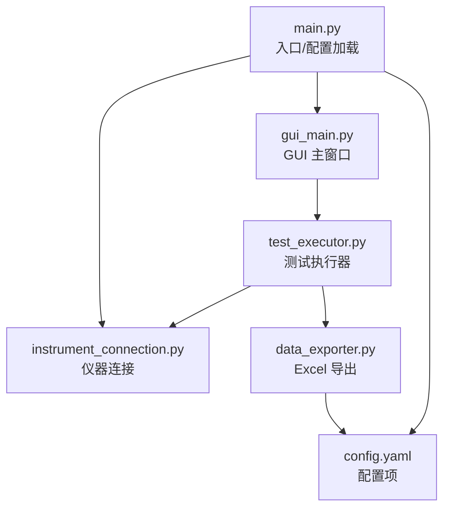
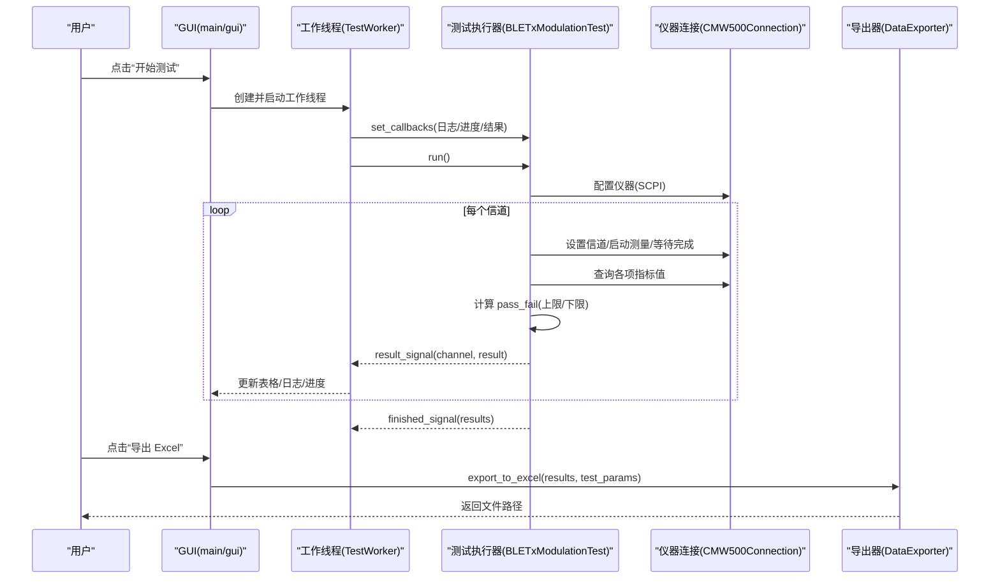
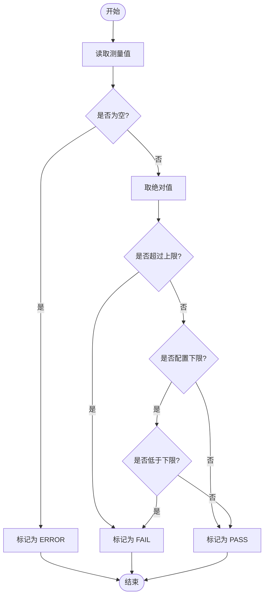
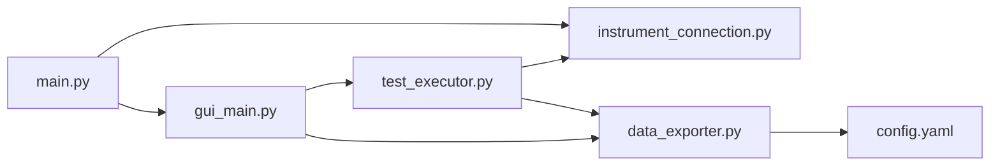

# 测试结果分析

<cite>
**本文引用的文件**   
- [main.py](file://main.py)
- [test_executor.py](file://test_executor.py)
- [data_exporter.py](file://data_exporter.py)
- [config.yaml](file://config.yaml)
- [gui_main.py](file://gui_main.py)
- [instrument_connection.py](file://instrument_connection.py)
- [requirements.txt](file://requirements.txt)
</cite>

## 目录
1. [引言](#引言)
2. [项目结构](#项目结构)
3. [核心组件](#核心组件)
4. [架构总览](#架构总览)
5. [详细组件分析](#详细组件分析)
6. [依赖关系分析](#依赖关系分析)
7. [性能与可扩展性](#性能与可扩展性)
8. [可视化与报告模板建议](#可视化与报告模板建议)
9. [异常处理与数据质量保证](#异常处理与数据质量保证)
10. [批量对比与历史追踪](#批量对比与历史追踪)
11. [结论](#结论)

## 引言
本技术文档聚焦于“测试结果分析”，面向测试工程师与质量保障人员，系统性阐述：
- 测试结果的数据结构与存储格式（含字段、单位、含义）
- pass_fail 判定逻辑与上下限配置的灵活性
- 统计分析与摘要信息的计算方法（通过率、失败分类、趋势）
- 结果数据的可视化建议与报告生成模板
- 异常结果的处理策略与数据质量保证措施
- 批量测试结果对比与历史数据追踪方法

## 项目结构
本项目为基于 CMW500 的 BLE TX 调制自动化测试工具，主要模块职责如下：
- main.py：程序入口、配置加载、CLI/GUI 启动
- instrument_connection.py：仪器连接封装（LAN/GPIB/USB），SCPI 命令收发
- test_executor.py：测试执行器，逐信道测量并计算 pass_fail
- data_exporter.py：导出 Excel（测试数据 + 测试摘要），样式美化
- gui_main.py：PyQt6 界面，线程化执行测试、实时展示结果
- config.yaml：仪器连接参数、测试参数、测量指标及限值、导出路径等
- requirements.txt：运行依赖库清单

图表来源
- [main.py:295-336](file://main.py#L295-L336)
- [gui_main.py:499-528](file://gui_main.py#L499-L528)
- [test_executor.py:186-245](file://test_executor.py#L186-L245)
- [data_exporter.py:81-139](file://data_exporter.py#L81-L139)
- [config.yaml:27-79](file://config.yaml#L27-L79)

章节来源
- [main.py:295-336](file://main.py#L295-L336)
- [gui_main.py:499-528](file://gui_main.py#L499-L528)
- [test_executor.py:186-245](file://test_executor.py#L186-L245)
- [data_exporter.py:81-139](file://data_exporter.py#L81-L139)
- [config.yaml:27-79](file://config.yaml#L27-L79)

## 核心组件
- 仪器连接层（CMW500Connection）：统一 LAN/GPIB/USB 资源地址构建、连接/断开、*IDN? 查询、SCPI 命令发送与查询。
- 测试执行层（BLETxModulationTest）：按信道遍历，逐项读取频率准确度、频率漂移、频率偏移、初始频率漂移、最大漂移速率，依据配置进行 pass_fail 判定。
- 数据导出层（DataExporter）：将原始结果与判定结果写入 Excel，自动生成“测试数据”和“测试摘要”两个 Sheet，并进行样式美化。
- GUI 与 CLI：提供交互入口，支持实时日志、进度条、表格展示与一键导出。

章节来源
- [instrument_connection.py:18-216](file://instrument_connection.py#L18-L216)
- [test_executor.py:22-184](file://test_executor.py#L22-L184)
- [data_exporter.py:23-139](file://data_exporter.py#L23-L139)
- [gui_main.py:28-73](file://gui_main.py#L28-L73)

## 架构总览
下图展示了从用户操作到结果导出的端到端流程，包括线程安全与回调机制。

图表来源
- [gui_main.py:499-528](file://gui_main.py#L499-L528)
- [gui_main.py:561-628](file://gui_main.py#L561-L628)
- [test_executor.py:186-245](file://test_executor.py#L186-L245)
- [test_executor.py:105-184](file://test_executor.py#L105-L184)
- [instrument_connection.py:192-216](file://instrument_connection.py#L192-L216)
- [data_exporter.py:81-139](file://data_exporter.py#L81-L139)

## 详细组件分析

### 测试结果数据结构与存储格式
- 单信道结果字典包含以下字段：
  - channel：整数，BLE 信道编号（0~39）
  - timestamp：字符串，测量时间戳（YYYY-MM-DD HH:MM:SS）
  - frequency_accuracy：数值（kHz），频率准确度
  - frequency_drift：数值（kHz），频率漂移
  - frequency_offset：数值（kHz），频率偏移
  - initial_frequency_drift：数值（kHz），初始频率漂移
  - max_drift_rate：数值（kHz），最大漂移速率
  - pass_fail：键值对，key 为上述指标名，value 为 PASS/FAIL/ERROR
- 错误结果字典（当某信道测量异常时）：
  - channel、timestamp、error（异常信息）
- Excel 输出结构：
  - Sheet “测试数据”：每行一个信道，列包含“指标名称 (单位)”与“指标名称 判定”
  - Sheet “测试摘要”：汇总统计信息（见下文）

章节来源
- [test_executor.py:125-184](file://test_executor.py#L125-L184)
- [test_executor.py:226-234](file://test_executor.py#L226-L234)
- [data_exporter.py:95-139](file://data_exporter.py#L95-L139)

### 测量指标数值含义与单位
- 频率准确度（frequency_accuracy）：单位 kHz，表示实测频率相对标称值的偏差绝对值
- 频率漂移（frequency_drift）：单位 kHz，表示一段时间内频率变化幅度
- 频率偏移（frequency_offset）：单位 kHz，表示瞬时或平均频率偏移量
- 初始频率漂移（initial_frequency_drift）：单位 kHz，表示起始阶段的频率漂移
- 最大漂移速率（max_drift_rate）：单位 kHz，表示频率漂移的最大速率

说明：所有数值在采集后取绝对值参与判定；单位由配置文件定义，默认均为 kHz。

章节来源
- [config.yaml:44-71](file://config.yaml#L44-L71)
- [test_executor.py:125-164](file://test_executor.py#L125-L164)

### pass_fail 判定逻辑与上下限配置
- 判定规则：
  - 若测量值为空（None），则该项标记为 ERROR
  - 否则取绝对值 abs(value)，与上限 upper_limit 比较：
    - 若 abs(value) > upper_limit，则 FAIL
    - 若配置了 lower_limit 且 abs(value) < lower_limit，则 FAIL
    - 其他情况 PASS
- 灵活性与扩展点：
  - 通过 measurements 配置项动态增减指标、修改名称与单位
  - 可引入更复杂的判定函数（例如区间判定、加权评分、多条件组合）
  - 可在测试执行器中增加自定义判定规则钩子，便于不同标准适配

图表来源
- [test_executor.py:166-183](file://test_executor.py#L166-L183)
- [config.yaml:44-71](file://config.yaml#L44-L71)

章节来源
- [test_executor.py:166-183](file://test_executor.py#L166-L183)
- [config.yaml:44-71](file://config.yaml#L44-L71)

### 统计分析与摘要信息计算
- 逐项指标统计：
  - 遍历所有信道结果，统计每项指标的 PASS 与 FAIL 数量
- 总体判定：
  - 仅当某信道的全部指标均为 PASS 时，该信道计为“全部通过”
  - 总体判定 = PASS 当且仅当“全部通过信道数 == 总信道数”
- 摘要内容（Sheet “测试摘要”）：
  - 测试时间、测试标准、信道范围、统计次数、总测试信道数
  - 各指标通过/失败计数（含上限与单位）
  - 全部通过信道数、有失败项信道数、总体判定

章节来源
- [data_exporter.py:141-202](file://data_exporter.py#L141-L202)
- [main.py:188-203](file://main.py#L188-L203)
- [gui_main.py:601-619](file://gui_main.py#L601-L619)

### 结果数据可视化建议
- 折线图：横轴为信道号，纵轴为各指标绝对值，叠加上下限参考线，直观显示越限情况
- 柱状图：按指标维度统计 PASS/FAIL 数量，快速识别薄弱环节
- 热力图：以信道×指标矩阵形式着色（PASS=绿，FAIL=红，ERROR=黄），便于定位问题信道
- 趋势分析：同一批次多次测试结果的通道级指标均值/方差随时间变化曲线，用于评估设备稳定性
- 仪表盘：总体通过率、失败率、TOP 失败指标占比

[本节为概念性建议，不直接分析具体代码文件]

### 报告生成模板建议
- 封面：项目名称、测试日期、测试人员、仪器序列号、固件版本
- 测试概要：标准、PHY 类型、信道范围、统计次数、环境条件
- 结果总览：总体判定、通过率、失败项分布
- 详细结果：逐信道数据表（含单位）、判定结果、异常记录
- 统计分析：各指标通过/失败计数、TOP 失败原因、趋势图
- 附录：原始数据导出文件名、导出路径、异常堆栈摘要

[本节为概念性建议，不直接分析具体代码文件]

## 依赖关系分析
- 外部依赖：
  - pyvisa/pyvisa-py：仪器通信后端
  - PyQt6：图形界面
  - pandas/openpyxl：Excel 读写与样式
  - PyYAML：配置文件解析
  - matplotlib：可选用于可视化
  - pyinstaller：打包为 exe
- 内部依赖：
  - main.py 依赖 instrument_connection、test_executor、data_exporter、gui_main
  - gui_main 通过 TestWorker 调用 test_executor，并通过信号槽更新 UI
  - test_executor 依赖 instrument_connection 进行 SCPI 指令收发
  - data_exporter 依赖 pandas/openpyxl 生成格式化 Excel

图表来源
- [main.py:295-336](file://main.py#L295-L336)
- [gui_main.py:499-528](file://gui_main.py#L499-L528)
- [test_executor.py:186-245](file://test_executor.py#L186-L245)
- [data_exporter.py:81-139](file://data_exporter.py#L81-L139)
- [requirements.txt:1-12](file://requirements.txt#L1-L12)

章节来源
- [requirements.txt:1-12](file://requirements.txt#L1-L12)
- [main.py:295-336](file://main.py#L295-L336)
- [gui_main.py:499-528](file://gui_main.py#L499-L528)
- [test_executor.py:186-245](file://test_executor.py#L186-L245)
- [data_exporter.py:81-139](file://data_exporter.py#L81-L139)

## 性能与可扩展性
- 性能特征：
  - 逐信道串行测量，单次测量包含多次 SCPI 查询，整体耗时受仪器响应与统计次数影响
  - GUI 使用独立线程执行测试，避免阻塞主线程，提升用户体验
- 优化建议：
  - 批量查询合并：若仪器支持，减少 SCPI 往返次数
  - 自适应超时：根据网络/接口类型动态调整 timeout
  - 增量导出：大样本场景下分片写入，降低内存占用
- 可扩展性：
  - 新增指标：在 config.yaml 的 measurements 中添加新项，并在测试执行器中补充读取与判定逻辑
  - 自定义判定：在测试执行器中注入判定函数，支持更复杂规则（如区间、权重、阈值联动）

[本节为通用指导，不直接分析具体代码文件]

## 异常处理与数据质量保证
- 异常捕获与记录：
  - 单信道测量异常时，记录 error 字段并继续后续信道，保证批测完整性
  - GUI 捕获工作线程异常并弹窗提示，同时恢复按钮状态
- 连接与通信异常：
  - 仪器未连接或通信失败时，抛出 ConnectionError 或返回错误消息，引导用户检查接口参数
- 数据质量保证：
  - 数值为空时标记 ERROR，避免误判
  - 导出文件自动带时间戳，避免覆盖历史数据
  - 建议在 CI/流水线中加入数据校验脚本（字段完整性、单位一致性、越限告警）

章节来源
- [test_executor.py:226-234](file://test_executor.py#L226-L234)
- [gui_main.py:621-629](file://gui_main.py#L621-L629)
- [instrument_connection.py:112-132](file://instrument_connection.py#L112-L132)
- [data_exporter.py:68-79](file://data_exporter.py#L68-L79)

## 批量对比与历史追踪
- 批量对比：
  - 基于导出文件的“测试摘要”Sheet，横向对比不同批次/版本的总体判定与通过率
  - 针对 TOP 失败指标进行跨批次趋势分析，识别退化或波动
- 历史追踪：
  - 利用文件名中的时间戳组织历史数据，建立版本化归档
  - 结合数据库或 CSV 聚合平台，长期保存关键指标均值、方差、越限次数
  - 在报告中加入“历史对比”页签，标注回归与改进项

[本节为概念性建议，不直接分析具体代码文件]

## 结论
本系统实现了 BLE TX 调制测试的自动化执行、结果判定与可视化导出。其核心优势在于：
- 灵活的 pass_fail 判定与上下限配置，易于适配不同标准
- 清晰的测试结果数据结构与结构化导出，便于二次分析与报表生成
- 线程安全的 GUI 与完善的异常处理，保障测试过程稳定可靠

建议后续增强方向：
- 引入更丰富的可视化与统计功能（matplotlib 集成）
- 支持自定义判定规则与多标准切换
- 建立历史数据仓库与自动化报告流水线，提升质量追溯效率