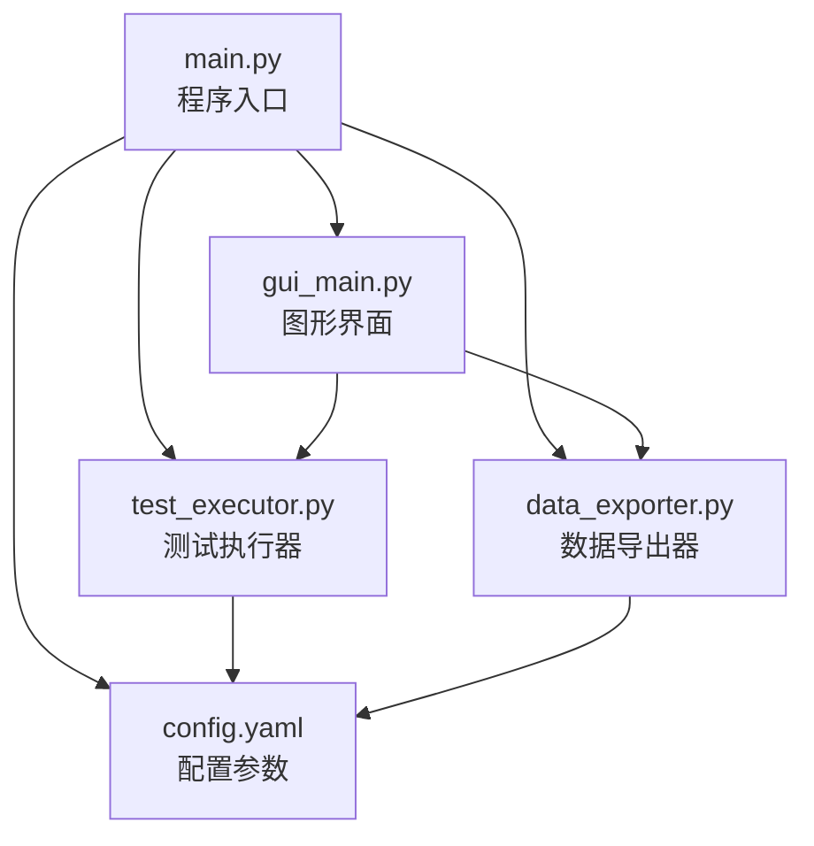
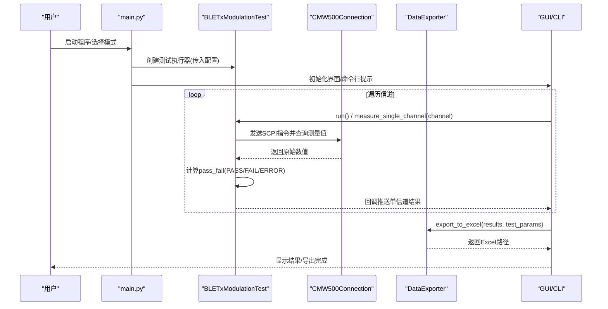
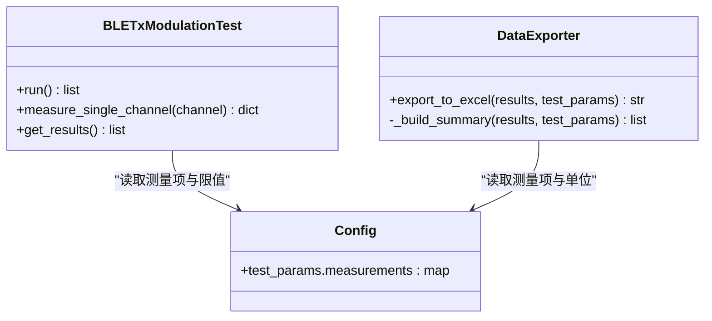

# 测试结果数据结构

<cite>
**本文引用的文件**   
- [main.py](file://main.py)
- [test_executor.py](file://test_executor.py)
- [data_exporter.py](file://data_exporter.py)
- [config.yaml](file://config.yaml)
- [gui_main.py](file://gui_main.py)
</cite>

## 目录
1. [简介](#简介)
2. [项目结构](#项目结构)
3. [核心组件](#核心组件)
4. [架构总览](#架构总览)
5. [详细组件分析](#详细组件分析)
6. [依赖关系分析](#依赖关系分析)
7. [性能与稳定性考量](#性能与稳定性考量)
8. [故障排查指南](#故障排查指南)
9. [结论](#结论)
10. [附录：数据模型与校验规则](#附录数据模型与校验规则)

## 简介
本文件聚焦于“测试结果数据结构”的技术说明，覆盖以下要点：
- 存储格式与字段定义（channel、timestamp、frequency_accuracy、frequency_drift、frequency_offset、initial_frequency_drift、max_drift_rate）
- pass_fail 判定结果的结构与状态含义（PASS、FAIL、ERROR）
- 错误处理机制中 error 字段的记录方式与异常信息格式
- 完整的数据结构示例与 JSON 序列化格式说明
- 数据验证规则与字段约束条件

该文档面向测试工程师与二次开发者，既提供高层概览，也给出可直接落地的规范。

## 项目结构
本项目为 CMW500 BLE TX 调制自动化测试工具，测试结果由测试执行器生成，经导出器输出为 Excel，并在 GUI/CLI 中进行展示与汇总。

图表来源
- [main.py:295-336](file://main.py#L295-L336)
- [test_executor.py:22-50](file://test_executor.py#L22-L50)
- [data_exporter.py:23-50](file://data_exporter.py#L23-L50)
- [config.yaml:27-72](file://config.yaml#L27-L72)

章节来源
- [main.py:295-336](file://main.py#L295-L336)
- [config.yaml:27-72](file://config.yaml#L27-L72)

## 核心组件
- 测试执行器：负责逐信道测量并构建单条测试结果记录，包含测量值与 pass_fail 判定。
- 数据导出器：将测试结果列表转换为 Excel，包含“测试数据”和“测试摘要”两个工作表。
- 主程序与 GUI：负责加载配置、启动测试、展示结果与导出文件。

章节来源
- [test_executor.py:105-184](file://test_executor.py#L105-L184)
- [data_exporter.py:81-139](file://data_exporter.py#L81-L139)
- [main.py:178-204](file://main.py#L178-L204)
- [gui_main.py:580-667](file://gui_main.py#L580-L667)

## 架构总览
下图展示了从配置到结果生成的端到端流程，以及关键数据结构在各模块间的流转。

图表来源
- [main.py:178-204](file://main.py#L178-L204)
- [test_executor.py:186-245](file://test_executor.py#L186-L245)
- [data_exporter.py:81-139](file://data_exporter.py#L81-L139)
- [gui_main.py:580-667](file://gui_main.py#L580-L667)

## 详细组件分析

### 测试结果记录（单条）
每条测试结果对应一个字典对象，包含以下字段：
- channel: 整数，BLE 信道编号（0~39）。来源：测试执行器在设置当前信道后记录。
- timestamp: 字符串，ISO 风格的时间戳（YYYY-MM-DD HH:MM:SS），表示本次测量的时间。
- frequency_accuracy: 浮点数或空值，频率准确度（单位 kHz）。
- frequency_drift: 浮点数或空值，频率漂移（单位 kHz）。
- frequency_offset: 浮点数或空值，频率偏移（单位 kHz）。
- initial_frequency_drift: 浮点数或空值，初始频率漂移（单位 kHz）。
- max_drift_rate: 浮点数或空值，最大漂移速率（单位 kHz）。
- pass_fail: 字典，键为上述五项指标名称，值为 PASS、FAIL 或 ERROR。
- error: 可选字符串，当整条记录因异常而失败时存在，内容为异常信息的字符串化形式。

字段取值与来源说明：
- 数值型字段来源于仪器 SCPI 查询，若读取失败则为空值；否则保留两位小数。
- pass_fail 的判定逻辑基于配置中的上限/下限阈值进行绝对值比较。
- error 字段仅在捕获到异常时写入，用于定位问题。

章节来源
- [test_executor.py:126-184](file://test_executor.py#L126-L184)
- [test_executor.py:226-234](file://test_executor.py#L226-L234)
- [config.yaml:44-71](file://config.yaml#L44-L71)

### pass_fail 判定结构与状态语义
- 结构：每个通道的 pass_fail 是一个映射，键为测量项名，值为状态字符串。
- 状态：
  - PASS：测量值的绝对值未超过上限（或未低于下限，如配置了 lower_limit）。
  - FAIL：测量值的绝对值超过上限或低于下限。
  - ERROR：该项测量值缺失（例如仪器查询失败或解析异常）。
- 使用场景：
  - 在 GUI 表格中以颜色区分（绿色 PASS、红色 FAIL、黄色 ERROR）。
  - 在导出 Excel 的“测试数据”表中以列呈现，并在“测试摘要”中统计通过/失败数量。
  - CLI 模式下用于快速统计全部通过的信道数。

章节来源
- [test_executor.py:166-183](file://test_executor.py#L166-L183)
- [gui_main.py:655-666](file://gui_main.py#L655-L666)
- [data_exporter.py:117-122](file://data_exporter.py#L117-L122)
- [data_exporter.py:173-200](file://data_exporter.py#L173-L200)
- [main.py:188-197](file://main.py#L188-L197)

### 错误处理与 error 字段
- 触发时机：当单个信道的测量过程中发生异常（如仪器通信失败、指令超时、返回值解析异常等），会捕获异常并生成一条仅包含 channel、timestamp、error 的错误记录。
- error 内容：异常对象的字符串化形式，便于直接查看异常类型与消息。
- 影响范围：
  - 该通道所有测量项的 pass_fail 不会生成（因为未进入正常测量分支）。
  - 导出器在遇到缺少 pass_fail 的记录时，会将各项判定列为 ERROR，以保证表格完整性。

章节来源
- [test_executor.py:226-234](file://test_executor.py#L226-L234)
- [data_exporter.py:117-122](file://data_exporter.py#L117-L122)

### 数据导出与可视化
- “测试数据”工作表：每行一个信道，包含各测量项的数值与判定列。
- “测试摘要”工作表：汇总测试时间、标准、信道范围、统计次数、各指标通过/失败计数、总体判定（全部通过则 PASS，否则 FAIL）。
- 样式：对 PASS/FAIL/ERROR 单元格进行着色，便于快速识别。

章节来源
- [data_exporter.py:81-139](file://data_exporter.py#L81-L139)
- [data_exporter.py:141-202](file://data_exporter.py#L141-L202)
- [data_exporter.py:204-283](file://data_exporter.py#L204-L283)

## 依赖关系分析
- 测试执行器依赖配置中的 measurements 定义（name、unit、upper_limit、lower_limit）来构造列名与判定阈值。
- 导出器依赖相同的 measurements 定义以生成一致的列名与单位。
- GUI 与 CLI 均消费测试执行器产出的结果列表，并进行展示与统计。

图表来源
- [test_executor.py:22-50](file://test_executor.py#L22-L50)
- [data_exporter.py:23-50](file://data_exporter.py#L23-L50)
- [config.yaml:44-71](file://config.yaml#L44-L71)

章节来源
- [test_executor.py:105-184](file://test_executor.py#L105-L184)
- [data_exporter.py:81-139](file://data_exporter.py#L81-L139)
- [config.yaml:44-71](file://config.yaml#L44-L71)

## 性能与稳定性考量
- 单次测量采用平均次数（statistic_count）提升稳定性，但会增加耗时。
- 异常路径下仍追加错误记录，避免中断整体扫描流程。
- 导出过程先写 DataFrame 再应用样式，减少重复 IO。

[本节为通用建议，不直接分析具体文件]

## 故障排查指南
- 若某项测量值为空且判定为 ERROR：检查仪器连接、SCPI 指令是否可用、返回值是否为有效数字。
- 若整条记录出现 error 字段：查看异常信息，确认通信超时、权限或设备占用等问题。
- 若导出文件中判定列出现 ERROR：说明对应记录缺少 pass_fail，需回溯至测试执行阶段。

章节来源
- [test_executor.py:226-234](file://test_executor.py#L226-L234)
- [data_exporter.py:117-122](file://data_exporter.py#L117-L122)

## 结论
测试结果数据结构围绕“测量值 + 判定 + 可选错误信息”展开，具备明确的类型、单位与判定规则。通过统一的 measurements 配置驱动，可在不同模块间保持一致的列名与语义，便于导出、展示与分析。

[本节为总结性内容，不直接分析具体文件]

## 附录：数据模型与校验规则

### 字段定义与数据类型
- channel: 整数，取值范围 0~39（依据 BLE 信道定义与配置）。
- timestamp: 字符串，格式 YYYY-MM-DD HH:MM:SS。
- frequency_accuracy: 浮点数或空值，单位 kHz。
- frequency_drift: 浮点数或空值，单位 kHz。
- frequency_offset: 浮点数或空值，单位 kHz。
- initial_frequency_drift: 浮点数或空值，单位 kHz。
- max_drift_rate: 浮点数或空值，单位 kHz。
- pass_fail: 字典，键为上述五项指标名，值为 PASS、FAIL 或 ERROR。
- error: 可选字符串，仅在异常路径存在。

章节来源
- [test_executor.py:126-184](file://test_executor.py#L126-L184)
- [test_executor.py:226-234](file://test_executor.py#L226-L234)
- [config.yaml:44-71](file://config.yaml#L44-L71)

### 判定规则（pass_fail）
- 若测量值为空：该项判定为 ERROR。
- 若 upper_limit 存在：当 abs(value) > upper_limit 时为 FAIL，否则 PASS。
- 若 lower_limit 存在：当 abs(value) < lower_limit 时为 FAIL，否则 PASS。
- 若同时存在上下限：任一条件不满足即为 FAIL。

章节来源
- [test_executor.py:166-183](file://test_executor.py#L166-L183)
- [config.yaml:44-71](file://config.yaml#L44-L71)

### 错误记录（error 字段）
- 触发条件：测量过程中抛出异常。
- 内容格式：异常对象的字符串化形式，包含异常类型与消息。
- 影响：该通道不产生 pass_fail，导出器将其判定列填充为 ERROR。

章节来源
- [test_executor.py:226-234](file://test_executor.py#L226-L234)
- [data_exporter.py:117-122](file://data_exporter.py#L117-L122)

### JSON 序列化格式说明
- 顶层为数组，元素为单条测试结果记录。
- 数值型字段可为 null（表示空值）。
- pass_fail 为对象，键为测量项名，值为字符串枚举。
- error 字段可选，类型为字符串。

示例（示意，非代码片段）：
- 成功记录示例：
  - channel: 整数
  - timestamp: 字符串
  - frequency_accuracy: 数字或 null
  - frequency_drift: 数字或 null
  - frequency_offset: 数字或 null
  - initial_frequency_drift: 数字或 null
  - max_drift_rate: 数字或 null
  - pass_fail: 对象，每项为 PASS/FAIL/ERROR
- 错误记录示例：
  - channel: 整数
  - timestamp: 字符串
  - error: 字符串（异常信息）

章节来源
- [test_executor.py:126-184](file://test_executor.py#L126-L184)
- [test_executor.py:226-234](file://test_executor.py#L226-L234)

### 数据验证规则与约束
- 必填字段：channel、timestamp。
- 可选字段：error（仅在异常路径存在）。
- 数值字段：允许为空；若存在，应为有限浮点数。
- 判定字段：必须为 PASS、FAIL 或 ERROR 三者之一。
- 一致性：pass_fail 的键集合应与 measurements 定义的测量项一致。

章节来源
- [test_executor.py:126-184](file://test_executor.py#L126-L184)
- [config.yaml:44-71](file://config.yaml#L44-L71)