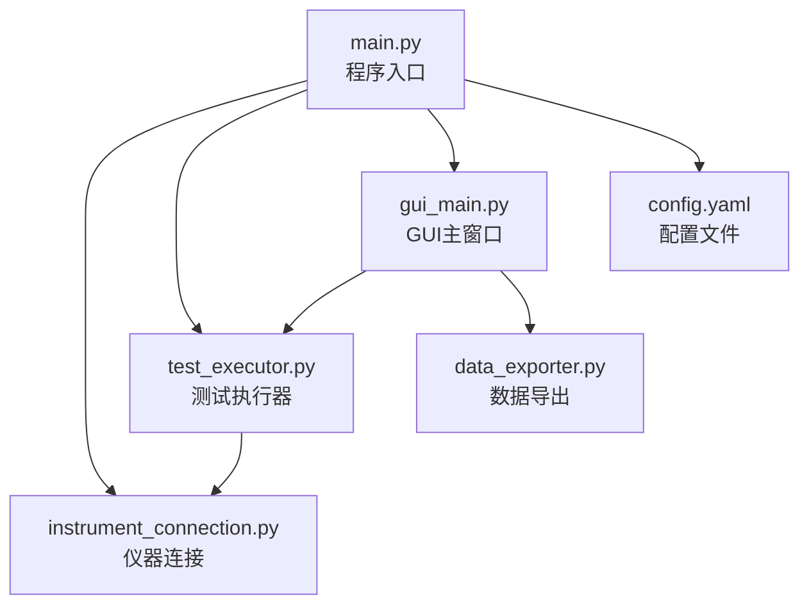
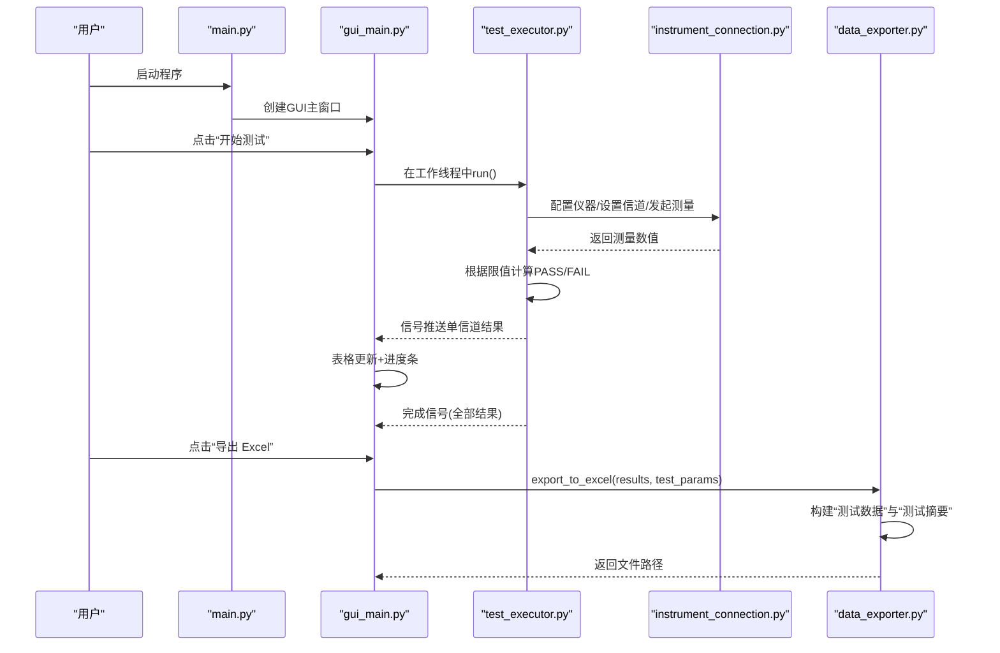
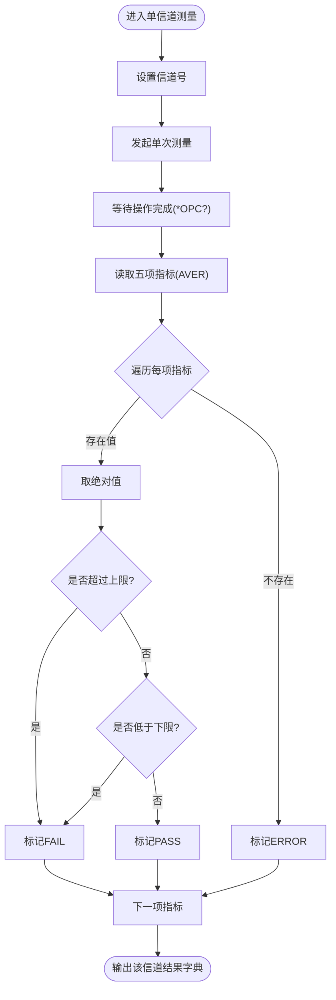
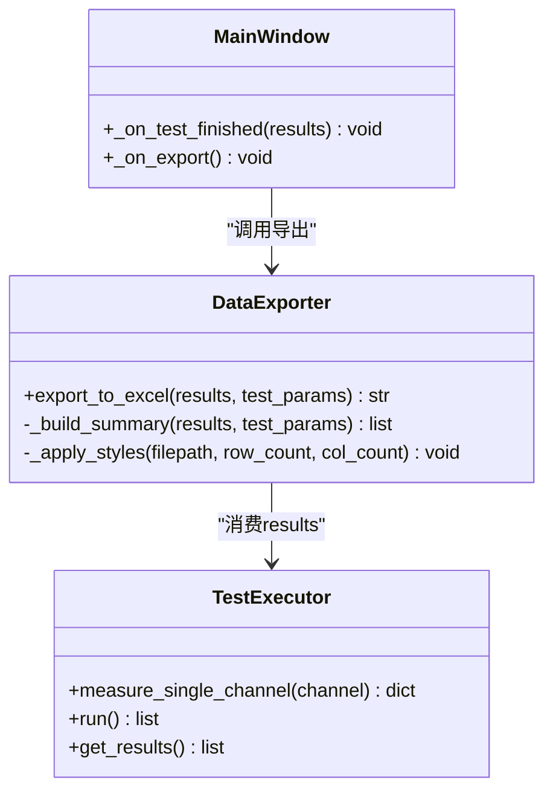
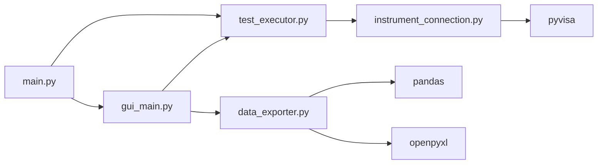

# 统计分析和摘要

<cite>
**本文引用的文件**
- [main.py](file://main.py)
- [test_executor.py](file://test_executor.py)
- [data_exporter.py](file://data_exporter.py)
- [gui_main.py](file://gui_main.py)
- [instrument_connection.py](file://instrument_connection.py)
- [config.yaml](file://config.yaml)
</cite>

## 目录
1. [引言](#引言)
2. [项目结构](#项目结构)
3. [核心组件](#核心组件)
4. [架构总览](#架构总览)
5. [详细组件分析](#详细组件分析)
6. [依赖关系分析](#依赖关系分析)
7. [性能考量](#性能考量)
8. [故障排查指南](#故障排查指南)
9. [结论](#结论)
10. [附录](#附录)

## 引言
本技术文档聚焦于“统计分析与摘要”能力，围绕以下目标展开：
- 通过率统计的计算方法与汇总逻辑（整体通过率、各信道通过率、各项指标通过率）
- 失败原因分类与统计（按指标类型、按信道范围的失败分布）
- 趋势分析方法（时间序列与性能变化检测）
- 可视化建议与图表生成方案
- 批量测试结果对比分析方法
- 统计数据导出格式与报告模板设计

当前代码库已实现基础的数据采集、判定与Excel导出；部分高级统计分析（如趋势分析、复杂可视化、批量对比）尚未在源码中直接实现，将在文档中给出扩展方案与落地路径。

## 项目结构
本项目为CMW500 BLE TX调制自动化测试工具，主要模块职责如下：
- main.py：程序入口、配置加载、CLI/GUI启动
- instrument_connection.py：仪器连接管理（LAN/GPIB/USB），SCPI命令收发
- test_executor.py：测试执行器，逐信道测量并判定
- data_exporter.py：数据导出（Excel），包含“测试数据”和“测试摘要”两个Sheet
- gui_main.py：PyQt6界面，实时展示结果、进度、日志，支持导出
- config.yaml：仪器连接参数、测试参数、导出配置

图示来源
- [main.py:295-336](file://main.py#L295-L336)
- [test_executor.py:186-245](file://test_executor.py#L186-L245)
- [data_exporter.py:81-139](file://data_exporter.py#L81-L139)
- [gui_main.py:499-528](file://gui_main.py#L499-L528)
- [instrument_connection.py:85-132](file://instrument_connection.py#L85-L132)
- [config.yaml:1-79](file://config.yaml#L1-L79)

章节来源
- [main.py:295-336](file://main.py#L295-L336)
- [config.yaml:1-79](file://config.yaml#L1-L79)

## 核心组件
- 测试执行器（BLETxModulationTest）
  - 负责逐信道测量五项频率相关指标，依据配置中的上下限进行PASS/FAIL判定
  - 维护测试结果列表，提供回调接口供GUI更新
- 数据导出器（DataExporter）
  - 将原始结果写入Excel的“测试数据”Sheet
  - 构建“测试摘要”Sheet，汇总通过/失败计数与总体判定
- GUI主窗口（CMW500MainWindow）
  - 线程化执行测试，实时显示结果表格与进度
  - 触发导出流程，保存最近一次测试结果
- 仪器连接（CMW500Connection）
  - 封装VISA通信，统一发送/查询SCPI指令
- 配置（config.yaml）
  - 定义测试标准、PHY类型、信道范围、统计次数、各项指标上限/下限及单位

章节来源
- [test_executor.py:22-184](file://test_executor.py#L22-L184)
- [data_exporter.py:23-202](file://data_exporter.py#L23-L202)
- [gui_main.py:75-120](file://gui_main.py#L75-L120)
- [instrument_connection.py:18-54](file://instrument_connection.py#L18-L54)
- [config.yaml:27-72](file://config.yaml#L27-L72)

## 架构总览
下图展示了从用户操作到数据采集、判定、导出与摘要生成的完整流程。

图示来源
- [main.py:222-242](file://main.py#L222-L242)
- [gui_main.py:499-528](file://gui_main.py#L499-L528)
- [test_executor.py:186-245](file://test_executor.py#L186-L245)
- [instrument_connection.py:192-215](file://instrument_connection.py#L192-L215)
- [data_exporter.py:81-139](file://data_exporter.py#L81-L139)

## 详细组件分析

### 指标测量与判定逻辑
- 测量指标（五项）
  - 频率准确度、频率漂移、频率偏移、初始频率漂移、最大漂移速率
- 判定规则
  - 对每个指标取绝对值后与配置的上限比较，超过则FAIL；若配置有下限且绝对值小于下限也FAIL；否则PASS
  - 读取异常时标记ERROR
- 数据来源
  - 通过SCPI查询获取AVER平均值，避免单次波动影响

图示来源
- [test_executor.py:105-184](file://test_executor.py#L105-L184)
- [config.yaml:44-72](file://config.yaml#L44-L72)

章节来源
- [test_executor.py:105-184](file://test_executor.py#L105-L184)
- [config.yaml:44-72](file://config.yaml#L44-L72)

### 通过率统计计算方法与汇总逻辑
- 单项指标通过率
  - 计算公式：某指标通过率 = 该项PASS数量 / 总信道数
  - 实现位置：导出器在“测试摘要”中对每项指标分别统计PASS/FAIL计数
- 各信道通过率
  - 单个信道的通过率 = 该信道PASS项数 / 总指标项数
  - 实现位置：测试执行器在每信道完成后打印简要日志（例如“X/Y 项通过”）
- 整体通过率
  - 两种常用口径：
    - 基于信道维度：全部通过的信道数 / 总信道数
    - 基于指标维度：所有指标PASS总数 / (总信道数 × 指标项数)
  - 当前实现：
    - “测试摘要”中统计“全部通过信道数”和“有失败项信道数”，并给出“总体判定”（全通过则为PASS，否则FAIL）
    - GUI在完成时显示“全部通过信道数/总信道数”
- 汇总数据结构
  - “测试数据”Sheet：逐行记录每个信道的各项指标数值与判定
  - “测试摘要”Sheet：逐项指标统计与总体判定

图示来源
- [data_exporter.py:81-202](file://data_exporter.py#L81-L202)
- [test_executor.py:186-245](file://test_executor.py#L186-L245)
- [gui_main.py:601-619](file://gui_main.py#L601-L619)

章节来源
- [data_exporter.py:141-202](file://data_exporter.py#L141-L202)
- [test_executor.py:218-220](file://test_executor.py#L218-L220)
- [gui_main.py:611-619](file://gui_main.py#L611-L619)

### 失败原因分类与统计
- 按指标类型统计
  - 导出器“测试摘要”已实现：逐项指标统计“通过/失败”数量
- 按信道范围统计
  - 当前未内置分区间统计功能，但可通过扩展导出器或新增统计模块实现
  - 建议：增加“信道分段”统计（如0~12、13~24、25~39），输出各段内PASS/FAIL计数与失败指标占比
- 失败原因细化
  - 当前仅区分PASS/FAIL/ERROR，未记录具体超限方向（正/负）或偏离量
  - 建议：在结果字典中补充“偏差值”、“超限方向”等字段，便于后续根因分析

章节来源
- [data_exporter.py:172-202](file://data_exporter.py#L172-L202)
- [test_executor.py:166-184](file://test_executor.py#L166-L184)

### 趋势分析方法（时间序列与性能变化检测）
- 现状
  - 当前结果包含timestamp字段，但未进行时间序列分析或性能变化检测
- 建议实现
  - 时间序列聚合：以固定时间窗口（如每5分钟）聚合指标均值与方差，观察漂移趋势
  - 变化检测：使用滑动窗口均值/方差阈值或CUSUM方法检测显著变化点
  - 通道维度趋势：按信道分组绘制指标随时间的变化曲线，识别特定信道劣化
- 数据准备
  - 在导出器或新增统计模块中，将原始结果转换为结构化DataFrame，保留channel、timestamp与各指标列
- 输出
  - 生成CSV/JSON用于外部分析，或在GUI中嵌入折线图/热力图

[本节为概念性扩展建议，不直接对应现有源码]

### 可视化建议与图表生成方案
- 推荐图表
  - 柱状图：各指标通过/失败计数
  - 饼图：总体判定比例（PASS/FAIL）
  - 折线图：指标均值随时间变化（趋势）
  - 热力图：信道×指标的PASS/FAIL矩阵
  - 箱线图：各信道指标分布（识别离群信道）
- 生成方式
  - 使用pandas+matplotlib/seaborn生成静态图表，或plotly生成交互式图表
  - 将图表嵌入PDF报告或HTML看板
- 集成点
  - 可在导出器中增加“生成图表”选项，或将图表作为附件随Excel一同打包

[本节为概念性扩展建议，不直接对应现有源码]

### 批量测试结果对比分析方法
- 场景
  - 多次测试批次之间的对比（不同日期、不同固件版本、不同硬件批次）
- 方法
  - 对齐字段：确保多份结果的字段一致（channel、timestamp、指标列、pass_fail）
  - 指标对比：计算同一指标在不同批次的均值、方差、通过率差异
  - 信道对比：定位跨批次不稳定信道
  - 统计检验：对关键指标进行t检验或Mann-Whitney U检验，评估差异显著性
- 实现建议
  - 新增“批量对比”模块，输入多个Excel或CSV，输出对比报告（含图表与统计结论）

[本节为概念性扩展建议，不直接对应现有源码]

### 统计数据导出格式与报告模板设计
- 当前导出格式
  - Excel，两Sheet：
    - “测试数据”：逐信道指标数值与判定
    - “测试摘要”：测试元信息、各指标通过/失败计数、总体判定
- 样式与可读性
  - 表头加粗、居中、边框；判定列着色（PASS绿色、FAIL红色、ERROR黄色）
  - 自动列宽调整，适配中文内容
- 报告模板建议
  - 封面：项目名称、测试人员、设备序列号、测试环境
  - 摘要页：总体判定、关键指标通过率、失败Top N指标
  - 明细页：逐信道数据、失败信道清单
  - 附录：原始数据链接、图表截图、备注说明

章节来源
- [data_exporter.py:81-139](file://data_exporter.py#L81-L139)
- [data_exporter.py:204-282](file://data_exporter.py#L204-L282)

## 依赖关系分析
- 模块耦合
  - main.py依赖GUI/CLI分支，GUI依赖测试执行器与导出器
  - 测试执行器依赖仪器连接模块进行SCPI通信
  - 导出器依赖pandas/openpyxl进行Excel处理
- 外部依赖
  - pyvisa：仪器通信
  - pandas/openpyxl：数据处理与Excel导出
  - PyQt6：图形界面

图示来源
- [main.py:295-336](file://main.py#L295-L336)
- [gui_main.py:499-528](file://gui_main.py#L499-L528)
- [test_executor.py:186-245](file://test_executor.py#L186-L245)
- [instrument_connection.py:85-132](file://instrument_connection.py#L85-L132)
- [data_exporter.py:14-21](file://data_exporter.py#L14-L21)

章节来源
- [main.py:295-336](file://main.py#L295-L336)
- [data_exporter.py:14-21](file://data_exporter.py#L14-L21)

## 性能考量
- 通信开销
  - 每个信道多次SCPI查询（5项指标+状态查询），网络/总线延迟可能成为瓶颈
  - 建议：合理设置超时、合并查询（若仪器支持）、减少不必要的日志输出
- 内存占用
  - 大量信道结果存储于内存，导出前需保持结果列表
  - 建议：流式导出（边测边写）以降低峰值内存
- 界面响应
  - GUI通过QThread异步执行测试，避免阻塞主线程
  - 建议：控制日志追加频率，避免频繁UI刷新导致卡顿

[本节为通用性能指导，不直接分析具体源码]

## 故障排查指南
- 常见问题
  - 连接失败：检查IP/板号/地址/VID/PID/序列号是否正确，确认驱动与线缆
  - 导出失败：确认输出目录权限、openpyxl依赖安装
  - 判定异常：核对config.yaml中上下限与单位是否与仪器实际输出一致
- 错误处理
  - 仪器通信异常：捕获VisaIOError并提示具体接口问题
  - 全局异常保护：启动阶段捕获异常并弹窗提示，避免静默崩溃
- 调试建议
  - 启用详细日志，关注SCPI指令与返回值
  - 对异常信道单独复测，定位是否为偶发通信错误

章节来源
- [instrument_connection.py:112-132](file://instrument_connection.py#L112-L132)
- [main.py:340-356](file://main.py#L340-L356)
- [gui_main.py:621-629](file://gui_main.py#L621-L629)

## 结论
- 当前系统已具备完整的测试执行、判定与Excel导出能力，并在“测试摘要”中实现了基础的通过率统计与总体判定
- 针对更深入的统计分析（趋势分析、批量对比、可视化图表、失败原因细分），建议在现有导出器或新增统计模块中扩展，复用已有数据结构与配置
- 通过合理的扩展，可形成从数据采集、判定、统计、可视化到报告输出的完整闭环，提升测试效率与质量洞察能力

## 附录
- 配置项参考
  - 测试标准、PHY类型、信道范围、统计次数、各项指标上限/下限与单位
- 导出字段参考
  - 测试数据：信道、测量时间、各指标数值与判定
  - 测试摘要：测试时间、标准、信道范围、统计次数、总信道数、各指标通过/失败计数、总体判定

章节来源
- [config.yaml:27-72](file://config.yaml#L27-L72)
- [data_exporter.py:95-139](file://data_exporter.py#L95-L139)