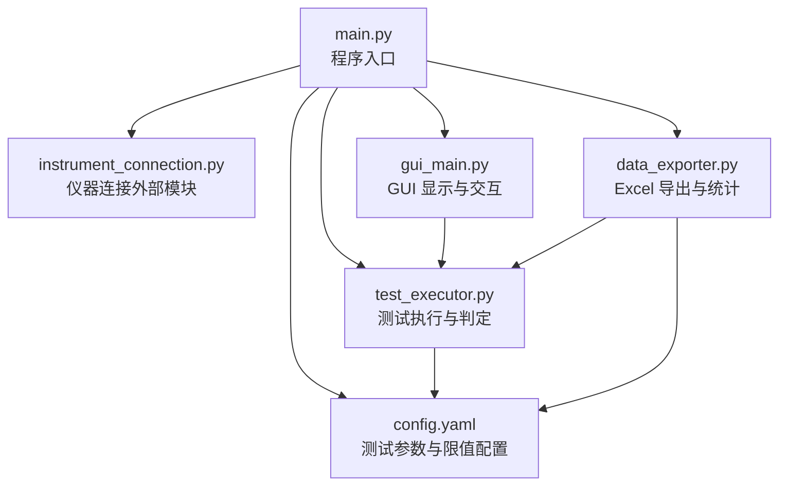
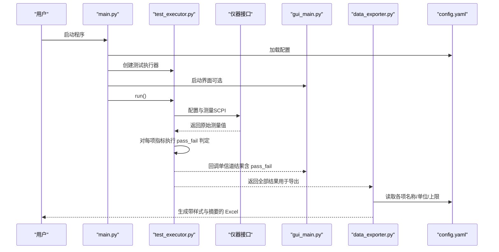
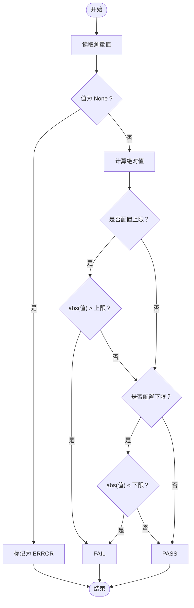
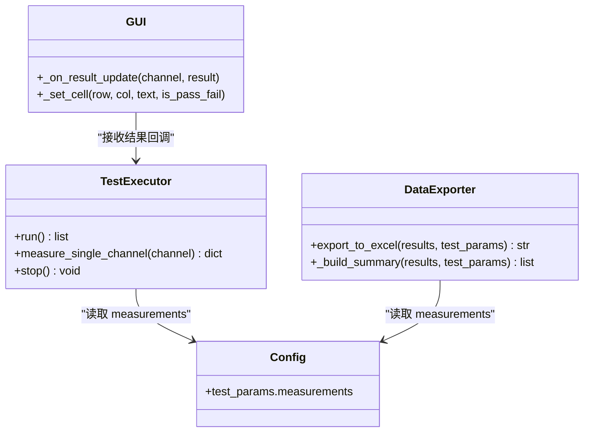

# 通过失败判定逻辑

<cite>
**本文引用的文件**   
- [main.py](file://main.py)
- [test_executor.py](file://test_executor.py)
- [config.yaml](file://config.yaml)
- [data_exporter.py](file://data_exporter.py)
- [gui_main.py](file://gui_main.py)
</cite>

## 目录
1. [简介](#简介)
2. [项目结构](#项目结构)
3. [核心组件](#核心组件)
4. [架构总览](#架构总览)
5. [详细组件分析](#详细组件分析)
6. [依赖关系分析](#依赖关系分析)
7. [性能与复杂度](#性能与复杂度)
8. [故障排查指南](#故障排查指南)
9. [结论](#结论)
10. [附录：配置与扩展示例](#附录配置与扩展示例)

## 简介
本技术文档聚焦于“通过/失败”判定逻辑，围绕以下目标展开：
- 深入解释 pass_fail 判定算法的实现原理，包括绝对值比较策略和上下限配置的灵活性。
- 详细说明 upper_limit 与 lower_limit 的作用与计算方式。
- 解释 ERROR 状态的触发条件与优先级处理。
- 提供自定义判定规则的扩展方法与配置示例。
- 说明边界情况处理与异常值的容错机制。
- 说明不同测量指标的判定标准差异与特殊处理逻辑。

## 项目结构
本项目为 BLE TX 调制自动化测试工具，核心流程由入口程序加载配置、初始化仪器连接、执行测试并导出结果。判定逻辑集中在测试执行模块中，并在 GUI 与数据导出模块中进行展示与汇总。

图表来源
- [main.py:295-336](file://main.py#L295-L336)
- [test_executor.py:22-51](file://test_executor.py#L22-L51)
- [data_exporter.py:23-48](file://data_exporter.py#L23-L48)
- [gui_main.py:580-667](file://gui_main.py#L580-L667)
- [config.yaml:27-78](file://config.yaml#L27-L78)

章节来源
- [main.py:295-336](file://main.py#L295-L336)
- [config.yaml:27-78](file://config.yaml#L27-L78)

## 核心组件
- 测试执行器（BLETxModulationTest）：负责逐信道测量、读取指标、应用判定规则并生成 pass_fail 字典。
- 数据导出器（DataExporter）：将测试结果写入 Excel，并对判定结果进行着色与汇总统计。
- GUI 主窗口（CMW500MainWindow）：实时渲染测量数值与判定结果，支持进度与日志输出。
- 配置文件（config.yaml）：定义测试项名称、单位、上限与下限等判定阈值。

章节来源
- [test_executor.py:22-51](file://test_executor.py#L22-L51)
- [data_exporter.py:23-48](file://data_exporter.py#L23-L48)
- [gui_main.py:580-667](file://gui_main.py#L580-L667)
- [config.yaml:27-78](file://config.yaml#L27-L78)

## 架构总览
下图展示了从配置到判定的关键路径，以及错误状态在系统中的传播与展示。

图表来源
- [main.py:295-336](file://main.py#L295-L336)
- [test_executor.py:186-245](file://test_executor.py#L186-L245)
- [data_exporter.py:81-139](file://data_exporter.py#L81-L139)
- [config.yaml:27-78](file://config.yaml#L27-L78)

## 详细组件分析

### 判定算法实现原理（绝对值比较与上下限）
- 输入：每个测量指标的实际测量值（可能为正或负）。
- 策略：取绝对值后与上限进行比较；若配置了非空的下限，则再与下限进行比较。
- 判定规则：
  - 若存在上限且 abs(测量值) > 上限 → FAIL
  - 否则若存在下限且 abs(测量值) < 下限 → FAIL
  - 其他情况 → PASS
- 异常值：当某项测量值为 None（例如读取失败），该项直接标记为 ERROR。

图表来源
- [test_executor.py:166-183](file://test_executor.py#L166-L183)

章节来源
- [test_executor.py:166-183](file://test_executor.py#L166-L183)

### upper_limit 与 lower_limit 配置参数
- 作用：
  - upper_limit：允许的最大绝对偏差。超过该值即判定为失败。
  - lower_limit：允许的最低绝对偏差。低于该值即判定为失败（适用于需要最小漂移速率等场景）。
- 计算方式：
  - 先对测量值取绝对值，再与上限/下限比较。
- 配置位置：
  - 在 config.yaml 的 test_params.measurements 下，每项指标可独立设置 upper_limit 与 lower_limit。
- 默认行为：
  - 若未配置 lower_limit（为 null），则仅使用上限判断。

章节来源
- [config.yaml:45-71](file://config.yaml#L45-L71)
- [test_executor.py:166-183](file://test_executor.py#L166-L183)

### ERROR 状态的触发条件与优先级
- 触发条件：
  - 当某项指标测量值为 None（如 SCPI 查询异常、解析失败）时，该项直接标记为 ERROR。
- 优先级：
  - ERROR 优先于 PASS/FAIL。即使满足上限/下限条件，只要值为 None，仍为 ERROR。
- 展示与统计：
  - GUI 与导出模块会将 ERROR 以黄色高亮显示，并在统计时将非 PASS 视为失败计数的一部分。

章节来源
- [test_executor.py:166-183](file://test_executor.py#L166-L183)
- [data_exporter.py:117-122](file://data_exporter.py#L117-L122)
- [gui_main.py:584-589](file://gui_main.py#L584-L589)

### 不同测量指标的判定标准差异与特殊处理
- 频率准确度（frequency_accuracy）：通常关注绝对偏差，使用上限即可。
- 频率漂移（frequency_drift）：关注绝对漂移量，使用上限。
- 频率偏移（frequency_offset）：关注绝对偏移量，使用上限。
- 初始频率漂移（initial_frequency_drift）：关注起始阶段的绝对漂移，使用上限。
- 最大漂移速率（max_drift_rate）：关注速率大小，使用上限；如需最小速率要求，可配置 lower_limit。
- 特殊处理：
  - 所有指标均按绝对值比较，避免正负号影响判定。
  - 缺失值统一归为 ERROR，便于快速定位问题。

章节来源
- [config.yaml:47-71](file://config.yaml#L47-L71)
- [test_executor.py:125-183](file://test_executor.py#L125-L183)

### 边界情况与容错机制
- 缺失值容错：
  - 任何单项测量失败都会导致该项为 ERROR，不影响其他项的正常判定。
- 越界与极值：
  - 由于采用绝对值比较，正负极端值都会被正确识别为超出上限。
- 停止与中断：
  - 测试循环支持 stop() 中断，已记录的结果保持完整，未完成的信道不再继续。
- 异常捕获：
  - 单个信道的测量异常会被捕获并记录错误信息，同时继续后续信道。

章节来源
- [test_executor.py:226-234](file://test_executor.py#L226-L234)
- [test_executor.py:247-252](file://test_executor.py#L247-L252)

### 可视化与统计中的判定呈现
- GUI 表格：
  - 判定列根据 PASS/FAIL/ERROR 分别着色（绿/红/黄），便于快速识别。
- Excel 导出：
  - “测试数据”表包含各指标数值与判定列；“测试摘要”表汇总通过/失败数量与总体判定。
  - 总体判定基于“全部通过信道数”与“总信道数”的比较。

章节来源
- [gui_main.py:642-667](file://gui_main.py#L642-L667)
- [data_exporter.py:141-202](file://data_exporter.py#L141-L202)

## 依赖关系分析
- main.py 负责加载配置、初始化连接与选择运行模式（CLI/GUI）。
- test_executor.py 依赖配置中的 measurements 定义，执行测量与判定。
- data_exporter.py 依赖配置中的 measurements 元信息（名称、单位、上限）进行导出与统计。
- gui_main.py 依赖 test_executor.py 的回调结果进行实时展示。

图表来源
- [test_executor.py:22-51](file://test_executor.py#L22-L51)
- [data_exporter.py:23-48](file://data_exporter.py#L23-L48)
- [gui_main.py:580-667](file://gui_main.py#L580-L667)
- [config.yaml:27-78](file://config.yaml#L27-L78)

章节来源
- [main.py:295-336](file://main.py#L295-L336)
- [test_executor.py:186-245](file://test_executor.py#L186-L245)
- [data_exporter.py:81-139](file://data_exporter.py#L81-L139)
- [gui_main.py:580-667](file://gui_main.py#L580-L667)

## 性能与复杂度
- 时间复杂度：
  - 单信道判定：O(m)，m 为测量指标数量（当前为 5）。
  - 全信道判定：O(n*m)，n 为信道数量。
- 空间复杂度：
  - 存储全部结果：O(n*m)。
- 优化建议：
  - 对于大规模信道扫描，可在导出阶段按需聚合，减少内存占用。
  - 判定逻辑本身轻量，瓶颈主要在仪器通信与 I/O。

[本节为通用性能讨论，不直接分析具体文件]

## 故障排查指南
- 常见问题：
  - 某项指标频繁 ERROR：检查仪器通信稳定性与 SCPI 指令返回值。
  - 大量 FAIL：核对 config.yaml 中的 upper_limit/lower_limit 是否符合实际产品规格。
  - 总体判定为 FAIL：确认是否存在任意一项 FAIL 或 ERROR。
- 定位方法：
  - 查看 GUI 日志与表格中的 ERROR 行。
  - 打开导出的 Excel，关注“测试数据”与“测试摘要”。
- 恢复措施：
  - 调整限值或重新校准仪器。
  - 重启测试并观察是否复现。

章节来源
- [test_executor.py:226-234](file://test_executor.py#L226-L234)
- [data_exporter.py:141-202](file://data_exporter.py#L141-L202)
- [gui_main.py:621-629](file://gui_main.py#L621-L629)

## 结论
本项目的 pass_fail 判定逻辑简洁而稳健：以绝对值为核心，结合灵活的上下限配置，确保对不同测量指标的包容性与一致性。ERROR 状态优先，有助于快速发现异常；GUI 与 Excel 的可视化与统计进一步提升了可观测性。通过合理配置与扩展，系统可适配更多指标与业务需求。

[本节为总结，不直接分析具体文件]

## 附录：配置与扩展示例

### 配置示例（节选）
- 在 config.yaml 的 test_params.measurements 下为每项指标设置 name、unit、upper_limit 与 lower_limit。
- 示例字段参考：
  - frequency_accuracy：name=“频率准确度”，unit=“kHz”，upper_limit=150.00，lower_limit=null
  - max_drift_rate：name=“最大漂移速率”，unit=“kHz”，upper_limit=20.00，lower_limit=null

章节来源
- [config.yaml:45-71](file://config.yaml#L45-L71)

### 自定义判定规则扩展方法
- 新增指标：
  - 在 config.yaml 中添加新指标键名与限值。
  - 在测试执行器中增加对应 SCPI 读取与结果赋值。
  - 在导出与 GUI 中注册新指标的名称、单位与判定列。
- 修改判定策略：
  - 若需引入加权评分或多阈值区间，可在判定函数中扩展分支逻辑。
  - 注意保持 ERROR 优先原则，确保异常值不被误判为 PASS/FAIL。

章节来源
- [test_executor.py:125-183](file://test_executor.py#L125-L183)
- [data_exporter.py:104-123](file://data_exporter.py#L104-L123)
- [gui_main.py:580-590](file://gui_main.py#L580-L590)