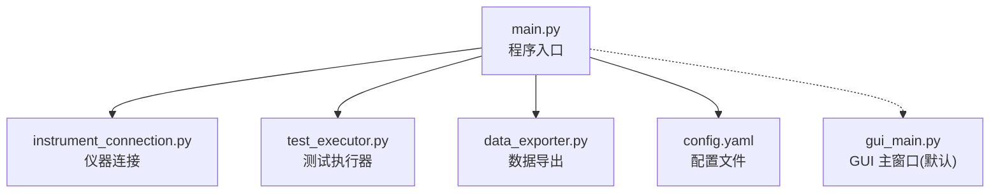
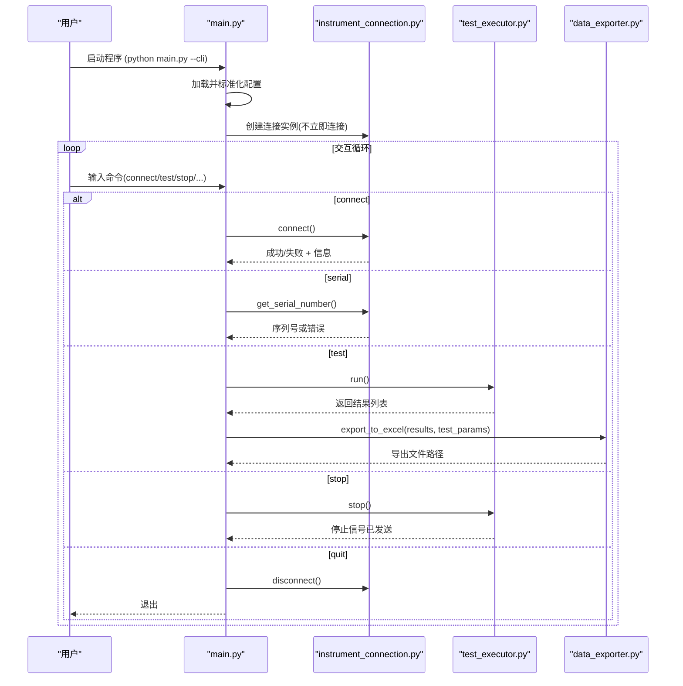
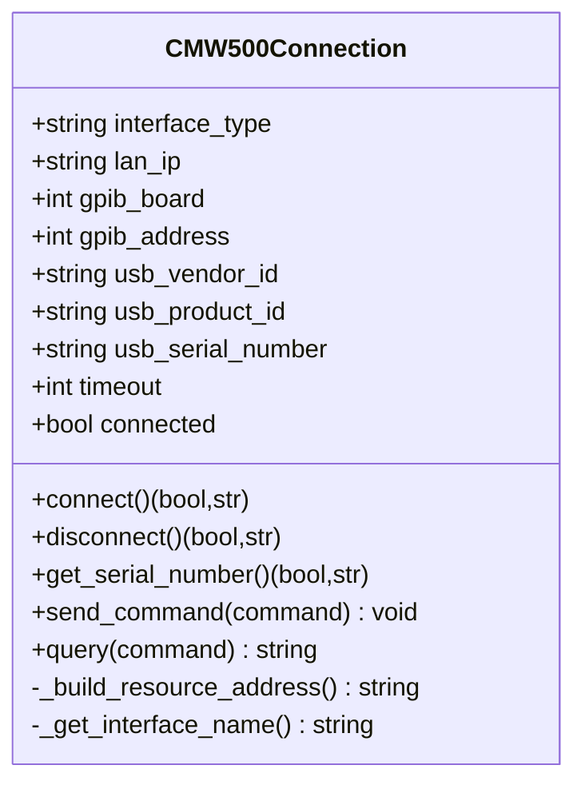
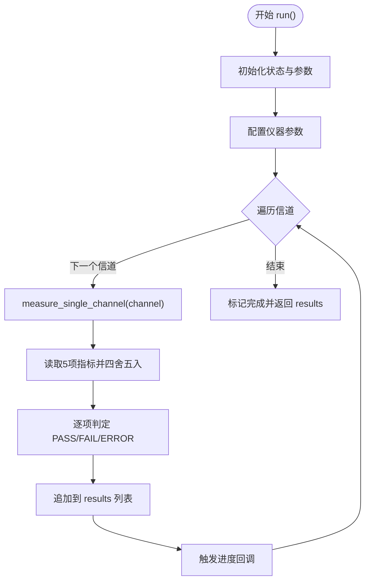
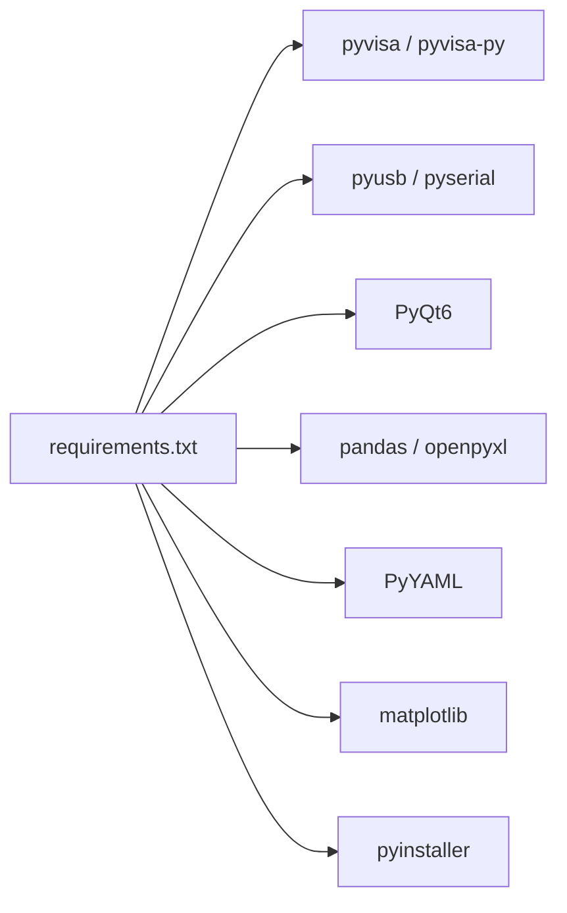

# 命令行模式使用指南

<cite>
**本文引用的文件**   
- [main.py](file://main.py)
- [config.yaml](file://config.yaml)
- [instrument_connection.py](file://instrument_connection.py)
- [test_executor.py](file://test_executor.py)
- [data_exporter.py](file://data_exporter.py)
- [gui_main.py](file://gui_main.py)
- [build.bat](file://build.bat)
- [requirements.txt](file://requirements.txt)
</cite>

## 目录
1. [简介](#简介)
2. [项目结构](#项目结构)
3. [核心组件](#核心组件)
4. [架构总览](#架构总览)
5. [详细组件分析](#详细组件分析)
6. [依赖关系分析](#依赖关系分析)
7. [性能与稳定性建议](#性能与稳定性建议)
8. [故障排查指南](#故障排查指南)
9. [结论](#结论)
10. [附录：命令速查与最佳实践](#附录命令速查与最佳实践)

## 简介
本指南面向需要在无图形界面环境下运行 CMW500 BLE TX 调制自动化测试的用户，详细说明如何通过命令行启动程序并执行自动化测试。内容涵盖：
- 启动方式与参数
- 可用命令及语法（connect、disconnect、serial、test、stop、quit）
- 配置文件的作用与加载方式
- 输出格式与结果处理
- 批量测试脚本示例与自动化集成方案
- 常见使用场景的命令序列与最佳实践
- 与 GUI 模式的区别与适用场景

## 项目结构
本项目采用模块化设计，核心模块职责清晰：
- main.py：程序入口，负责加载配置、创建连接对象、选择 CLI/GUI 模式
- instrument_connection.py：封装仪器连接/断开/查询等底层通信
- test_executor.py：实现 BLE TX 调制测试流程与判定逻辑
- data_exporter.py：将测试结果导出为带样式的 Excel 报告
- gui_main.py：PyQt6 图形界面（非 CLI 模式使用）
- config.yaml：全局配置（仪器接口、测试参数、导出路径等）
- build.bat / requirements.txt：构建与依赖管理

图表来源
- [main.py:295-336](file://main.py#L295-L336)
- [instrument_connection.py:18-133](file://instrument_connection.py#L18-L133)
- [test_executor.py:22-261](file://test_executor.py#L22-L261)
- [data_exporter.py:23-283](file://data_exporter.py#L23-L283)
- [config.yaml:1-79](file://config.yaml#L1-L79)
- [gui_main.py:75-124](file://gui_main.py#L75-L124)

章节来源
- [main.py:295-336](file://main.py#L295-L336)
- [config.yaml:1-79](file://config.yaml#L1-L79)

## 核心组件
- 命令行交互循环：在 CLI 模式下提供 connect、disconnect、serial、test、stop、quit 命令，支持交互式输入与状态提示。
- 仪器连接管理：统一封装 LAN/GPIB/USB 三种接口的资源地址构造、连接/断开、*IDN? 查询等。
- 测试执行器：按配置遍历信道范围，逐信道测量频率准确度、漂移、偏移、初始漂移、最大漂移速率，并按限值进行 PASS/FAIL 判定。
- 数据导出：生成“测试数据”和“测试摘要”两个 Sheet，自动着色与列宽调整，文件名包含时间戳避免覆盖。

章节来源
- [main.py:117-220](file://main.py#L117-L220)
- [instrument_connection.py:18-216](file://instrument_connection.py#L18-L216)
- [test_executor.py:22-261](file://test_executor.py#L22-L261)
- [data_exporter.py:23-283](file://data_exporter.py#L23-L283)

## 架构总览
CLI 模式下的关键调用链如下：
- 启动时加载配置并标准化字段
- 根据 --cli 参数进入命令行交互
- 用户输入命令后，调用连接或测试执行器方法
- 测试完成后通过导出器生成 Excel 报告

图表来源
- [main.py:117-220](file://main.py#L117-L220)
- [instrument_connection.py:85-191](file://instrument_connection.py#L85-L191)
- [test_executor.py:186-261](file://test_executor.py#L186-L261)
- [data_exporter.py:81-139](file://data_exporter.py#L81-L139)

## 详细组件分析

### 命令行交互与命令语义
- 启动方式
  - 源码运行：python main.py --cli
  - 打包后可执行文件：dist\CMW500_BLE_Test\CMW500_BLE_Test.exe --cli（需确保同目录存在 config.yaml）
- 交互命令
  - connect：建立仪器连接；成功后可创建测试执行器
  - disconnect：断开当前连接
  - serial：读取仪器序列号（基于 *IDN?）
  - test：开始 BLE TX 调制测试；完成后自动导出 Excel
  - stop：停止正在执行的测试
  - quit：退出程序（若已连接则先断开）
- 命令行为要点
  - 未连接时执行 test 会提示先连接
  - stop 仅在测试运行中有效
  - 每次 test 结束后会自动尝试导出 Excel，并在控制台打印导出路径

章节来源
- [main.py:117-220](file://main.py#L117-L220)
- [instrument_connection.py:161-191](file://instrument_connection.py#L161-L191)

### 仪器连接模块
- 支持的接口类型
  - LAN（TCP/IP）：TCPIP0::<IP>::inst0::INSTR
  - GPIB（IEEE-488）：GPIB<board>::<address>::INSTR
  - USB（TMC）：USB0::<VID>::<PID>::<SN>::INSTR（SN 为空时使用通配符自动匹配）
- 关键方法
  - connect()：打开资源、设置超时、验证 *IDN?
  - disconnect()：关闭资源并重置状态
  - get_serial_number()：解析 *IDN? 返回的序列号
  - send_command()/query()：通用 SCPI 写入与查询

图表来源
- [instrument_connection.py:18-216](file://instrument_connection.py#L18-L216)

章节来源
- [instrument_connection.py:18-216](file://instrument_connection.py#L18-L216)

### 测试执行器
- 功能概述
  - 初始化：从配置读取测试标准、PHY、统计次数、信道范围、测量项与限值
  - 配置仪器：复位、选择 BT TX 调制测量、设置突发类型、PHY、统计次数、数据包类型
  - 单信道测量：设置信道、启动测量、等待完成、读取各项指标并计算 PASS/FAIL
  - 全量扫描：遍历信道范围，支持 stop 中断，记录日志与进度回调
- 判定规则
  - 对每项指标取绝对值与上限比较，超过上限或低于下限（如有）则为 FAIL，否则 PASS
  - 缺失值记为 ERROR

图表来源
- [test_executor.py:186-261](file://test_executor.py#L186-L261)
- [test_executor.py:105-184](file://test_executor.py#L105-L184)

章节来源
- [test_executor.py:22-261](file://test_executor.py#L22-L261)

### 数据导出器
- 输出内容
  - Sheet “测试数据”：每行一个信道，包含各指标数值与判定结果
  - Sheet “测试摘要”：汇总统计（测试时间、标准、信道范围、统计次数、各指标通过/失败数、总体判定）
- 样式与命名
  - 表头蓝色背景、白色加粗字体
  - PASS 浅绿色、FAIL 浅红色、ERROR 浅黄色
  - 自动列宽调整，文件名含时间戳避免覆盖
- 路径解析
  - 支持相对路径（基于程序根目录）与绝对路径
  - 兼容 PyInstaller 打包后的运行环境

章节来源
- [data_exporter.py:23-283](file://data_exporter.py#L23-L283)

### 配置文件说明
- 位置与加载
  - 默认路径：程序所在目录下的 config.yaml
  - 加载函数会在找不到文件或 YAML 解析失败时抛出异常并给出明确提示
- 主要字段
  - instrument：接口类型与连接参数（LAN/GPIB/USB），以及超时
  - test_params：测试标准、PHY、统计次数、信道范围、测量项与限值
  - export：输出目录与文件名前缀
- 兼容性处理
  - 自动补全缺失字段（如旧版缺少子节或字段），保证向后兼容

章节来源
- [main.py:85-115](file://main.py#L85-L115)
- [main.py:245-292](file://main.py#L245-L292)
- [config.yaml:1-79](file://config.yaml#L1-L79)

## 依赖关系分析
- 运行时依赖
  - pyvisa/pyvisa-py：仪器通信后端
  - pyusb/pyserial：USB/串口驱动支持
  - PyQt6：GUI 框架（CLI 模式不需要）
  - pandas/openpyxl：Excel 读写与样式
  - PyYAML：配置文件解析
  - matplotlib：可视化（CLI 模式未直接使用）
  - pyinstaller：打包工具
- 构建产物
  - build.bat 会将 config.yaml 复制到 dist 目录下，便于 exe 直接运行

图表来源
- [requirements.txt:1-12](file://requirements.txt#L1-L12)
- [build.bat:60-90](file://build.bat#L60-L90)

章节来源
- [requirements.txt:1-12](file://requirements.txt#L1-L12)
- [build.bat:60-90](file://build.bat#L60-L90)

## 性能与稳定性建议
- 合理设置统计次数 statistic_count：增大可提高稳定性但延长单次测量时间
- 控制信道范围：仅测试必要信道可减少整体耗时
- 网络与驱动：LAN 模式需确保网络稳定；USB 模式需安装对应驱动
- 超时配置：timeout 可根据实际链路质量适当调整，避免频繁超时重试
- 并发与线程：CLI 模式为单线程交互，适合无人值守批处理；如需并行多设备，可在外部脚本中并发启动多个进程

[本节为通用建议，不直接分析具体文件]

## 故障排查指南
- 无法找到配置文件
  - 现象：启动时报错提示找不到配置文件或解析失败
  - 处理：确保 config.yaml 位于程序同一目录，且格式正确
- 连接失败
  - LAN：检查 IP 地址、网线连通性与防火墙策略
  - GPIB：核对板号与主地址，确认线缆连接
  - USB：确认 VID/PID/序列号是否正确，驱动是否安装
- 测试中途停止
  - 现象：stop 后部分信道未完成
  - 处理：属预期行为，已记录的信道结果仍会保存
- 导出失败
  - 现象：导出 Excel 报错
  - 处理：检查输出目录权限、磁盘空间与 openpyxl 依赖是否正常

章节来源
- [main.py:85-115](file://main.py#L85-L115)
- [instrument_connection.py:112-133](file://instrument_connection.py#L112-L133)
- [data_exporter.py:81-139](file://data_exporter.py#L81-L139)

## 结论
命令行模式适用于无人值守、持续集成与批量测试场景。通过简洁的命令集与稳定的配置驱动，可实现从连接仪器、执行测试到结果导出的全流程自动化。结合外部脚本与任务调度系统，可轻松搭建生产级自动化流水线。

[本节为总结性内容，不直接分析具体文件]

## 附录：命令速查与最佳实践

### 启动方式
- 源码运行
  - python main.py --cli
- 打包后运行
  - dist\CMW500_BLE_Test\CMW500_BLE_Test.exe --cli
  - 注意：确保 dist 目录下存在 config.yaml

章节来源
- [main.py:295-336](file://main.py#L295-L336)
- [build.bat:87-100](file://build.bat#L87-L100)

### 命令清单与用法
- connect
  - 作用：连接仪器（依据配置中的接口类型与参数）
  - 返回：成功/失败信息与提示信息
  - 示例：在交互提示下输入 connect
- disconnect
  - 作用：断开当前仪器连接
  - 返回：成功/提示消息
  - 示例：在交互提示下输入 disconnect
- serial
  - 作用：读取仪器序列号（基于 *IDN?）
  - 返回：序列号或错误信息
  - 示例：在交互提示下输入 serial
- test
  - 作用：执行 BLE TX 调制测试（按配置遍历信道）
  - 前置条件：必须先 connect 成功
  - 后续动作：完成后自动导出 Excel 并打印路径
  - 示例：在交互提示下输入 test
- stop
  - 作用：停止正在执行的测试
  - 说明：仅当测试运行中有效
  - 示例：在交互提示下输入 stop
- quit
  - 作用：退出程序（若已连接则先断开）
  - 示例：在交互提示下输入 quit

章节来源
- [main.py:117-220](file://main.py#L117-L220)
- [instrument_connection.py:161-191](file://instrument_connection.py#L161-L191)

### 配置文件要点
- 接口类型与参数
  - interface_type：LAN/GPIB/USB
  - LAN：lan.ip_address
  - GPIB：gpib.board、gpib.address
  - USB：usb.vendor_id、usb.product_id、usb.serial_number
  - timeout：毫秒
- 测试参数
  - standard、phy_type、burst_type、packet_type、statistic_count
  - channel_start、channel_end
  - measurements：每项包含 name、unit、upper_limit、lower_limit
- 导出配置
  - output_dir：相对或绝对路径
  - file_prefix：Excel 文件名前缀

章节来源
- [config.yaml:1-79](file://config.yaml#L1-L79)
- [main.py:245-292](file://main.py#L245-L292)

### 输出格式与结果处理
- 控制台输出
  - 连接/断开/序列号/测试进度/摘要等信息
- Excel 报告
  - Sheet “测试数据”：逐信道数值与判定
  - Sheet “测试摘要”：汇总统计与总体判定
  - 文件名：前缀_YYYYMMDD_HHMMSS.xlsx
  - 样式：PASS 绿、FAIL 红、ERROR 黄，表头蓝底白字

章节来源
- [data_exporter.py:81-139](file://data_exporter.py#L81-L139)
- [data_exporter.py:204-283](file://data_exporter.py#L204-L283)

### 批量测试脚本示例（思路）
- 使用 Python 子进程或 shell 脚本循环调用 main.py --cli
- 通过管道或临时文件向 CLI 注入命令序列（connect、test、stop、quit）
- 收集生成的 Excel 文件路径，用于后续归档与分析
- 可结合任务调度（Windows Task Scheduler / cron）定时执行

[本节为概念性指导，不直接分析具体文件]

### 常见使用场景与推荐命令序列
- 快速验证连接与序列号
  - connect → serial → disconnect → quit
- 执行一次完整测试并导出报告
  - connect → test → quit
- 长时间测试中途停止
  - connect → test → stop → quit
- 切换不同接口进行测试
  - 修改 config.yaml 的 instrument 段 → connect → test → disconnect → quit

[本节为概念性指导，不直接分析具体文件]

### 与 GUI 模式的区别与适用场景
- 启动差异
  - CLI：python main.py --cli
  - GUI：python main.py（默认）
- 交互方式
  - CLI：文本命令，适合脚本化与自动化
  - GUI：按钮与表格，适合人工操作与实时监控
- 线程与更新
  - GUI 使用独立工作线程与 Qt 信号机制实时更新界面
  - CLI 为同步交互，简单可靠
- 适用场景
  - CLI：无人值守、CI/CD、批量回归
  - GUI：现场调试、演示、快速定位问题

章节来源
- [main.py:295-336](file://main.py#L295-L336)
- [gui_main.py:28-73](file://gui_main.py#L28-L73)
- [gui_main.py:499-528](file://gui_main.py#L499-L528)