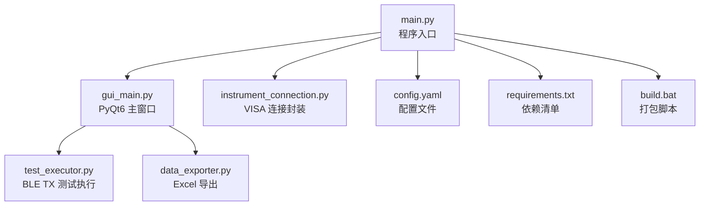
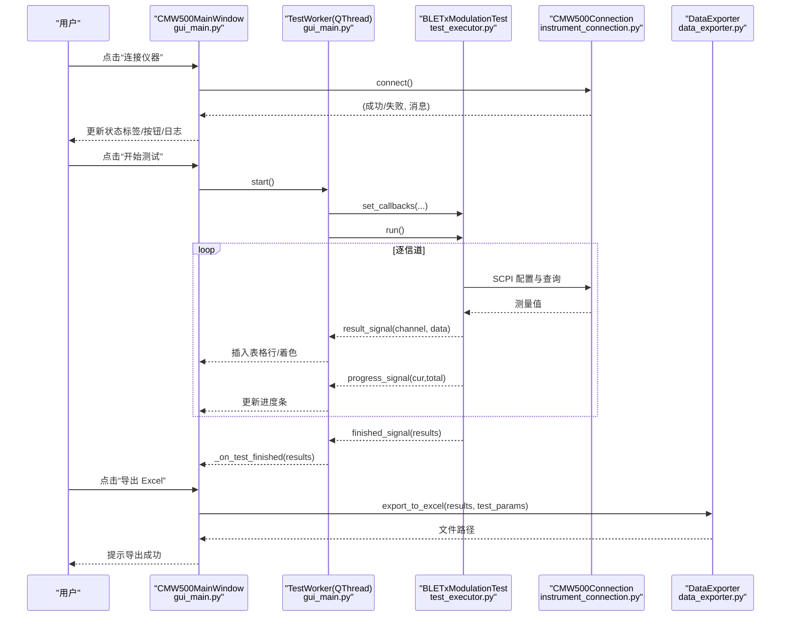
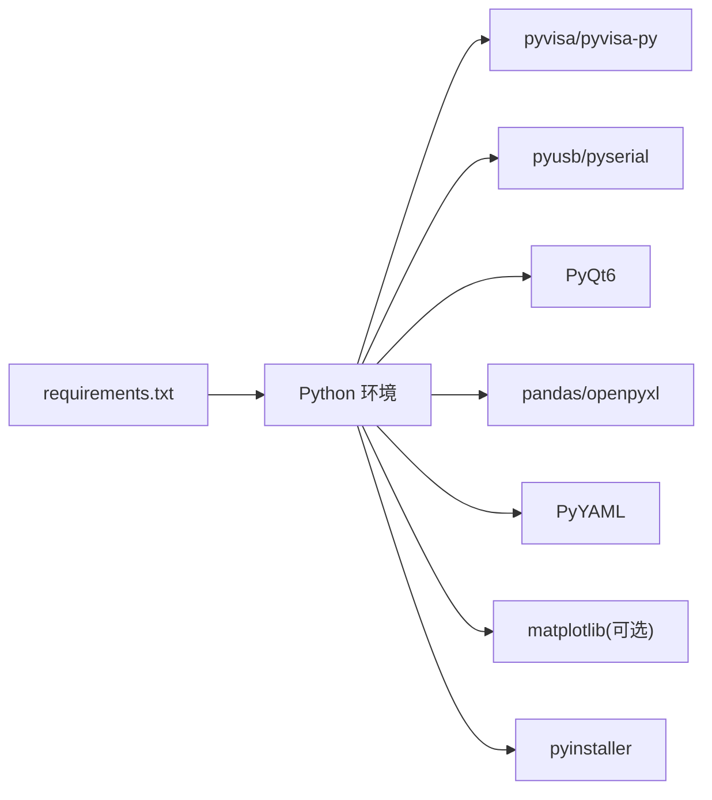

# 图形界面操作指南

<cite>
**本文引用的文件**   
- [gui_main.py](file://gui_main.py)
- [main.py](file://main.py)
- [instrument_connection.py](file://instrument_connection.py)
- [test_executor.py](file://test_executor.py)
- [data_exporter.py](file://data_exporter.py)
- [config.yaml](file://config.yaml)
- [requirements.txt](file://requirements.txt)
- [build.bat](file://build.bat)
</cite>

## 目录
1. [简介](#简介)
2. [项目结构](#项目结构)
3. [核心组件](#核心组件)
4. [架构总览](#架构总览)
5. [详细组件分析](#详细组件分析)
6. [依赖关系分析](#依赖关系分析)
7. [性能与稳定性建议](#性能与稳定性建议)
8. [故障排查指南](#故障排查指南)
9. [结论](#结论)
10. [附录：完整操作流程示例](#附录完整操作流程示例)

## 简介
本指南面向使用 CMW500 BLE TX 调制自动化测试工具的用户，提供从安装、连接仪器到执行测试、查看结果与导出报告的完整图形界面操作说明。文档覆盖主窗口布局、接口配置区（LAN/GPIB/USB）、操作面板、测试结果表格、日志窗口、状态栏等区域的功能与使用方法，并解释判定标准与数据解读方式。

## 项目结构
程序采用模块化设计，GUI 层与业务逻辑分离，支持三种仪器接口（LAN/GPIB/USB），并通过线程化测试执行避免阻塞界面。

图表来源
- [main.py:222-242](file://main.py#L222-L242)
- [gui_main.py:75-149](file://gui_main.py#L75-L149)
- [instrument_connection.py:18-133](file://instrument_connection.py#L18-L133)
- [test_executor.py:22-104](file://test_executor.py#L22-L104)
- [data_exporter.py:23-93](file://data_exporter.py#L23-L93)
- [config.yaml:1-79](file://config.yaml#L1-L79)
- [requirements.txt:1-12](file://requirements.txt#L1-L12)
- [build.bat:75-100](file://build.bat#L75-L100)

章节来源
- [main.py:295-336](file://main.py#L295-L336)
- [gui_main.py:129-149](file://gui_main.py#L129-L149)
- [config.yaml:1-79](file://config.yaml#L1-L79)

## 核心组件
- 主窗口与控件：负责展示界面、接收用户输入、驱动测试流程与更新状态。
- 仪器连接模块：封装 VISA 通信，统一 LAN/GPIB/USB 资源地址构造与连接管理。
- 测试执行器：按信道遍历测量五项频率指标，计算 PASS/FAIL，回调推送进度与结果。
- 数据导出器：将结果写入 Excel，生成“测试数据”和“测试摘要”两个工作表，并应用样式。
- 配置系统：YAML 定义默认接口、测试参数、限值与导出路径。

章节来源
- [gui_main.py:75-149](file://gui_main.py#L75-L149)
- [instrument_connection.py:18-133](file://instrument_connection.py#L18-L133)
- [test_executor.py:22-104](file://test_executor.py#L22-L104)
- [data_exporter.py:23-93](file://data_exporter.py#L23-L93)
- [config.yaml:1-79](file://config.yaml#L1-L79)

## 架构总览
下图展示了 GUI 与后端模块的交互关系，以及信号槽驱动的异步测试流程。

图表来源
- [gui_main.py:438-556](file://gui_main.py#L438-L556)
- [gui_main.py:28-73](file://gui_main.py#L28-L73)
- [test_executor.py:186-245](file://test_executor.py#L186-L245)
- [instrument_connection.py:85-133](file://instrument_connection.py#L85-L133)
- [data_exporter.py:81-139](file://data_exporter.py#L81-L139)

## 详细组件分析

### 主窗口布局与功能区域
- 顶部：接口配置区
  - 作用：选择 LAN/GPIB/USB 三种连接方式，并显示对应参数输入控件。
  - 控件与行为：
    - 接口类型下拉框：切换后通过堆叠控件显示对应页面。
    - LAN 页：IP 地址文本框，默认来自配置文件。
    - GPIB 页：板号与地址数值框，范围分别为 0~10 与 0~30，默认来自配置文件。
    - USB 页：VID/PID 文本框与序列号文本框，序列号留空表示自动搜索。
  - 输入格式与验证规则：
    - LAN IP：字符串，形如 “192.168.1.100”，由连接时校验网络可达性与 *IDN? 响应。
    - GPIB 板号/地址：整数，超出范围将被禁用或导致连接失败。
    - USB VID/PID：十六进制字符串，形如 “0x0AAD”；序列号可为空。
  - 参考实现位置：[gui_main.py:150-276](file://gui_main.py#L150-L276)

- 中部上：操作面板
  - 按钮：
    - 连接仪器：读取当前接口参数并调用连接；成功后启用“开始测试”、禁用“连接”。
    - 断开仪器：释放连接，恢复所有按钮初始状态。
    - 开始测试：清空表格与进度，启动工作线程执行测试。
    - 停止测试：发送停止信号，等待当前信道完成。
    - 导出 Excel：将最近一次测试结果导出为带样式的 Excel。
  - 连接状态标签：显示“● 未连接/已连接”，颜色随状态变化。
  - 参考实现位置：[gui_main.py:301-382](file://gui_main.py#L301-L382)、[gui_main.py:438-556](file://gui_main.py#L438-L556)

- 中部下：测试结果表格 + 进度条
  - 表格列：
    - 信道
    - 频率准确度(kHz) / 判定
    - 频率漂移(kHz) / 判定
    - 频率偏移(kHz) / 判定
    - 初始频率漂移(kHz) / 判定
    - 最大漂移速率(kHz) / 判定
  - 判定着色：PASS 浅绿、FAIL 浅红、ERROR 浅黄。
  - 进度条：百分比与“进度：当前/总数”文本同步更新。
  - 参考实现位置：[gui_main.py:384-418](file://gui_main.py#L384-L418)、[gui_main.py:561-600](file://gui_main.py#L561-L600)

- 底部：运行日志
  - 只读文本框，实时追加时间戳日志，自动滚动到底部。
  - 参考实现位置：[gui_main.py:420-432](file://gui_main.py#L420-L432)、[gui_main.py:635-641](file://gui_main.py#L635-L641)

- 状态栏
  - 显示连接状态与测试进度信息。
  - 参考实现位置：[gui_main.py:123](file://gui_main.py#L123)、[gui_main.py:618-629](file://gui_main.py#L618-L629)

章节来源
- [gui_main.py:150-276](file://gui_main.py#L150-L276)
- [gui_main.py:301-382](file://gui_main.py#L301-L382)
- [gui_main.py:384-418](file://gui_main.py#L384-L418)
- [gui_main.py:420-432](file://gui_main.py#L420-L432)
- [gui_main.py:561-600](file://gui_main.py#L561-L600)
- [gui_main.py:618-629](file://gui_main.py#L618-L629)

### 仪器连接模块（LAN/GPIB/USB）
- 支持的接口类型：
  - LAN（TCP/IP）：TCPIP0::<IP>::inst0::INSTR
  - GPIB（IEEE-488）：GPIB<board>::<address>::INSTR
  - USB（TMC）：USB0::<VID>::<PID>::<serial>::INSTR（序列号为 ? 时自动匹配）
- 关键方法：
  - connect()：创建 VISA 资源管理器，打开资源，发送 *IDN? 验证连接。
  - disconnect()：关闭资源并重置状态。
  - get_serial_number()：解析 *IDN? 返回的第三段作为序列号。
  - send_command()/query()：SCPI 命令发送与查询封装。
- 错误处理：
  - 捕获 VISA 通信异常，给出针对接口的提示信息。
- 参考实现位置：[instrument_connection.py:18-133](file://instrument_connection.py#L18-L133)、[instrument_connection.py:134-216](file://instrument_connection.py#L134-L216)

章节来源
- [instrument_connection.py:55-75](file://instrument_connection.py#L55-L75)
- [instrument_connection.py:85-133](file://instrument_connection.py#L85-L133)
- [instrument_connection.py:161-191](file://instrument_connection.py#L161-L191)

### 测试执行器（BLE TX 调制）
- 测试项（每项单位 kHz）：
  - 频率准确度
  - 频率漂移
  - 频率偏移
  - 初始频率漂移
  - 最大漂移速率
- 工作流程：
  - 配置仪器：复位、选择 BT TX 调制测量、设置突发类型、PHY、统计次数、数据包类型。
  - 逐信道测量：设置信道、启动测量、等待完成、读取各项指标。
  - 判定规则：对绝对值与上限比较，若超过上限则 FAIL；可配置下限（当前默认无下限）。
  - 回调机制：向 GUI 推送日志、进度与单信道结果。
- 参考实现位置：[test_executor.py:76-104](file://test_executor.py#L76-L104)、[test_executor.py:105-184](file://test_executor.py#L105-L184)、[test_executor.py:186-245](file://test_executor.py#L186-L245)

章节来源
- [test_executor.py:22-51](file://test_executor.py#L22-L51)
- [test_executor.py:166-184](file://test_executor.py#L166-L184)

### 数据导出器（Excel）
- 输出内容：
  - Sheet 1“测试数据”：每信道一行，包含测量值与判定列。
  - Sheet 2“测试摘要”：汇总统计与总体判定。
- 样式美化：
  - 表头蓝色背景白字加粗，单元格居中对齐，边框细线。
  - PASS/FAIL 单元格着色，自动调整列宽。
- 文件名：前缀 + 日期时间戳，避免覆盖历史数据。
- 参考实现位置：[data_exporter.py:81-139](file://data_exporter.py#L81-L139)、[data_exporter.py:204-283](file://data_exporter.py#L204-L283)

章节来源
- [data_exporter.py:23-67](file://data_exporter.py#L23-L67)
- [data_exporter.py:141-203](file://data_exporter.py#L141-L203)

### 配置系统（config.yaml）
- 仪器连接：
  - interface_type：默认接口类型（LAN/GPIB/USB）。
  - lan.ip_address、gpib.board/address、usb.vendor_id/product_id/serial_number。
  - timeout：毫秒级超时。
- 测试参数：
  - standard、phy_type、burst_type、packet_type、statistic_count。
  - channel_start/channel_end：信道范围（默认 0~39）。
  - measurements：各指标的 name/unit/upper_limit/lower_limit。
- 导出配置：
  - output_dir：相对或绝对路径。
  - file_prefix：Excel 文件名前缀。
- 参考实现位置：[config.yaml:1-79](file://config.yaml#L1-L79)

章节来源
- [config.yaml:1-79](file://config.yaml#L1-L79)

## 依赖关系分析
- 运行时依赖：
  - pyvisa/pyvisa-py：VISA 通信后端。
  - pyusb/pyserial：USB/串口支持（pyvisa-py 依赖）。
  - PyQt6：GUI 框架。
  - pandas/openpyxl：Excel 读写与样式。
  - PyYAML：配置文件解析。
  - matplotlib：可选可视化（当前未在主流程中使用）。
  - pyinstaller：打包为 exe。
- 构建与打包：
  - build.bat 自动安装依赖、清理旧构建、使用 PyInstaller 打包 main.py，并将 config.yaml 复制到 dist 目录。
- 参考实现位置：[requirements.txt:1-12](file://requirements.txt#L1-L12)、[build.bat:60-100](file://build.bat#L60-L100)

图表来源
- [requirements.txt:1-12](file://requirements.txt#L1-L12)
- [build.bat:60-100](file://build.bat#L60-L100)

章节来源
- [requirements.txt:1-12](file://requirements.txt#L1-L12)
- [build.bat:60-100](file://build.bat#L60-L100)

## 性能与稳定性建议
- 线程安全：测试在独立 QThread 中执行，通过信号槽更新 UI，避免阻塞主线程。
- 进度反馈：每个信道完成后触发进度回调，便于长时间任务监控。
- 异常保护：全局异常捕获与错误弹窗，确保无控制台环境下仍可提示错误。
- 资源管理：连接失败与断开时及时释放资源，防止句柄泄漏。
- 参考实现位置：[gui_main.py:28-73](file://gui_main.py#L28-L73)、[main.py:339-357](file://main.py#L339-L357)、[instrument_connection.py:134-159](file://instrument_connection.py#L134-L159)

## 故障排查指南
- 无法连接仪器
  - 检查接口类型与参数是否正确（LAN IP、GPIB 板号/地址、USB VID/PID/序列号）。
  - 确认网络连接或 GPIB/USB 线缆连接正常，驱动已安装。
  - 查看日志窗口的错误提示与状态栏信息。
  - 参考实现位置：[instrument_connection.py:112-133](file://instrument_connection.py#L112-L133)、[gui_main.py:438-480](file://gui_main.py#L438-L480)
- 测试中途停止
  - 点击“停止测试”，等待当前信道完成后再退出。
  - 参考实现位置：[gui_main.py:530-536](file://gui_main.py#L530-L536)、[test_executor.py:247-252](file://test_executor.py#L247-L252)
- 导出失败
  - 检查输出目录权限与磁盘空间。
  - 确认 openpyxl/pandas 可用。
  - 参考实现位置：[data_exporter.py:63-79](file://data_exporter.py#L63-L79)、[gui_main.py:537-556](file://gui_main.py#L537-L556)
- 启动错误
  - 确认 config.yaml 位于程序同目录且格式正确。
  - 查看错误弹窗中的堆栈信息与程序目录。
  - 参考实现位置：[main.py:339-357](file://main.py#L339-L357)

章节来源
- [instrument_connection.py:112-133](file://instrument_connection.py#L112-L133)
- [gui_main.py:438-480](file://gui_main.py#L438-L480)
- [gui_main.py:530-536](file://gui_main.py#L530-L536)
- [data_exporter.py:63-79](file://data_exporter.py#L63-L79)
- [main.py:339-357](file://main.py#L339-L357)

## 结论
本工具以清晰的 GUI 布局与稳定的多线程架构，实现了 CMW500 BLE TX 调制的自动化测试与报告导出。通过灵活的接口配置与直观的判定着色，用户可以快速完成从连接仪器到获取结果的完整流程，并基于 Excel 报告进行数据分析与归档。

## 附录：完整操作流程示例
以下为从启动到导出报告的步骤说明（无需代码片段，仅操作步骤）：

- 启动程序
  - 双击运行生成的 exe，或在 Python 环境中执行 main.py。
  - 程序加载 config.yaml 并初始化 GUI。
  - 参考实现位置：[main.py:295-336](file://main.py#L295-L336)、[main.py:222-242](file://main.py#L222-L242)

- 配置接口
  - 在“接口配置”区选择接口类型：
    - LAN：输入 IP 地址（例如 192.168.1.100）。
    - GPIB：设置板号与地址（范围见控件限制）。
    - USB：填写 VID/PID，序列号留空自动搜索。
  - 参考实现位置：[gui_main.py:150-276](file://gui_main.py#L150-L276)

- 连接仪器
  - 点击“连接仪器”，观察日志窗口与状态栏提示。
  - 成功后，“开始测试”按钮启用。
  - 参考实现位置：[gui_main.py:438-480](file://gui_main.py#L438-L480)

- 开始测试
  - 点击“开始测试”，表格逐行填充结果，进度条实时更新。
  - 如需中断，点击“停止测试”。
  - 参考实现位置：[gui_main.py:499-536](file://gui_main.py#L499-L536)、[gui_main.py:561-600](file://gui_main.py#L561-L600)

- 查看结果与判定
  - 表格中“判定”列显示 PASS/FAIL/ERROR，并带有颜色标识。
  - 判定依据参见配置文件中各项上限值。
  - 参考实现位置：[gui_main.py:642-666](file://gui_main.py#L642-L666)、[config.yaml:44-71](file://config.yaml#L44-L71)

- 导出 Excel
  - 点击“导出 Excel”，保存至配置的输出目录，文件名含时间戳。
  - 打开 Excel 查看“测试数据”与“测试摘要”两个工作表。
  - 参考实现位置：[gui_main.py:537-556](file://gui_main.py#L537-L556)、[data_exporter.py:81-139](file://data_exporter.py#L81-L139)

- 断开仪器
  - 点击“断开仪器”，恢复按钮状态与连接标签。
  - 参考实现位置：[gui_main.py:481-498](file://gui_main.py#L481-L498)

章节来源
- [main.py:295-336](file://main.py#L295-L336)
- [gui_main.py:150-276](file://gui_main.py#L150-L276)
- [gui_main.py:438-498](file://gui_main.py#L438-L498)
- [gui_main.py:499-556](file://gui_main.py#L499-L556)
- [gui_main.py:642-666](file://gui_main.py#L642-L666)
- [config.yaml:44-71](file://config.yaml#L44-L71)
- [data_exporter.py:81-139](file://data_exporter.py#L81-L139)