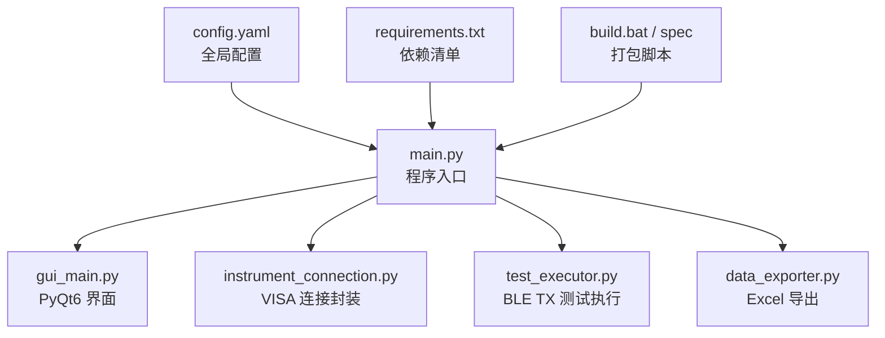
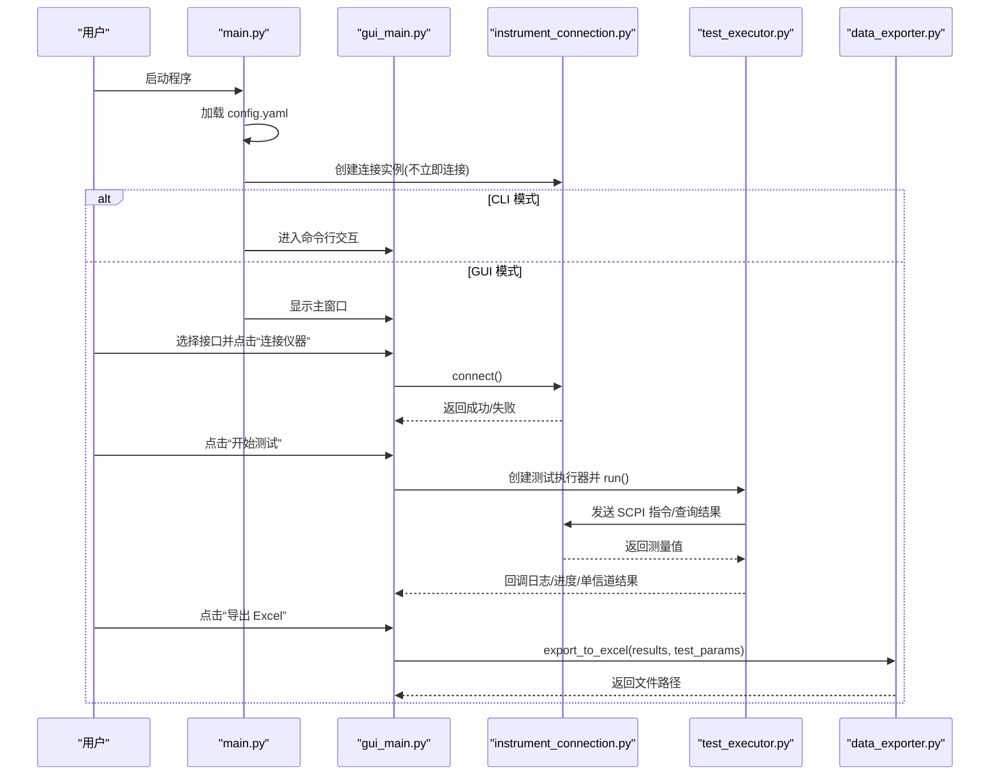
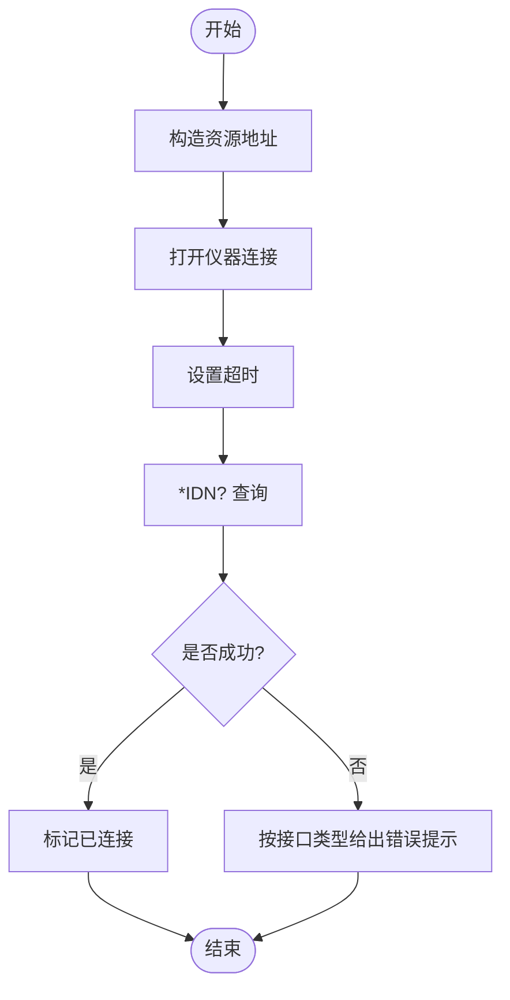
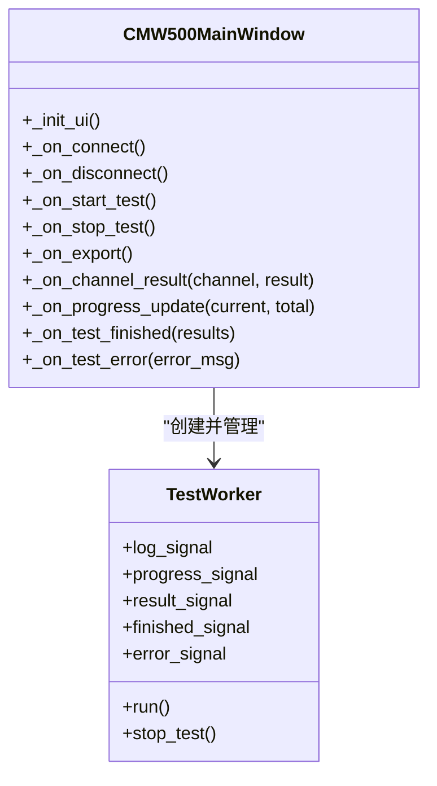
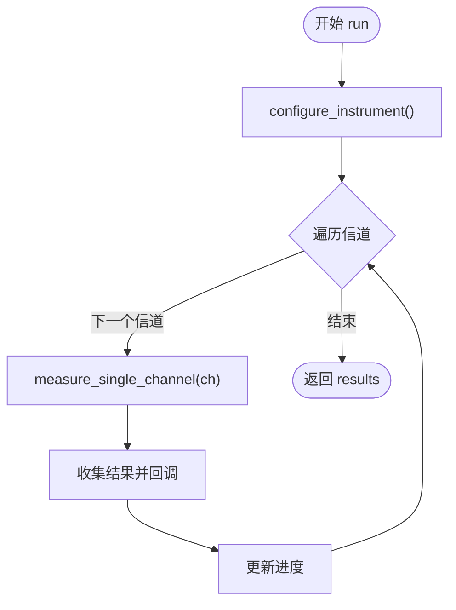
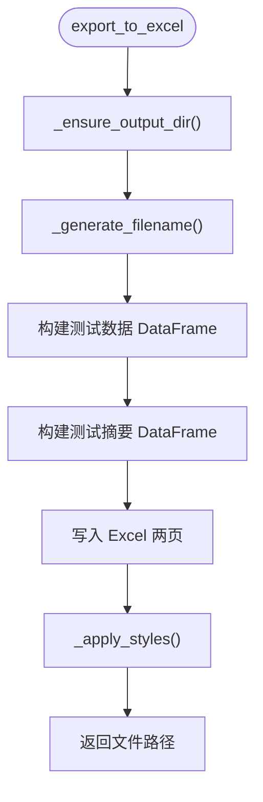
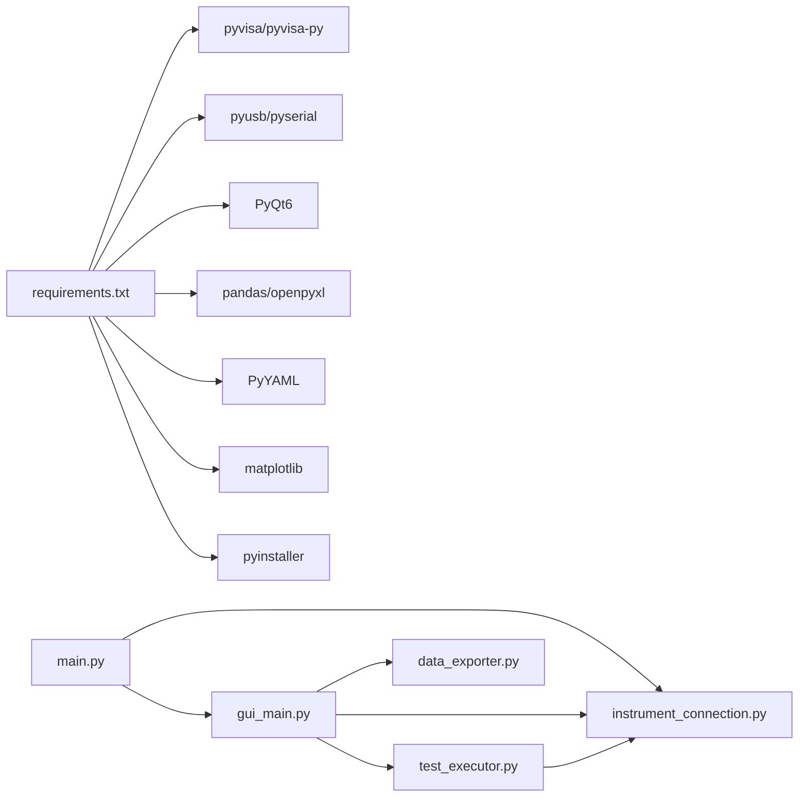

# 完整测试流程

<cite>
**本文引用的文件**   
- [main.py](file://main.py)
- [gui_main.py](file://gui_main.py)
- [instrument_connection.py](file://instrument_connection.py)
- [test_executor.py](file://test_executor.py)
- [data_exporter.py](file://data_exporter.py)
- [config.yaml](file://config.yaml)
- [requirements.txt](file://requirements.txt)
- [build.bat](file://build.bat)
- [CMW500_BLE_Test.spec](file://CMW500_BLE_Test.spec)
</cite>

## 目录
1. [简介](#简介)
2. [项目结构](#项目结构)
3. [核心组件](#核心组件)
4. [架构总览](#架构总览)
5. [详细组件分析](#详细组件分析)
6. [依赖关系分析](#依赖关系分析)
7. [性能与稳定性考虑](#性能与稳定性考虑)
8. [故障排除指南](#故障排除指南)
9. [结论](#结论)
10. [附录：典型测试场景与最佳实践](#附录典型测试场景与最佳实践)

## 简介
本指导文档面向使用 R&S CMW500 进行蓝牙 BLE TX 调制自动化测试的工程师，提供从环境准备、配置校验、仪器连接（LAN/GPIB/USB）、参数设置、执行测试、实时监控、结果判定、导出 Excel 报告到清理资源的全流程操作说明。文档同时包含常见问题排查方法、测试结果解读和质量评估标准，以及典型测试场景的最佳实践建议。

## 项目结构
本项目采用“入口 + GUI/CLI + 连接层 + 测试执行 + 数据导出”的分层组织方式，便于扩展与维护。

图表来源
- [main.py:295-336](file://main.py#L295-L336)
- [gui_main.py:75-124](file://gui_main.py#L75-L124)
- [instrument_connection.py:18-54](file://instrument_connection.py#L18-L54)
- [test_executor.py:22-51](file://test_executor.py#L22-L51)
- [data_exporter.py:23-62](file://data_exporter.py#L23-L62)
- [config.yaml:1-26](file://config.yaml#L1-L26)
- [requirements.txt:1-12](file://requirements.txt#L1-L12)
- [build.bat:76-84](file://build.bat#L76-L84)

章节来源
- [main.py:295-336](file://main.py#L295-L336)
- [gui_main.py:75-124](file://gui_main.py#L75-L124)
- [instrument_connection.py:18-54](file://instrument_connection.py#L18-L54)
- [test_executor.py:22-51](file://test_executor.py#L22-L51)
- [data_exporter.py:23-62](file://data_exporter.py#L23-L62)
- [config.yaml:1-26](file://config.yaml#L1-L26)
- [requirements.txt:1-12](file://requirements.txt#L1-L12)
- [build.bat:76-84](file://build.bat#L76-L84)

## 核心组件
- 程序入口 main.py：加载配置、初始化连接对象、选择 GUI/CLI 模式、统一异常处理。
- 图形界面 gui_main.py：基于 PyQt6 的主窗口，支持接口切换、连接/断开、开始/停止测试、进度条、实时表格、日志输出、一键导出 Excel。
- 仪器连接 instrument_connection.py：封装 VISA 通信，支持 LAN/GPIB/USB 三种接口，提供 connect/disconnect/query/send_command/get_serial_number 等方法。
- 测试执行 test_executor.py：实现 BLE LE 1Msps TX 调制测量，遍历信道范围，读取频率准确度/漂移/偏移/初始漂移/最大漂移速率并判定 PASS/FAIL。
- 数据导出 data_exporter.py：将测试结果写入 Excel，生成“测试数据”和“测试摘要”两个 Sheet，自动样式美化与列宽自适应。
- 配置文件 config.yaml：定义仪器连接参数、测试标准与限值、导出路径等。
- 构建脚本 build.bat 与 spec：一键安装依赖、打包为 exe，并将配置文件复制到输出目录。

章节来源
- [main.py:85-115](file://main.py#L85-L115)
- [gui_main.py:28-73](file://gui_main.py#L28-L73)
- [instrument_connection.py:85-132](file://instrument_connection.py#L85-L132)
- [test_executor.py:76-104](file://test_executor.py#L76-L104)
- [data_exporter.py:81-139](file://data_exporter.py#L81-L139)
- [config.yaml:27-79](file://config.yaml#L27-L79)
- [build.bat:60-84](file://build.bat#L60-L84)

## 架构总览
下图展示了从用户交互到仪器控制、数据采集与导出的整体调用链。

图表来源
- [main.py:295-336](file://main.py#L295-L336)
- [gui_main.py:438-479](file://gui_main.py#L438-L479)
- [instrument_connection.py:85-132](file://instrument_connection.py#L85-L132)
- [test_executor.py:186-245](file://test_executor.py#L186-L245)
- [data_exporter.py:81-139](file://data_exporter.py#L81-L139)

## 详细组件分析

### 组件一：仪器连接（LAN/GPIB/USB）
- 功能要点
  - 通过 pyvisa 建立资源管理器，按接口类型构造资源地址字符串并打开连接。
  - 连接成功后通过 *IDN? 验证设备可达性。
  - 提供 disconnect、get_serial_number、send_command、query 等基础能力。
- 关键流程
  - 构造资源地址：根据 interface_type 选择 TCPIP/GPIB/USB 格式。
  - 连接与校验：open_resource -> 设置超时 -> *IDN? 查询 -> 标记 connected=True。
  - 错误提示：针对 LAN/GPIB/USB 分别给出定位提示。
- 注意事项
  - LAN：确保 IP 可达、防火墙放行、端口正确。
  - GPIB：确认板卡驱动与地址设置；若多设备需明确 board::address。
  - USB：VID/PID 匹配，序列号留空时自动匹配首个设备。
- 故障排除
  - 连接失败：检查网络/线缆/驱动；核对 IP/Board/Address/VID/PID/SN。
  - 读取序列号失败：确认已连接且仪器响应正常。

图表来源
- [instrument_connection.py:55-132](file://instrument_connection.py#L55-L132)

章节来源
- [instrument_connection.py:55-132](file://instrument_connection.py#L55-L132)

### 组件二：GUI 主窗口与线程化测试
- 功能要点
  - 顶部接口配置区：下拉选择 LAN/GPIB/USB，动态切换输入控件。
  - 操作面板：连接/断开、开始/停止、导出 Excel。
  - 中部结果表格：逐信道显示数值与 PASS/FAIL 判定，自动滚动。
  - 底部日志窗口：实时记录操作与测试过程。
  - 状态栏与进度条：显示连接状态与测试进度。
- 线程模型
  - 测试在独立 QThread 中执行，通过信号槽更新 UI，避免阻塞。
  - 工作线程回调：log_signal、progress_signal、result_signal、finished_signal、error_signal。
- 关键流程
  - 点击“连接仪器”：从 UI 读取当前接口参数，更新连接实例后调用 connect()。
  - 点击“开始测试”：清空表格，创建工作线程，绑定信号槽，启动线程。
  - 单信道结果回调：插入一行，填充数值与判定，自动着色。
  - 测试完成：统计通过数，启用导出按钮。
- 注意事项
  - 连接期间禁用接口输入，防止误改。
  - 停止测试仅置位停止标志，等待当前信道完成。
- 故障排除
  - 界面卡顿：确认测试在工作线程执行。
  - 导出失败：检查输出目录权限与 openpyxl 依赖。

图表来源
- [gui_main.py:75-124](file://gui_main.py#L75-L124)
- [gui_main.py:28-73](file://gui_main.py#L28-L73)
- [gui_main.py:438-479](file://gui_main.py#L438-L479)
- [gui_main.py:499-528](file://gui_main.py#L499-L528)
- [gui_main.py:561-629](file://gui_main.py#L561-L629)

章节来源
- [gui_main.py:129-276](file://gui_main.py#L129-L276)
- [gui_main.py:438-479](file://gui_main.py#L438-L479)
- [gui_main.py:499-528](file://gui_main.py#L499-L528)
- [gui_main.py:561-629](file://gui_main.py#L561-L629)

### 组件三：BLE TX 调制测试执行
- 功能要点
  - 配置仪器：复位、选择 BT TX 调制测量、设置突发类型、PHY、统计次数、数据包类型。
  - 逐信道测量：设置信道、启动测量、等待完成、读取五项指标并判定。
  - 支持中断：stop() 置位停止标志，循环内检查。
- 关键流程
  - configure_instrument：发送一组 SCPI 命令完成初始化。
  - measure_single_channel：设置信道 -> INIT:IMM -> *OPC? -> 读取各项 -> 计算 PASS/FAIL。
  - run：遍历 channel_start ~ channel_end，收集结果并触发回调。
- 注意事项
  - 统计次数 statistic_count 影响测量时间与稳定性，需权衡。
  - 异常捕获：单个信道失败不影响其他信道继续执行。
- 故障排除
  - 测量结果为空或报错：检查仪器固件是否支持对应 SCPI；确认链路稳定。

图表来源
- [test_executor.py:76-104](file://test_executor.py#L76-L104)
- [test_executor.py:105-184](file://test_executor.py#L105-L184)
- [test_executor.py:186-245](file://test_executor.py#L186-L245)

章节来源
- [test_executor.py:76-104](file://test_executor.py#L76-L104)
- [test_executor.py:105-184](file://test_executor.py#L105-L184)
- [test_executor.py:186-245](file://test_executor.py#L186-L245)

### 组件四：Excel 报告导出
- 功能要点
  - 生成带时间戳的文件名，自动创建输出目录。
  - “测试数据”Sheet：每行一个信道，包含各指标数值与判定。
  - “测试摘要”Sheet：汇总统计信息、总体判定。
  - 样式美化：表头蓝色背景、PASS/FAIL 单元格着色、列宽自适应。
- 关键流程
  - export_to_excel：构建 DataFrame -> 写入两个 Sheet -> 应用样式 -> 保存。
  - _apply_styles：遍历单元格设置字体、对齐、边框与颜色。
- 注意事项
  - 相对路径 output_dir 会基于程序根目录解析，兼容打包后的 exe。
  - 导出前确保有测试结果数据。
- 故障排除
  - 导出失败：检查 openpyxl 安装、磁盘空间与目录权限。

图表来源
- [data_exporter.py:81-139](file://data_exporter.py#L81-L139)
- [data_exporter.py:204-282](file://data_exporter.py#L204-L282)

章节来源
- [data_exporter.py:81-139](file://data_exporter.py#L81-L139)
- [data_exporter.py:204-282](file://data_exporter.py#L204-L282)

## 依赖关系分析
- 外部库
  - pyvisa/pyvisa-py：仪器通信后端（无需 NI-VISA）。
  - pyusb/pyserial：USB/串口底层支持。
  - PyQt6：图形界面。
  - pandas/openpyxl：Excel 读写与样式。
  - PyYAML：配置文件解析。
  - matplotlib：可选可视化（当前未在主流程中使用）。
  - pyinstaller：打包工具。
- 模块耦合
  - main.py 负责装配：加载配置、创建连接、选择运行模式。
  - gui_main.py 依赖 instrument_connection.py 与 test_executor.py。
  - test_executor.py 依赖 instrument_connection.py 进行 SCPI 通信。
  - data_exporter.py 独立于 GUI，可被 CLI/GUI 复用。

图表来源
- [requirements.txt:1-12](file://requirements.txt#L1-L12)
- [main.py:295-336](file://main.py#L295-L336)
- [gui_main.py:438-479](file://gui_main.py#L438-L479)
- [test_executor.py:186-245](file://test_executor.py#L186-L245)
- [data_exporter.py:81-139](file://data_exporter.py#L81-L139)

章节来源
- [requirements.txt:1-12](file://requirements.txt#L1-L12)
- [main.py:295-336](file://main.py#L295-L336)
- [gui_main.py:438-479](file://gui_main.py#L438-L479)
- [test_executor.py:186-245](file://test_executor.py#L186-L245)
- [data_exporter.py:81-139](file://data_exporter.py#L81-L139)

## 性能与稳定性考虑
- 通信超时：默认 10000ms，可根据网络/总线质量调整。
- 统计次数：statistic_count 越大越稳定但耗时更长，建议先小批量验证再调大。
- 线程安全：GUI 与测试分离，避免界面冻结。
- 异常隔离：单信道失败不影响整体扫描，便于定位问题信道。
- 导出优化：openpyxl 样式应用在完成后一次性执行，减少 IO 抖动。

[本节为通用指导，不涉及具体文件分析]

## 故障排除指南
- 无法加载配置文件
  - 现象：启动即报错找不到或解析失败。
  - 排查：确认 config.yaml 位于程序同目录；检查 YAML 语法。
- 连接失败
  - LAN：检查 IP、网线、路由器/交换机、防火墙策略。
  - GPIB：检查板卡驱动、地址、线缆接触；尝试更换 board/address。
  - USB：确认 VID/PID 正确；序列号留空时仅匹配首个设备；检查驱动。
- 读取序列号失败
  - 确认已连接；检查仪器是否响应 *IDN?。
- 测试无结果或大量 ERROR
  - 检查 SCPI 指令是否与固件版本匹配；降低 statistic_count 重试；关注日志中的错误详情。
- 导出失败
  - 检查 openpyxl 安装；确认输出目录存在且有写权限；关闭占用该文件的 Excel。

章节来源
- [main.py:85-115](file://main.py#L85-L115)
- [instrument_connection.py:112-132](file://instrument_connection.py#L112-L132)
- [instrument_connection.py:161-190](file://instrument_connection.py#L161-L190)
- [test_executor.py:226-234](file://test_executor.py#L226-L234)
- [data_exporter.py:81-139](file://data_exporter.py#L81-L139)

## 结论
本工具以模块化设计实现了 BLE TX 调制自动化测试全流程，覆盖多接口连接、实时可视化、结果判定与报告导出。通过合理的线程模型与异常隔离，提升了易用性与鲁棒性。配合完善的配置与构建脚本，可在不同环境下快速部署与使用。

[本节为总结，不涉及具体文件分析]

## 附录：典型测试场景与最佳实践

### 场景一：首次使用（LAN 直连）
- 步骤
  1) 环境准备：安装 Python，执行依赖安装。
  2) 配置校验：编辑 config.yaml 中 instrument.lan.ip_address 为 CMW500 实际 IP。
  3) 启动程序：双击 exe 或运行 python main.py。
  4) 连接仪器：选择“LAN (TCP/IP)”，输入 IP，点击“连接仪器”。
  5) 开始测试：点击“开始测试”，观察进度与实时结果。
  6) 导出报告：点击“导出 Excel”，查看 test_results 目录下的文件。
  7) 断开连接：点击“断开仪器”，释放资源。
- 注意事项
  - 首次运行建议在少量信道范围内验证（如 0~5），确认链路稳定后再全量扫描。
  - 若网络不稳定，适当增大 timeout 或减小 statistic_count。

章节来源
- [build.bat:60-84](file://build.bat#L60-L84)
- [config.yaml:4-25](file://config.yaml#L4-L25)
- [gui_main.py:438-479](file://gui_main.py#L438-L479)
- [gui_main.py:499-528](file://gui_main.py#L499-L528)
- [gui_main.py:537-556](file://gui_main.py#L537-L556)
- [gui_main.py:481-498](file://gui_main.py#L481-L498)

### 场景二：GPIB 多设备环境
- 步骤
  1) 在 config.yaml 中设置 instrument.interface_type="GPIB"，填写 board 与 address。
  2) 启动程序，选择“GPIB (IEEE-488)”，输入板号与地址。
  3) 连接并执行测试，必要时通过“读取序列号”确认目标设备。
- 注意事项
  - 多个设备时务必指定唯一 board::address，避免误连。
  - 若频繁掉线，检查 GPIB 线缆长度与终端电阻。

章节来源
- [config.yaml:12-15](file://config.yaml#L12-L15)
- [gui_main.py:201-228](file://gui_main.py#L201-L228)
- [instrument_connection.py:62-64](file://instrument_connection.py#L62-L64)

### 场景三：USB 自动搜索
- 步骤
  1) 在 config.yaml 中设置 instrument.interface_type="USB"，保留 serial_number 为空。
  2) 启动程序，选择“USB (TMC)”，保持 VID/PID 默认，序列号留空。
  3) 连接并执行测试。
- 注意事项
  - 若系统中有多个匹配设备，建议填入具体序列号以避免歧义。
  - 驱动安装失败时，优先检查设备管理器中是否正确识别。

章节来源
- [config.yaml:17-23](file://config.yaml#L17-L23)
- [gui_main.py:230-265](file://gui_main.py#L230-L265)
- [instrument_connection.py:66-70](file://instrument_connection.py#L66-L70)

### 测试结果解读与质量评估
- 指标含义
  - 频率准确度：发射频率与标称值的偏差。
  - 频率漂移：传输过程中的频率变化幅度。
  - 频率偏移：瞬时频偏。
  - 初始频率漂移：起始阶段的漂移。
  - 最大漂移速率：单位时间内最大频率变化率。
- 判定规则
  - 每项指标取绝对值与上限比较，超过上限则 FAIL；部分项可配置下限。
  - 单信道所有项均 PASS 则该信道通过；任一 FAIL 则该信道不通过。
- 报告内容
  - “测试数据”：逐信道数值与判定。
  - “测试摘要”：统计通过/失败数量、总体判定。
- 质量建议
  - 若某信道持续 FAIL，优先检查硬件链路、天线匹配与干扰源。
  - 若多数信道 FAIL，检查仪器配置、统计次数与 PHY 设置。

章节来源
- [test_executor.py:166-184](file://test_executor.py#L166-L184)
- [data_exporter.py:141-202](file://data_exporter.py#L141-L202)
- [config.yaml:44-71](file://config.yaml#L44-L71)

### 打包与分发
- 使用 build.bat 一键安装依赖并打包为 exe，自动复制 config.yaml 至输出目录。
- 注意 hiddenimports 与 --add-data 参数，确保运行时依赖可用。

章节来源
- [build.bat:60-84](file://build.bat#L60-L84)
- [CMW500_BLE_Test.spec:4-16](file://CMW500_BLE_Test.spec#L4-L16)