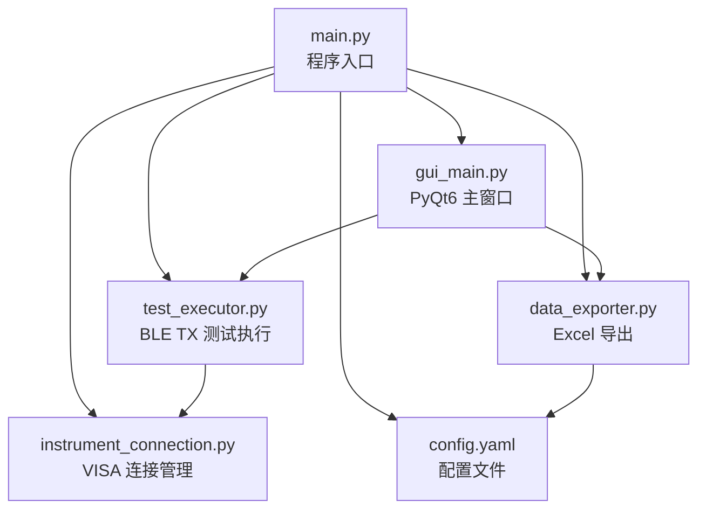
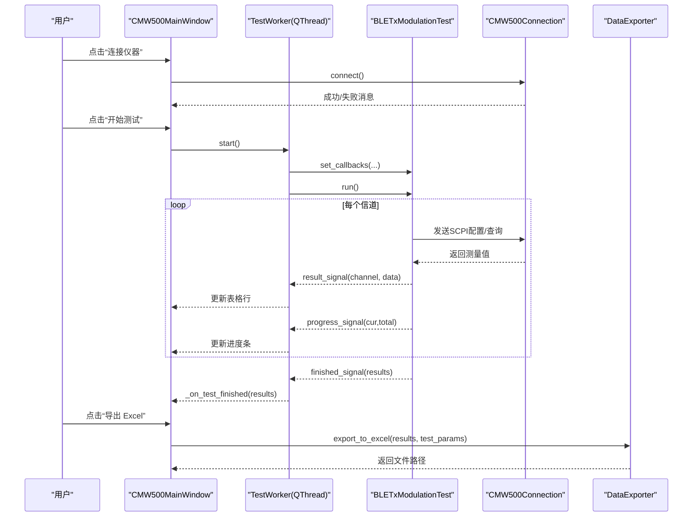
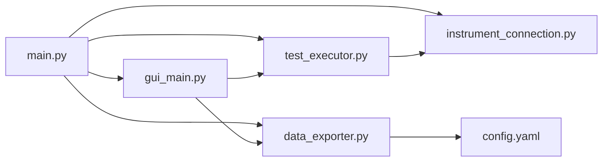

# 用户手册

<cite>
**本文引用的文件**   
- [main.py](file://main.py)
- [gui_main.py](file://gui_main.py)
- [instrument_connection.py](file://instrument_connection.py)
- [test_executor.py](file://test_executor.py)
- [data_exporter.py](file://data_exporter.py)
- [config.yaml](file://config.yaml)
- [requirements.txt](file://requirements.txt)
</cite>

## 目录
1. [简介](#简介)
2. [项目结构](#项目结构)
3. [核心组件](#核心组件)
4. [架构总览](#架构总览)
5. [详细组件分析](#详细组件分析)
6. [依赖关系分析](#依赖关系分析)
7. [性能与稳定性建议](#性能与稳定性建议)
8. [故障排除指南](#故障排除指南)
9. [结论](#结论)
10. [附录：完整测试流程与示例](#附录完整测试流程与示例)

## 简介
本手册面向使用 R&S CMW500 进行蓝牙 BLE TX 调制自动化测试的用户，提供图形界面（GUI）与命令行两种操作方式的详细说明。内容涵盖主窗口布局、各功能区域作用、操作流程与交互方式；命令行模式下的可用命令；从仪器连接到测试结果导出的完整流程；测试结果含义与判定标准；常见问题与排错建议；以及最佳实践。

## 项目结构
本项目采用模块化设计，入口程序负责加载配置、选择运行模式（GUI/CLI），并初始化仪器连接对象。GUI 模块提供可视化操作面板、实时结果表格与日志输出；仪器连接模块封装 VISA 通信；测试执行模块实现 BLE TX 调制测量逻辑；数据导出模块将结果写入 Excel 并生成摘要。

图表来源
- [main.py:295-336](file://main.py#L295-L336)
- [gui_main.py:75-124](file://gui_main.py#L75-L124)
- [instrument_connection.py:18-54](file://instrument_connection.py#L18-L54)
- [test_executor.py:22-51](file://test_executor.py#L22-L51)
- [data_exporter.py:23-62](file://data_exporter.py#L23-L62)
- [config.yaml:1-79](file://config.yaml#L1-L79)

章节来源
- [main.py:295-336](file://main.py#L295-L336)
- [config.yaml:1-79](file://config.yaml#L1-L79)

## 核心组件
- 程序入口与模式选择：加载配置、兼容处理、创建仪器连接实例，根据参数启动 GUI 或 CLI。
- GUI 主窗口：提供接口配置区、操作按钮区、结果表格、进度条、日志窗口与状态栏。
- 仪器连接：支持 LAN/GPIB/USB 三种接口，统一通过 VISA 资源地址建立连接，发送 SCPI 指令。
- 测试执行：按信道范围逐信道测量五项频率指标，依据限值自动判定 PASS/FAIL。
- 数据导出：生成“测试数据”和“测试摘要”两个工作表，自动命名并应用样式。

章节来源
- [main.py:295-336](file://main.py#L295-L336)
- [gui_main.py:75-124](file://gui_main.py#L75-L124)
- [instrument_connection.py:18-54](file://instrument_connection.py#L18-L54)
- [test_executor.py:22-51](file://test_executor.py#L22-L51)
- [data_exporter.py:23-62](file://data_exporter.py#L23-L62)

## 架构总览
下图展示系统整体架构与关键交互路径，包括 GUI 线程模型、测试执行回调与导出流程。

图表来源
- [gui_main.py:499-528](file://gui_main.py#L499-L528)
- [gui_main.py:561-629](file://gui_main.py#L561-L629)
- [test_executor.py:186-245](file://test_executor.py#L186-L245)
- [instrument_connection.py:85-132](file://instrument_connection.py#L85-L132)
- [data_exporter.py:81-139](file://data_exporter.py#L81-L139)

## 详细组件分析

### 图形界面（GUI）使用说明
- 主窗口布局
  - 顶部：接口配置区，支持切换 LAN/GPIB/USB 并编辑对应参数。
  - 中部上方：操作面板，包含“连接仪器”“断开仪器”“开始测试”“停止测试”“导出 Excel”按钮及连接状态标签。
  - 中部下方：测试结果表格与进度条，表格列包含信道号、五项指标的数值与判定。
  - 底部：运行日志窗口，显示时间戳与操作信息。
  - 状态栏：显示当前连接状态与测试进度提示。
- 交互方式
  - 连接前可修改接口类型与参数；连接后输入控件禁用，防止误改。
  - 开始测试后，“开始测试”“断开仪器”禁用，“停止测试”启用；测试完成后恢复。
  - 测试结果实时更新到表格，判定列以颜色区分（绿色 PASS、红色 FAIL、黄色 ERROR）。
  - 导出 Excel 仅在测试完成且有结果时可用。
- 截图说明（文字描述）
  - 界面顶部显示“接口配置”，下拉框可选“LAN (TCP/IP)”“GPIB (IEEE-488)”“USB (TMC)”，右侧为对应输入项。
  - 操作面板中“连接仪器”为绿色、“断开仪器”为红色、“开始测试”为蓝色、“停止测试”为橙色、“导出 Excel”为紫色。
  - 结果表格首列为“信道”，后续每两项为一组（数值+判定），共五组指标。
  - 进度条显示百分比与“进度：当前 / 总数”。
  - 日志窗口背景深色，字体等宽，便于阅读。

章节来源
- [gui_main.py:129-149](file://gui_main.py#L129-L149)
- [gui_main.py:150-276](file://gui_main.py#L150-L276)
- [gui_main.py:301-382](file://gui_main.py#L301-L382)
- [gui_main.py:384-432](file://gui_main.py#L384-L432)
- [gui_main.py:438-498](file://gui_main.py#L438-L498)
- [gui_main.py:499-556](file://gui_main.py#L499-L556)
- [gui_main.py:561-666](file://gui_main.py#L561-L666)

### 命令行模式使用说明
- 启动方式
  - 默认启动 GUI：python main.py
  - 启动命令行：python main.py --cli
- 可用命令
  - connect：连接仪器（根据 config.yaml 的 instrument 设置）
  - disconnect：断开仪器
  - serial：读取仪器序列号（通过 *IDN? 解析）
  - test：开始 BLE TX 调制测试，完成后自动导出 Excel
  - stop：停止正在执行的测试
  - quit：退出程序（若已连接则先断开）
- 交互流程
  - 启动后打印默认接口与测试参数摘要。
  - 输入命令后即时反馈成功/失败信息与提示信息。
  - 测试过程中可在控制台查看进度与通道统计。

章节来源
- [main.py:117-220](file://main.py#L117-L220)
- [main.py:295-336](file://main.py#L295-L336)

### 仪器连接模块
- 支持的接口
  - LAN（TCP/IP）：TCPIP0::<IP>::inst0::INSTR
  - GPIB（IEEE-488）：GPIB<board>::<address>::INSTR
  - USB（TMC）：USB0::<VID>::<PID>::<serial>::INSTR（序列号留空则自动匹配第一个设备）
- 主要方法
  - connect()：建立连接并验证 *IDN?
  - disconnect()：关闭连接并清理状态
  - get_serial_number()：解析序列号
  - send_command()/query()：发送/查询 SCPI 指令
- 错误处理
  - 捕获 VISA 通信异常并提供针对性提示（网络/地址/驱动等）
  - 未知异常统一返回错误信息

章节来源
- [instrument_connection.py:18-54](file://instrument_connection.py#L18-L54)
- [instrument_connection.py:55-84](file://instrument_connection.py#L55-L84)
- [instrument_connection.py:85-132](file://instrument_connection.py#L85-L132)
- [instrument_connection.py:134-160](file://instrument_connection.py#L134-L160)
- [instrument_connection.py:161-190](file://instrument_connection.py#L161-L190)
- [instrument_connection.py:192-215](file://instrument_connection.py#L192-L215)

### 测试执行模块
- 测试范围
  - 遍历 channel_start ~ channel_end（默认 0~39）
- 测量指标（单位 kHz）
  - 频率准确度、频率漂移、频率偏移、初始频率漂移、最大漂移速率
- 判定规则
  - 对每项指标取绝对值，比较上限（upper_limit）与下限（lower_limit，可为空）
  - 超过上限或未达下限记为 FAIL，否则 PASS；读取失败记为 ERROR
- 执行流程
  - 配置仪器（复位、选择 BT TX 调制、设置突发类型、PHY、统计次数、数据包类型）
  - 逐信道设置频率、触发测量、等待完成、读取各项指标
  - 记录结果并通过回调推送至 GUI
- 中断机制
  - 支持 stop() 在信道间检查停止标志，安全终止

章节来源
- [test_executor.py:22-51](file://test_executor.py#L22-L51)
- [test_executor.py:76-104](file://test_executor.py#L76-L104)
- [test_executor.py:105-184](file://test_executor.py#L105-L184)
- [test_executor.py:186-245](file://test_executor.py#L186-L245)
- [test_executor.py:247-261](file://test_executor.py#L247-L261)

### 数据导出模块
- 输出内容
  - Sheet 1 “测试数据”：逐信道测量数值 + 判定结果
  - Sheet 2 “测试摘要”：汇总统计信息（测试时间、标准、信道范围、统计次数、各指标通过/失败数、总体判定）
- 文件命名
  - 文件名包含日期时间戳，避免覆盖历史数据
- 样式美化
  - 表头蓝色加粗白字，数据居中带边框，PASS/FAIL 单元格着色，自动调整列宽
- 输出目录
  - 支持相对路径（基于程序根目录）与绝对路径

章节来源
- [data_exporter.py:23-62](file://data_exporter.py#L23-L62)
- [data_exporter.py:81-139](file://data_exporter.py#L81-L139)
- [data_exporter.py:141-202](file://data_exporter.py#L141-L202)
- [data_exporter.py:204-283](file://data_exporter.py#L204-L283)

## 依赖关系分析
- 外部库
  - pyvisa/pyvisa-py：仪器通信后端
  - PyQt6：GUI 框架
  - pandas/openpyxl：Excel 读写与样式
  - PyYAML：配置文件解析
  - matplotlib：绘图（当前未在主流程中使用）
  - pyinstaller：打包 exe
- 模块耦合
  - main.py 作为入口，低耦合地组合其他模块
  - gui_main.py 通过信号槽与 TestWorker 解耦，避免阻塞 UI
  - test_executor.py 仅依赖 instrument_connection.py 进行 SCPI 通信
  - data_exporter.py 独立于 GUI，可被 CLI 与 GUI 复用

图表来源
- [main.py:295-336](file://main.py#L295-L336)
- [gui_main.py:75-124](file://gui_main.py#L75-L124)
- [test_executor.py:22-51](file://test_executor.py#L22-L51)
- [data_exporter.py:23-62](file://data_exporter.py#L23-L62)
- [config.yaml:1-79](file://config.yaml#L1-L79)

章节来源
- [requirements.txt:1-12](file://requirements.txt#L1-L12)

## 性能与稳定性建议
- 通信超时
  - 合理设置 timeout（毫秒），在网络不稳定或 GPIB 总线负载较高时可适当增大
- 统计次数
  - statistic_count 越大，单次测量越稳定但耗时更长；建议在满足精度前提下尽量减小
- 信道范围
  - 全信道扫描（0~39）耗时较长，可按需缩小范围进行快速验证
- 线程与回调
  - GUI 使用 QThread 执行测试，避免阻塞主线程；确保回调函数轻量，避免在回调中进行重计算
- 导出优化
  - 大量数据导出时，openpyxl 样式应用可能较慢；建议分批导出或减少不必要的美化

[本节为通用指导，不直接分析具体文件]

## 故障排除指南
- 无法连接仪器
  - 检查接口类型与参数是否正确（LAN IP、GPIB Board/Address、USB VID/PID/SN）
  - 确认网络连接、GPIB 线缆与驱动安装、USB 设备识别
  - 查看日志窗口的错误提示与状态栏信息
- 测试中途失败
  - 关注日志中的 Channel 错误信息，必要时降低 statistic_count 或缩短信道范围
  - 检查仪器固件版本与 SCPI 指令兼容性
- 导出失败
  - 确认输出目录存在且可写，权限正常
  - 检查 openpyxl/pandas 是否安装正确
- 全局异常保护
  - 程序启动失败会弹出错误对话框，包含堆栈与排查建议；请检查 config.yaml 位置与格式

章节来源
- [main.py:42-83](file://main.py#L42-L83)
- [main.py:295-357](file://main.py#L295-L357)
- [instrument_connection.py:112-132](file://instrument_connection.py#L112-L132)
- [instrument_connection.py:151-159](file://instrument_connection.py#L151-L159)
- [gui_main.py:621-629](file://gui_main.py#L621-L629)

## 结论
本工具提供了直观的 GUI 与灵活的命令行两种方式，支持多接口连接、自动化测试与结果导出。通过合理的配置与操作，用户可以高效完成 BLE TX 调制测试并获得标准化的报告。遵循本手册的最佳实践与故障排除建议，可显著提升测试成功率与效率。

[本节为总结性内容，不直接分析具体文件]

## 附录：完整测试流程与示例

### 准备工作
- 安装依赖
  - 参考 requirements.txt 安装所需库（pyvisa、pyvisa-py、PyQt6、pandas、openpyxl、PyYAML 等）
- 准备仪器
  - 确保 CMW500 与主机连通（LAN/GPIB/USB），并已知相应地址参数
- 配置文件
  - 打开 config.yaml，核对 instrument 与 test_params 设置是否符合实际环境

章节来源
- [requirements.txt:1-12](file://requirements.txt#L1-L12)
- [config.yaml:1-79](file://config.yaml#L1-L79)

### GUI 操作流程
- 步骤 1：选择接口与参数
  - 在“接口配置”中选择 LAN/GPIB/USB，填写对应参数（如 LAN IP、GPIB Board/Address、USB VID/PID/SN）
- 步骤 2：连接仪器
  - 点击“连接仪器”，观察状态栏与日志窗口提示；成功后“开始测试”可用
- 步骤 3：开始测试
  - 点击“开始测试”，进度条与表格实时更新；如需中止，点击“停止测试”
- 步骤 4：查看结果
  - 表格中每项指标均有数值与判定列，颜色直观反映 PASS/FAIL/ERROR
- 步骤 5：导出报告
  - 点击“导出 Excel”，保存路径在状态栏与日志中显示；文件包含“测试数据”与“测试摘要”两表

章节来源
- [gui_main.py:150-276](file://gui_main.py#L150-L276)
- [gui_main.py:438-498](file://gui_main.py#L438-L498)
- [gui_main.py:499-556](file://gui_main.py#L499-L556)
- [gui_main.py:561-629](file://gui_main.py#L561-L629)

### 命令行操作流程
- 启动命令行模式
  - 执行 python main.py --cli
- 连接仪器
  - 输入 connect，查看返回的连接信息与仪器标识
- 读取序列号
  - 输入 serial，获取仪器序列号用于记录
- 开始测试
  - 输入 test，控制台显示进度与通道统计；完成后自动导出 Excel
- 停止测试
  - 输入 stop，等待当前信道完成后再退出
- 退出程序
  - 输入 quit，若已连接则先断开再退出

章节来源
- [main.py:117-220](file://main.py#L117-L220)

### 测试结果含义与判定标准
- 指标与单位
  - 频率准确度（kHz）、频率漂移（kHz）、频率偏移（kHz）、初始频率漂移（kHz）、最大漂移速率（kHz）
- 判定规则
  - 对每项指标取绝对值，与配置的上限（upper_limit）和下限（lower_limit）比较
  - 超出上限或未达下限记为 FAIL；在范围内记为 PASS；读取失败记为 ERROR
- 总体判定
  - 当所有信道的全部指标均为 PASS 时，总体判定为 PASS；否则为 FAIL

章节来源
- [test_executor.py:166-184](file://test_executor.py#L166-L184)
- [data_exporter.py:141-202](file://data_exporter.py#L141-L202)
- [config.yaml:44-71](file://config.yaml#L44-L71)

### 最佳实践建议
- 首次使用建议先用 LAN 接口，便于快速验证网络连通性与配置正确性
- 合理设置 statistic_count，平衡测试时间与稳定性
- 在批量生产环境中，优先使用命令行模式并结合脚本自动化
- 定期备份测试报告，按时间戳归档，便于追溯与分析

[本节为通用指导，不直接分析具体文件]