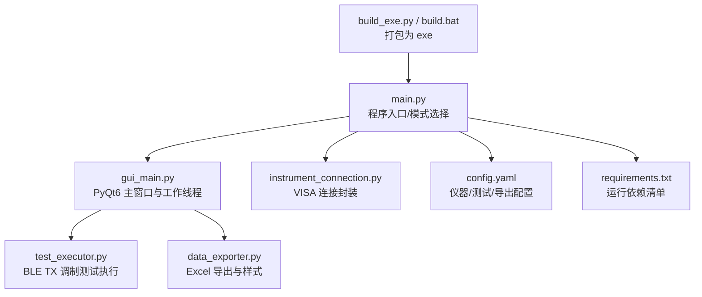
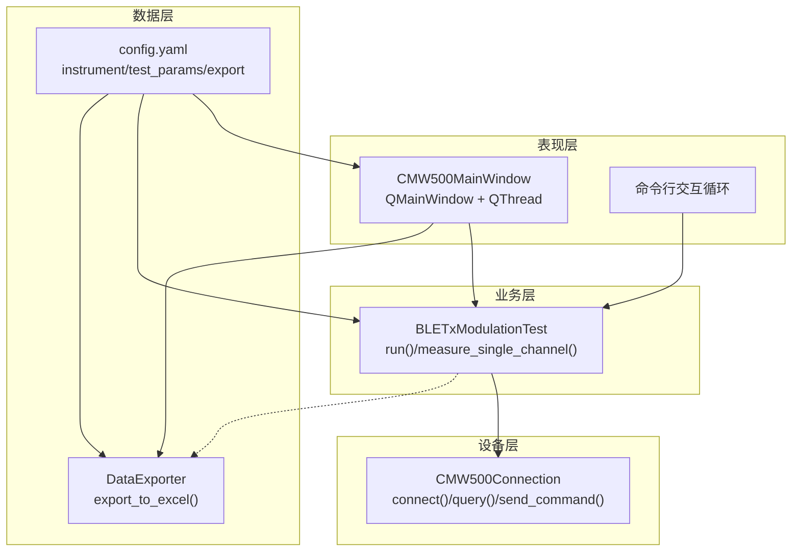
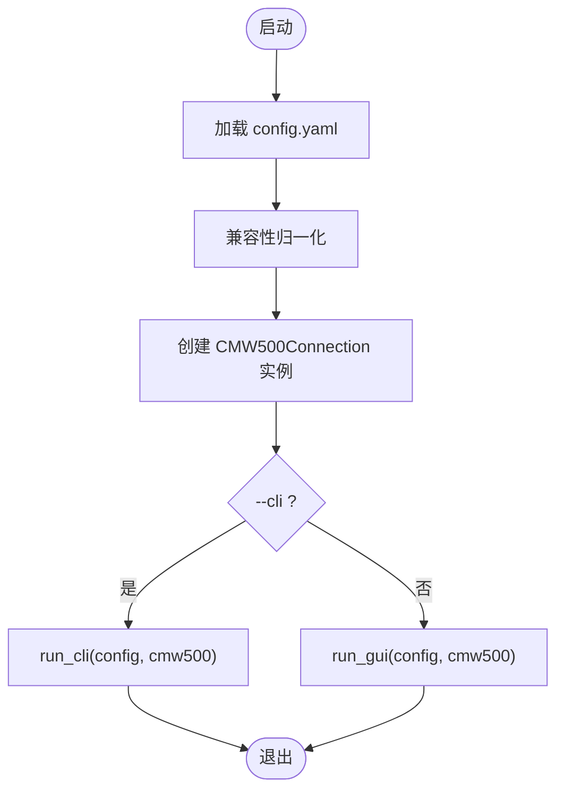
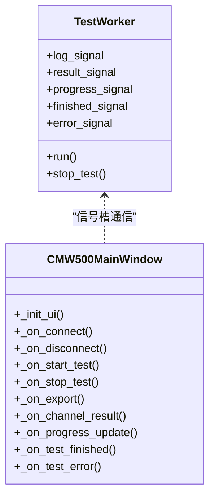
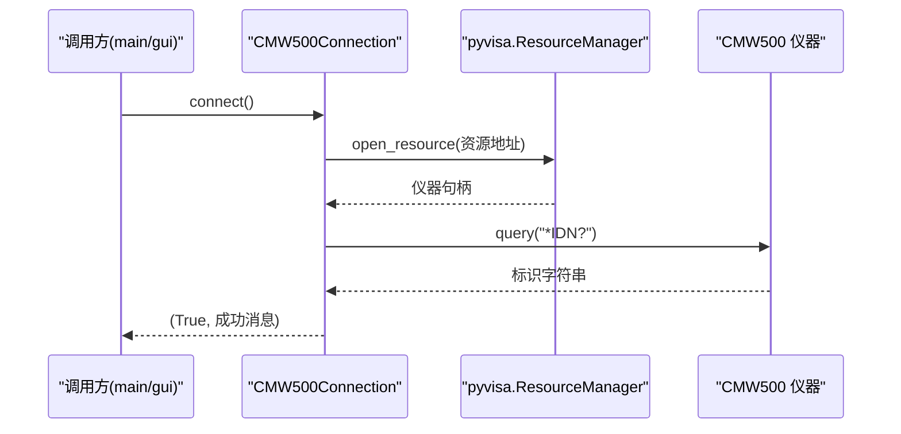
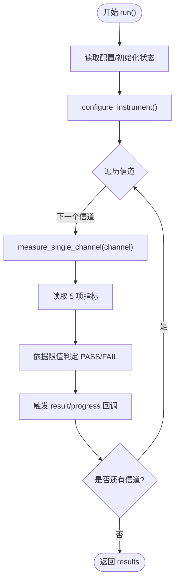
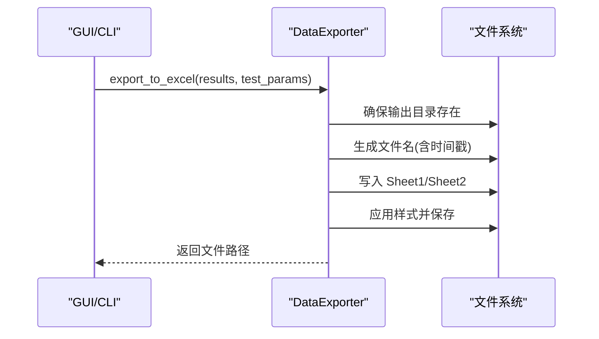
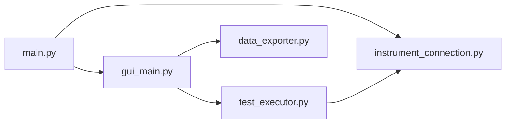

# 项目概述

<cite>
**本文引用的文件**   
- [main.py](file://main.py)
- [gui_main.py](file://gui_main.py)
- [instrument_connection.py](file://instrument_connection.py)
- [test_executor.py](file://test_executor.py)
- [data_exporter.py](file://data_exporter.py)
- [config.yaml](file://config.yaml)
- [requirements.txt](file://requirements.txt)
- [build_exe.py](file://build_exe.py)
- [build.bat](file://build.bat)
</cite>

## 目录
1. [简介](#简介)
2. [项目结构](#项目结构)
3. [核心组件](#核心组件)
4. [架构总览](#架构总览)
5. [详细组件分析](#详细组件分析)
6. [依赖关系分析](#依赖关系分析)
7. [性能与可靠性考虑](#性能与可靠性考虑)
8. [快速开始指南](#快速开始指南)
9. [故障排查指南](#故障排查指南)
10. [结论](#结论)

## 简介
本项目是一个面向 Rohde & Schwarz CMW500 无线通信测试仪的自动化测试工具，专注于蓝牙低功耗（BLE）TX 调制指标的自动测量与报告导出。系统通过图形界面或命令行驱动仪器，完成频率准确度、频率漂移、频率偏移、初始频率漂移、最大漂移速率等关键指标的逐信道扫描与判定，并将结果以格式化的 Excel 文件输出，便于质量审核与归档。

该工具支持 LAN（TCP/IP）、GPIB（IEEE-488）和 USB（TMC）三种仪器接口方式，具备线程安全的 GUI、可插拔的配置管理、清晰的错误提示与日志记录能力，适合产线或实验室环境使用。

## 项目结构
项目采用“入口 + 分层模块”的组织方式：
- 入口与启动控制：main.py
- 图形用户界面：gui_main.py
- 仪器通信层：instrument_connection.py
- 测试执行引擎：test_executor.py
- 数据导出模块：data_exporter.py
- 配置与打包：config.yaml、requirements.txt、build_exe.py、build.bat

图表来源
- [main.py:295-336](file://main.py#L295-L336)
- [gui_main.py:75-124](file://gui_main.py#L75-L124)
- [instrument_connection.py:18-54](file://instrument_connection.py#L18-L54)
- [test_executor.py:22-51](file://test_executor.py#L22-L51)
- [data_exporter.py:23-49](file://data_exporter.py#L23-L49)
- [config.yaml:1-79](file://config.yaml#L1-L79)
- [requirements.txt:1-12](file://requirements.txt#L1-L12)
- [build_exe.py:1-87](file://build_exe.py#L1-L87)
- [build.bat:1-106](file://build.bat#L1-L106)

章节来源
- [main.py:295-336](file://main.py#L295-L336)
- [config.yaml:1-79](file://config.yaml#L1-L79)

## 核心组件
- 程序入口与模式路由：负责加载配置、初始化仪器连接对象、根据参数选择 GUI 或 CLI 模式，并提供全局异常保护与错误弹窗。
- 图形用户界面：提供连接/断开、开始/停止测试、导出 Excel 等操作；在独立工作线程中执行测试并通过信号槽更新 UI，显示实时进度与逐信道结果表格。
- 仪器通信层：基于 VISA 统一封装 LAN/GPIB/USB 资源地址构建与连接生命周期管理，支持 *IDN? 查询与通用 SCPI 命令发送/查询。
- 测试执行引擎：按配置遍历 BLE 信道范围，逐项下发 SCPI 指令进行 TX 调制测量，计算并判定各项指标是否通过，支持回调推送日志、进度与单信道结果。
- 数据导出模块：将测试结果写入 Excel，包含“测试数据”和“测试摘要”两个 Sheet，并对表头、边框、对齐与 PASS/FAIL 着色进行美化。

章节来源
- [main.py:295-336](file://main.py#L295-L336)
- [gui_main.py:75-124](file://gui_main.py#L75-L124)
- [instrument_connection.py:18-54](file://instrument_connection.py#L18-L54)
- [test_executor.py:22-51](file://test_executor.py#L22-L51)
- [data_exporter.py:23-49](file://data_exporter.py#L23-L49)

## 架构总览
系统整体分为四层：
- 表现层（GUI/CLI）：用户交互与状态展示
- 业务层（测试执行器）：测试流程编排、SCPI 指令序列、结果判定
- 设备层（仪器连接）：跨接口的 VISA 抽象与命令收发
- 数据层（配置/导出）：YAML 配置解析与 Excel 报告生成

图表来源
- [gui_main.py:75-124](file://gui_main.py#L75-L124)
- [test_executor.py:186-245](file://test_executor.py#L186-L245)
- [instrument_connection.py:85-132](file://instrument_connection.py#L85-L132)
- [data_exporter.py:81-139](file://data_exporter.py#L81-L139)
- [config.yaml:1-79](file://config.yaml#L1-L79)

## 详细组件分析

### 程序入口 main.py
- 功能要点
  - 获取应用目录，兼容 PyInstaller 打包后的路径
  - 加载 YAML 配置并进行兼容性归一化（补齐缺失字段）
  - 构造仪器连接实例（不立即连接），根据命令行参数选择 GUI 或 CLI 模式
  - 全局异常捕获，失败时弹出错误对话框并输出诊断信息
- 关键流程
  - 启动 → 加载配置 → 归一化 → 创建连接对象 → 选择模式 → 进入事件循环或命令行交互

图表来源
- [main.py:295-336](file://main.py#L295-L336)
- [main.py:85-115](file://main.py#L85-L115)
- [main.py:245-292](file://main.py#L245-L292)

章节来源
- [main.py:295-336](file://main.py#L295-L336)
- [main.py:85-115](file://main.py#L85-L115)
- [main.py:245-292](file://main.py#L245-L292)

### 图形用户界面 gui_main.py
- 功能要点
  - 顶部接口配置区：动态切换 LAN/GPIB/USB 输入项，默认值来自配置
  - 操作面板：连接/断开、开始/停止测试、导出 Excel
  - 结果表格：逐信道显示五项指标数值与 PASS/FAIL 判定，自动滚动
  - 日志窗口：带时间戳的运行日志
  - 进度条：当前/总数与百分比
  - 线程安全：测试在工作线程执行，通过 Qt 信号槽更新 UI
- 关键类与方法
  - TestWorker：继承 QThread，绑定测试执行器回调，发射日志/进度/结果/完成/错误信号
  - CMW500MainWindow：UI 布局、按钮事件处理、信号槽绑定、结果渲染与样式

图表来源
- [gui_main.py:28-73](file://gui_main.py#L28-L73)
- [gui_main.py:75-124](file://gui_main.py#L75-L124)
- [gui_main.py:499-528](file://gui_main.py#L499-L528)
- [gui_main.py:561-629](file://gui_main.py#L561-L629)

章节来源
- [gui_main.py:75-124](file://gui_main.py#L75-L124)
- [gui_main.py:499-528](file://gui_main.py#L499-L528)
- [gui_main.py:561-629](file://gui_main.py#L561-L629)

### 仪器连接 instrument_connection.py
- 功能要点
  - 统一封装 LAN/GPIB/USB 资源地址构建与连接生命周期
  - 支持 *IDN? 查询与通用 send_command/query 方法
  - 详细的错误提示与连接状态标志
- 关键方法
  - connect/disconnect：建立/关闭 VISA 连接，验证 *IDN?
  - get_serial_number：解析序列号
  - send_command/query：无返回/有返回的命令发送

图表来源
- [instrument_connection.py:85-132](file://instrument_connection.py#L85-L132)
- [instrument_connection.py:161-190](file://instrument_connection.py#L161-L190)
- [instrument_connection.py:192-216](file://instrument_connection.py#L192-L216)

章节来源
- [instrument_connection.py:18-54](file://instrument_connection.py#L18-L54)
- [instrument_connection.py:85-132](file://instrument_connection.py#L85-L132)
- [instrument_connection.py:161-190](file://instrument_connection.py#L161-L190)
- [instrument_connection.py:192-216](file://instrument_connection.py#L192-L216)

### 测试执行 test_executor.py
- 功能要点
  - 配置 CMW500 为 BLE TX 调制测量模式（复位、选择 BT TX、设置突发类型、PHY、统计次数、数据包类型）
  - 逐信道测量五项指标：频率准确度、频率漂移、频率偏移、初始频率漂移、最大漂移速率
  - 依据配置上限/下限进行 PASS/FAIL 判定
  - 支持 stop() 中断测试，回调推送日志、进度与单信道结果
- 关键流程
  - run()：初始化 → 配置仪器 → 遍历信道 → 单次测量 → 判定 → 回调 → 汇总结果

图表来源
- [test_executor.py:76-103](file://test_executor.py#L76-L103)
- [test_executor.py:105-184](file://test_executor.py#L105-L184)
- [test_executor.py:186-245](file://test_executor.py#L186-L245)

章节来源
- [test_executor.py:22-51](file://test_executor.py#L22-L51)
- [test_executor.py:76-103](file://test_executor.py#L76-L103)
- [test_executor.py:105-184](file://test_executor.py#L105-L184)
- [test_executor.py:186-245](file://test_executor.py#L186-L245)

### 数据导出 data_exporter.py
- 功能要点
  - 生成带时间戳的文件名，确保输出目录存在
  - 写入“测试数据”Sheet（逐信道数值与判定）与“测试摘要”Sheet（汇总统计）
  - 对表头、边框、对齐与 PASS/FAIL 单元格进行样式美化
- 关键方法
  - export_to_excel(results, test_params)：组装 DataFrame → 写入 Excel → 应用样式
  - _build_summary(results, test_params)：统计各指标通过/失败数与总体判定

图表来源
- [data_exporter.py:81-139](file://data_exporter.py#L81-L139)
- [data_exporter.py:141-202](file://data_exporter.py#L141-L202)
- [data_exporter.py:204-283](file://data_exporter.py#L204-L283)

章节来源
- [data_exporter.py:23-49](file://data_exporter.py#L23-L49)
- [data_exporter.py:81-139](file://data_exporter.py#L81-L139)
- [data_exporter.py:141-202](file://data_exporter.py#L141-L202)
- [data_exporter.py:204-283](file://data_exporter.py#L204-L283)

## 依赖关系分析
- 外部库
  - pyvisa/pyvisa-py：仪器通信后端（无需 NI-VISA）
  - PyQt6：图形界面
  - pandas/openpyxl：Excel 读写与样式
  - PyYAML：配置文件解析
  - matplotlib：可视化（可选）
  - pyinstaller：打包为 exe
- 内部模块耦合
  - main.py 依赖 instrument_connection、gui_main、test_executor、data_exporter
  - gui_main.py 依赖 test_executor 与 data_exporter
  - test_executor.py 依赖 instrument_connection
  - data_exporter.py 仅依赖配置与第三方库

图表来源
- [main.py:295-336](file://main.py#L295-L336)
- [gui_main.py:499-528](file://gui_main.py#L499-L528)
- [test_executor.py:186-245](file://test_executor.py#L186-L245)
- [instrument_connection.py:85-132](file://instrument_connection.py#L85-L132)
- [data_exporter.py:81-139](file://data_exporter.py#L81-L139)

章节来源
- [requirements.txt:1-12](file://requirements.txt#L1-L12)
- [main.py:295-336](file://main.py#L295-L336)

## 性能与可靠性考虑
- 线程安全：测试在主线程之外执行，避免阻塞 UI；通过信号槽机制更新界面，保证响应性。
- 超时与重试：仪器连接与命令查询均设置超时；异常分支提供明确错误提示，便于快速定位问题。
- 增量导出：每次测试生成唯一文件名，避免覆盖历史数据；导出过程分两步（写入+样式），提升可读性与稳定性。
- 可扩展性：配置集中管理，新增测量项只需扩展 measurements 配置与对应 SCPI 读取逻辑。

[本节为通用指导，不直接分析具体文件]

## 快速开始指南
- 环境准备
  - 安装 Python（建议 3.9+）
  - 安装依赖：pip install -r requirements.txt
- 首次运行（源码）
  - 修改 config.yaml 中的仪器连接参数（LAN IP 或 GPIB/USB 参数）
  - 运行：python main.py（默认 GUI 模式）
  - 如需命令行模式：python main.py --cli
- 打包为 exe（Windows）
  - 双击运行 build.bat，或在命令行执行 python -m PyInstaller main.py ...（参考 build.bat 内容）
  - 打包完成后，dist/CMW500_BLE_Test 目录下包含可执行文件与配置文件
- 基本使用方法
  - 在 GUI 中选择接口类型并填写参数，点击“连接仪器”
  - 点击“开始测试”，观察进度条与结果表格
  - 测试完成后点击“导出 Excel”，查看 test_results 目录下的报告

章节来源
- [requirements.txt:1-12](file://requirements.txt#L1-L12)
- [config.yaml:1-79](file://config.yaml#L1-L79)
- [main.py:295-336](file://main.py#L295-L336)
- [build.bat:76-106](file://build.bat#L76-L106)

## 故障排查指南
- 无法连接仪器
  - 检查网络/线缆/驱动是否正确，确认 IP/板号/地址/VID/PID/序列号
  - 查看 GUI 日志与错误弹窗提示，必要时切换到命令行模式获取更详细信息
- 测试中途失败
  - 关注日志中的 Channel 错误信息，确认仪器固件版本与 SCPI 指令兼容性
  - 适当调整 statistic_count 或 timeout 参数
- 导出失败
  - 确认输出目录权限与磁盘空间，检查 openpyxl/pandas 依赖是否完整

章节来源
- [instrument_connection.py:112-132](file://instrument_connection.py#L112-L132)
- [instrument_connection.py:151-159](file://instrument_connection.py#L151-L159)
- [test_executor.py:226-234](file://test_executor.py#L226-L234)
- [data_exporter.py:204-283](file://data_exporter.py#L204-L283)

## 结论
本工具围绕“配置—连接—执行—导出”的主线，提供了稳定可靠的 BLE TX 调制自动化测试能力。通过统一的仪器连接抽象、线程安全的 GUI 与清晰的测试执行流程，既满足初学者的易用性需求，也为有经验的用户提供了良好的扩展点与排障手段。建议在产线或实验室环境中结合 CI/CD 流程，实现批量、无人值守的自动化测试与报告归档。